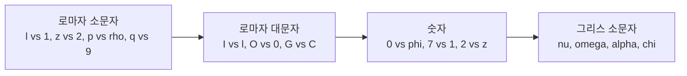

엔지니어링, 과학, 수학을 공부하거나 업무할 때 수식과 기호를 손으로 쓸 기회가 많다. 이때 **명확하고 읽기 쉬운 수학 필기**는 오해를 줄이고, 나중에 다시 읽을 때도 이해를 돕는다. John Kerl의 [Mathematical Handwriting Tips](https://johnkerl.org/doc/ortho/ortho.html)와 [수학 기호](https://en.wikipedia.org/wiki/Mathematical_notation), [수·공학에서 쓰는 문자 목록](https://en.wikipedia.org/wiki/List_of_letters_used_in_mathematics,_science,_and_engineering)을 참고해, 실무에 바로 쓸 수 있는 **수학 필기 규칙**을 정리했다.

---

## 개요

### 목적

- 수학·과학·공학에서 **손글씨로 쓰는 수식**에서 알파벳(로마자), 숫자, 그리스 문자를 **서로 구분 가능하게** 쓰기 위함.
- `2z`와 `z²`, `l`과 `1`, `ρ`와 `p` 같은 혼동을 줄여 **자기 노트·과제·화이트보드 필기**의 가독성과 정확도를 높이는 것.

### 추천 대상

- 공학·자연과학·수학 전공 학생(미적분, 선형대수, 통계, 물리 등 수식이 많은 과목).
- 연구·개발 업무에서 손으로 수식·알고리즘을 정리하는 사람.
- 시험·과제·스터디 노트를 손으로 작성하는 사람.

---

## 왜 수학 필기가 중요한가?

일반 문장에서는 주변 단어로 문맥을 추측할 수 있다. 예를 들어 "hou*e"에서 빈 칸은 문맥상 "s"로 읽힌다. 반면 **수학 표현**에서는 로마자, 숫자, 그리스 문자 등이 **같은 줄에 뒤섞여** 나오기 때문에, 문맥만으로는 한 글자가 무엇인지 추론하기 어렵다. 그래서 수학 필기에서는 **각 기호가 혼자서도 명확히 구분될 수 있도록** 쓰는 것이 중요하다.

- **자기 자신**: 나중에 노트를 볼 때 `2z`와 `z²`를 헷갈리지 않도록.
- **타인**: 과제, 시험, 협업 시 상대가 수식을 정확히 해석할 수 있도록.
- **표준 습관**: [ISO 80000-2](https://en.wikipedia.org/wiki/ISO_80000-2)처럼 인쇄물에서는 변수는 이탤릭, 상수는 로만체로 쓰는 등, 손글씨에서도 **일관된 구분 규칙**을 두면 실수가 줄어든다.

---

## 기호 체계와 혼동 관계

수학·공학 필기에서 자주 쓰는 기호는 대략 **로마자(소·대문자), 숫자, 그리스 문자(소·대문자)** 로 나눌 수 있다. 아래 다이어그램은 **자주 혼동되는 쌍**을 정리한 것이다. 노드 ID는 camelCase/PascalCase로 두었고, 라벨에 등호·특수문자가 있을 수 있는 부분은 큰따옴표로 감쌌다.

이제 **로마자(소·대문자) → 숫자 → 그리스 문자** 순으로, 각 항목별로 **구체적인 필기 팁**을 정리한다.

---

## 소문자 로마자 (Lowercase Roman)

| 문자 | 혼동 가능 | 필기 요령 |
|------|-----------|-----------|
| **l** | 숫자 1 | **항상 필기체(cursive)** 로 쓰고, e보다 **키를 크게** 한다. 소문자 l은 변수로 쓰기엔 비추이지만, 교재·강의에서 자주 나오므로 구분만 확실히 하자. |
| **z** | 숫자 2 | **가운데 가로선을 반드시** 그어 2와 구분한다. (cross your z's) |
| **x** | 곱하기 기호 × | **갈라진 부분에 작은 갈고리**를 넣어 곱하기 기호와 구분한다. 미적분 이후로 ×를 자주 쓰므로 습관화하는 것이 좋다. |
| **v, w** | 그리스 nu(ν), omega(ω) | v와 w는 **아래를 뾰족하게** 써서 ν, ω와 구분한다. |
| **u** | v | **아래에 꼬리**를 넣어 v와 구분한다. |
| **t** | 더하기 + | **아래에 갈고리**를 넣어 플러스와 구분한다. |
| **q** | 9, 8 | **꼬리는 선(stroke)**으로만 그리며, 9처럼 동그란 고리로 만들지 않는다. 8과도 구분되게 한다. |
| **p** | 그리스 rho(ρ) | **위쪽에 뚜렷한 돌출부**를 만들어 ρ와 구분한다. |

---

## 대문자 로마자 (Uppercase Roman)

| 문자 | 혼동 가능 | 필기 요령 |
|------|-----------|-----------|
| **I** | 소문자 l, 숫자 1 | **위아래에 가로선(bar)**을 그어 일관되게 쓴다. |
| **O** | 숫자 0 | **안쪽에 작은 곡선·루프**를 넣어 0과 구분한다. |
| **G** | C, 6 | **오른쪽 안쪽에 꺾임(브라켓)**을 분명히 넣어 C·6과 구분한다. |
| **X, Z** | 소문자와 동일 | 소문자와 마찬가지로 X는 갈고리, Z는 가운데 가로선을 넣어 구분한다. |

---

## 숫자 (Digits)

| 숫자 | 혼동 가능 | 필기 요령 |
|------|-----------|-----------|
| **0** | 그리스 phi(φ), 공집합(∅) | **0에는 사선을 넣지 않는다.** φ는 세로 세로선, ∅는 비스듬한 사선으로 구분한다. |
| **2** | 소문자 z | **아래를 둥글게** 써서 z와 구분한다. z는 가운데 가로선으로 구분. |
| **7** | 1 | **가로선을 그어** 1과 구분한다. |
| **5** | S | **위쪽을 각지게** 써서 S와 구분한다. |
| **4** | 9 | **위쪽이 열린 형태**를 유지해 9와 구분한다. |
| **9** | g, q | **아래에 고리를 붙이지 않아** g·q와 구분한다. |

---

## 그리스 문자 (Greek)

수학·물리·통계에서 그리스 문자는 **변수·상수·특수 함수**에 널리 쓰인다. [수학·공학에서 쓰는 문자 목록](https://en.wikipedia.org/wiki/List_of_letters_used_in_mathematics,_science,_and_engineering)에서도 로마자·그리스 문자가 함께 정리되어 있으므로, 혼동되는 쌍만 손글씨에서 명확히 하면 된다.

### 소문자 그리스

| 문자 | 혼동 가능 | 필기 요령 |
|------|-----------|-----------|
| **α (alpha)** | 2 | **한 번에 부드럽게** 휘어 쓰되, 2처럼 각지거나 꺾이지 않게 한다. |
| **ν (nu)** | u, v, υ(upsilon) | **왼쪽 갈고리**와 **아래 뾰족한 점**을 분명히 해 u, v, υ와 구분한다. nu는 물리·선형대수에서 자주 나온다. |
| **υ (upsilon)** | u, v, ν | u·v·ν와 비슷하므로 **형태를 일관되게** 정해 두고 쓴다. 사용 빈도는 상대적으로 낮다. |
| **ω (omega)** | w | **둥글게** 써서 w와 구분한다. 각진 w와 구분되게 한다. |
| **χ (chi)** | 소문자 x, 대문자 X | **위로 올라가는 선을 아래로 내려가는 선보다 훨씬 크게** 써서 x, X와 구분한다. |
| **φ (phi)** | 0, ∅ | **세로선**을 넣는다. 0에는 선 없음, ∅는 비스듬한 사선. |
| **λ (lambda)** | — | **위쪽에 갈고리**를 넣어 일관된 형태로 쓴다. |
| **η (eta), μ (mu)** | n, 필기체 u | **아래로 길게 내리는 꼬리**를 써서 n, u와 구분한다. |
| **ο (omicron)** | 로마자 o | 인쇄체가 로마자 o와 동일하므로, 손글씨에서는 보통 **로마자 o를 그대로** 쓰고 omicron을 별도로 쓰지 않는 경우가 많다. |

### 대문자 그리스

- **Φ (phi), Ψ (psi)**: 대문자 I처럼 **위아래에 가로선(bar)**을 그어 구분한다.
- **Θ (theta)**: **안에 대문자 H 모양**을 넣어 소문자 θ와 구분한다.
- 그 외 대문자 그리스(Α, Β 등)는 로마자 대문자와 형태가 같아서, 수학·공학에서는 보통 **로마자만 쓰고** 그리스 대문자는 일부(Φ, Ψ, Θ, Σ 등)만 구분해 쓴다.

---

## 연습과 일상 적용

- **자주 쓰는 문자부터**: l, 1, z, 2, O, 0, α, ν, ω, φ, Σ 등 자주 나오는 것부터 규칙을 고정하고 반복해서 쓴다.
- **노트·과제에 일관 적용**: 한 번 정한 규칙(z에 가로선, 7에 가로선, O에 루프 등)을 **항상** 지키면 나중에 읽을 때 오해가 줄어든다.
- **화이트보드·스크린 공유**: 협업·발표 시에도 같은 규칙을 적용하면 청자가 수식을 더 빠르게 이해한다.

---

## 정리

수학 필기는 **단순한 글쓰기가 아니라, 정확한 의사소통을 위한 규칙**에 가깝다. 로마자·숫자·그리스 문자를 위와 같이 구분해 쓰면, 자기 노트와 타인과의 소통 모두에서 오해를 줄일 수 있다. John Kerl의 원문과 위키백과의 수학 기호·문자 목록을 참고해, 자신만의 **일관된 필기 습관**을 만드는 것을 권한다.

---

## 참고 자료

1. [Mathematical Handwriting Tips — John Kerl](https://johnkerl.org/doc/ortho/ortho.html): 로마자·숫자·그리스 문자별 손글씨 샘플과 혼동 방지 요령.
2. [Mathematical notation — Wikipedia](https://en.wikipedia.org/wiki/Mathematical_notation): 수학 기호의 역할, 역사, ISO 80000-2 등 타입페이스·표기 관례.
3. [List of letters used in mathematics, science, and engineering — Wikipedia](https://en.wikipedia.org/wiki/List_of_letters_used_in_mathematics,_science,_and_engineering): 라틴·그리스·기타 문자별 수·공학에서의 용도 정리.
