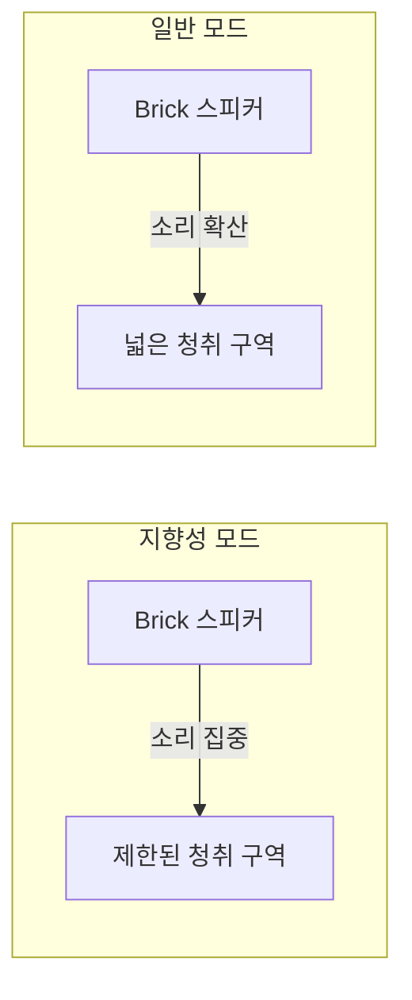

이 글에서는 윤사운드에서 판매하는 **Brick 지향성 파워드 스피커**를 소개한다. 지향성 스피커의 원리, 제품 개요·사양, 활용 시나리오, 구매 시 참고사항, 장단점을 정리했으며, 전문 오디오 환경 구축을 고민하는 독자에게 실사용 관점의 참고 자료가 되도록 구성했다.

## 지향성 스피커란?

**지향성 스피커(directional speaker)**는 소리를 특정 방향·각도 안으로만 집중시켜 전달하는 스피커다. 일반 스피커가 사방으로 음파를 퍼뜨리는 것과 달리, 전파를 정밀하게 제어해 지정한 영역에만 명확한 음향을 전달할 수 있다. 이를 통해 소음이 큰 환경이나 여러 구역이 공존하는 공간에서도, 필요한 위치에만 음향을 한정할 수 있어 **프라이버시 보호**와 **효과적인 메시지 전달**을 동시에 만족시킬 수 있다.

초지향 기술에는 **초음파(ultrasonic)**를 이용해 제한된 공간 안에만 음장을 형성하는 방식이 널리 쓰인다. 이렇게 형성된 음장 안에서만 소리가 들리므로, 발표·안내 방송·전시 설명 등에서 주변 간섭을 줄이고 명확한 전달이 가능해진다. 또한 내부 음향 처리로 벽·천장 반사음을 줄여 **에코를 최소화**하는 제품이 많아, 실내 음향 품질 개선에도 기여한다.

## 제품 개요 및 추천 대상

윤사운드 Brick 지향성 파워드 스피커는 **100W 출력**의 파워드 스피커에 **초지향 모드**와 **일반 스피커 모드**를 결합한 국내 제조 제품이다. **Bluetooth** 무선 스트리밍, **SD카드** 재생, **외부 입력**을 지원하며, **VASA 브라켓**으로 다양한 설치 각도와 위치에 대응할 수 있다.

| 항목 | 내용 |
|------|------|
| 제품명 | Brick 지향성 파워드 스피커 |
| 제조 | JD SOLUTION (국내) |
| 출력 | 100W 파워드 |
| 특징 | 초지향 + 일반 스피커, Bluetooth, SD카드, 외부입력, VASA 브라켓 |

**추천 대상**은 다음과 같다. 박물관·미술관·전시장에서 전시물별로 음성 안내를 나누어 전달하려는 운영자, 컨퍼런스·세미나 룸에서 발표 구역만 타겟으로 음향을 주고 싶은 기관, 소음이 있는 현장에서 특정 구역에만 안내 방송을 하고 싶은 업체, 그리고 무선·다중 소스·설치 유연성을 중시하는 전문 오디오 구매자다. 넓은 홀 전체에 BGM을 퍼뜨리는 용도보다는 **특정 지점·구역에만 음향을 집중**시키는 용도에 적합하다.

## 주요 특징

### 소리의 방향성 제어

스피커가 설계된 **특정 각도 안에서만** 소리가 들리도록 되어 있어, 주변 소음의 영향을 줄이면서 원하는 지점에만 음향을 집중시킬 수 있다. 정밀한 음향 조절로 프라이버시를 유지하면서도 필요한 대상에게만 메시지를 전달할 수 있다.

### 소리의 집중성

초음파 기술을 활용해 **제한된 공간 내에 집중된 음장**을 만든다. 발표·안내 방송에서 명확한 음향 전달이 가능하고, 특정 지점에서만 음장이 형성되어 불필요한 주변 소음 간섭이 최소화된다.

### 에코 최소화

내부 음향 처리로 벽·천장에 반사되는 음파를 줄여 **깨끗한 음질**을 유지한다. 실내에서 반사음이 많은 환경일수록 이 점이 체감되며, 음성 인식이나 안내 청취성 향상에 도움이 된다.

### 다양한 입력과 설치

Bluetooth 연결로 스마트폰·태블릿과 무선 스트리밍이 가능하고, SD카드 및 외부 입력을 통해 다양한 미디어 소스를 사용할 수 있다. VASA 브라켓으로 벽·천장·스탠드 등에 유연하게 설치할 수 있어 공간 제약을 줄일 수 있다.

아래 다이어그램은 지향성 모드와 일반 모드에서의 음향 전달 개념을 정리한 것이다.

## 제품 사양

| 항목 | 사양 |
|------|------|
| 크기 (W×H×D) | 220 × 105 × 60 mm |
| 무게 | 1.2 kg |
| 출력 | 100W 파워드 |
| 연결 | Bluetooth, SD카드, 외부 입력 |
| 설치 | VASA 브라켓 지원 |
| 제조사 | JD SOLUTION |
| 원산지 | 대한민국 |

컴팩트한 크기와 1.2 kg 무게로 이동·배치가 수월하며, 국내 제조 제품으로 A/S와 품질 관리가 용이한 편이다.

## 활용 시나리오

Brick 지향성 파워드 스피커는 아래와 같은 상황에서 특히 유리하다.

- **박물관·전시장**: 전시물·존별로 서로 다른 음성 안내를 동시에 재생할 때, 구역 간 음향 간섭을 줄이고 관람객 위치에만 소리를 전달할 수 있다.
- **컨퍼런스·세미나**: 발표자 앞이나 특정 청취 구역에만 음향을 집중시켜, 다른 팀의 발표나 복도 소음과의 혼선을 줄일 수 있다.
- **매장·로비**: 특정 디스플레이나 안내판 앞에만 안내 음성을 주어, 전체 BGM과 구분된 메시지 전달이 가능하다.
- **공공 시설**: 안내 데스크나 대기 구역 등 필요한 지점에만 방송을 집중시켜, 불필요한 소음 확산을 줄일 수 있다.

일반 스피커 모드를 함께 지원하므로, 같은 제품으로 **지향 구역**과 **넓은 구역** 용도를 상황에 따라 선택할 수 있다.

## 가격 및 구매 정보

윤사운드 기준 판매 가격은 **1,430,000원**이다. 50,000원 이상 구매 시 무료배송, 3~12개월 무이자 할부 등이 적용될 수 있으므로 구매 시점에 [윤사운드 공식 쇼핑몰](https://www.yoonsound.com)에서 최신 혜택을 확인하는 것이 좋다.

## 구매 시 참고사항

1. **국내 제조·유통**: 해외 구매대행이 아닌 국내 제조 제품으로, 품질 관리와 A/S 체계가 갖춰져 있다.
2. **전문 채널**: 전문 오디오 장비를 다루는 윤사운드를 통해 구매할 수 있어, 설치·연결·운영에 대한 상담과 사후 지원을 기대할 수 있다.
3. **문의처**: 제품·주문 문의는 윤사운드 고객센터(02-2273-8557) 또는 [고객센터 페이지](https://www.yoonsound.com/service/cs)를 통해 할 수 있다.

## 장단점 및 한 줄 평

**장점**으로는 100W급 출력과 초지향·일반 모드 결합으로 용도에 맞는 음향 제어가 가능한 점, Bluetooth·SD카드·외부입력으로 소스 활용도가 높은 점, VASA 브라켓으로 설치가 유연한 점, 국내 제조로 A/S와 품질 관리가 수월한 점을 꼽을 수 있다.

**단점·고려사항**으로는 가격대가 140만 원대라 예산이 제한된 소규모 현장에는 부담이 될 수 있는 점, 지향성 특성상 “넓은 공간 전체에 고르게 BGM”을 깔기보다는 “특정 구역 타겟” 용도에 맞다는 점을 인지할 필요가 있다. 따라서 **특정 구역에만 음향을 집중**시키는 요구가 있을 때 선택하는 것이 적합하다.

**한 줄 평**: 박물관·컨퍼런스·전시장 등에서 구역별·대상별 음향 전달이 필요할 때, 국내 제조의 초지향 파워드 스피커를 찾는다면 Brick은 출력·연결·설치 면에서 검토할 만한 제품이다.

## 참고 문헌

1. [윤사운드 공식 쇼핑몰](https://www.yoonsound.com) — 제품 카탈로그 및 구매·배송 안내.
2. [윤사운드 고객센터](https://www.yoonsound.com/service/cs) — 제품 문의·A/S 안내.
3. [윤사운드 서비스 가이드](https://www.yoonsound.com/service/guide) — 배송·반품·결제 등 이용 안내.
