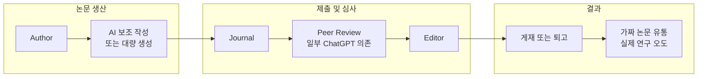

## 도입: 왜 이 주제인가

컴퓨터 과학자들과 전직 헬스 리포터가 6개월간 조사한 결과, **수천 편의 가짜 학술 논문**이 특히 암(cancer)과 Covid-19 연구 분야에서 유통되고 있으며, 이는 실제 과학 연구를 방해하고 환자 안전까지 위협할 수 있다는 충격적인 보고가 나왔다. 본문에서는 "가짜 논문"의 정의, 학계 인센티브 구조, 식별 도구, Peer Review의 한계, 그리고 근본적인 해결 방향까지 정리한다.

다음 Medium 블로그 글이 이 조사의 요약과 동기를 잘 전달한다.

- [Why thousands of fake scientific papers are flooding academic journals](https://blog.medium.com/why-thousands-of-fake-scientific-papers-are-flooding-academic-journals-0ca31aa9882a)

---

## 정의와 배경: 가짜 논문이란 무엇인가

여기서 **가짜 논문**이란, **AI에 의해 작성되었거나 AI의 도움을 크게 받아 작성된 학술 논문**을 의미한다. 표절·데이터 조작·논문 공장(paper mill)에서 나온 논문도 넓은 의미에서 "가짜"에 포함될 수 있으나, 본 글은 특히 **생성형 AI(ChatGPT 등)가 본문·초록·심사 의견까지 대량 생산하는 현상**에 초점을 둔다.

학계에는 **논문 수가 많을수록 펀딩·승진·평가에 유리**하다는 구조가 있다. 그래서 저널 에디터의 검토를 통과할 수 있는 수준의 논문을 **대량으로 내는 것**에 대한 암묵적 인센티브가 생기고, 이는 **"publish or perish(발표하지 않으면 도태된다)"** 현상으로 이어진다. 그 결과, **질보다 양**을 추구하는 논문 생산이 늘고, AI를 이용한 초안·번역·동의어 치환이 심사 과정을 피해 유입되는 경로가 넓어졌다.

---

## 가짜 논문 유통과 심사 구조

아래 다이어그램은 가짜 논문이 학술지에 침투하는 흐름과, 심사·검증 단계에서 발생하는 한계를 요약한다. 노드 ID는 camelCase·PascalCase로만 사용했고, 라벨에 등호·특수문자가 있는 경우 큰따옴표로 감쌌다.

- **논문 생산**: 저자가 AI를 보조로 쓰거나, 논문 공장이 대량 생성한 원고가 제출된다.
- **제출 및 심사**: 저널이 수령한 뒤 Peer Review에 회부하나, 심사 의견 자체가 ChatGPT로 작성되는 비율이 약 17%에 이른다는 보고가 있다.
- **결과**: 심사를 통과한 논문이 게재되면, 가짜 논문이 정상 문헌처럼 인용·확산되며 실제 연구자와 임상 결정을 오도할 수 있다.

---

## 가짜 논문이 미치는 영향

이러한 현상의 결과는 **실제 연구를 수행하는 과학자들을 오도**하고, **환자 건강에 직접적인 위험**을 초래할 수 있다. 한 암 연구자는 해당 보도를 인용하며 "이제 초록만 읽고는 어떤 논문도 믿기 어렵다", "일단 모든 것이 잘못되었을 수 있다고 가정한다"고 말한 바 있다.

대표 사례는 **Covid-19 초기 ivermectin 관련 연구**다. 일부 연구가 임상 권고의 근거로 인용되었으나, 나중에 **실제 임상시험에 기반하지 않은 부정·오류**가 드러났다. BBC 보도에 따르면, ivermectin의 Covid-19 효능을 주장한 주요 시험들 중 상당수에서 데이터 조작·논리적 오류가 발견되었고, 그로 인해 잘못된 치료 선택을 한 사례도 보고되었다.

> "Ivermectin: How false science created a Covid 'miracle' drug" — [BBC Reality Check (2021)](https://www.bbc.com/news/health-58170809)

따라서 가짜 논문 문제는 "학계만의 이슈"가 아니라, **의료·정책·공중 보건**까지 영향을 미치는 사회적 문제로 봐야 한다.

---

## 가짜 논문을 식별하는 방법

**Problematic Paper Screener**는 새로운 학술 논문을 주기적으로 검토하며 속임수의 단서를 찾는 도구다. 툴루즈·그르노블 대학 등 연구팀이 개발했으며, 매주 약 1억 3천만 편의 논문을 스캔한다. The Conversation 소개 기사에 따르면, 다음 같은 식별 포인트를 사용한다.

- **어색한 문체**: 대화나 정상적인 학술 글에서 쓰이지 않을 문구(예: "crude information" 대신 자연스러운 "raw data"를 쓰지 않고 과도한 동의어 사용).
- **Tortured phrases(왜곡된 구문)**: 표절 감지 소프트웨어를 피하기 위해 동의어 치환을 과도하게 사용한 결과, "United States"가 "Joined Together States", "breast cancer"가 "bosom peril"처럼 비논리적으로 바뀐 사례가 실제 논문에서 발견되었다.
- **ChatGPT 지문(fingerprints)**: 본문에 "Regenerate Response", "As an AI language model, I cannot …"처럼 AI 출력이 그대로 붙여 넣어진 흔적.

이 도구는 1,000건 이상의 논문 퇴稿(retraction)에 기여했으며, 여러 출판사가 편집 워크플로에 통합해 의심 논문을 사전에 걸러 내고 있다.

- [Problematic Paper Screener: Trawling for fraud in the scientific literature (The Conversation)](https://theconversation.com/problematic-paper-screener-trawling-for-fraud-in-the-scientific-literature-246317)

---

## Peer Review의 한계

Peer Review는 **완벽한 해결책이 되지 못하고** 있다. Nature 기사에 따르면, 논문 심사 의뢰의 상당 비율(약 17% 등)이 **ChatGPT에 의해 작성**되는 추세가 관찰되고 있으며, 심사 자체가 **개인적 연결·친목·호혜**에 의해 움직이는 측면도 지적된다. 즉, "서로 심사해 주는" 구조에서 동기가 부여된 심사(motivated reasoning)가 개입할 수 있고, AI가 심사 의견까지 대량 생성함으로써 **검증의 의미가 약화**될 수 있다.

- [ChatGPT is transforming peer review — how can we use it responsibly? (Nature, 2024)](https://www.nature.com/articles/d41586-024-03588-8)

---

## 해결 방향과 원칙

이 문제를 완화하려면 **시스템 수준의 변화**가 필요하다. 다음 세 가지가 자주 제안된다.

1. **양이 아닌 질 기반의 펀딩·평가**: 논문 편수만으로 기관·연구자를 평가하지 않고, 재현성·임팩트·투명성을 반영한 질적 지표를 도입한다.
2. **독자 중심의 연구**: "쓰는 사람을 위한 논문"이 아니라 **읽는 사람(동료·임상의·정책 입안자)이 활용할 수 있는 연구**를 지향한다.
3. **덜 쓰고, 더 잘 쓰고, 올바른 이유로 쓰기**: 한 통계학자가 보고서에서 강조한 대로, "We need less research, better research, research done for the right reasons"라는 관점이 필요하다.

정리하면, 가짜 논문 유통은 **인센티브 구조·심사 품질·AI 사용 규범**이 함께 바뀌어야 줄어들 수 있는 문제다.

---

## 마무리 및 참고 문헌

가짜 학술 논문의 침투는 **AI 생성 텍스트의 남용**, **publish or perish에 따른 양산 압력**, **Peer Review의 취약성**이 겹친 결과다. 식별 도구(Problematic Paper Screener 등)로 일부를 걸러 낼 수 있으나, 근본적으로는 **질 기반 평가·독자 중심 연구·적절한 AI 사용**이 정착되어야 신뢰할 수 있는 과학 생태계를 유지할 수 있다. 이 주제는 연구자·편집자·펀딩 기관뿐 아니라 일반 시민도 인지할 필요가 있는 이슈다.

### 참고 문헌

| 순서 | 제목·설명 | URL |
|------|-----------|-----|
| 1 | Why thousands of fake scientific papers are flooding academic journals (Medium Blog) | [blog.medium.com](https://blog.medium.com/why-thousands-of-fake-scientific-papers-are-flooding-academic-journals-0ca31aa9882a) |
| 2 | Ivermectin: How false science created a Covid 'miracle' drug (BBC Reality Check) | [bbc.com/news/health-58170809](https://www.bbc.com/news/health-58170809) |
| 3 | ChatGPT is transforming peer review — how can we use it responsibly? (Nature) | [nature.com/articles/d41586-024-03588-8](https://www.nature.com/articles/d41586-024-03588-8) |
| 4 | Problematic Paper Screener: Trawling for fraud in the scientific literature (The Conversation) | [theconversation.com](https://theconversation.com/problematic-paper-screener-trawling-for-fraud-in-the-scientific-literature-246317) |
