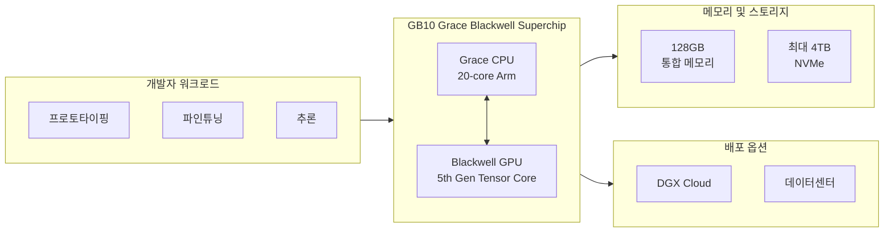

## 개요

NVIDIA가 **CES 2025**에서 공개한 개인용 AI 슈퍼컴퓨터 **Project DIGITS**는 이후 정식 제품명 **NVIDIA DGX Spark**로 출시되었다. 데스크톱 크기의 폼팩터에 **NVIDIA GB10 Grace Blackwell Superchip**을 탑재해, AI 연구원·데이터 사이언티스트·학생이 로컬에서 최대 **200B 파라미터** 규모의 대형 언어 모델(LLM) 프로토타이핑, 파인튜닝, 추론을 수행할 수 있게 한다. DGX OS 기반 Linux 환경과 NGC·NVIDIA AI Enterprise 스택을 통해 클라우드·데이터센터로의 이식도 용이하다.

**추천 대상**: AI·머신러닝 연구·개발자, LLM 로컬 실험을 고민하는 데이터 사이언티스트, 데스크톱급 AI 하드웨어와 Grace Blackwell 아키텍처에 관심 있는 독자.

---

## 아키텍처와 구성

Project DIGITS(DGX Spark)는 **Grace CPU**와 **Blackwell GPU**가 **NVLink-C2C**로 결합된 단일 **GB10 Superchip**을 중심으로, 통합 메모리·스토리지·네트워크가 한 시스템에 담긴 구조다. 워크로드가 로컬에서 DGX Cloud·데이터센터까지 이어지는 흐름은 아래 다이어그램으로 요약할 수 있다.

- **Grace CPU**: 20-core Arm(10× Cortex-X925 + 10× Cortex-A725), 전력 효율 중심 설계.
- **Blackwell GPU**: 최신 CUDA 코어와 5세대 Tensor Core, FP4 기준 이론상 **1 petaFLOP** 수준 AI 성능.
- **통합 메모리**: 128GB LPDDR5x, CPU·GPU가 공유하는 코히어런트 메모리로 대형 모델 로딩에 유리.
- **확장**: 두 대의 DGX Spark를 ConnectX-7(200 Gbps)로 연결하면 **405B 파라미터** 규모 모델까지 실행 가능하다.

---

## 핵심 스펙 요약

| 항목 | 내용 |
|------|------|
| 아키텍처 | NVIDIA Grace Blackwell |
| GPU | Blackwell, 5세대 Tensor Core, 4세대 RT Core |
| CPU | 20-core Arm (Cortex-X925 + Cortex-A725) |
| Tensor 성능 | FP4 기준 최대 약 1 PFLOP (이론치, sparsity 활용 시) |
| 시스템 메모리 | 128GB LPDDR5x, 256-bit, 273 GB/s |
| 스토리지 | 4TB NVMe M.2 (자체 암호화 지원) |
| 네트워크 | 10 GbE RJ-45, ConnectX-7 NIC 200 Gbps, Wi-Fi 7, Bluetooth 5.4 |
| 전원·TDP | 240W 어댑터, GB10 TDP 140W |
| 크기·무게 | 150 mm × 150 mm × 50.5 mm, 약 1.2 kg |
| OS | NVIDIA DGX OS (Linux 기반) |

상세 스펙과 노이즈·인증 정보는 [NVIDIA Project DIGITS 공식 스펙](https://www.nvidia.com/en-us/project-digits/#m-specs) 및 [DGX Spark 사용자 가이드](https://docs.nvidia.com/dgx/dgx-spark/index.html)를 참고하면 된다.

---

## 워크로드와 활용 시나리오

DGX Spark는 다음 워크로드에 최적화되어 있다.

- **프로토타이핑**: 로컬에서 AI 모델·애플리케이션 개발·검증 후, DGX Cloud·클라우드·데이터센터로 마이그레이션하는 워크플로우.
- **파인튜닝**: 128GB 통합 메모리를 활용해 **최대 70B 파라미터** 규모 모델의 파인튜닝 가능.
- **추론**: 5세대 Tensor Core와 FP4 지원으로 **최대 200B 파라미터** LLM 추론을 데스크톱에서 수행.
- **데이터 사이언스**: 대용량·고연산 데이터 분석 및 ML 파이프라인을 데스크톱 환경에서 실행.
- **엣지·로보틱스**: NVIDIA Isaac, Metropolis, Holoscan 등과 연계한 엣지·로봇·비전 개발.

NVIDIA AI 스택(NIM, NGC 카탈로그, AI Enterprise)이 사전 구성되어 있어, 프레임워크·라이브러리·사전 학습 모델 접근이 용이하다.

---

## 출시 정보

- **구독·구입**: 2025년 5월부터 NVIDIA 및 주요 파트너를 통해 구매 가능, **시작가 약 $3,000**.
- **구입 경로**: [NVIDIA Marketplace – DGX Spark](https://marketplace.nvidia.com/en-us/developer/dgx-spark/), [Get Started (Build)](https://build.nvidia.com/spark)에서 안내 및 플레이북 확인 가능.

---

## 시사점과 평가

**장점**

- 데스크톱 폼팩터에서 **1 petaFLOP급** AI 연산과 **200B LLM** 로컬 실행을 지원해, AI 개발·실험의 접근성이 크게 높아진다.
- 비용 대비 성능이 뛰어나 개인 개발자·소규모 팀·교육 현장에서 활용하기에 유리하다.
- DGX OS·NGC·AI Enterprise로 로컬→클라우드·온프레미스 연계가 자연스럽다.
- 두 대 연결 시 405B 규모까지 확장 가능해, 중규모 연구·개발에도 대안이 된다.

**단점·고려사항**

- FP4·1 PFLOP는 이론적 수치이며, sparsity 등 조건에 따라 실제 성능은 다를 수 있다.
- 128GB 메모리로 200B 모델을 풀 프리시전으로 올리기는 어렵고, 양자화·최적화가 필요하다.
- 공급·가격·지역별 가용성은 시점에 따라 변동될 수 있으므로 공식 채널을 확인하는 것이 좋다.

NVIDIA CEO Jensen Huang의 “AI는 모든 산업의 모든 애플리케이션에서 메인스트림이 될 것”이라는 방향과 맞닿아, **Project DIGITS(DGX Spark)**는 그 메인스트림을 데스크톱까지 끌어오는 대표 제품으로 평가할 수 있다.

---

## 참고 문헌

1. **NVIDIA – Project DIGITS (DGX Spark)**  
   [https://www.nvidia.com/en-us/project-digits/](https://www.nvidia.com/en-us/project-digits/)  
   제품 개요, 스펙, 구매 링크, 플레이북·포럼 링크.

2. **NVIDIA Developer – Get Started With NVIDIA DGX Spark**  
   [https://developer.nvidia.com/topics/ai/dgx-spark](https://developer.nvidia.com/topics/ai/dgx-spark)  
   소프트웨어, 리커버리 이미지, NVIDIA Sync·AI Workbench, 문서·포럼 링크.

3. **DGX Spark User Guide**  
   [https://docs.nvidia.com/dgx/dgx-spark/index.html](https://docs.nvidia.com/dgx/dgx-spark/index.html)  
   하드웨어 개요, 초기 설정, OS·컴포넌트 업데이트, 복구, 지원 정보.
