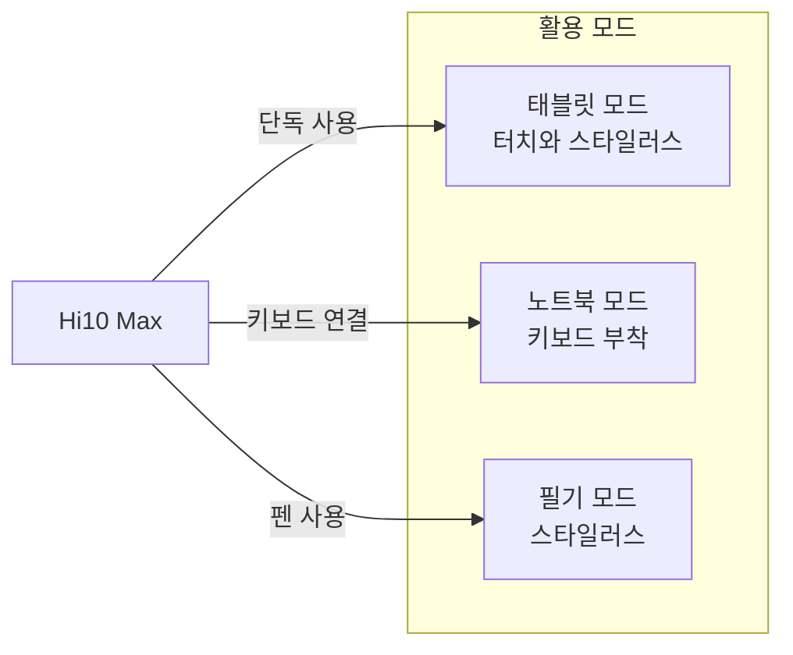

이 글에서는 CHUWI에서 출시한 **Hi10 Max** 2-in-1 태블릿을 소개한다. Windows 11을 탑재해 PC 수준의 생산성과 태블릿의 휴대성을 동시에 제공하며, 본문에서 제품 개요·스펙·주요 특징·활용 시나리오·장단점을 정리했다. 제품 사양은 출시 지역·모델에 따라 공식 스펙과 다를 수 있으므로, 구매 전 [CHUWI 공식 페이지](https://www.chuwi.com/product/items/chuwi-hi10-max-en.html)에서 최신 정보를 확인하는 것이 좋다.

## 개요 및 추천 대상

CHUWI Hi10 Max는 **생산성과 휴대성을 겸비한 2-in-1 Windows 태블릿**이다. 10.1인치 2K 디스플레이, 12세대 Intel N100 프로세서, 12GB LPDDR5 RAM, 256GB SSD를 탑재해 문서 작업·화상 회의·온라인 강의·가벼운 엔터테인먼트까지 다양한 용도로 쓸 수 있다. 두께 7.9mm·무게 약 560g으로 이동 시 부담이 적고, 키보드와 스타일러스 펜(별도 구매)을 조합하면 노트북처럼 활용할 수 있다.

**추천 대상**은 다음과 같다. 출퇴근·이동 중 가벼운 문서·메일·웹 작업을 하고 싶은 직장인, 온라인 수업·필기·E-book 읽기를 하나의 기기로 처리하려는 학생, 영상 시청·웹 서핑·가벼운 게임을 휴대용으로 즐기려는 사용자, 그리고 합리적인 가격대에 Windows 11 태블릿을 찾는 사람이다. 고사양 게임·고부하 영상 편집보다는 **일상 생산성·학습·엔터테인먼트**에 적합한 제품이다.

## 제품 사양 요약

| 구분 | 사양 |
|------|------|
| **디스플레이** | 10.1인치 2K IPS, 2160×1440, 16:10, 10점 멀티터치 |
| **프로세서** | Intel N100 (12th Gen Alder Lake-N) |
| **그래픽** | Intel UHD Graphics |
| **메모리** | 12GB LPDDR5 |
| **저장** | 256GB SSD |
| **무선** | Wi-Fi 6 |
| **크기·무게** | 두께 7.9mm, 약 560g |
| **연결** | USB Type-C, USB 3.0 등 |
| **주변기기** | 키보드·스타일러스 펜 지원 (별도 구매) |
| **배터리** | 24.3Wh, 최대 약 6시간 사용, 빠른 충전 지원 |
| **OS** | Windows 11 |

공식 사이트의 Hi10 Max 모델은 12.96인치 3K·780g 등 다른 스펙으로 안내되는 경우가 있으므로, 구매처·모델명을 꼭 확인하는 것이 좋다.

## 주요 특징

### 디스플레이

10.1인치 **2K IPS 디스플레이**(2160×1440, 16:10 비율)로 문서·웹·동영상 가독성이 좋다. 10점 멀티터치를 지원해 터치 조작과 스타일러스 필기가 가능하며, 2-in-1 형태로 세로·가로 사용을 모두 고려한 비율이다.

### 하드웨어

**Intel N100**(12세대 Alder Lake-N, 4코어 4스레드)과 **Intel UHD Graphics**를 사용해 일상적인 오피스·웹·동영상·가벼운 앱 실행에 무리가 없다. **12GB LPDDR5**와 **256GB SSD**로 멀티태스킹과 저장 공간이 충분하고, **Wi-Fi 6**로 무선 환경이 안정적이다. 고사양 게임이나 전문가급 영상 편집에는 한계가 있을 수 있다.

### 디자인과 휴대성

두께 **7.9mm**, 무게 **약 560g**으로 가방에 넣고 다니기 부담이 적다. USB Type-C, USB 3.0 등 포트를 제공하며, **키보드**와 **스타일러스 펜**을 옵션으로 붙여 노트북·필기 모드로 전환할 수 있다. 2-in-1 구조로 사용 상황에 맞게 형태를 바꿀 수 있다.

### 배터리

**24.3Wh** 배터리를 탑재하며, 사용 환경에 따라 **최대 약 6시간** 사용이 가능하다고 안내된다. 빠른 충전을 지원해 외부에서의 재충전이 비교적 수월한 편이다.

## 활용 시나리오

Hi10 Max는 아래와 같은 용도에 적합하다.

- **업무용**: Microsoft Office 문서 작성·편집, 이메일·캘린더 확인, 화상 회의(Teams·Zoom 등), 간단한 웹 기반 업무
- **교육용**: 온라인 강의 시청, 강의 노트·필기, E-book·PDF 읽기, 과제·보고서 초안 작성
- **엔터테인먼트**: 스트리밍 영상 시청, 웹 서핑, SNS, 가벼운 게임

아래 다이어그램은 태블릿·키보드·스타일러스 조합에 따른 주요 활용 방식을 정리한 것이다.

## 장단점 및 한 줄 평

**장점**으로는 Windows 11 기반으로 기존 PC 소프트웨어·워크플로를 그대로 쓸 수 있는 점, 12GB RAM·256GB SSD로 일상 생산성에 충분한 점, 7.9mm·560g 수준의 휴대성, 2K IPS 디스플레이와 16:10 비율로 작업·시청에 유리한 점, 키보드·스타일러스 옵션으로 업무·학습 시나리오를 확장할 수 있는 점을 꼽을 수 있다.

**단점·고려사항**으로는 배터리 용량(24.3Wh)으로 고부하·장시간 사용 시 충전이 필요할 수 있는 점, 키보드·스타일러스가 별도 구매인 점, Intel N100 특성상 고사양 게임·고부하 전문 작업에는 한계가 있는 점을 인지할 필요가 있다.

**한 줄 평**: 합리적인 가격대에 Windows 11 생산성과 휴대성을 모두 원하는 이에게, CHUWI Hi10 Max는 업무·교육·엔터테인먼트용 2-in-1 태블릿 후보로 검토할 만한 제품이다.

## 참고 문헌

1. [CHUWI Hi10 Max 공식 제품 페이지](https://www.chuwi.com/product/items/chuwi-hi10-max-en.html) — 제품 개요·스펙·구매 안내.
2. [Windows 11 다운로드 및 설치](https://www.microsoft.com/software-download/windows11) — Windows 11 설치 미디어·시스템 요구사항 안내.
3. [Windows 11 장치 사양](https://www.microsoft.com/en-us/windows/windows-11-specifications) — Windows 11 지원 하드웨어·기능 요구사항.
