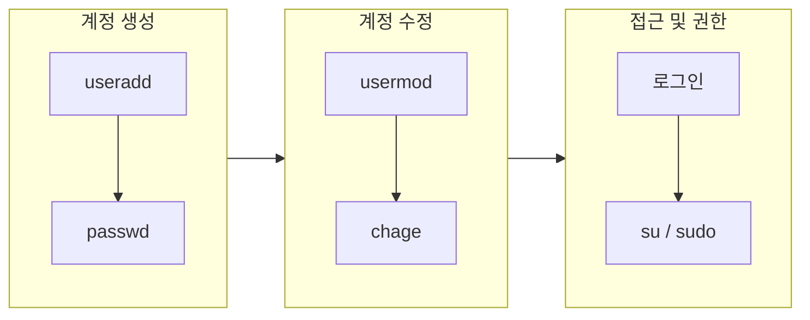

## 개요

Linux는 다중 사용자 환경을 지원하는 운영체제이며, 사용자 관리(user management)는 시스템 보안과 자원 관리의 핵심이다. 이 글에서는 UID/GID 기반 식별 체계, 계정·그룹 생명주기 관리, 권한 상승(su·sudo), PAM 인증, 보안·감사까지 **실무에 필요한 Linux 사용자 관리**를 한곳에 정리한다.

**대상 독자**: 서버/데스크톱 리눅스 관리자, DevOps·SRE, 리눅스 입문 후 계정·권한을 다지고 싶은 개발자.

---

## 사용자 정보가 저장되는 위치

Linux에서 사용자·그룹 정보는 다음 파일에 저장된다.

| 파일 | 역할 |
|------|------|
| `/etc/passwd` | 사용자 계정 정보(로그인명, UID, GID, 홈, 셸 등). 비밀번호 필드는 `x`로 표기되며 실제 해시는 `/etc/shadow`에 있음 |
| `/etc/shadow` | 암호화된 비밀번호, 마지막 변경일, 만료·경고·비활성 기간 등(root만 읽기 가능) |
| `/etc/group` | 그룹명, GID, 보조 그룹 멤버 목록 |
| `/etc/gshadow` | 그룹 비밀번호·관리자 등 보안 정보(선택) |

`/etc/passwd`의 한 행 형식은 `username:x:UID:GID:comment:home_directory:shell`이다. 배포판에 따라 일반 사용자 UID는 1000번대부터, 시스템 계정은 1–999(또는 201–999) 범위를 사용한다.

---

## 사용자 생명주기: 생성·비밀번호·수정·삭제·조회

### 계정 생성 (useradd)

새 사용자 계정을 만들 때는 `useradd`를 사용한다. `-m`으로 홈 디렉터리 생성, `-s`로 셸, `-g`로 기본 그룹, `-G`로 보조 그룹을 지정할 수 있다.

```bash
# 기본 생성(홈 없을 수 있음: 배포판에 따름)
sudo useradd username

# 홈 생성 + bash + 기본 그룹 지정
sudo useradd -m -s /bin/bash -g developers newuser

# 홈 경로·UID 명시
sudo useradd -m -d /home/newuser -s /bin/bash -u 1001 -g developers newuser
```

Debian/Ubuntu는 `adduser`를 쓰는 경우가 많고, `useradd -m` 또는 `/etc/login.defs`의 `CREATE_HOME`으로 홈 생성을 제어한다. 기본값은 `/etc/default/useradd`, `/etc/login.defs`에서 읽는다.

### 비밀번호 설정·정책 (passwd, chage)

```bash
# 비밀번호 설정·변경
sudo passwd username

# 계정 만료·비밀번호 수명 제어(chage)
sudo chage -M 90 -E 2025-12-31 newuser   # 90일마다 변경, 2025년 말 계정 만료
sudo chage -l newuser                    # 정책 조회
```

비밀번호 정책은 `/etc/login.defs`와 PAM(`/etc/pam.d/passwd`, pam_pwquality 등)으로 강화할 수 있다.

### 계정 수정 (usermod)

```bash
# 로그인명 변경
sudo usermod -l newlogin oldlogin

# 보조 그룹 추가(기존 그룹 유지)
sudo usermod -aG groupname username

# 셸·홈 변경
sudo usermod -s /bin/bash -d /home/newhome -m username
```

그룹 변경은 **로그아웃 후 재로그인**해야 적용된다. `-aG`를 빼고 `-G`만 쓰면 기존 보조 그룹이 덮어씌워지므로 주의한다.

### 계정 삭제 (userdel)

```bash
# 계정만 삭제
sudo userdel username

# 홈 디렉터리·메일 스풀까지 삭제
sudo userdel -r username
```

삭제 전에는 해당 사용자가 로그아웃되어 있고 실행 중인 프로세스가 없어야 한다.

### 사용자 정보 조회

```bash
whoami
id username
id -un
getent passwd username
cat /etc/passwd
```

---

## 그룹 관리

각 사용자는 **기본 그룹(primary group)** 하나에 반드시 속하고, **보조 그룹(secondary group)**은 여러 개 가질 수 있다(일반적으로 15개까지).

```bash
# 그룹 생성·삭제·수정
sudo groupadd groupname
sudo groupdel groupname
sudo groupmod -n newname oldname
sudo groupmod -g 1002 groupname

# 그룹에 사용자 추가(보조 그룹)
sudo usermod -aG groupname username
# 또는
sudo gpasswd -a username groupname
```

`/etc/group` 형식: `groupname:x:GID:member1,member2,...`

---

## 권한 관리: chmod, chown, setgid, ACL

파일·디렉터리 권한은 **소유자(u)·그룹(g)·기타(o)** 3계층으로, 읽기(r=4)·쓰기(w=2)·실행(x=1) 조합으로 부여한다.

```bash
# 권한 변경(8진수 또는 기호)
chmod 755 script.sh
chmod u+x,g-w file

# 소유자·그룹 변경
chown user:group file
chown -R user:group /dir
chgrp groupname file
```

**setgid(2000)**를 디렉터리에 걸면, 그 안에 새로 만들어진 파일·디렉터리가 부모의 그룹을 상속해 협업 디렉터리에 유용하다. **ACL**로 사용자·그룹별 세밀한 권한을 주려면 `setfacl`·`getfacl`을 사용한다.

---

## 권한 상승: su와 sudo

### su (substitute user)

다른 사용자(주로 root)로 전환할 때 쓴다. `-`(또는 `-l`)를 주면 대상 사용자의 로그인 환경(.profile 등)이 로드된다.

```bash
su - root
su - root -c "apt-get update"
```

`-` 없이 `su root`만 쓰면 현재 사용자 환경(PATH 등)이 유지되어 보안상 불리할 수 있으므로, root 전환 시에는 `su -` 사용을 권장한다. 로그는 `/var/log/secure`(RHEL 계열) 또는 `/var/log/auth.log`(Debian 계열)에 남는다.

### sudo (superuser do)

특정 명령만 root(또는 지정 사용자) 권한으로 실행하도록 **위임**하는 방식이다. `/etc/sudoers`를 `visudo`로 편집해 설정한다.

```bash
# 예: newuser가 모든 호스트에서 root로 apt-get만 실행 가능
# /etc/sudoers
newuser ALL=(root) /usr/bin/apt-get
%wheel ALL=(ALL) ALL
```

wheel 그룹에 관리자를 넣고 그룹 단위로 sudo를 주는 구성이 일반적이다. `Defaults rootpw` 등으로 root 비밀번호 대신 본인 비밀번호를 쓰게 할 수 있다.

---

## 사용자 관리 흐름 요약 (Mermaid)

다음 다이어그램은 계정 생성부터 권한 사용까지의 흐름을 요약한다.



---

## 보안 고려사항

1. **root 직접 로그인 차단**  
   SSH의 경우 `PermitRootLogin no`(sshd_config), 콘솔 로그인도 제한하고, sudo로만 권한 상승하도록 한다.
2. **강한 비밀번호 정책**  
   `/etc/login.defs`, PAM(pam_pwquality 등)으로 최소 길이·복잡성·만료 주기를 설정한다.
3. **최소 권한 원칙**  
   필요한 명령만 sudo로 허용하고, 가능하면 일반 사용자로 동작하게 한다.
4. **계정·세션 관리**  
   불필요한 계정은 제거하고, `TMOUT` 등으로 비활성 시 자동 로그아웃을 둘 수 있다.
5. **PAM 활용**  
   로그인·sudo·passwd 등 인증 경로를 `/etc/pam.d/`에서 모듈(required, requisite, sufficient 등)로 조합해 2FA·비밀번호 강도 검사 등을 적용한다.

---

## 감사 및 모니터링

- **인증 로그**  
  `/var/log/secure`(RHEL) 또는 `/var/log/auth.log`(Debian)에서 로그인·su·sudo 이력을 확인한다.
- **로그인 기록**  
  `last`, `lastb`로 성공/실패 로그인을 점검한다.
- **auditd**  
  커널 수준에서 `passwd` 수정, `useradd` 실행 등 중요 이벤트를 규칙으로 남기고 `ausearch`로 검색할 수 있다.

---

## 결론

Linux 사용자 관리는 `/etc/passwd`, `/etc/shadow`, `/etc/group`과 useradd·usermod·userdel·passwd·chage·su·sudo 같은 기본 도구, 그리고 PAM·auditd를 함께 이해하면 실무에서 계정·권한·보안을 체계적으로 다룰 수 있다. 최소 권한 원칙과 정기적인 계정·로그 검토를 습관화하는 것이 좋다.

---

## 참고 문헌

- [Red Hat Enterprise Linux 9 - 사용자 계정 관리 시작하기](https://docs.redhat.com/ko/documentation/red_hat_enterprise_linux/9/html/configuring_basic_system_settings/assembly_getting-started-with-managing-user-accounts_managing-users-and-groups) — RHEL 9 사용자·그룹 관리 공식 문서.
- [Rocky Linux - 사용자 관리](https://docs.rockylinux.org/ko/books/admin_guide/06-users/) — 그룹·사용자 명령, passwd/shadow/group 파일, chown·gpasswd·su 등 상세 가이드.
- [Amazon EC2 - Linux 인스턴스에서 시스템 사용자 관리](https://docs.aws.amazon.com/ko_kr/AWSEC2/latest/UserGuide/managing-users.html) — EC2 Linux에서 사용자 추가·제거 및 SSH 키 설정.
