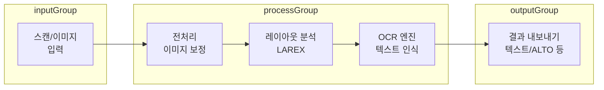

## 개요

**OCR4all**은 Optical Character Recognition(광학 문자 인식)을 누구나 쉽게 쓸 수 있게 만든 **완전 무료·오픈소스** 웹 기반 도구다. 구독료나 유료 기능 없이, 코드나 CLI 없이도 복잡한 OCR 파이프라인을 UI로 구성하고 실행할 수 있다.

### 도구 정보

| 항목 | 내용 |
|------|------|
| **이름** | OCR4all |
| **라이선스** | MIT (코드·모델 공개) |
| **실행 방식** | Docker 기반 웹 앱 (브라우저에서 접속) |
| **공식 사이트** | [ocr4all.org](https://www.ocr4all.org) |
| **호환성** | OCR-D 표준 및 생태계와 호환 |

### 추천 대상

- **연구자·도서관**: 고문헌, 수기 원고, 희귀 인쇄물의 디지털화 및 전자 텍스트 추출
- **기관·아카이브**: 대량 자료의 레이아웃 분석·OCR·메타데이터 생성을 워크플로우로 자동화하고 싶은 경우
- **개인·교육**: 무료로 OCR 개념을 익히거나 소규모 문서를 텍스트로 남기고 싶은 경우

---

## OCR4all이란

OCR4all은 뷔르츠부르크 대학(University of Würzburg) 중심의 OCR-D 프로젝트와 연계된 오픈소스 도구다. **까다로운 수기·인쇄 문서**에 맞춘 모델과 **LAREX** 레이아웃 편집기를 내장해, 스캔 이미지에서 영역을 나누고 텍스트를 인식·수정·내보내기까지 한 환경에서 처리할 수 있다. 유료 API나 클라우드 서비스 없이 로컬·서버에서 자체 호스팅할 수 있어 **프라이버시와 데이터 주권**을 유지하기 좋다.

---

## 주요 특징

### 완전한 무료 및 오픈소스

- 구독료·유료 기능·프리미엄 제한이 없다.
- MIT 라이선스로 소스 코드와 모델이 공개되어 있다.
- [OCR4all GitHub](https://github.com/OCR4all)에서 코드·Docker 이미지·문서를 확인할 수 있다.

### 유연한 적용 범위

- 난해한 **수기 문서**의 고품질 인식
- **인쇄물**의 대량 전체 텍스트 인식
- 역사 자료, 학술 원고, 신문 등 다양한 레이아웃에 적용 가능

### 레이아웃·텍스트 주석 (LAREX)

- **LAREX** 편집기로 레이아웃·텍스트 요소를 수동으로 편집·비교할 수 있다.
- 영역(블록·라인·단어) 단위 주석과 수정이 가능해, OCR 결과 품질을 세밀하게 보정할 수 있다.

### OCR-D 호환성

- [OCR-D](https://ocr-d.de/) 생태계와 호환되도록 설계되어 있다.
- 향후 OCR-D 파이프라인·도구와 연동하거나 확장하기에 유리하다.

### 사용자 친화적 설계

- 코드나 명령줄 없이 **웹 UI**만으로 워크플로우를 만들고 실행할 수 있다.
- 단계별 가이드와 직관적인 화면 구성으로 초보자도 진입 장벽이 낮다.

### 크로스 플랫폼 배포

- **Docker** 한 번 설치하면 Linux, macOS, Windows에서 동일한 환경으로 실행 가능하다.
- 공식 퀵스타트는 단일 `docker run` 명령으로 서비스 기동을 안내한다.

---

## 설치 및 실행

### 요구 사항

- [Docker 설치](https://docs.docker.com/get-docker/) (Desktop 또는 Engine)
- 브라우저(Chrome, Firefox, Edge 등 권장)
- 디스크 여유 공간(이미지·모델 저장용)

### Docker로 빠르게 실행 (Linux 예시)

공식 퀵스타트에 따르면, 터미널에서 다음처럼 실행할 수 있다.

```bash
sudo docker run -p 1476:8080 \
  -u `id -u root`:`id -g $USER` \
  --name ocr4all \
  -v $PWD/data:/var/ocr4all/data \
  -v $PWD/models:/var/ocr4all/models/custom \
  -it uniwuezpd/ocr4all
```

이후 브라우저에서 **http://localhost:1476/ocr4all/** 로 접속한다. Windows·macOS는 [설정 가이드](https://www.ocr4all.org/guide/setup-guide/quickstart)(Quickstart 내 플랫폼별 링크)를 참고하면 된다.

---

## OCR4all 워크플로우 개요

일반적인 처리 흐름은 **이미지 로드 → 전처리 → 레이아웃 분석 → OCR → 교정·내보내기** 순이다. 아래 다이어그램은 이 파이프라인을 단순화한 것이다.



- **전처리**: 이진화·노이즈 제거·기울기 보정 등으로 인식 품질을 높인다.
- **레이아웃 분석**: 텍스트 블록·라인·영역을 자동/반자동으로 나누고, LAREX에서 수정할 수 있다.
- **OCR**: 학습된 모델로 문자를 인식하고, 필요 시 수동 교정 후 다양한 형식으로 내보낸다.

---

## 활용 시나리오

| 시나리오 | 설명 |
|----------|------|
| **고문헌 디지털화** | 희귀본·필사본을 스캔한 뒤 OCR4all로 텍스트화하고, LAREX로 레이아웃을 보정해 메타데이터와 함께 보존 |
| **대량 인쇄물 처리** | 동일 레이아웃의 인쇄물을 배치로 넣고 워크플로우를 반복 실행해 전자 텍스트 대량 생성 |
| **교육·실습** | OCR·레이아웃 분석 개념을 무료 도구로 체험하고, Docker·워크플로우 구성까지 함께 학습 |
| **OCR-D 파이프라인 연동** | OCR-D 호환 포맷으로 내보낸 결과를 다른 OCR-D 도구나 스크립트와 연계해 후처리·검색 시스템 구축 |

---

## 종합 평가

### 장점

- **완전 무료·오픈소스**로 비용 부담이 없고, 자체 호스팅으로 데이터를 외부로 보내지 않아도 된다.
- **수기·역사 인쇄물**에 특화된 모델과 **LAREX**로 품질 보정이 가능하다.
- **Docker 기반**이라 설치·버전 관리가 단순하고, **OCR-D**와의 호환으로 확장성이 좋다.
- **웹 UI**만으로 워크플로우를 구성할 수 있어 접근성이 높다.

### 단점

- 대용량·초대량 문서를 실시간에 가깝게 처리하려면 서버 사양과 튜닝이 필요할 수 있다.
- 일부 언어·폰트는 전용 모델 추가나 학습이 필요할 수 있다.

### 한 줄 평

**무료로 수기·인쇄 문서를 고품질 OCR하고, 레이아웃까지 손보고 싶다면 OCR4all을 먼저 써 보기 좋다.**

---

## 참고 문헌·링크

1. **OCR4all 공식 사이트**  
   [https://www.ocr4all.org](https://www.ocr4all.org) — 소개, 설정 가이드, 사용자 가이드, 개발자 문서.

2. **OCR4all Quickstart (설정 가이드)**  
   [https://www.ocr4all.org/guide/setup-guide/quickstart](https://www.ocr4all.org/guide/setup-guide/quickstart) — Docker 기반 빠른 설치 및 플랫폼별 상세 가이드 링크.

3. **OCR-D 프로젝트**  
   [https://ocr-d.de](https://ocr-d.de/) — OCR-D 생태계 소개 및 연관 도구·표준 정보.

4. **OCR4all GitHub**  
   [https://github.com/OCR4all](https://github.com/OCR4all) — 소스 코드, Docker 이미지, LAREX, 모델 저장소 등.

5. **Docker 설치 문서**  
   [https://docs.docker.com/get-docker/](https://docs.docker.com/get-docker/) — Docker Desktop·Engine 설치 방법.
