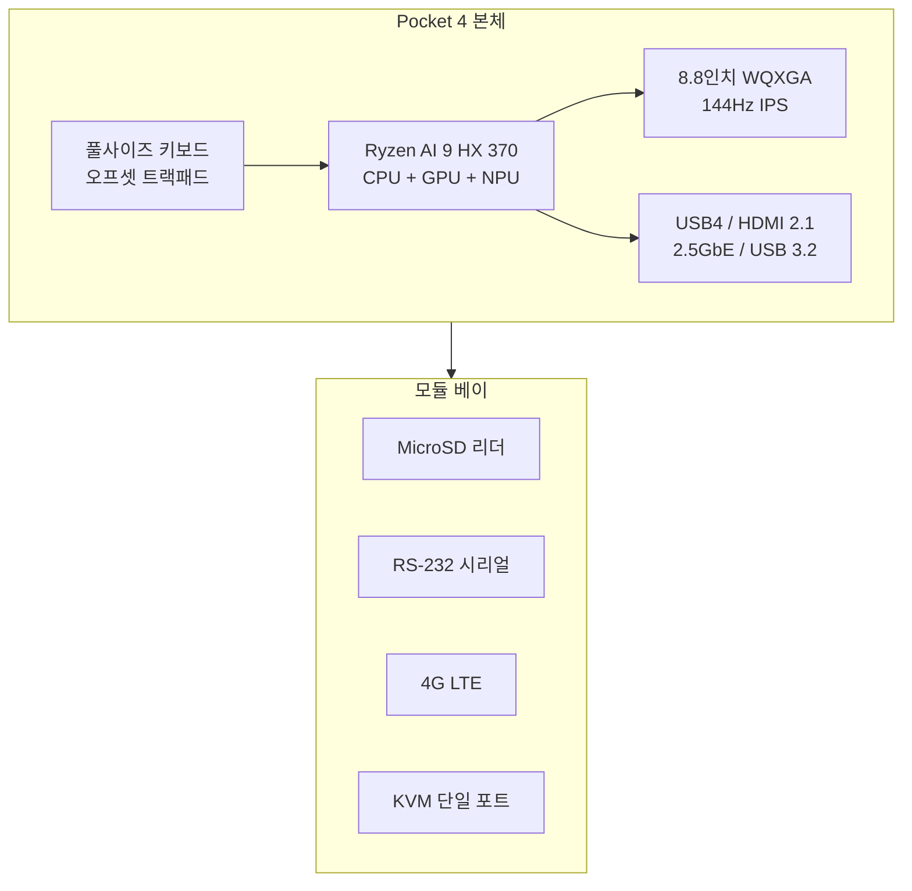

이 글에서는 Indiegogo 크라우드펀딩으로 출시된 **GPD Pocket 4** 모듈형 핸드헬드 AI PC를 소개한다. AMD Ryzen AI 300 시리즈 APU와 8.8인치 144Hz WQXGA 디스플레이, 사용자 교체 가능한 뒷면 모듈(RS-232·KVM·4G LTE 등)을 특징으로 하며, 본문에서 제품 개요·스펙·구조·주요 특징·시장 포지션·장단점·참고 문헌을 정리했다. 제품 사양과 가격은 캠페인·지역에 따라 다를 수 있으므로 구매 전 [Pocket 4 Indiegogo 프로젝트](https://www.indiegogo.com/projects/pocket-4-modular-full-featured-handheld-ai-pc)에서 최신 정보를 확인하는 것이 좋다.

## 개요 및 추천 대상

GPD Pocket 4는 **모듈식 설계와 AI 가속을 결합한 울트라 모바일 PC(UMPC)** 이다. AMD Ryzen AI 9 HX 370 APU(Zen 5 기반 12코어, Radeon 890M, 50TOPS NPU), 8.8인치 2560×1600(WQXGA) 144Hz IPS 디스플레이, 풀사이즈 백라이트 키보드와 오프셋 트랙패드를 갖추고, 뒷면 모듈 베이로 MicroSD·RS-232·4G LTE·단일 포트 KVM 등을 교체할 수 있다. 785g·20.68mm 두께, 63Wh 배터리와 USB4·HDMI 2.1·2.5GbE 등 포트 구성으로 이동 중 업무·산업 현장·엣지 AI 실험까지 다양한 시나리오를 겨냥한다.

**추천 대상**은 다음과 같다. 서류 가방에서 꺼내 즉시 문서·메일·코딩을 하고 싶은 **이동형 업무 사용자**, RS-232·KVM 모듈로 레거시 장비·서버실 관리를 하려는 **산업·IT 관리자**, 50TOPS NPU로 온디바이스 AI·화상 회의 배경 블러·노이즈 캔슬을 쓰고 싶은 **AI·비대면 회의 사용자**, eGPU(GPD G1 등)와 조합해 1080p 게임이나 개발 환경을 휴대하고 싶은 **개발자·게이머**이다. 고정된 데스크톱 대신 **한 대로 여러 역할**을 수행해야 하는 이들에게 적합한 제품이다.

## 제품 사양 요약

| 구분 | 사양 |
|------|------|
| **APU** | AMD Ryzen AI 9 HX 370 (Zen 5, 12코어, RDNA 3.5 Radeon 890M, 50TOPS NPU) |
| **디스플레이** | 8.8인치 IPS, 2560×1600(WQXGA), 144Hz, 16:10, 343PPI, 500니트 |
| **메모리** | LPDDR5X, 최대 64GB |
| **저장** | M.2 Gen4x4, 최대 4TB |
| **모듈** | MicroSD·RS-232·4G LTE·KVM 단일 포트 등 교체 가능 |
| **연결** | USB4 40Gbps, HDMI 2.1, 2.5GbE, USB 3.2 Gen2 Type-A/C, USB 2.0 Type-A |
| **배터리·충전** | 63Wh, PD 3.1 100W |
| **쿨링** | 3D 베이퍼 챔버, TDP 10W–35W 조정 가능 |
| **크기·무게** | 두께 20.68mm, 약 785g |
| **OS** | Windows 11 (AI 기능 최적화) |

공식 스펙·모듈 종류·가격은 제조사·캠페인에 따라 달라질 수 있으므로, 구매 전 공식 채널에서 최신 정보를 확인하는 것이 좋다.

## 제품 구조 개요

Pocket 4의 핵심은 **일체형 본체 + 교체 가능한 뒷면 모듈**이다. 아래 다이어그램은 본체와 모듈·주요 인터페이스 관계를 요약한 것이다.

- **본체**: 디스플레이·APU·키보드·트랙패드·주요 포트가 고정되어 있다.
- **모듈 베이**: 사용 목적에 따라 위 네 가지 중 하나로 교체할 수 있으며, 산업용·현장용 시나리오에 맞춰 확장성이 열려 있다.

## 주요 특징

### 디자인과 입력 장치

8.8인치 **WQXGA(2560×1600) 144Hz IPS** 패널은 343PPI로 텍스트·UI가 선명하고, 16:10 비율로 문서·멀티태스킹에 유리하다. 500니트 밝기는 실내·야외에서 가독성을 높인다. **풀사이즈 백라이트 키보드**는 1.5mm 키트래블로 기존 핸드헬드 대비 타이핑 정확도가 개선되었다는 평가가 있으며, **오프셋 트랙패드**는 이동 중 포인팅과의 간섭을 줄이기 위한 설계로 알려져 있다. 360도 힌지로 태블릿 모드 전환이 가능해 터치 중심 사용도 할 수 있다. 한편 **액티브 스타일러스** 지원이 Pocket 3 대비 제한적이라는 점은 커뮤니티에서 논의된 바 있으며, 산업용·모듈 확장성을 우선한 설계로 해석된다.

### 성능과 열 관리

**AMD Ryzen AI 9 HX 370**는 Zen 5 기반 12코어(4 성능 + 8 효율), **Radeon 890M**(RDNA 3.5, 16CU)을 내장해 1080p 게임 환경에서 평균 60FPS 수준을 목표로 한다. **50TOPS NPU**는 Windows 11 AI 기능(배경 블러·음성 노이즈 캔슬 등)과 온디바이스 AI 모델 실행에 활용된다. **3D 베이퍼 챔버** 쿨링으로 28W TDP에서도 표면 온도를 42°C 이하로 유지한다는 제조사 스펙이 있으며, BIOS에서 TDP 10W–35W 구간 조정이 가능해 배터리와 성능 사이 균형을 맞출 수 있다. 고부하 시 팬 소음·키보드 상부 미세 진동에 대한 사용자 보고도 있으므로, 극한 부하 사용 시에는 체감 여부를 참고하는 것이 좋다.

### 모듈 시스템과 확장성

뒷면 **모듈 베이**는 MicroSD 리더, **EIA RS-232** 시리얼 포트, **4G LTE** SIM 모듈, **단일 포트 KVM** 컨트롤러 등으로 교체할 수 있다. RS-232는 레거시 산업 장비·공정 제어와의 연동에, KVM 모듈은 서버실·원격 관리 시나리오에 활용된다. **USB4(40Gbps)** 로 eGPU(GPD G1 도킹 스테이션 등) 연결이 가능해, 고부하 게임·개발 환경을 외부 그래픽으로 보완할 수 있다. 모듈식 설계는 부품 교체·업그레이드 주기를 늘려 장기 사용과 유지보수에 유리하다는 평가가 있다.

### 배터리와 소프트웨어

**63Wh** 배터리는 25W 부하 시 최대 8시간 30분 사용이 가능하다는 제조사 안내가 있으며, 144Hz·AI 가속 동시 사용 시에는 5시간 내외로 줄어드는 사용자 보고가 있다. **PD 3.1 100W** 충전으로 30분 충전 시 약 70% 회복이 가능하다고 한다. Windows 11은 ML 기반 자원 관리로 CPU/GPU/NPU를 상황에 맞게 할당하며, NPU 활용 시 배터리 소모 절감 효과가 있다는 정리도 있다. 고해상도 스케일링은 대부분 최적화되어 있으나, 레거시 앱은 200% 수동 스케일이 필요할 수 있다. Linux(예: Ubuntu 24.04 LTS)에서의 드라이버·가속 지원 현황은 커뮤니티 테스트를 참고하는 것이 좋다.

## 시장 포지셔닝

785g·20.68mm는 동급 울트라 모바일 PC 중에서도 컴팩트한 편이나, 모듈 시스템으로 인해 일부 경쟁 제품 대비 중량이 다소 나간다는 의견이 있다. 기본 모델 약 899달러는 동급 미니 PC 대비 프리미엄이 있으나, **모듈 확장성·휴대성·AI 성능**을 하나에 묶은 점을 감안하면 특정 니즈(산업·이동 업무·엣지 AI)에는 매력적인 옵션으로 꼽힌다. 모듈식 설계는 부품 수명 연장과 전자 폐기물 감소에 기여할 수 있으며, ErP 규격 대응·재활용 가능 소재 사용 등 환경·규제 측면도 제조사가 강조하는 부분이다.

## 장단점 및 한 줄 평

**장점**으로는 (1) **모듈식 설계**로 RS-232·KVM·4G LTE 등 용도별 확장이 가능한 점, (2) **Ryzen AI 300 + 50TOPS NPU**로 Windows 11 AI·온디바이스 AI 실험이 가능한 점, (3) **8.8인치 144Hz WQXGA**와 풀사이즈 키보드로 이동 중에도 생산성 작업이 가능한 점, (4) **USB4 eGPU** 연동으로 게임·개발 환경을 보강할 수 있는 점, (5) **TDP 조정·배터리 용량**으로 사용 시나리오에 맞춘 균형을 맞출 수 있는 점을 꼽을 수 있다.

**단점·고려사항**으로는 (1) 액티브 스타일러스 지원이 제한되어 필기·드로잉 중심 사용자에게는 아쉬울 수 있는 점, (2) 144Hz·AI 동시 사용 시 배터리 시간이 줄어드는 점, (3) 고부하 시 팬 소음·미세 진동이 체감될 수 있는 점, (4) 기본 가격이 동급 대비 다소 높은 점, (5) 물리 게임 컨트롤러가 없어 게임 시 외부 패드가 필요할 수 있는 점을 인지할 필요가 있다.

**한 줄 평**: 이동형 업무·산업용 모듈·엣지 AI를 한 대에 묶고 싶다면, GPD Pocket 4는 모듈식 핸드헬드 AI PC 후보로 검토할 만한 제품이다.

## 참고 문헌

1. [Pocket 4 — Modular Full-Featured Handheld AI PC (Indiegogo)](https://www.indiegogo.com/projects/pocket-4-modular-full-featured-handheld-ai-pc) — 공식 크라우드펀딩 캠페인, 스펙·모듈·가격 안내.
2. [GPD Unveils Pocket 4 Handheld AI PC Featuring AMD Ryzen AI 300 Strix Chip (Minixpc)](https://minixpc.com/blogs/news/gpd-unveils-pocket-4-handheld-ai-pc-featuring-amd-ryzen-ai-300-strix-chip) — 디스플레이·연결·확장 모듈·성능 요약.
3. [Pocket 4: Modular full-featured Handheld AI PC (Reddit r/gpdwin)](https://www.reddit.com/r/gpdwin/comments/1gx35cu/pocket_4_modular_fullfeatured_handheld_ai_pcg/) — 사용자 논의·스타일러스·KVM·쿨링·배터리 경험담.
