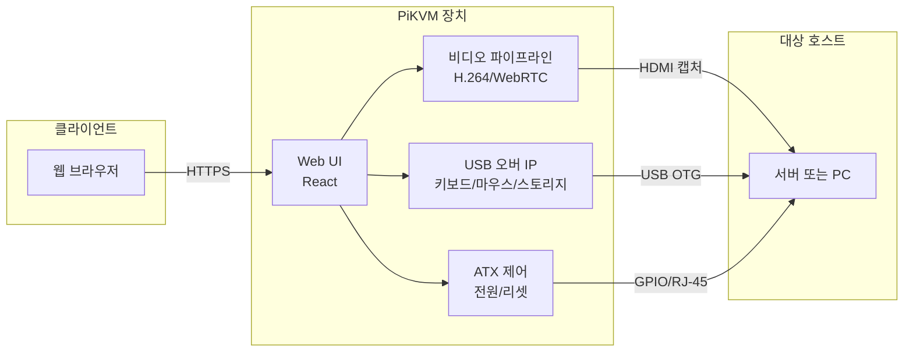

## 개요

**PiKVM**(Pi-based KVM)은 라즈베리 파이를 기반으로 한 **오픈 소스 하드웨어·소프트웨어 프로젝트**로, 네트워크를 통해 대상 머신의 키보드·비디오·마우스(KVM)를 원격 제어할 수 있는 **KVM over IP** 솔루션이다. 상용 IDRAC·iLO 대비 약 1/10 수준의 비용으로 BIOS/UEFI 레벨 원격 접근, 가상 미디어 마운트, 전원 제어를 구현하며, GPLv3 하에 소스와 설계가 공개되어 DIY 및 커스터마이징이 가능하다.

**추천 대상**: 서버·PC 원격 관리가 필요한 SMB·홈랩·개발자, 상용 KVM 비용 부담이 있는 팀, 데이터센터·랙 환경에서 저비용 아웃오브밴드(OOB) 관리 도구를 찾는 관리자.

---

## PiKVM 시스템 구조

PiKVM은 브라우저에서 접속한 사용자와 대상 호스트 사이에 위치하며, 비디오 캡처·USB 에뮬레이션·전원 제어를 한 장치에서 담당한다. 전체 데이터 흐름은 다음과 같이 요약할 수 있다.

---

## PiKVM의 핵심 기술 구성

### 오픈 소스 기반의 하이브리드 아키텍처

PiKVM은 하드웨어와 소프트웨어 모두 **GPLv3** 라이선스 하에 공개되어 사용자가 자유롭게 수정 및 배포할 수 있는 개방형 구조를 채택했다. 커스텀 PCB와 라즈베리 파이 컴퓨트 모듈(CM4 등)의 결합으로 전원 공급, 비디오 캡처, USB 에뮬레이션까지 한 보드에 통합된다. **CSI-2** 인터페이스를 활용한 네이티브 비디오 캡처는 USB 기반 캡처 대비 성능·지연 측면에서 유리하다.

소프트웨어는 **Arch Linux ARM** 기반 경량 OS 위에서 동작하며, 읽기 전용 파일 시스템과 자동 롤백으로 안정성을 높였다. 웹 인터페이스는 **React**로 구현되어 있으며, 비디오 스트리밍·입력 에뮬레이션·원격 제어 등 기능이 마이크로서비스 형태로 분리되어 있다.

### 초저지연 비디오 스트리밍

**H.264 하드웨어 인코딩**과 **WebRTC** 프로토콜을 사용해 1080p 60fps 구간에서 **약 35~50ms 수준의 지연**을 목표로 한다. 일반 원격 데스크톱(200~300ms)보다 짧은 지연으로, BIOS·부팅 화면·설정 변경처럼 반응성이 중요한 장면에 적합하다. V4 Plus 등에서는 1920×1200@60Hz까지 지원해 다양한 UEFI/BIOS 환경과의 호환성을 높였다.

비디오 파이프라인은 커스텀 MJPG 서버와 GPU 가속 인코딩을 사용하며, 다중 스레딩으로 동시 접속 시에도 프레임 유실을 줄이도록 설계되어 있다.

---

## PiKVM의 주요 기능 분석

### 하드웨어 가상화 및 에뮬레이션

- **USB over IP**: 키보드·마우스 신호를 패킷 단위로 변환해 전송하며, 대상 호스트는 실제 USB 장치가 연결된 것처럼 인식한다.
- **가상 미디어**: ISO 이미지를 원격에서 마운트해 네트워크 부팅·OS 설치·복구를 수행할 수 있다. V4에서는 **NVMe** 스토리지를 가상 디스크로 인식시키는 방식도 지원한다.
- **ATX 제어**: GPIO 및 전용 케이블을 통해 파워 버튼·리셋·전원 LED를 제어하고, 웹 UI에서 전력 상태 모니터링·전원 스케줄링을 할 수 있다.

### 확장형 네트워크 관리

- **IPMI 2.0·Redfish API** 지원으로 기존 데이터센터 도구와 연동 가능하다.
- **SOL(Serial Over LAN)** 로 시리얼 콘솔 접근이 가능하며, LDAP/Active Directory 연동으로 중앙 인증을 구성할 수 있다.
- **PiKVM Switch** 등 멀티포트 확장을 사용하면 한 대의 PiKVM으로 다수의 호스트를 전환 제어할 수 있다(최대 약 20대 규모).

---

## PiKVM 하드웨어 구성 비교

### V4 시리즈의 기술적 진화

| 항목 | V4 Mini | V4 Plus |
|------|---------|---------|
| 해상도 | 1920×1200@60Hz | 1920×1200@60Hz, HDMI 출력 2개 |
| USB 에뮬레이션 | 지원 | 지원, 내부 USB 3.0 슬롯 |
| 전력 (유휴) | 약 2.65W | 약 3.3W |
| 쿨링 | 팬리스 | 라디얼 팬, 저소음 |
| 확장 | WiFi 옵션 | mPCIe(LTE/5G 모듈 등) |

V4 Plus는 RJ-45 콘솔 포트, 실시간 클록(RTC), 위치 표시 LED 등을 갖추어 랙 환경·엔터프라이즈 사용에 맞춰져 있다.

### DIY 버전의 커스터마이징

DIY V2/V1은 표준 **라즈베리 파이 4** 또는 **Zero 2 W**와 CSI-2 카메라·USB 캡처 보드를 조합해 구성한다. 오픈 소스 펌웨어로 핫키 매핑·전원 시퀀스·이벤트 기반 스크립트 등 사용자 정의가 가능하며, 3D 프린팅용 케이스 설계도가 공개되어 있다.

---

## PiKVM의 실제 적용 사례

### 엔터프라이즈·데이터센터

대형 클라우드·IDC에서는 PiKVM을 랙 단위로 배치해 수백~수천 대 서버의 콘솔 접근을 통합한다. 메시 네트워크·페일오버·IPMI 확장 스크립트와 연동한 사례가 알려져 있다.

### 소규모 비즈니스·홈랩

중소기업은 상용 대비 **약 90% 비용 절감**을 꾀하면서 원격 전원·콘솔·가상 미디어를 활용한다. CI/CD에서 전원 제어 API를 호출해 자동화 테스트·배포 파이프라인에 붙이는 경우도 있다. 개발자 및 하드웨어 애호가는 홈 서버·NAS·멀티부팅 PC의 원격 관리와 전원 최적화에 PiKVM을 활용한다.

---

## PiKVM 구축을 위한 실전 가이드

### 필수 하드웨어 (DIY 기준)

- 라즈베리 파이 4B(8GB 권장) 또는 CM4
- CSI-2 비디오 캡처 모듈(1080p 이상)
- USB OTG 케이블, ATX 제어 보드
- 선택: PoE HAT(전원·LAN 통합), 10GbE 등 확장 보드

### 소프트웨어 설치 및 초기 설정

1. [공식 이미지](https://docs.pikvm.org/)를 다운로드한 뒤 `dd` 등으로 microSD에 기록한다.
2. 첫 부팅 후 기본 IP(예: 192.168.0.100)로 웹 UI에 접속한다.
3. 네트워크·관리자 계정·SSL(선택)을 설정한다.
4. `systemd`로 서비스 상태·로그를 확인하며, 필요 시 [공식 문서](https://docs.pikvm.org/cheatsheet/)의 치트시트를 참고한다.

BIOS/부팅 전 구간에서 키보드·마우스가 동작하지 않는 경우, 일부 보드에서는 가상 스토리지와 키보드/마우스를 동시에 쓰지 못하는 제한이 있다. 이때는 [공식 문서의 USB 동적 설정](https://docs.pikvm.org/usb_dynamic)에 따라 `kvmd-otgconf`로 mass storage를 일시 비활성화한 뒤 키보드/마우스만 사용하는 방법을 검토할 수 있다.

---

## PiKVM의 진화 방향과 커뮤니티

최신 버전에서는 Kubernetes 연동, WASM 기반 플러그인 구조 등이 도입·검토되고 있다. [GitHub](https://github.com/pikvm/pikvm) 저장소는 포크·서드파티 모듈이 활발하며, [공식 포럼·Discord](https://pikvm.org/support/)에서 사용자 간 지원이 이뤄진다. 연간 PiKVM 컨퍼런스에서 하드웨어 개선·사용 사례가 공유된다.

---

## 결론

PiKVM은 **오픈 소스 KVM over IP**의 대표 사례로, 라즈베리 파이 기반으로 저비용·고기능 원격 서버/PC 관리를 실현한다. 1080P 초저지연 스트리밍, USB·가상 미디어·ATX 제어, IPMI/Redfish 호환, DIY 확장성까지 갖춰 초보자부터 데이터센터 운영자까지 단계별로 활용할 수 있다. 상용 솔루션 대비 비용과 유연성 측면에서 강점이 있으므로, 원격 콘솔·전원·가상 미디어가 필요한 환경에서는 검토할 만한 선택지다.

---

## 참조

- [PiKVM 공식 사이트](https://pikvm.org)
- [PiKVM 공식 문서(Handbook)](https://docs.pikvm.org/)
- [PiKVM GitHub 저장소](https://github.com/pikvm/pikvm)
- [Red Hat: KVM(Kernel-based Virtual Machine)이란?](https://www.redhat.com/ko/topics/virtualization/what-is-KVM)
- [PiKVM BIOS/키보드·마우스 조작 이슈 대처 (키사라기 스테이션)](https://blog.kisaragistation.com/321/pikvm-bios-%EC%A1%B0%EC%9E%91-%EB%B6%88%EA%B0%80%EB%8A%A5%ED%95%A0%EB%95%8C-%EC%A1%B0%EC%B9%98%ED%95%98%EB%8A%94-%EB%B2%95/)
- [PiKVM V4 Plus 제품 정보 (네스켓)](https://netsket.co.kr/product/pikvm-v4-plus/167/)
