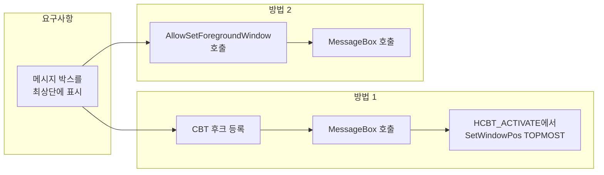

Win32 API 환경에서 메시지 박스(MessageBox)를 띄울 때, 다른 창 뒤에 가려지거나 포커스를 받지 못하는 경우가 있다. 사용자에게 반드시 눈에 띄어야 하는 알림·경고·확인 대화상자를 다룰 때는 **최상단(topmost) 표시**와 **포커스 확보**가 중요하다. 이 포스트에서는 그 배경과, **CBT 후크**·**AllowSetForegroundWindow API**를 활용한 두 가지 실전 해결 방법을 정리한다.

## 개요

- **대상**: Win32 네이티브 앱(C/C++)에서 `MessageBox`를 사용하며, 항상 최상단·포커스를 보장하고 싶은 개발자.
- **전제**: `MB_SETFOREGROUND`만으로는 Windows의 포그라운드 정책 때문에 의도대로 동작하지 않는 경우가 많다. 이에 대한 대안으로 CBT 후크와 `AllowSetForegroundWindow`를 소개한다.

## 문제의 배경

Windows에서는 **포그라운드 창**을 바꾸는 동작에 보안·정책상 제약이 있다. 다른 프로세스가 활성 창인 상태에서 우리 프로세스가 메시지 박스만으로 포커스를 가져오려 하면, 시스템이 이를 제한할 수 있다.

- `MessageBox(..., MB_SETFOREGROUND)`는 **호출 프로세스가 이미 포그라운드**이거나, 시스템이 허용하는 조건일 때만 포커스를 준다.
- 따라서 백그라운드에서 호출되거나, 다른 앱이 활성인 경우 메시지 박스가 뒤에 가려지거나 포커스를 받지 못할 수 있다.

이 제한을 우회하거나 완화하기 위해 아래 두 가지 방법을 사용할 수 있다.

## 해결 방법 요약(흐름도)

아래 Mermaid 흐름도는 “메시지 박스를 최상단에 띄워야 할 때” 어떤 접근을 고려할 수 있는지 요약한다.



- **방법 1**: 창이 활성화되는 순간(HCBT_ACTIVATE)을 후크로 잡아 `HWND_TOPMOST`로 올린다.
- **방법 2**: 메시지 박스 호출 전에 `AllowSetForegroundWindow`로 포그라운드 설정 권한을 부여한 뒤 `MB_SETFOREGROUND`와 함께 호출한다.

## 해결 방법 1: CBT 후크 이용

CBT(Computer-Based Training) 후크를 사용하면 **메시지 박스 창이 생성·활성화되는 순간**을 가로채서 스타일을 바꿀 수 있다. `WH_CBT` 후크에서 `HCBT_ACTIVATE`가 발생할 때 해당 창에 `SetWindowPos(..., HWND_TOPMOST, ...)`를 적용하면, 메시지 박스가 항상 최상단에 붙어 있게 된다.

### 동작 순서

1. `SetWindowsHookEx(WH_CBT, CBTProc, ...)`로 **같은 스레드**에 CBT 후크 등록.
2. `MessageBox(..., MB_SETFOREGROUND)` 호출.
3. 시스템이 메시지 박스 창을 활성화하면서 `CBTProc`에 `HCBT_ACTIVATE` 전달.
4. 콜백에서 해당 HWND에 `SetWindowPos(hwnd, HWND_TOPMOST, 0, 0, 0, 0, SWP_NOMOVE | SWP_NOSIZE)` 적용 후 `UnhookWindowsHookEx`로 후크 해제.

### 예제 코드

```cpp
#include <windows.h>

HHOOK g_hHook = NULL;

LRESULT CALLBACK CBTProc(int nCode, WPARAM wParam, LPARAM lParam)
{
    if(nCode == HCBT_ACTIVATE)
    {
        HWND hMsgBox = (HWND)wParam;
        // 메시지 박스를 최상단에 배치한다.
        SetWindowPos(hMsgBox, HWND_TOPMOST, 0, 0, 0, 0, SWP_NOMOVE | SWP_NOSIZE);
        UnhookWindowsHookEx(g_hHook);
    }
    return CallNextHookEx(g_hHook, nCode, wParam, lParam);
}

void ShowTopMostMessageBox(HWND hParent)
{
    // CBT 후크를 설정한다.
    g_hHook = SetWindowsHookEx(WH_CBT, CBTProc, NULL, GetCurrentThreadId());
    // MB_SETFOREGROUND 플래그를 포함하여 메시지 박스를 생성한다.
    MessageBox(hParent, L"메시지 내용", L"타이틀", MB_OK | MB_SETFOREGROUND);
    // 후크는 CBTProc에서 해제된다.
}
```

- 후크는 **동일 스레드**에서만 동작하므로 `GetCurrentThreadId()`로 등록하는 것이 일반적이다. 다른 스레드에서 메시지 박스를 띄우면 해당 스레드에 후크를 걸어야 한다.
- 이 방법도 시스템 보안 정책·UAC·포그라운드 잠금 등에 따라 일부 환경에서는 제한될 수 있으므로, “가능한 한 최상단으로 올린다”는 수준으로 이해하는 것이 좋다.

## 해결 방법 2: AllowSetForegroundWindow API 활용

`AllowSetForegroundWindow`는 **현재 프로세스(또는 지정한 프로세스)가 포그라운드 창을 설정할 수 있도록** 일시적으로 권한을 주는 API다. 메시지 박스를 띄우기 직전에 이 API를 호출한 뒤 `MB_SETFOREGROUND`와 함께 `MessageBox`를 호출하면, 포커스 확보 가능성이 높아진다.

### 예제 코드

```cpp
#include <windows.h>

void ShowMyMessageBox()
{
    // 현재 프로세스에게 포그라운드 창 설정 권한을 부여한다.
    AllowSetForegroundWindow(ASFW_ANY);

    // MB_SETFOREGROUND 플래그를 사용하여 메시지 박스를 생성한다.
    MessageBox(NULL, L"메시지 내용", L"타이틀", MB_OK | MB_SETFOREGROUND);
}
```

- `ASFW_ANY`는 “어떤 프로세스든 포그라운드를 설정할 수 있도록” 허용하는 인자다. 특정 프로세스 ID를 넘기면 해당 프로세스만 권한을 받는다.
- 호출 시점에 이미 다른 창이 강하게 포커스를 갖고 있거나, 정책에 의해 제한되면 동작이 보장되지 않을 수 있다. “대부분의 상황에서 포커스를 얻기 쉽게 만든다”는 보조 수단으로 쓰는 것이 적절하다.

## 두 방법 비교 및 선택

| 구분 | CBT 후크 | AllowSetForegroundWindow |
|------|----------|---------------------------|
| 목적 | 창을 **항상 최상단(HWND_TOPMOST)** 으로 유지 | **포그라운드 설정 권한** 부여 후 포커스 확보 |
| 구현 | 후크 등록·해제, 스레드 일치 필요 | API 한 번 호출 후 MessageBox 호출 |
| 적용 시점 | 창 활성화 시점(HCBT_ACTIVATE) | MessageBox 호출 전 |
| 제한 | 스레드별 후크, 정책에 따라 제한 가능 | 호출 시점·환경에 따라 효과 제한 |

- **최상단 고정**이 더 중요하면 CBT 후크를 사용하고, **포커스만 확보**하면 될 때는 `AllowSetForegroundWindow`만으로도 시도해 볼 수 있다. 필요하면 두 방법을 함께 사용할 수 있다(CBT로 TOPMOST 적용 + 호출 전 AllowSetForegroundWindow).

## 결론

Win32 API에서 메시지 박스가 **최상단에 보이고 포커스를 갖도록** 하려면 `MB_SETFOREGROUND`만으로는 부족한 경우가 많다.  

- **CBT 후크**를 쓰면 메시지 박스 창이 활성화될 때 `SetWindowPos(..., HWND_TOPMOST, ...)`로 최상단에 붙일 수 있다.  
- **AllowSetForegroundWindow**를 쓰면 메시지 박스 호출 전에 포그라운드 설정 권한을 부여해, 포커스 확보 가능성을 높일 수 있다.  

환경(백그라운드 호출, 다른 앱 활성 여부, 보안 정책 등)에 따라 동작이 제한될 수 있으므로, 실제 타깃 환경에서 동작을 확인한 뒤 상황에 맞는 방법을 선택하는 것이 좋다.
