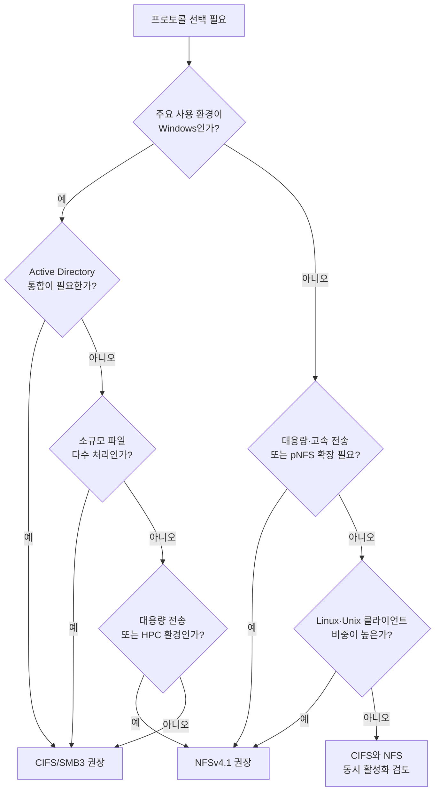

## 개요

네트워크 파일 공유를 구축할 때 **CIFS(Common Internet File System)** 와 **NFS(Network File System)** 중 어떤 프로토콜을 쓸지 선택하는 일은 성능, 보안, 운영 편의성에 직결된다. 특히 **윈도우** 기반 공유 폴더를 **시놀로지 NAS**에 마운트하는 구성에서는 두 프로토콜을 모두 지원하므로, 환경에 맞는 선택이 중요하다. 이 글은 두 프로토콜의 기술적 배경, 호환성, 성능·보안, 운영 난이도를 비교하고, **의사결정 플로우**와 함께 실무에서 바로 쓸 수 있는 선택 기준를 제시한다.

**대상 독자**: 시놀로지 DSM에서 원격 폴더 마운트를 설정하는 관리자, 윈도우·리눅스 혼합 환경에서 파일 공유를 설계하는 엔지니어, CIFS/NFS 차이를 정리해보고 싶은 학습자.

---

## 프로토콜의 역사적 배경과 기술적 기반

### CIFS의 발전 과정과 구조적 특징

CIFS는 1990년대 마이크로소프트가 **서버 메시지 블록(SMB)** 프로토콜을 확장해 만든 파일 공유 프로토콜이다. Windows NT 4.0에 통합된 뒤 SMB 2.0·3.0으로 진화하면서 성능과 보안이 크게 개선되었다. CIFS는 클라이언트-서버 모델을 쓰며, **TCP 445번 포트**로 통신한다.

구조적으로 CIFS는 **파일 잠금(file locking)**, **공유 모드(share modes)**, 분산 파일 시스템 지원 등을 포함한다. 여러 사용자가 같은 파일을 다룰 때 충돌을 줄이는 데 유리하며, Office 문서 협업과 같은 시나리오에서 강점이 있다.

### NFS의 진화와 아키텍처 설계

NFS는 1984년 썬 마이크로시스템즈가 유닉스 간 파일 공유를 위해 개발했고, 현재는 RFC로 표준화되어 있다. **NFSv4.1**은 병렬 데이터 접근(pNFS)을 지원해 클러스터·대용량 스토리지 환경에 적합하다. **UDP/TCP 2049번 포트**를 사용한다.

NFS의 중요한 특성은 **무상태(stateless)** 설계다. 서버가 클라이언트 세션 상태를 유지하지 않아 장애 복구가 빠르고, 대규모 분산 환경에서 안정적이다. 대신 파일 잠금 등 상태가 필요한 기능은 NFSv4에서 프로토콜 내부에 통합된 잠금 관리자를 통해 처리한다.

---

## 운영 체제 호환성 및 통합 가능성

### 윈도우 환경과의 통합도

| 구분 | CIFS/SMB | NFS |
|------|----------|-----|
| 윈도우 네이티브 | ● (탐색기, 네트워크 위치 추가) | △ (Pro/Enterprise 이상 클라이언트만) |
| Active Directory | ● 통합 용이 | △ 추가 구성 필요 |
| 초기 설정 | GUI 기반, 단순 | NFS 클라이언트 기능·export 설정 필요 |

CIFS는 윈도우에 기본 포함되어 있어 공유 폴더·네트워크 드라이브 연결이 쉽고, 도메인 컨트롤러와 결합해 중앙 집중식 접근 제어를 만들기 좋다. NFS는 윈도우 10/11 프로페셔널 이상에서 클라이언트로 사용 가능하고, 서버 역할은 Windows Server 쪽에 한정된다.

### 시놀로지 NAS의 프로토콜 지원

시놀로지 **DSM**은 **CIFS/SMB 3.1.1**과 **NFSv4.1**을 모두 지원하며, 동시에 켜두고 쓸 수 있다. **File Station** → **도구** → **원격 폴더 마운트**에서 **CIFS 공유 폴더** 또는 **NFS 공유 폴더**를 선택해 윈도우 등 외부 공유를 NAS에 마운트할 수 있다. SMB 서명(SMB signing) 등 보안 옵션도 DSM에서 설정 가능하다. NFS 사용 시에는 export의 squash 매핑으로 UID/GID 불일치를 조정할 수 있다.

---

## 성능 벤치마크 및 전송 효율

### 대용량 파일 vs 소규모 파일

- **대용량 파일(1GB 이상)**: NFS가 CIFS 대비 15~20% 정도 높은 처리량을 보이는 사례가 많다. 경량 프로토콜과 UDP/TCP 최적화 영향으로 분석된다. 10GbE 환경에서 수십 GB 단일 파일 전송 시 NFS가 유리한 경우가 많다.
- **소규모 파일 다수(1MB 미만)**: CIFS가 메타데이터·캐싱 최적화 덕분에 약 8% 정도 더 빠른 결과가 나온 벤치마크도 있다.

따라서 **4K 편집·백업·대용량 미디어**는 NFS, **문서·작은 파일 위주**는 CIFS를 우선 검토하는 것이 합리적이다.

### 동시 접속 및 확장성

동시 접속이 많을 때 NFS의 무상태 설계는 CPU·지연 시간 측면에서 유리한 경우가 있다. pNFS를 쓰면 스토리지 노드 간 부하 분산으로 확장성도 높일 수 있다. 반면 CIFS는 세션·잠금 관리 오버헤드로 동시 사용자가 많을 때 부담이 커질 수 있다.

---

## 보안 메커니즘과 접근 제어

### 인증·암호화

- **CIFS/SMB**: Kerberos 5 기반 SPNEGO 인증, SMB3부터 **AES-128-GCM** 전 구간 암호화 지원. 윈도우 도메인과 잘 맞는다.
- **NFSv4**: RPCSEC_GSS로 Kerberos 5·LIPKEY 지원 가능. 기본 설정은 AUTH_SYS로 IP·호스트 기반 접근 제어에 의존하므로, 보안을 높이려면 krb5p 등 강화 모드와 도메인 연동이 필요하다.

엔드투엔드 암호화와 중앙 인증이 중요하면 **SMB 3.1.1**을 우선 고려하는 것이 좋다.

### 감사 및 로깅

CIFS는 윈도우 이벤트 뷰어와 연동해 접근 시도·권한 변경·공유 설정 변경 이력을 남기기 쉽다. NFS는 auditd 등으로 기본 접근 로그를 모을 수 있으나, 파일 단위 감사는 추가 구성이 필요하다. 시놀로지 DSM은 두 프로토콜 모두에 대해 접근 모니터링·로그 기능을 제공한다.

---

## 운영 및 유지보수 편의성

### 초기 구성 난이도

- **CIFS**: DSM의 원격 폴더 마운트 마법사에서 공유 경로·계정·암호·마운트 위치만 입력하면 되며, 대부분 5단계 내로 완료 가능하다. NTFS 권한 상속도 윈도우와 맞춰 쓰기 쉽다.
- **NFS**: export 설정·UID/GID 매핑·동기화 작업이 필요해, 초기 구성과 트러블슈팅 비용이 상대적으로 크다.

### 장애 대응

CIFS 장애 시에는 윈도우 **이벤트 뷰어**의 SMB 클라이언트 관련 이벤트로 원인 파악이 수월하다. NFS는 `rpcdebug`·Wireshark 등으로 RPC·패킷 단위 분석이 자주 필요하다. 시놀로지 커뮤니티·지식 베이스 기준으로도 CIFS 관련 이슈 해결 시간이 NFS보다 짧은 편으로 알려져 있다.

---

## 프로토콜 선택 의사결정 플로우

다음 플로우는 “윈도우 공유 폴더를 시놀로지 NAS에 마운트할 때 CIFS vs NFS”를 빠르게 결정하는 데 쓸 수 있다.

### 사용 사례별 권장 요약

| 사용 사례 | 권장 프로토콜 | 이유 |
|-----------|----------------|------|
| 윈도우 중심 + AD 통합 | CIFS/SMB3 | 네이티브 통합, ACL·감사 |
| 대용량 미디어·4K 편집 | NFSv4.1 | 처리량·지연 시간 유리 |
| Linux·컨테이너(K8s PV 등) | NFSv4.1 | 무상태·확장성 |
| 혼합 OS(Windows + Linux) | CIFS + NFS 동시 활성화 | 클라이언트별 최적 경로 |
| 엔드투엔드 암호화 필수 | SMB 3.1.1 | 전 구간 암호화 기본 지원 |

---

## 성능·보안 트레이드오프 요약

| 항목 | CIFS/SMB3 유리 | NFSv4.1 유리 |
|------|----------------|--------------|
| 소규모 파일 다수 | ● | |
| 대용량 파일 전송 | | ● |
| Windows 통합 | ● | |
| Linux·Unix 최적화 | | ● |
| 암호화·중앙 인증 | ● | |
| 확장성·pNFS | | ● |
| 구성·운영 용이성 | ● | |
| 동시 접속·무상태 | | ● |

---

## 결론 및 실무 적용 전략

CIFS와 NFS 선택은 “어느 쪽이 더 좋다”가 아니라, **주요 클라이언트 OS**, **성능 요구(대용량 vs 소규모 파일)**, **보안·감사 요구**, **운영 난이도**를 함께 고려해야 한다.

- **윈도우 공유 폴더를 시놀로지 NAS에 마운트하는 일반적인 경우**: 먼저 **CIFS**로 연결을 만들고, 성능·호환성 이슈가 있으면 **NFS**를 추가로 검토하는 방식을 권한다.
- **NFS 도입을 고려할 상황**: 비디오 렌더링·시뮬레이션 등 HPC 성격의 워크로드, Kubernetes PV 등 컨테이너 스토리지, 10Gbps 이상 고속 네트워크, 다중 스토리지 노드 부하 분산이 필요할 때.

적용 시에는 **CIFS로 기본 구성을 만든 뒤** 리소스 사용·지연 시간을 모니터링하고, NFS 전환 시에는 **소규모 테스트베드**에서 실제 워크로드로 검증한 뒤 단계적으로 확대하는 편이 안전하다. 두 프로토콜을 함께 쓸 때는 DSM의 **쿼터·파일 잠금 정책**을 명확히 해 데이터 무결성을 유지하는 것이 좋다.

---

## 참고 문헌

1. [시놀로지 DSM 원격 폴더 마운트 (CIFS/NFS) – 몸무니의 삽질일기](https://mummumni.tistory.com/31)
2. [NFS와 CIFS의 차이점 – AWS](https://aws.amazon.com/ko/compare/the-difference-between-nfs-and-cifs/)
3. [시놀로지 원격 마운트 – tcanon](https://tcanon.tistory.com/75)
4. [NFS vs CIFS 주요 차이점 – GoodCloudStorage](https://www.goodcloudstorage.net/ko/nfs-vs-cifs-key-differences-between-file-systems-explained/)
5. [SMB/CIFS 개요 – eveningdev](https://eveningdev.tistory.com/215)
6. [SMB \| DSM – Synology 지식 센터](https://kb.synology.com/ko-kr/DSM/help/DSM/AdminCenter/file_winmacnfs_win?version=6)
7. [원격 폴더 마운트 \| File Station – Synology 지식 센터](https://kb.synology.com/ko-kr/DSM/help/FileStation/mountremotevolume?version=7)
