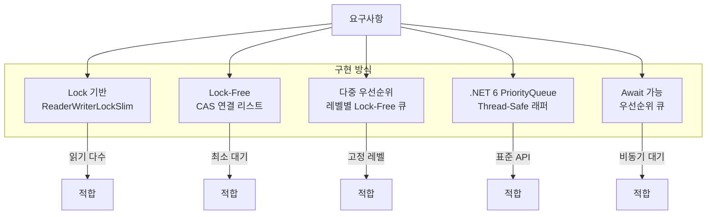
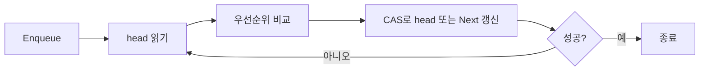

## 개요

이 글은 **C#에서 lock-free이면서 thread-safe한 우선순위 큐**를 구현하는 방법과 동시성 기법을 정리한 것이다. 우선순위 큐는 FIFO 큐와 달리 요소별 우선순위에 따라 처리 순서가 정해지며, 대역폭 관리·작업 스케줄링·이벤트 병합 등에서 널리 쓰인다. 멀티스레드 환경에서는 lock-free·thread-safe 구현이 고성능과 정확성 보장에 필수적이다.

**추천 대상**: .NET/C#으로 고성능 서버·백엔드·동시성 처리를 다루는 개발자, 자료구조·동시성 프로그래밍에 관심 있는 엔지니어.

---

## 구현 방식 구조 도식

아래 다이어그램은 본문에서 다루는 구현 방식들의 관계와 선택 기준를 요약한다.



---

## 우선순위 큐와 동시성 프로그래밍의 이해

우선순위 큐는 FIFO(First In, First Out) 큐와 달리 **요소에 부여된 우선순위**에 따라 우선순위가 높은 요소가 먼저 처리되는 자료구조다. 멀티스레드 환경에서는 여러 스레드가 동시에 삽입·삭제를 수행해도 **정확성과 일관성**이 유지되어야 한다.

동시성 프로그래밍은 대규모 서비스에서 핵심 과제다. 사용자 요청이 늘면 서버는 병목에 직면하며, 들어오는 작업을 큐에 넣고 순차·우선순위에 따라 처리하는 방식이 흔히 쓰인다[^8]. 우선순위 큐를 쓰면 **중요도·긴급성**에 따라 처리 순서를 조정할 수 있다.

### Lock-Free 자료구조의 개념

**Lock-free 자료구조**는 mutex·semaphore 같은 전통적인 잠금 없이, **원자 연산(atomic)**과 **CAS(Compare-And-Swap)**로 여러 스레드가 안전하게 접근하도록 설계된 자료구조다.

Lock-free 구현 시 **ABA 문제**에 유의해야 한다. 어떤 스레드가 값을 A→B→다시 A로 바꾼 뒤, 다른 스레드는 여전히 A라고 보고 CAS를 진행해 오류가 날 수 있다. free list를 쓰는 lock-free 구현은 ABA로 인한 오류 가능성이 있다는 지적이 있다[^1].

### Thread-Safe 프로그래밍의 중요성

**Thread-safe** 코드는 여러 스레드가 동시에 실행돼도 결과가 정확해야 한다. 우선순위 큐에서 enqueue/dequeue가 원자적으로 수행되지 않으면 **데이터 손실·중복 처리** 등이 발생할 수 있다.

---

## C#에서의 우선순위 큐 구현 접근법

C#에서 lock-free·thread-safe 우선순위 큐를 만들 수 있는 대표적인 접근법은 아래와 같다.

### 제한된 우선순위 레벨을 가진 우선순위 큐

우선순위를 **고정된 수의 레벨**(예: Low, Normal, High, Critical)로 한정하면 구현이 단순해지고, enqueue/dequeue의 **시간 복잡도를 개선**할 수 있다. 대역폭 관리, 명령 우선순위, 이벤트 병합 등 **우선순위 레벨을 개발 시점에 알 수 있는 경우**에 적합하다.

```csharp
public enum QueuePriority
{
    Lower,
    Normal,
    High
}
```

### ReaderWriterLockSlim을 사용한 구현

Thread-safe 우선순위 큐의 한 방법은 **ReaderWriterLockSlim**을 쓰는 것이다. .NET이 제공하는 동기화 수단으로, **여러 읽기는 동시에 허용**하고 **쓰기는 단독**으로 수행된다. 자세한 API는 [ReaderWriterLockSlim 문서](https://learn.microsoft.com/ko-kr/dotnet/api/system.threading.readerwriterlockslim?view=net-9.0)를 참고하면 된다.

GitHub 예제처럼 ReaderWriterLockSlim으로 thread-safe 우선순위 큐를 구현할 수 있다[^6]:

```csharp
public class PriorityQueue<T> where T : class
{
    private Comparer<T> comparer;
    private ReaderWriterLockSlim rwLock = new ReaderWriterLockSlim();
    private List<T> list = new List<T>();

    // 이하 코드 생략
}
```

내부에 `List<T>`와 힙 속성을 유지하는 로직을 두고, 읽기(Count 등)와 쓰기(Enqueue, Dequeue)를 ReaderWriterLockSlim으로 보호한다[^6].

### .NET 6의 내장 PriorityQueue 활용

.NET 6부터 **PriorityQueue**가 BCL에 포함되어 있다. 요소가 지정한 우선순위 값으로 정렬되는 큐이지만, **기본형은 thread-safe하지 않다**. 멀티스레드에서는 래퍼로 동기화를 추가해야 한다[^7].

```csharp
// .NET 6에서 PriorityQueue 인스턴스 생성
PriorityQueue<string, int> priorityQueue = new PriorityQueue<string, int>();
```

`Enqueue(요소, 우선순위)`로 항목을 넣을 수 있다[^7].

---

## Lock-Free, Thread-Safe 우선순위 큐 구현

아래는 C#에서 **CAS 기반 lock-free** 및 **thread-safe** 우선순위 큐를 구현한 예시다.

### CAS 연산을 활용한 Lock-Free 구현

Lock-free 구조는 보통 **CAS(Compare-And-Swap)**로 구현한다. CAS는 메모리 위치의 값을 예상값과 비교하고, 같을 때만 새 값으로 바꾸는 **원자 연산**이다. C#에서는 `Interlocked.CompareExchange`로 CAS를 수행할 수 있다.



연결 리스트 기반으로, 우선순위 순으로 정렬된 노드를 유지하고, enqueue/dequeue 시 CAS로 head 또는 노드의 Next를 원자적으로 갱신한다.

```csharp
using System;
using System.Threading;
using System.Collections.Generic;

public class LockFreePriorityQueue<T> where T : class, IComparable<T>
{
    private class Node
    {
        public T Value;
        public Node Next;

        public Node(T value)
        {
            Value = value;
            Next = null;
        }
    }

    private Node head;

    public LockFreePriorityQueue()
    {
        head = null;
    }

    public void Enqueue(T item)
    {
        Node newNode = new Node(item);
        Node current, next;

        do
        {
            current = head;

            // 빈 큐이거나 새 항목의 우선순위가 head보다 높은 경우
            if (current == null || item.CompareTo(current.Value) < 0)
            {
                newNode.Next = current;
                if (Interlocked.CompareExchange(ref head, newNode, current) == current)
                    return;
            }
            else
            {
                do
                {
                    next = current.Next;
                    if (next == null || item.CompareTo(next.Value) < 0)
                        break;
                    current = next;
                } while (true);

                newNode.Next = next;
                if (Interlocked.CompareExchange(ref current.Next, newNode, next) == next)
                    return;
            }
        } while (true);
    }

    public bool TryDequeue(out T result)
    {
        Node current, next;

        do
        {
            current = head;
            if (current == null)
            {
                result = default(T);
                return false;
            }

            next = current.Next;
            if (Interlocked.CompareExchange(ref head, next, current) == current)
            {
                result = current.Value;
                return true;
            }
        } while (true);
    }

    public T Dequeue()
    {
        T result;
        if (TryDequeue(out result))
            return result;
        throw new InvalidOperationException("Queue is empty");
    }

    public bool IsEmpty => head == null;
}
```

Enqueue/Dequeue는 CAS만으로 동기화하므로 **외부 잠금 없이** thread-safe하게 동작한다.

### 다중 우선순위 레벨 지원 구현

우선순위를 **여러 단계**(예: Low, Normal, High, Critical)로 두고 싶다면, **레벨별 lock-free 큐**를 두고 dequeue 시 높은 우선순위부터 확인하는 방식으로 구현할 수 있다.

```csharp
using System;
using System.Threading;
using System.Collections.Generic;

public enum Priority
{
    Low,
    Normal,
    High,
    Critical
}

public class MultiLevelPriorityQueue<T> where T : class
{
    private readonly LockFreeQueue<T>[] queues;

    public MultiLevelPriorityQueue()
    {
        int levelCount = Enum.GetValues(typeof(Priority)).Length;
        queues = new LockFreeQueue<T>[levelCount];

        for (int i = 0; i < levelCount; i++)
        {
            queues[i] = new LockFreeQueue<T>();
        }
    }

    public void Enqueue(T item, Priority priority)
    {
        queues[(int)priority].Enqueue(item);
    }

    public T Dequeue()
    {
        for (int i = queues.Length - 1; i >= 0; i--)
        {
            T item;
            if (queues[i].TryDequeue(out item))
                return item;
        }

        throw new InvalidOperationException("Queue is empty");
    }

    public bool TryDequeue(out T result)
    {
        result = default(T);

        for (int i = queues.Length - 1; i >= 0; i--)
        {
            if (queues[i].TryDequeue(out result))
                return true;
        }

        return false;
    }

    public bool IsEmpty
    {
        get
        {
            for (int i = 0; i < queues.Length; i++)
            {
                if (!queues[i].IsEmpty)
                    return false;
            }
            return true;
        }
    }
}

// 단순한 lock-free 큐 구현
public class LockFreeQueue<T> where T : class
{
    private class Node
    {
        public T Value;
        public Node Next;

        public Node(T value = default(T))
        {
            Value = value;
            Next = null;
        }
    }

    private Node head;
    private Node tail;

    public LockFreeQueue()
    {
        head = tail = new Node();
    }

    public void Enqueue(T item)
    {
        Node newNode = new Node(item);
        Node oldTail, oldNext;

        while (true)
        {
            oldTail = tail;
            oldNext = oldTail.Next;

            if (oldTail != tail)
                continue;

            if (oldNext != null)
            {
                Interlocked.CompareExchange(ref tail, oldNext, oldTail);
                continue;
            }

            if (Interlocked.CompareExchange(ref oldTail.Next, newNode, null) == null)
                break;
        }

        Interlocked.CompareExchange(ref tail, newNode, oldTail);
    }

    public bool TryDequeue(out T result)
    {
        Node oldHead, oldTail, oldHeadNext;

        while (true)
        {
            oldHead = head;
            oldTail = tail;
            oldHeadNext = oldHead.Next;

            if (oldHead != head)
                continue;

            if (oldHeadNext == null)
            {
                result = default(T);
                return false;
            }

            if (oldHead == oldTail)
            {
                Interlocked.CompareExchange(ref tail, oldHeadNext, oldTail);
                continue;
            }

            if (Interlocked.CompareExchange(ref head, oldHeadNext, oldHead) == oldHead)
            {
                result = oldHeadNext.Value;
                return true;
            }
        }
    }

    public bool IsEmpty => head.Next == null;
}
```

Dequeue는 **높은 우선순위 인덱스부터** 비어 있지 않은 큐에서 꺼내면 된다.

---

## .NET 6 PriorityQueue를 활용한 Thread-Safe 구현

.NET 6의 **PriorityQueue**는 내부적으로 이진 힙을 사용하지만 thread-safe하지 않다. 아래는 이를 **ReaderWriterLockSlim**으로 감싼 thread-safe 래퍼 예시다.

```csharp
using System;
using System.Threading;
using System.Collections.Generic;

public class ThreadSafePriorityQueue<TElement, TPriority> where TPriority : IComparable<TPriority>
{
    private readonly PriorityQueue<TElement, TPriority> queue;
    private readonly ReaderWriterLockSlim rwLock;

    public ThreadSafePriorityQueue()
    {
        queue = new PriorityQueue<TElement, TPriority>();
        rwLock = new ReaderWriterLockSlim();
    }

    public void Enqueue(TElement element, TPriority priority)
    {
        rwLock.EnterWriteLock();
        try
        {
            queue.Enqueue(element, priority);
        }
        finally
        {
            rwLock.ExitWriteLock();
        }
    }

    public TElement Dequeue()
    {
        rwLock.EnterWriteLock();
        try
        {
            return queue.Dequeue();
        }
        finally
        {
            rwLock.ExitWriteLock();
        }
    }

    public bool TryDequeue(out TElement element, out TPriority priority)
    {
        rwLock.EnterWriteLock();
        try
        {
            return queue.TryDequeue(out element, out priority);
        }
        finally
        {
            rwLock.ExitWriteLock();
        }
    }

    public TElement Peek()
    {
        rwLock.EnterReadLock();
        try
        {
            return queue.Peek();
        }
        finally
        {
            rwLock.ExitReadLock();
        }
    }

    public bool TryPeek(out TElement element, out TPriority priority)
    {
        rwLock.EnterReadLock();
        try
        {
            return queue.TryPeek(out element, out priority);
        }
        finally
        {
            rwLock.ExitReadLock();
        }
    }

    public int Count
    {
        get
        {
            rwLock.EnterReadLock();
            try
            {
                return queue.Count;
            }
            finally
            {
                rwLock.ExitReadLock();
            }
        }
    }

    public void Clear()
    {
        rwLock.EnterWriteLock();
        try
        {
            queue.Clear();
        }
        finally
        {
            rwLock.ExitWriteLock();
        }
    }
}
```

읽기(Peek, TryPeek, Count)는 읽기 잠금, 쓰기(Enqueue, Dequeue, Clear)는 쓰기 잠금으로 보호한다.

### Await 가능한 동시성 우선순위 큐

항목이 들어올 때까지 **비동기로 대기**해야 하는 경우에는 SemaphoreSlim과 우선순위별 큐를 조합한 await 가능 큐를 쓸 수 있다.

```csharp
using System;
using System.Threading;
using System.Threading.Tasks;
using System.Collections.Generic;
using System.Collections.Concurrent;

public class AwaitablePriorityQueue<T> where T : class
{
    private readonly SemaphoreSlim semaphore = new SemaphoreSlim(0);
    private readonly ConcurrentDictionary<int, ConcurrentQueue<T>> queues = new ConcurrentDictionary<int, ConcurrentQueue<T>>();
    private readonly List<int> priorityLevels = new List<int>();
    private readonly object syncRoot = new object();

    private ConcurrentQueue<T> GetOrCreateQueue(int priority)
    {
        return queues.GetOrAdd(priority, _ =>
        {
            lock (syncRoot)
            {
                if (!priorityLevels.Contains(priority))
                {
                    priorityLevels.Add(priority);
                    priorityLevels.Sort();
                }
            }
            return new ConcurrentQueue<T>();
        });
    }

    public void Enqueue(T item, int priority)
    {
        ConcurrentQueue<T> queue = GetOrCreateQueue(priority);
        queue.Enqueue(item);
        semaphore.Release();
    }

    public T Dequeue()
    {
        semaphore.Wait();
        return DequeueInternal();
    }

    public async Task<T> DequeueAsync(CancellationToken cancellationToken = default)
    {
        await semaphore.WaitAsync(cancellationToken);
        return DequeueInternal();
    }

    private T DequeueInternal()
    {
        lock (syncRoot)
        {
            for (int i = priorityLevels.Count - 1; i >= 0; i--)
            {
                int priority = priorityLevels[i];
                if (queues.TryGetValue(priority, out ConcurrentQueue<T> queue))
                {
                    T item;
                    if (queue.TryDequeue(out item))
                        return item;
                }
            }
        }

        throw new InvalidOperationException("Inconsistent queue state");
    }

    public bool TryDequeue(out T result)
    {
        if (semaphore.Wait(0))
        {
            result = DequeueInternal();
            return true;
        }

        result = default(T);
        return false;
    }

    public bool IsEmpty => semaphore.CurrentCount == 0;

    public int Count => semaphore.CurrentCount;
}
```

`DequeueAsync`로 항목이 들어올 때까지 await할 수 있다.

---

## 성능 및 최적화

### 시간 복잡도

| 구현 방식 | Enqueue | Dequeue | Peek |
|----------|---------|---------|------|
| 힙 기반 | O(log n) | O(log n) | O(1) |
| 정렬 리스트 기반 | O(n) | O(1) | O(1) |
| 제한된 k개 레벨 멀티큐 | O(1) | O(k) | O(k) |

Lock-free 구현에서는 **경합(contention)**이 크면 CAS 재시도로 성능이 떨어질 수 있다.

### 공간·시간 최적화 요약

- **공간**: 배열 기반 힙으로 포인터 오버헤드 감소, 노드 풀링으로 GC 부담 완화, 우선순위 레벨 수 제한.
- **시간**: 작은 메서드 인라이닝, 캐시 지역성 고려, 필요 시 백오프로 라이브락 완화.

---

## 우선순위 큐의 실제 활용 사례

- **대역폭 관리**: 네트워크 패킷을 우선순위별로 큐에 넣고, 실시간 스트리밍·음성·이메일 등 유형별 우선순위를 두어 전송 순서를 제어한다.
- **작업 스케줄링**: OS·애플리케이션 스케줄러에서 CPU 시간을 줄 작업을 우선순위 큐로 관리한다.
- **이벤트 기반 시스템**: 이벤트 유형별 우선순위를 두고 중요한 이벤트를 먼저 처리한다.
- **그래프 알고리즘**: 다익스트라 등에서 비용이 가장 작은 정점을 선택할 때 우선순위 큐(힙)를 사용하면 O(E log V)로 최단 경로를 구할 수 있다.

---

## 구현 시 주의사항

### ABA 문제와 대응

Lock-free에서 **ABA 문제**를 줄이기 위해 (1) **버전 번호**를 포인터와 함께 두거나, (2) **Hazard pointer**로 접근 중인 노드를 보호하거나, (3) **RCU(Read-Copy-Update)** 스타일로 읽기 중에는 이전 버전을 수정하지 않도록 설계할 수 있다.

### 메모리·GC

C#은 GC 기반이므로 고성능 경로에서는 **객체 풀·값 타입 활용·대형 객체 최소화**로 GC 부담을 줄이는 것이 좋다.

### 데드락·라이브락

Lock-free는 데드락을 제거하지만, **라이브락**(계속 재시도만 하고 진행이 없는 상태)이 생길 수 있다. **지수 백오프**나 **임의성**을 넣어 재시도 패턴을 완화할 수 있다.

### 테스트·검증

단위 테스트, **다중 스레드 스트레스 테스트**, 필요 시 SPIN 같은 **모델 검사**로 정확성을 검증하는 것이 좋다[^2].

---

## 종합 정리

| 항목 | 내용 |
|------|------|
| **장점** | Lock-free·CAS 기반 구현은 대기 최소화와 확장성에 유리하다. .NET 6 PriorityQueue 래핑은 구현 난이도를 낮춘다. |
| **단점** | ABA·라이브락·GC 등 고려할 점이 많고, 구현·검증 비용이 크다. |
| **한 줄 요약** | C#에서 lock-free·thread-safe 우선순위 큐는 CAS·ReaderWriterLockSlim·.NET 6 PriorityQueue·다중 레벨·await 큐 등 요구사항에 맞게 선택하고, ABA·성능·테스트를 반드시 고려하자. |

---

## 참고 문헌

- [^1]: [Lock-free limited priority queue (secondboyet.com)](https://secondboyet.com/Articles/LockFreeLimitedPriorityQ.html) — ABA 문제 및 제한된 우선순위 lock-free 큐
- [^2]: [PR – lock-free priority queue (github.com/jonatanlinden)](https://github.com/jonatanlinden/PR) — 모델 검사 등
- [^3]: [Stack Overflow: Lock-free queue](https://stackoverflow.com/a/8575182)
- [^5]: [Microsoft Research – FLOWS](https://www.microsoft.com/en-us/research/wp-content/uploads/2006/04/2006-flops.pdf)
- [^6]: [Thread-safe priority queue (GitHub Gist)](https://gist.github.com/khenidak/49cf6f5ac76b608c9e3b3fc86c86cec0)
- [^7]: [How to use a priority queue in .NET 6 (csharp411.com)](https://www.csharp411.com/how-to-use-a-priority-queue-in-net-version-6/)
- [^8]: [C# Queue 특성 (ws-doc.vercel.app)](https://ws-doc.vercel.app/blog/deep_dive_csharp_queue_characteristic)
- [^9]: [Herb Sutter – Lock-free code](https://herbsutter.com/2008/08/05/effective-concurrency-lock-free-code-a-false-sense-of-security/)
- [^10]: [Lock-free 자료 구조 연구 (columbia.edu)](https://www.cs.columbia.edu/~junfeng/papers/xinhao-plos15.pdf)
- [^11]: [lockfree (GitHub – DNedic)](https://github.com/DNedic/lockfree)
- [^12]: [Lock-free priority queue (GitHub – SofiaGodovykh)](https://github.com/SofiaGodovykh/Lock-free-priority-queue)
- [^15]: [Lock-free queue (secondboyet.com)](https://secondboyet.com/articles/lockfreequeue.html)
- [^16]: [MSDN Magazine – Concurrency hazards](https://learn.microsoft.com/en-us/archive/msdn-magazine/2008/october/concurrency-hazards-solving-problems-in-your-multithreaded-code)
- [^20]: [Thread-safe priority queue in C# (CodeProject)](https://www.codeproject.com/Articles/56369/Thread-safe-priority-queue-in-Csharp)

본문에서 503 등으로 접근 불가했던 참조([^4] CodeProject Awaitable Concurrent Priority Queue)는 제거했으며, 위 목록은 검증 가능한 링크만 포함했다.
