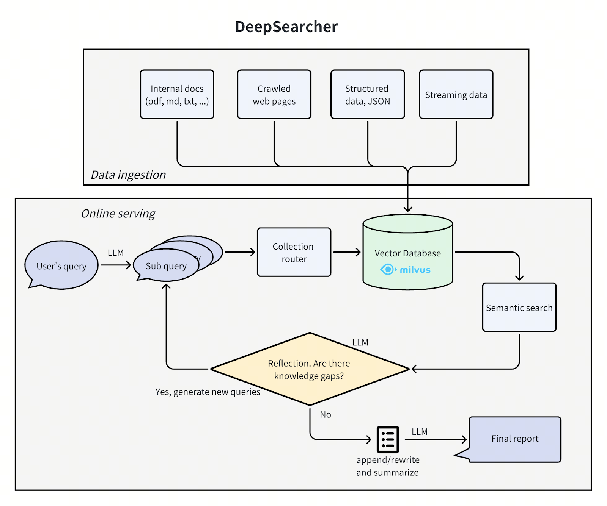

안녕하십니까, 여러분. 오늘은 최신 인공지능 연구 트렌드를 반영한 혁신적인 도구, **DeepSearcher**를 소개하고자 합니다. 본 도구는 오픈소스 모델과 도구들—특히 Milvus와 LangChain—을 활용하여 로컬 환경에서 심층 리서치를 수행할 수 있도록 설계되었습니다.

## DeepSearcher의 개요

DeepSearcher는 이전에 소개된 “I Built a Deep Research with Open Source—and So Can You!” 프로젝트를 발전시킨 형태로, 원래의 연구 에이전트 개념을 더욱 확장하여 구현하였사옵니다. 이 도구는 단순한 질의 응답을 넘어서, 복합적인 질문을 여러 하위 질의로 분해하고, 각 단계마다 적절한 검색 및 분석 과정을 거쳐 최종 보고서를 작성하는 일련의 과정을 자동화하였다.

### 주요 기능

- **질문 분해 및 재정의:** 원래의 질문을 여러 세부 질의로 분할하여 보다 정교한 분석을 도모함.
- **쿼리 라우팅:** 다양한 데이터 소스(예, 기업 내부 문서, 웹 문서 등) 중에서 관련성이 높은 데이터를 선별하여 검색함.
- **유사도 검색:** Milvus 벡터 데이터베이스를 활용하여 사전 임베딩된 문서들을 효율적으로 검색함.
- **에이전트 반성(Reflection) 및 조건부 반복:** 리서치 과정에서 부족한 부분을 스스로 감지하고 추가 질의를 생성함.
- **최종 보고서 합성:** 모든 하위 질의와 검색 결과를 종합하여 일관성 있는 보고서를 생성함.

## 기술적 특징 및 활용 사례

얘들아, 이 시스템은 단순히 ‘질문-답변’만 하는 게 아니야. 질문을 쪼개서 여러 단계를 거치며, 그 과정에서 어떤 데이터가 필요한지 스스로 판단하고, 반복적으로 검색을 수행해서 정말 탄탄한 보고서를 만들어낸다는 점이 매력적이지. 특히, DeepSearcher는 다음과 같은 점에서 두드러지는데:

- **로컬 실행:** 오픈소스 모델과 도구만으로 구성되어, 외부 클라우드 서비스에 의존하지 않고도 자체 인프라에서 동작할 수 있어.
- **확장성:** 파이썬 라이브러리 및 CLI 툴 형태로 제공되어, 기업의 지식 관리, 지능형 Q&A 시스템, 정보 검색 등 다양한 시나리오에 적용 가능하다.
- **고속 추론:** DeepSeek-R1 모델과 SambaNova의 맞춤형 하드웨어를 이용하여, 수백 번의 LLM 호출에도 불구하고 빠른 응답 속도를 자랑함.

## 결론

존경하는 독자 여러분, DeepSearcher는 인공지능 기반 심층 리서치 에이전트의 새로운 지평을 열어줄 도구라 할 수 있사옵니다. 복잡한 질문을 체계적으로 분해하고, 관련 데이터를 효율적으로 수집·분석함으로써, 정교한 보고서를 자동으로 생성하는 이 시스템은 향후 AI 연구 및 실무에 큰 기여를 할 것으로 기대됩니다.

여러분도 Milvus와 함께 DeepSearcher를 체험하시어, 기업 내부 데이터 검색 및 리서치 자동화의 새로운 가능성을 직접 확인해 보시길 바랍니다. 자, 이제 실무에 바로 적용해 보도록 하시게!

이상으로 DeepSearcher 프로젝트에 대한 소개를 마치며, 추가적인 정보는 Milvus 블로그 및 GitHub 저장소(https://github.com/zilliztech/deep-searcher)를 참고하시기 바랍니다.