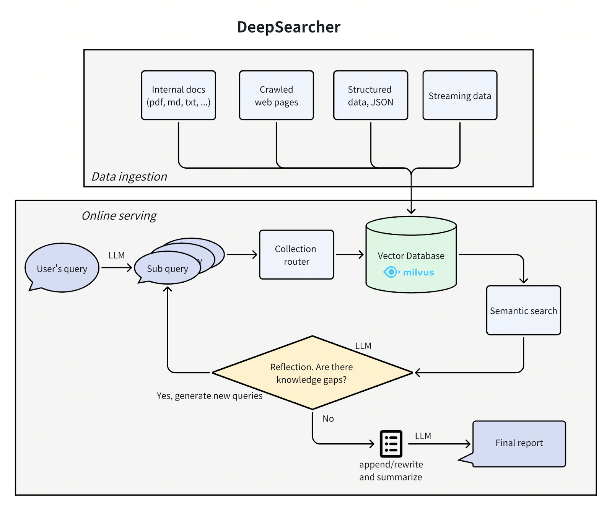
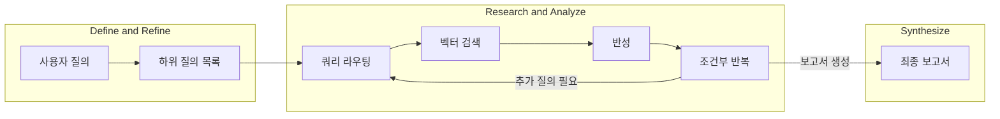

오픈소스 모델과 벡터 DB만으로 로컬에서 동작하는 **DeepSearcher**는 복합 질문을 분해·검색·반성·합성하는 심층 리서치 에이전트다. 본문에서는 도구 개요, 아키텍처, 기술 스택, 활용 시나리오, 장단점을 정리하고 참고 자료를 제시한다.

## 개요: 도구 정보와 추천 대상

**DeepSearcher**는 Zilliz(Milvus 개발사)가 공개한 오픈소스 프로젝트로, [“I Built a Deep Research with Open Source—and So Can You!”](https://milvus.io/blog/i-built-a-deep-research-with-open-source-so-can-you.md)에서 제시한 연구 에이전트 개념을 확장해 구현한 형태다. Python 라이브러리 및 CLI로 제공되며, 단순 Q&A가 아니라 **질문 분해 → 라우팅·검색 → 반성(Reflection)·조건부 반복 → 보고서 합성**까지 한 흐름으로 자동화한다.

**추천 대상:** 기업 내부 문서·지식베이스 기반 리서치 자동화가 필요한 팀, RAG·에이전트 설계를 학습하려는 개발자, 프라이버시·비용 이슈로 로컬/오픈소스 기반 심층 리서치를 고려하는 실무자.

## 아키텍처: Define → Research → Synthesize

DeepSearcher는 **질문 정의·정제(Define/Refine)** → **리서치·분석(Research/Analyze)** → **합성(Synthesize)** 3단계로 구성되며, Research 단계 내부에서 라우팅·검색·반성·조건부 반복이 이루어진다. 아래 Mermaid는 전체 플로우를 요약한다.

```mermaid
flowchart LR
  subgraph DefineRefine["Define and Refine"]
    UserQuery["사용자 질의"]
    SubQueries["하위 질의 목록"]
    UserQuery --> SubQueries
  end

  subgraph ResearchAnalyze["Research and Analyze"]
    QueryRouter["쿼리 라우팅"]
    VectorSearch["벡터 검색"]
    Reflection["반성"]
    ConditionalRepeat["조건부 반복"]
    QueryRouter --> VectorSearch
    VectorSearch --> Reflection
    Reflection --> ConditionalRepeat
    ConditionalRepeat -->|"추가 질의 필요"| QueryRouter
  end

  subgraph SynthesizeStep["Synthesize"]
    Report["최종 보고서"]
  end

  SubQueries --> QueryRouter
  ConditionalRepeat -->|"보고서 생성"| Report
```

- **Define/Refine:** 초기 질의를 여러 하위 질의로 분해한다. 이후 Research 단계에서도 필요 시 질의를 계속 정제한다.
- **Research/Analyze:** (1) **라우팅** — LLM이 어떤 컬렉션(데이터 소스)에서 검색할지 결정하고, (2) **벡터 검색** — Milvus로 유사도 검색, (3) **반성** — 지금까지의 질의·검색 결과로 정보 격차를 판단하고 추가 질의 생성, (4) **조건부 반복** — 반성이 “추가 검색 필요”면 라우팅부터 다시, “충분”하면 합성으로 진입.
- **Synthesize:** 모든 하위 질의와 검색된 청크를 하나의 프롬프트로 넘겨 일관된 최종 보고서를 생성한다.

## 기술 스택과 주요 구성 요소

| 구분 | 기술 |
|------|------|
| 벡터 DB | [Milvus](https://milvus.io/docs) |
| 에이전트·오케스트레이션 | LangChain |
| 추론 | DeepSeek-R1, GPT-4o mini, Gemini 등(설정 가능), SambaNova 등 고속 추론 서비스 연동 가능 |
| 인터페이스 | Python 라이브러리, CLI |
| 언어 | Python |

로컬 실행을 전제로 하며, 임베딩 모델·벡터 DB 등은 설정 파일로 교체 가능하다.

## 주요 기능 상세

- **질문 분해 및 재정의:** 원래 질문을 여러 세부 질의로 나누어 각각 검색·분석한 뒤, 합성 단계에서 하나의 보고서로 통합한다.
- **쿼리 라우팅:** 여러 컬렉션(내부 문서, 웹 등) 중 질의에 맞는 소스만 선별해 검색하여 비용·노이즈를 줄인다.
- **유사도 검색:** Milvus에 미리 임베딩해 둔 문서를 활용해 관련 청크를 효율적으로 검색한다.
- **에이전트 반성(Reflection) 및 조건부 반복:** “지금까지 답으로 부족한가?”를 LLM이 판단하고, 필요 시 최대 3개 수준의 추가 검색 질의를 생성한 뒤 라우팅·검색을 반복한다.
- **최종 보고서 합성:** 모든 하위 질의와 검색 청크를 한 번에 넘겨, 중복·모순 없이 일관된 보고서를 생성한다.

## 활용 시나리오

- **기업 지식 관리:** 내부 위키·문서를 임베딩해 두고, 복합 질문에 대한 리서치 리포트 자동 생성.
- **지능형 Q&A·RAG 고도화:** 단일 검색이 아닌 다단계 검색·반성 루프를 둔 에이전트형 RAG 구축 참고.
- **리서치·조사 자동화:** 특정 주제에 대한 문헌·자료 수집·요약·보고서 초안 작성 파이프라인.

로컬·오픈소스 위주로 구성할 수 있어, 데이터 외부 유출과 API 비용을 줄이기에 적합하다.

## 장단점과 종합 평가

**장점**

- 오픈소스·로컬 실행으로 프라이버시·비용 통제에 유리하다.
- 질문 분해, 쿼리 라우팅, 반성·조건부 반복 등 에이전트 설계 요소를 실제 코드로 학습할 수 있다.
- Python·CLI 형태로 기존 파이프라인에 붙이기 쉽다.

**단점**

- 수백 회 이상의 LLM 호출이 필요할 수 있어, 추론 속도·비용이 이슈가 될 수 있다(고속 추론 서비스 연동으로 완화 가능).
- 온라인 검색 등 고급 기능은 추가 개발이 필요하다.

**한 줄 평:** 로컬 오픈소스로 심층 리서치 파이프라인을 체험·구축하고 싶다면 DeepSearcher로 아키텍처와 워크플로를 익히고, 필요에 맞게 확장하는 구성이 적합하다.

## 참고 문헌

1. [DeepSearcher — GitHub](https://github.com/zilliztech/deep-searcher): 공식 저장소 및 설치·실행 방법.
2. [Introducing DeepSearcher: A Local Open Source Deep Research — Zilliz Blog](https://zilliz.com/blog/introduce-deepsearcher-a-local-open-source-deep-research): 아키텍처(Define/Refine, Research, Synthesize), 라우팅·반성·조건부 반복 설명 및 DeepSeek-R1·SambaNova 연동 소개.
3. [Milvus Documentation](https://milvus.io/docs): 벡터 DB 기본 개념 및 연동 가이드.

위 자료를 바탕으로 DeepSearcher를 실험해 보시고, 기업 내부 데이터 검색 및 리서치 자동화에 맞게 튜닝·확장해 보시기를 권한다.
