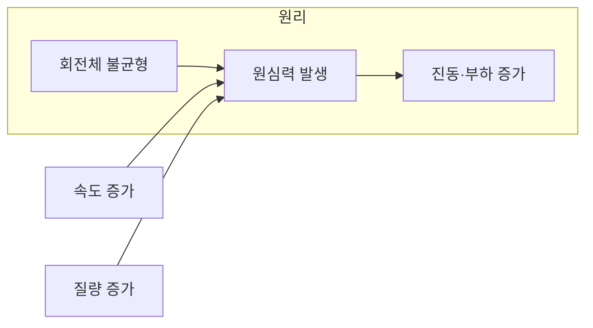
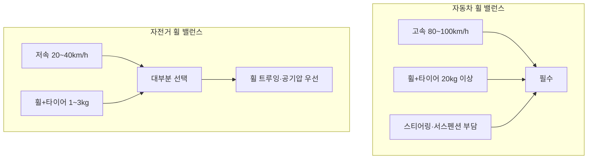

## 이 글에서 다루는 내용

자동차와 자전거는 모두 바퀴로 움직이지만, **휠 밸런스** 필요성은 크게 다르다. GCN Tech의 "Balance Your WHEELS" 영상[^1]처럼 자전거 휠 밸런스를 강조하는 목소리가 있지만, 자동차만큼 필수인지는 속도·무게·구조를 놓고 보면 다르다. 이 글에서는 **휠 밸런스의 기본 원리**, **자동차에서 필수인 이유**, **자전거에서는 상대적으로 선택적인 이유**를 공학적 근거와 함께 정리하고, 자전거 휠 관리의 **실용적 우선순위**(휠 트루잉, 공기압, 스포크·허브 점검)와 **예외적으로 밸런스가 중요한 상황**까지 다룬다.



---

## 휠 밸런스의 기본 개념과 원리

휠 밸런스는 바퀴가 회전할 때 생기는 **무게 불균형을 보정하는 작업**이다. 타이어와 휠은 제조 과정에서 완벽한 대칭을 이루기 어렵기 때문에, 회전 시 편심으로 인한 진동이 발생할 수 있다. 자동차에서는 휠 림에 **밸런스 웨이트**를 붙여 이 불균형을 맞추며[^2], 그 결과 고속 주행 시 진동 감소, 타이어 균일 마모, 주행 안정성 향상에 기여한다.

회전체의 밸런스는 공학적으로 중요한 요소다. **원심력은 속도의 제곱에 비례**하므로, 고속일수록 작은 불균형도 큰 진동과 부하를 만든다. 이 원리는 자동차와 자전거에 공통이지만, 속도·무게·구조 차이 때문에 실제 체감과 필요성은 크게 갈린다.

---

## 자동차에서 휠 밸런스가 필수적인 이유

자동차에서는 휠 밸런스를 **반드시** 맞추는 것이 정비의 기본이다.

- **고속 주행**: 시속 80~100km 이상에서는 밸런스 불량 시 스티어링 휠 떨림이 잘 나타나며, 주행 안전에 직결된다[^2].
- **무거운 회전체**: 승용차 휠+타이어 조합은 20kg 이상인 경우가 많다. 이런 무게가 불균형한 채 고속 회전하면 진동이 커지고, 서스펜션·베어링·조향계에 부담을 주어 수명과 안전에 영향을 준다.
- **제조사 권고**: 타이어 교체 시 휠 밸런스 조정은 자동차 정비의 기본 원칙으로, "타이어 교체 시 휠 밸런스는 필수적으로 조정해 줘야 한다"는 설명이 널리 통용된다[^2]. 80~90km/h 대에서의 스티어링 떨림과 편마모 방지를 위해 필수로 취급된다.

---

## 자전거에서 휠 밸런스의 상대적 중요성

자전거에서는 휠 밸런스가 자동차만큼 **필수로 다뤄지지 않는** 이유가 분명하다.

1. **낮은 주행 속도**: 로드 기준 평균 20~30km/h, 선수도 평지에서 40~50km/h대가 일반적이다. 원심력이 속도 제곱에 비례하므로, 같은 불균형이라도 자동차보다 영향이 작다.
2. **가벼운 휠·타이어**: 휠+타이어 합산 1~3kg 수준으로, 자동차 휠의 1/10 이하이다. 클리앙 사용자 계산에 따르면, 1kg 휠이 60km/h(455rpm)로 돌 때 허용 편심 무게는 약 **2.4g**, 3kg 휠이 30km/h로 주행할 때는 **14.4g**까지 허용된다[^3]. 즉 일반 주행 조건에서는 별도 밸런싱 없이도 허용 범위 안에 들어가는 경우가 많다.
3. **구조·환경**: 자전거는 노면 충격·바람·페달링 등에 더 직접 반응하며, 체감 품질에는 **타이어 공기압**, **스포크 텐션 균일성**, **휠 트루잉(직진성)**이 휠 밸런스보다 더 크게 작용한다.

---

## 공학적 분석: 자전거 휠 밸런스의 수치적 접근

자전거 휠 밸런스 필요성을 수치로 보려면, 회전체 밸런스 등급을 쓰는 다음 식이 참고가 된다[^3].

- **허용 편심(μm)** = G × 9550 ÷ N  
- **허용량(g)** = 허용 편심 × 물체질량(kg) ÷ 물체반경(mm)  

G는 밸런스 등급(자동차 휠은 보통 G40), N은 최고 회전수(rpm)이다.

예: 직경 700mm(반경 350mm), 1kg 휠이 60km/h(455rpm)로 회전할 때 허용 편심 무게는 약 **2.4g**. 같은 휠이 30km/h로만 주행하면 허용치는 더 커진다. 즉 **속도가 낮고 휠이 가벼울수록** 허용 편심이 커져, 별도 밸런싱 없이도 감당 가능한 경우가 많다.

---

## 자전거 휠 관리의 실용적 우선순위

자전거에서는 **휠 밸런스보다** 아래 항목을 우선하는 것이 합리적이다.

| 우선순위 | 항목 | 설명 |
|---------|------|------|
| 1 | **휠 트루잉(Wheel Truing)** | 휠이 원형에 가깝고 좌우 런아웃이 없도록 스포크 텐션을 조정. 휘어 있거나 흔들리면 브레이크 간섭·타이어 마모·저항 증가·고속 시 직진성 저하로 이어질 수 있음. |
| 2 | **타이어 공기압** | 권장 범위 내 유지. 과낮으면 핀치 플랫 위험, 과높으면 승차감·그립 저하. |
| 3 | **스포크 텐션 균일성** | 텐션 편차는 휠 강도 저하·스포크 파손·림 손상의 원인이 될 수 있음. |
| 4 | **허브 베어링** | 유격·이물·마모 점검. 불량 시 회전 저항 증가와 수명 단축. |

이 네 가지가 휠 밸런스보다 성능과 안전에 더 직접적으로 기여하므로, 일반 라이딩에서는 이 순서로 관리하는 것이 실용적이다.

---

## 특수한 경우: 휠 밸런스가 중요할 수 있는 상황

다만 **다음과 같은 경우**에는 자전거에서도 휠 밸런스를 고려할 만하다.

- **고속 하강·레이스**: 시속 80km 이상 다운힐이나 경기에서는 불균형에 의한 진동·고속 코너링 안정성 영향이 커질 수 있다.
- **초경량·고성능 휠**: 카본 하이림 등 무게가 매우 가볍고 회전 관성이 작은 휠은 작은 불균형에도 더 민감할 수 있다.
- **경기·타임트라이얼**: 미세한 성능 차이까지 추구하는 경우, 밸런스까지 손보는 선택이 있을 수 있다.

일반 취미·통근용이라면 필수 과제로 보기보다는, 위 조건에 해당할 때만 검토해도 충분하다.

---

## 자전거 휠 밸런스 조정의 현실적 한계

자전거 쪽은 휠 밸런스를 맞추고 싶어도 **제도적·기술적 한계**가 있다.

- **표준화된 웨이트 부착 방식 부재**: 자동차 휠처럼 림에 웨이트를 붙일 전용 구조가 없어[^3], 반사/납 테이프나 스포크 부착 등 비표준 방법에 의존할 수밖에 없다.
- **추가 무게·공력**: 웨이트 자체가 무게와 공기역학에 불리하며, "무게 추가로 인한 파워 손실도 무시할 수 없다"는 지적이 있다[^3].
- **타이어 위치 변화**: 자전거는 공기 뺐다 넣는 일이 잦아, 타이어가 림에서 미세하게 움직이면 한 번 맞춘 밸런스가 유지되지 않을 수 있다.

이런 점들이 자전거에서 휠 밸런스를 “선택 사항”으로 남기고, 실무에서는 트루잉·공기압·스포크·허브에 더 신경 쓰는 이유와 맞닿아 있다.

---

## 일반 자전거 사용자를 위한 휠 관리 가이드

휠 밸런스보다 **기본 점검과 유지보수**에 집중하는 것을 권한다.

1. **휠 트루잉**: 자전거를 뒤집어 휠을 돌리며 림의 좌우·상하 흔들림을 확인. 심하면 전문점에 트루잉 의뢰.
2. **타이어 공기압**: 측면 권장 범위와 주행 조건에 맞게 유지. 주 1회 정도 확인.
3. **스포크 텐션**: 스포크를 튕겨 소리로 비교. 다른 것보다 현저히 낮은 소리가 나면 텐션 부족 가능성.
4. **허브 베어링**: 휠을 들어 회전시켜 소음·걸림이 있는지 확인. 이상 시 점검·교체.
5. **타이어 상태**: 마모·찢김·이물 확인. 심한 마모나 손상 시 교체.

이 정도만 꾸준히 해도 대부분의 일반 라이더에게는 충분하다.

---

## 결론: 자동차 필수, 자전거는 대부분 선택

- **자동차**: 고속·무거운 휠·복잡한 서스펜션/조향 구조 때문에 휠 밸런스가 **안전과 부품 수명에 필수**이며, 타이어 교체 시 반드시 수행하는 것이 맞다[^2].
- **자전거**: 낮은 속도·가벼운 휠·단순한 구조와 공학적 계산[^3]을 보면, 일반 주행 조건에서는 **별도 밸런싱 없이도 허용 범위**인 경우가 많다. 표준화된 조정 방법 부재와 추가 무게·유지 문제까지 고려하면, 실용적으로는 **휠 트루잉·공기압·스포크·허브 관리**를 우선하는 것이 합리적이다.
- **예외**: 고속 다운힐·레이스·초경량 고성능 휠을 쓰는 경우에는 휠 밸런스를 선택적으로 고려할 수 있다.

GCN Tech 영상[^1]처럼 자전거 휠 밸런스를 강조하는 관점도 있지만, **대부분의 일반 라이더**에게는 과한 부담일 수 있다. 자신의 주행 스타일과 조건에 맞게 기본 유지보수를 우선하고, 필요할 때만 밸런스를 검토하는 편이 실용적이다.

---

## 참고 문헌

- [^1]: [GCN Tech – Balance Your WHEELS (YouTube)](https://www.youtube.com/watch?v=XMfoaZ-NFLI)
- [^2]: [마이클 – 휠 밸런스·휠 얼라인먼트 (타이어 교체 시 필수·선택)](https://mycle.co.kr/post/entry/ContentsHoneytipTireWheel230519.html)
- [^3]: [클리앙 자전거당 – 자전거 휠 밸런스 계산](https://www.clien.net/service/board/cm_bike/13668879)
