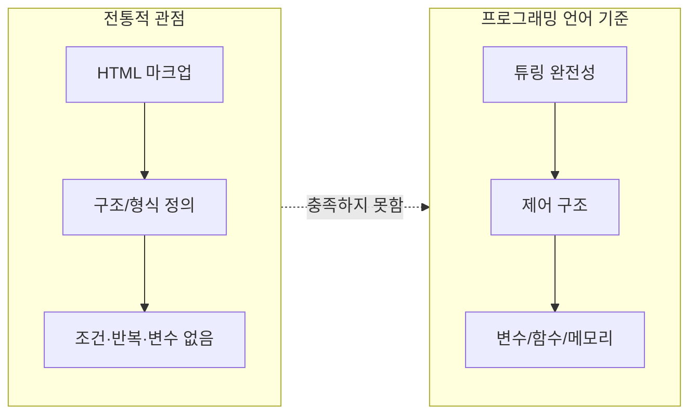
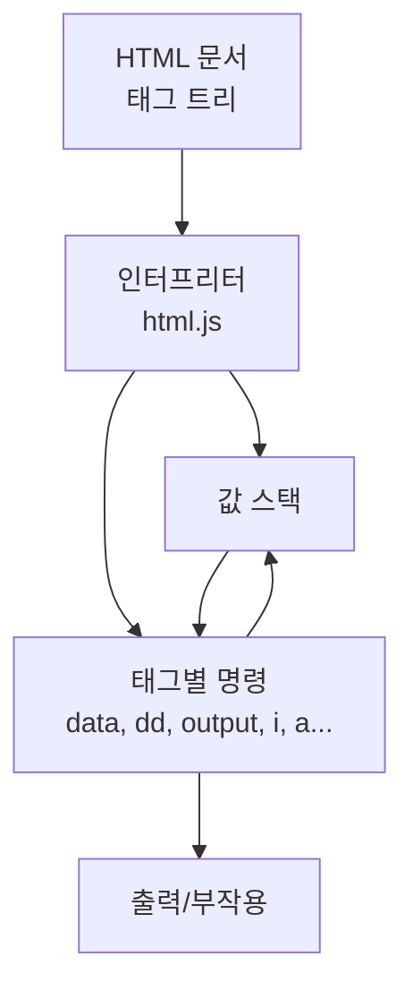

## 개요

이 글은 **HTML이 프로그래밍 언어로 볼 수 있는지**를 [html-lang.org](https://html-lang.org)를 중심으로 탐구한다. 전통적으로 HTML은 마크업 언어로 분류되지만, html-lang.org는 HTML 태그를 명령으로 해석하는 **튜링 완전한 스택 기반 언어**를 제시한다. 아래에서는 HTML의 전통적 정의와 한계, 프로그래밍 언어의 정의적 기준, html-lang.org의 접근 방식, XSLT·JSX 등과의 비교, 실용적 응용과 한계, 그리고 커뮤니티 논쟁을 다룬다.

**대상 독자**: 웹 개발자, 프로그래밍 언어에 관심 있는 독자, HTML·JavaScript 경험자.

---

## HTML의 전통적 정의와 한계

HTML(Hypertext Markup Language)은 웹 페이지의 **구조와 내용**을 정의하기 위해 설계된 마크업 언어이다. 1990년대 초 팀 버너스-리(Tim Berners-Lee)에 의해 개발된 이래, HTML은 웹의 기초 구성 요소로 자리 잡았으며 웹 문서 구조 정의의 표준으로 발전해왔다. HTML의 주요 목적은 텍스트, 이미지, 링크 등의 요소를 구조화하여 브라우저가 해석·표시할 수 있게 하는 것이다.

전통적인 HTML이 마크업 언어로 분류되는 이유는 명확하다. **마크업 언어**란 텍스트에 주석이나 지시를 더해 문서의 구조와 형식을 정의하는 언어를 말한다. HTML은 태그(tags)로 콘텐츠의 의미와 구조를 나타내며, 이는 문서가 **어떻게 보여야 하는지**를 브라우저에 알려준다. 예: `<h1>`은 제목, `
`는 문단, ``는 이미지를 나타낸다. 이러한 태그는 구조를 정의할 뿐, 논리 연산이나 데이터 처리를 수행하지 않는다.

**프로그래밍 언어**의 핵심은 제어 구조(조건문, 반복문), 변수, 함수, 데이터 구조 등을 통해 **알고리즘과 계산 과정**을 표현할 수 있는가이다. 전통적인 HTML에는 이런 기능이 없으며, 동적 동작은 주로 JavaScript로 구현된다. HTML 자체는 상태를 유지하거나 사용자 입력에 따라 변하는 로직을 직접 표현하지 못해, 프로그래밍 언어의 일반적인 요구를 충족하지 못한다고 보는 것이 통상적이다.

HTML5에서 `<canvas>`, `<video>`, `<audio>` 등이 추가되고 웹 애플리케이션 기능이 확장되었지만, 이를 조작하고 상호작용하게 만드는 것은 여전히 JavaScript이다. HTML은 정적인 문서 구조 정의에 초점을 두며, 실행 흐름을 제어하는 메커니즘을 내장하지 않는다.

다음 다이어그램은 전통적 HTML과 프로그래밍 언어의 기준을 비교한 것이다.

---

## 프로그래밍 언어의 정의와 기준

프로그래밍 언어를 정의하는 것은 컴퓨터 과학의 중요한 주제이다. 일반적으로 프로그래밍 언어는 **컴퓨터에게 특정 작업을 수행하도록 지시하는 형식 언어**로 정의되며, 사람이 작성한 코드를 기계가 실행할 수 있게 하는 매개체 역할을 한다. 이를 구분하는 핵심 개념 중 하나가 **튜링 완전성(Turing Completeness)**이다.

**튜링 완전성**이란 어떤 언어나 시스템이 튜링 머신과 동등한 계산 능력을 가진다는 뜻이다. 즉, 이론적으로 계산 가능한 모든 문제를 풀 수 있는 능력을 갖췄다고 보는 것이다. 튜링 완전한 언어는 최소한 다음을 포함해야 한다: 조건부 분기(if-else), 반복(루프), 메모리 조작(변수 저장·수정), 그리고 이들을 조합해 복잡한 알고리즘을 구현할 수 있는 능력이다.

또한 프로그래밍 언어는 보통 **추상화**(함수, 클래스, 모듈), **데이터 타입**, **연산자**, **오류 처리** 등을 제공하며, 특정 패러다임(절차적, 객체 지향, 함수형 등)을 따른다.

전통적인 의미의 HTML은 위 기준을 충족하지 못한다. HTML은 웹 페이지 구조를 정의하는 **선언적 마크업**이며, 프로그램 로직이나 실행 흐름을 직접 제어하지 않는다. 조건문·반복문이 없고, 변수 선언이나 함수 정의를 위한 내장 메커니즘도 없다. 따라서 전통적 관점에서는 HTML은 튜링 완전하지 않으며, 마크업 언어로 분류하는 것이 일반적이다.

---

## html-lang.org: HTML을 프로그래밍 언어로 재해석하기

[html-lang.org](https://html-lang.org)는 **HTML 마크업 언어의 요소(태그)를 그대로 사용해, 튜링 완전한 스택 기반 프로그래밍 언어**를 구현한 실험적 프로젝트이다. Big Sky Software(HTMX 개발사)에서 만들었으며, [공식 사이트](https://html-lang.org)에 따르면 HTML 태그를 명령으로 해석하는 인터프리터(`html.js`)를 통해 동작한다.

### 핵심 개념

- **스택 기반**: 값 스택을 두고, 태그가 푸시/팝/연산을 수행한다.
- **튜링 완전**: 조건 분기(`<i>`, `<a href="#...">`), 반복(같은 id로 점프), 변수(`<var title="...">`), 함수(`<dfn id="...">`) 등으로 임의의 계산을 표현할 수 있다.
- **문법**: HTML 마크업과 동일한 태그를 사용하되, 의미는 “프로그래밍 언어 HTML”의 명령으로 재정의된다. 유효한 HTML5 문서일 필요는 없다.

예시로, 1부터 10까지 출력하는 코드는 `<data value="1">`, `<output id="loop">`, `<dd>`, `<dt>`, `<small>`, `<i>`, `<a href="#loop">` 등의 태그 조합으로 작성된다. `<data value="n">`은 숫자 n을 스택에 넣고, `<dd>`는 덧셈, `<small>`은 비교, `<i>`는 “스택 상단이 true이면 자식 실행” 같은 조건 분기로 해석된다.

다음은 html-lang.org 실행 모델을 단순화한 흐름이다.

이 접근은 **선언적 마크업 구문을 유지하면서** 조건·반복·변수·함수를 태그로 표현한다는 점에서, XSLT가 XML로 변환 로직을 표현한 것과 비슷한 “마크업 기반 프로그래밍” 확장으로 볼 수 있다. 다만 html-lang.org는 범용 스택 기반 언어에 가깝고, 브라우저에서 스크립트 한 개(`html.js`)만 로드해 실행한다는 점이 다르다.

---

## 프로그래밍 패러다임과 HTML의 관계

프로그래밍 패러다임은 언어 설계와 사용 방식에 영향을 주는 사고방식이다. 대표적으로 명령형(Imperative), 선언형(Declarative), 객체 지향(OOP), 함수형(Functional) 등이 있다. **HTML은 전통적으로 선언형**에 가깝다. “무엇을” 보여줄지 기술하고, “어떻게” 계산할지는 추상화한다.

예: `<h1>제목</h1>`은 “이 텍스트는 제목이다”라고 선언하는 것이지, “이 텍스트를 제목으로 만드는 단계를 수행하라”라고 명령하는 것이 아니다. 이 선언적 특성은 문서 구조화에는 적합하지만, 알고리즘과 계산을 표현하는 데는 제한적이다.

html-lang.org는 **선언적 구문(HTML 태그)**을 그대로 쓰면서, 그 위에 **명령형/스택 기반** 실행 모델을 올린다. 태그와 속성이 “변수”, “조건”, “반복”, “함수 호출”로 재해석되므로, 기존 HTML에 익숙한 사람에게는 진입 장벽을 낮추는 효과가 있을 수 있다. 반면 복잡한 알고리즘을 태그만으로 쓰면 장황해지고 가독성이 떨어질 수 있으며, 브라우저는 원래 HTML을 “프로그래밍 언어”로 해석하도록 설계되지 않았기 때문에 추가 해석기(html.js)가 필요하다.

---

## 웹 기술의 진화와 HTML의 역할 변화

웹은 정적 문서 중심에서 복잡한 애플리케이션 플랫폼으로 진화했다. HTML5는 `<canvas>`, `<video>`, `<audio>`, Web Storage, Web Workers, WebSockets 등으로 그 이정표가 되었다. 그럼에도 **동적 동작과 상호작용**은 주로 JavaScript가 담당하고, HTML은 DOM 구조를 제공하는 역할에 가깝다. 즉, HTML은 구조, JavaScript는 동작이라는 분업이 유지된다.

html-lang.org는 이 분업을 재검토하고, **HTML 형태 그대로**에서 더 많은 “계산”을 표현하려는 시도로 볼 수 있다. 웹 컴포넌트(Web Components)처럼 구조·스타일·동작을 한 단위로 묶는 추세와도 맞닿아 있으며, “HTML 태그 자체에 동작을 부여한다”는 방향과 맞다. 다만 현재 웹의 사실상 표준 언어는 JavaScript이고, TypeScript·React·Vue 등 생태계가 크기 때문에, “HTML as a programming language”가 주류가 될지는 커뮤니티 수용과 도구 지원에 달려 있다.

---

## HTML 프로그래밍의 가능성과 한계

HTML을 프로그래밍 언어로 볼 수 있는지는 **정의(튜링 완전성, 표현력, 실행 모델)**와 **실용성(성능, 도구, 협업)**을 나누어 보는 것이 좋다.

### 가능성

- **표현력**: html-lang.org는 스택·조건·반복·변수·함수를 태그로 구현해 튜링 완전성을 만족한다. 이론적으로는 “HTML만으로” 모든 계산을 표현할 수 있다.
- **접근성**: HTML을 아는 사람이 별도 문법 없이 “같은 태그로 프로그래밍”을 경험할 수 있다.
- **교육·프로토타입**: 웹 폼 처리, 간단한 계산기·투두·미니 게임, 또는 프로그래밍 개념 소개용으로 활용 가능성이 있다.
- **확장성**: `html.meta.commands`에 사용자 정의 명령을 추가할 수 있어, 도메인에 맞는 태그를 정의할 수 있다.

### 한계

- **효율성**: HTML은 원래 파싱·렌더링용으로 설계되었고, “프로그래밍 언어”로 쓰려면 인터프리터 레이어가 필요하다. 순수 JavaScript나 네이티브 언어 대비 실행 효율은 불리할 수 있다.
- **가독성·유지보수**: 복잡한 로직을 태그로만 쓰면 장황하고, 디버깅·리팩토링이 어렵다.
- **생태계**: IDE, 린터, 테스트, 빌드 도구 등이 JavaScript/TypeScript에 비해 거의 없다.
- **관심사 분리**: 기존에는 구조(HTML)·스타일(CSS)·동작(JS)을 나누는 것이 관례인데, HTML에 로직을 많이 넣으면 이 분리가 흐려진다는 우려가 있다.

정리하면, **이론적으로는** html-lang.org 같은 체계를 “HTML을 사용한 프로그래밍 언어”로 부를 수 있고, **실무에서는** 특정 실험·교육·소규모 프로토타입에 의미가 있으며, 복잡한 앱이나 대규모 협업에는 기존 JavaScript/TypeScript 생태계가 더 적합하다고 보는 것이 타당하다.

---

## 웹 개발 커뮤니티의 관점과 논쟁

HTML의 정체성에 대한 논쟁은 크게 두 갈래다. 한쪽은 “HTML은 마크업으로서의 역할에 충실해야 한다”고 하고, 다른 한쪽은 “웹이 진화했으니 HTML의 역할도 확장될 수 있다”고 한다.

**전통적 관점**에서는 HTML·CSS·JavaScript의 분리가 **관심사 분리**를 가능하게 해 유지보수와 협업에 유리하다고 본다. HTML에 프로그래밍 기능을 많이 넣으면 이 분리가 약해질 수 있다는 우려가 있다.

**확장적 관점**에서는 웹 컴포넌트처럼 구조·스타일·동작을 한 단위로 묶는 추세가 이미 있고, html-lang.org도 “HTML 요소에 동작을 부여하는” 실험의 일종으로 볼 수 있다고 본다. 학습 곡선 측면에서는 “HTML만 알면 된다”는 장점과 “새로운 해석을 익혀야 한다”는 부담이 공존한다.

성능·확장성·도구 지원에 대해서도 의견이 갈리며, 아직 주류라고 보기 어렵다. 따라서 “HTML as a programming language”는 실험과 논의의 대상으로 두고, 장단점을 이해하는 것이 유용하다.

---

## 다른 마크업·템플릿 기반 접근과의 비교

HTML을 프로그래밍 언어로 확장하는 시도는 다른 사례들과 비교할 때 특징이 드러난다.

| 구분 | XSLT | JSX | html-lang.org |
|------|------|-----|----------------|
| **기반** | XML | JavaScript | HTML 태그 |
| **목적** | XML 변환 | UI 컴포넌트(React) | 범용 스택 기반 계산 |
| **실행** | XSLT 엔진 | JS 트랜스파일/실행 | 브라우저 + html.js |
| **튜링 완전** | 예 | (JavaScript에 의해) 예 | 예 |

- **XSLT**: XML로 조건·반복·변수·함수를 표현하는 선언적 변환 언어이다. 도메인은 “문서 변환”에 가깝고, html-lang.org는 “일반 계산”에 가깝다.
- **JSX**: JavaScript 안에 HTML 유사 구문을 넣는 방식이다. “JS 안에 마크업”인 반면, html-lang.org는 “마크업(HTML 태그) 안에 로직”을 넣는 방향이다.
- **템플릿 엔진**(Mustache, EJS 등): 서버/클라이언트에서 조건·반복을 넣은 템플릿을 렌더링한다. html-lang.org는 그보다 “언어”로서의 완결성(튜링 완전, 스택·함수 등)을 더 강하게 추구한다고 볼 수 있다.

---

## 실용적 응용 가능성

- **웹 폼·간단한 로직**: HTML 폼과 유효성 검사·처리 로직을 같은 문서에서 태그로 표현하는 식의 활용이 이론적으로는 가능하다. 실무에서는 기존 JS/TS가 더 편할 수 있다.
- **소규모 웹 앱·프로토타입**: 간단한 계산기, 투두 리스트, 미니 게임 등을 “HTML만으로” 구현해 보는 데 의미가 있다.
- **웹 컴포넌트와 결합**: 사용자 정의 요소의 내부 동작을 html-lang.org 스타일로 구현하는 실험도 가능하다.
- **교육**: “HTML을 아는 사람”에게 조건문·반복문·함수·스택을 태그로 설명하는 데 활용할 수 있다.

실제로 널리 쓰이려면 성능, 디버깅, 빌드·테스트 도구, 협업 방식 등이 더 정립될 필요가 있다.

---

## HTML의 미래와 프로그래밍 언어로서의 위치

웹 기술이 계속 진화하는 가운데, HTML의 역할도 확장될 수 있다. 한 가지 방향은 **HTML 표준에 조건부 렌더링·반복·변수 같은 개념을 더 넣는 것**이고, 다른 방향은 **HTML·CSS·JavaScript 경계가 더 흐려진 통합 개발 경험**을 추구하는 것이다. CSS만으로도 변수·계산·애니메이션이 늘어났고, JavaScript는 JSX·Tagged Templates 등으로 마크업과 더 밀접해졌다. WebAssembly는 웹에서 여러 언어를 실행하게 하여 “웹에서의 계산” 자체를 넓히고 있다.

html-lang.org 같은 실험은 “HTML로도 이만큼 할 수 있다”를 보여 주며, 정의와 실용의 경계를 탐색하는 데 의미가 있다. **HTML이 프로그래밍 언어인가?**에 대한 답은 “어떤 정의를 쓰느냐”에 따라 달라진다. 전통적 정의(마크업 vs 프로그래밍)를 고수하면 “아니라”가 맞고, “HTML 태그를 명령으로 해석하는 튜링 완전한 언어가 있는가?”라고 묻는다면 html-lang.org는 “그런 언어가 있다”는 사례가 된다. 실무에서는 여전히 JavaScript/TypeScript가 웹의 중심 언어이고, “HTML as a programming language”는 실험·교육·토론의 영역으로 두는 것이 현실적이다.

---

## 결론

- **전통적 의미의 HTML**은 마크업 언어이며, 조건·반복·변수·함수가 없어 튜링 완전하지 않고, 프로그래밍 언어의 일반적 기준을 충족하지 못한다.
- **[html-lang.org](https://html-lang.org)**는 HTML 태그를 명령으로 해석하는 **튜링 완전한 스택 기반 프로그래밍 언어**를 구현하며, “HTML을 프로그래밍 언어로 재해석한 사례”로 볼 수 있다.
- 웹 기술 진화, 웹 컴포넌트, CSS/JS 확장 등과 맞닿아 있으나, 성능·도구·협업 측면에서 주류로 자리 잡으려면 과제가 많다.
- **실용적으로는** 특정 실험·교육·소규모 프로토타입에 의미가 있고, 복잡한 애플리케이션과 대규모 개발에는 기존 JavaScript/TypeScript 생태계가 더 적합하다.
- “HTML이 프로그래밍 언어인가?”는 **정의를 어떻게 두느냐**에 따라 답이 달라지며, html-lang.org는 그 경계를 탐색하는 흥미로운 실험으로 정리할 수 있다.

---

## 참고 문헌

1. [HTML: The Programming Language](https://html-lang.org) — 공식 사이트, 언어 소개·문법·예제.
2. [이제, HTML도 프로그래밍 언어입니다 (mycodings.fly.dev)](https://mycodings.fly.dev/blog/2024-01-21-intro-to-the-html-programming-language) — 한국어 소개·설치·Hello World·FizzBuzz·피보나치 예제.
3. [튜링 완전 (한국어 위키백과)](https://ko.wikipedia.org/wiki/튜링_완전) — 튜링 완전성 정의·역사·예시.
4. [MDN: lang 전역 속성](https://developer.mozilla.org/en-US/docs/Web/HTML/Global_attributes/lang) — HTML `lang` 속성 참고.
5. [W3Schools HTML Language Code Reference](https://www.w3schools.com/tags/ref_language_codes.asp) — `lang` 값 참고(ISO 언어 코드).
