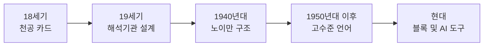
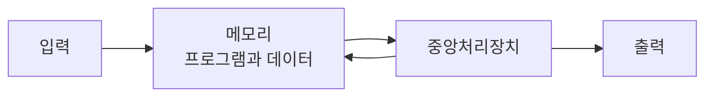

## 도입: 왜 코딩의 역사인가

**코딩**은 기계가 이해할 수 있는 형태로 지시를 만드는 행위이며, 그 역사는 300년 이상으로 거슬러 올라간다. 유튜브 채널 '지식해적단'과 온라인 코딩 교육 서비스 '코드잇'이 협업하여 제작한 영상 "코딩이 300년 전부터 있었다? 충격! 코딩의 역사"는 이 긴 여정을 흥미롭게 소개한다. 이 글은 해당 영상을 바탕으로, 기계식 천공 카드에서 현대의 소프트웨어 프로그래밍과 AI 기반 도구까지 코딩이 어떻게 시작되었고 얼마나 발전했는지, 그리고 왜 오늘날의 코딩이 과거보다 훨씬 접근하기 쉬워졌는지를 체계적으로 정리한다.[^1]



약 30년 전만 해도 존재하지 않았던 IT 기업들이 오늘날 글로벌 경제의 중심에 서 있다. 이러한 기업들의 성공 뒤에는 **소프트웨어 개발자**들이 있으며, 이들은 프로그래밍 언어로 프로그램을 설계하고 코드를 작성하는 핵심 인력이다. 한편 코딩은 여전히 많은 사람에게 숫자와 특수 기호로 가득한 낯선 영역으로 느껴진다. 그러나 현대의 코딩은 초등학생·유치원생도 배우는 시대가 되었고, 이는 300년에 걸친 기술적·교육적 발전의 결과이다. 이 글을 읽은 뒤에는 코딩의 역사적 단계를 구분할 수 있고, 노이만 구조와 고수준 언어의 의미를 설명할 수 있으며, 오늘날 코딩 교육·AI 도구의 위치를 비판적으로 바라볼 수 있다.

---

## 정의와 원칙: 코딩과 알고리즘

**코딩**이란 기계(컴퓨터)가 수행할 동작을 기계가 해석 가능한 형태로 기록하는 행위이다. 초기에는 구멍 뚫린 카드, 이후에는 0과 1의 이진 코드, 그리고 오늘날에는 Python·JavaScript 같은 **고수준 프로그래밍 언어**로 작성된다.

**알고리즘**은 특정 문제를 해결하기 위한 명확한 단계별 절차이다. 조건과 그에 따른 행동을 논리적으로 정의하는 방식이며, 예를 들어 "적이 나타났다 → 우리보다 강한가? → 예: 회피, 아니오: 접근"과 같은 절차가 알고리즘의 원시적 형태이다. 현대 프로그래밍의 기본은 바로 이 **조건 분기와 순차 실행**을 명시하는 것이다.

천공 카드를 사용한 기계들은 *무엇을* 처리할지는 입력할 수 있었지만, *어떤 방식으로* 처리할지까지는 정하지 못했다. 반면 19세기에는 계산만을 전문으로 하는 인력에게 "자료를 어떻게 처리할지" 설명하는 명령서가 초기 '프로그램'의 형태가 되었고, 여기서 프로그램은 단순 데이터가 아니라 **알고리즘**을 의미하게 되었다.

---

## 코딩 300년사: 흐름 한눈에 보기

아래 다이어그램은 코딩의 역사를 다섯 단계로 요약한 것이다. 각 단계는 이전 단계를 전제로 하며, **저장 프로그램 개념(stored-program)** 과 **고수준 언어**의 등장이 가장 큰 전환점이다.

---

## 18세기: 코딩의 초기 형태, 천공 카드

코딩의 역사는 18세기 산업혁명 시대까지 올라간다. 대량 생산을 위한 기계가 도입되면서, 기계가 이해할 수 있는 형태로 정보를 입력하는 방법이 필요해졌고, 이때 등장한 것이 **천공 카드(punch card)** 이다.

천공 카드는 18세기 프랑스에서 처음 등장했으며, 특히 **직물 산업**에서 직물에 새겨질 무늬 패턴을 기계가 읽을 수 있는 형태로 저장하는 일종의 기억·입력 장치였다. 빳빳한 종이 카드의 특정 위치에 구멍을 뚫어 두면, 기계는 구멍의 유무를 읽어 실이 어떻게 움직여야 할지를 결정했다. 직물 패턴을 구상하는 과정은 원시적인 형태의 **프로그래밍**, 종이에 구멍을 뚫는 작업은 초기 형태의 **코딩**으로 볼 수 있다.

천공 카드 기술은 직물을 넘어 **오르골·자동 피아노** 같은 자동 연주 악기, 그리고 **행정·인구 조사**에도 쓰였다. 1900년대 초 미국에서는 전국 인구 조사를 천공 카드로 처리해 이전보다 4배 빠르고 정확하게 완료한 사례가 있으며, 우리가 시험에서 사용하는 **OMR 카드**도 천공 카드에서 진화한 기술이다.

---

## 19세기: 해석기관과 최초의 프로그램

19세기 영국의 수학자 **찰스 배비지(Charles Babbage)** 는 알고리즘을 해석할 수 있는 기계인 **해석기관(Analytical Engine)** 을 설계했다. 이 기계는 이론상 **입력·저장·처리·출력**이라는 현대 컴퓨터의 네 가지 핵심 요소를 모두 갖춘 완전한 형태의 컴퓨터였으며, 이를 위한 최초의 컴퓨터 프로그램은 수학자 **에이다 러브레이스(Ada Lovelace)** 에 의해 개발되었다.

당시 기술적 한계와 예산 부족으로 해석기관은 실제로 완성되지 못했고, 배비지의 아이디어는 약 100년 후 전자공학을 통해야 실현되었다. 그때서야 프로그래밍이라는 개념과 프로그래머라는 직업이 본격적으로 등장한다. 20세기 중반 **전자식 컴퓨터**가 등장했을 때는 프로그램을 저장하는 별도 메모리가 없어, 다른 프로그램을 실행하려면 **물리적으로 회로를 재구성**해야 했다. 이른바 **하드웨어 프로그래밍**으로, CPU 배선을 직접 뽑았다 꽂았다 하며 회로를 바꾸는 작업이었고, 한 프로그램을 만드는 데만 몇 주가 걸리는 비효율적인 방식이었다.

---

## 1940년대: 존 폰 노이만과 프로그램 내장 방식

이 비효율을 혁신적으로 개선한 인물은 수학자이자 물리학자 **존 폰 노이만(John von Neumann)** 이다. 노이만은 중앙처리장치(CPU)를 모든 종류의 연산을 처리할 수 있도록 설계하고, **내부 기억장치**를 탑재해 프로그램을 별도로 저장할 수 있게 했다. 그 결과 프로그램도 데이터처럼 정보 형태로 컴퓨터에 입력할 수 있게 되었고, CPU는 저장된 프로그램을 읽어 실행하는 방식으로 동작하게 되었다. 이 전환이 프로그래밍을 **하드웨어에서 소프트웨어** 영역으로 옮긴 결정적 계기이다.

**노이만 구조**는 프로그램 내장 방식(stored-program concept)이라고도 불리며, 프로그램과 데이터를 **동일한 메모리**에 저장하는 것이 핵심이다. 프로그램 자체도 데이터처럼 변경 가능해져, 하드웨어에 손을 대지 않고도 다양한 프로그램을 실행할 수 있게 되었고, 오늘날 대부분의 컴퓨터 설계의 기본이 되고 있다.

아래 다이어그램은 노이만 구조의 핵심 요소와 데이터·명령 흐름을 단순화한 것이다. 노드 라벨에 "프로그램+데이터"처럼 연산자·등호가 포함된 표현이 있으면 Mermaid 규칙에 따라 큰따옴표로 감쌌다.

---

## 1950년대~: 프로그래밍 언어의 발전

노이만 구조로 현대적 의미의 코딩이 시작되었지만, 초기에는 **기계어(machine language)** 즉 0과 1의 이진 코드를 직접 다뤄야 해서 비효율적이고 오류가 많았다. 이를 완화하기 위해 **어셈블리어(assembly language)** 가 등장했고, 1950년대에는 **고수준 프로그래밍 언어**가 본격화되었다.

**포트란(FORTRAN), 코볼(COBOL), 리스프(LISP)** 등은 인간이 이해하기 쉬운 문법과 구조를 갖추어, 컴파일러나 인터프리터를 통해 기계어로 변환된 뒤 실행되도록 했다. 이후 **절차적·객체지향·함수형** 등 다양한 프로그래밍 패러다임이 등장했고, C, C++, Java, Python 등은 더 강력하고 사용하기 쉬운 언어로 진화했다. 특히 Python은 읽기 쉽고 직관적인 문법으로 코딩 교육 대중화에 크게 기여했다.

---

## 시대별 코딩 방식 비교

| 시대 | 입력·명령 방식 | 특징 | 접근성 |
|------|----------------|------|--------|
| 18세기~ | 천공 카드 | 패턴·데이터의 기계적 저장; 직조·OMR | 전문 장인·행정 |
| 19세기 | 해석기관 설계(미완성) | 알고리즘+입출력 개념 정립 | 이론 단계 |
| 1940년대 초 | 하드웨어 프로그래밍 | 회로 재배선으로 프로그램 변경 | 극소수 전문가 |
| 1940년대 후반~ | 노이만 구조, 기계어·어셈블리 | 프로그램 내장, 소프트웨어와 분리 | 전문 프로그래머 |
| 1950년대~ | 고수준 언어(FORTRAN, COBOL 등) | 컴파일·인터프리트, 추상화 | 확대된 개발자 층 |
| 2000년대~ | 블록 코딩·스크래치·온라인 교육 | 시각적·대화형 학습 | 초등·비전공자 |
| 2020년대~ | AI 보조(Copilot, Codex 등) | 자연어·자동 완성 | 진입 장벽 추가 하락 |

---

## 코딩 교육의 현대화와 접근성

과거 극소수 전문가만 접근하던 코딩은 이제 전 세계 많은 사람에게 열려 있다. **스크래치(Scratch)** 나 블록 코딩 같은 시각적 도구는 어린 학습자도 프로그래밍의 기본 개념을 익히게 하며, **코드잇** 같은 온라인 플랫폼은 체계적 커리큘럼과 실시간 피드백으로 언제 어디서든 학습할 수 있는 환경을 제공한다. 코딩 교육의 대중화는 직업 준비를 넘어 **논리적 사고, 문제 해결, 창의성** 개발에 기여하며, 디지털 시대의 기본 소양으로 인식되기 시작했다.

---

## 코딩의 미래: AI와 자연어 프로그래밍

코딩의 미래는 더 직관적이고 접근하기 쉬운 방향으로 진화하고 있다. **GitHub Copilot, OpenAI Codex** 같은 AI 코딩 보조 도구는 자연어 설명을 바탕으로 코드를 자동 생성하며, 진입 장벽을 낮추고 생산성을 높이는 가능성을 보여준다. 한편 전통적인 문법·디버깅·알고리즘 이해는 여전히 중요하며, AI 도구에만 의존할 때 유지보수·보안·윤리 측면의 한계가 드러날 수 있다. 미래에는 음성·제스처·뇌-컴퓨터 인터페이스까지 확장될 수 있으나, "무엇을 할지 정의하는 것"은 여전히 인간의 역할로 남을 가능성이 크다.

---

## 코딩의 사회적·경제적 영향과 윤리

코딩은 기술을 넘어 사회·경제에 깊은 영향을 미친다. 소프트웨어는 거의 모든 산업에 침투해 있으며, 스마트폰 앱·웹 서비스·자율주행·AI 비서 등은 모두 코딩으로 구현된다. 디지털 경제의 성장으로 개발자·데이터 과학자·AI 엔지니어에 대한 수요는 계속 늘고 있다.

동시에 **알고리즘 편향, 데이터 프라이버시, 사이버 보안, 자동화에 따른 일자리 변화** 등 코딩과 직결된 윤리적 문제가 부각되고 있다. 코딩 교육에서도 기술 습득뿐 아니라 **디지털 시민의식과 윤리적 고려**를 함께 다루는 것이 중요해졌다.

---

## 핵심 요약

- **코딩**은 기계가 이해할 수 있는 형태로 지시를 만드는 행위이며, **알고리즘**은 조건과 단계별 절차를 정의하는 것이다.
- **천공 카드**(18세기)는 기계가 읽을 수 있는 최초의 저장·입력 수단이었고, **해석기관**(19세기)은 이론상 현대 컴퓨터의 4요소를 갖췄으나 미완성으로 남았다.
- **노이만 구조**(1940년대 후반~)는 프로그램을 메모리에 저장해 실행하는 방식으로, 하드웨어 프로그래밍에서 **소프트웨어**로의 전환을 이끌었다.
- **고수준 언어**(1950년대~)와 **블록 코딩·AI 도구**(2000년대~)는 접근성과 생산성을 높였으나, 기초 개념과 윤리적 판단은 여전히 학습자가 갖춰야 할 역량이다.

---

## 이 글을 읽은 후 달성할 수 있는 것

- 코딩의 역사를 **천공 카드 → 해석기관(설계) → 노이만 구조 → 고수준 언어 → 현대 교육·AI** 단계로 구분하여 설명할 수 있다.
- **노이만 구조**(프로그램 내장 방식)가 하드웨어 프로그래밍과 어떻게 다른지, 왜 중요한지 설명할 수 있다.
- 시대별 코딩 방식의 **접근성·대상**이 어떻게 바뀌었는지 표나 요약으로 정리할 수 있다.
- AI 코딩 도구의 **가능성과 한계**(유지보수·보안·윤리)를 비판적으로 언급할 수 있다.

---

## 참고 문헌

[^1]: 지식해적단 × 코드잇, 「코딩이 300년 전부터 있었다? 충격! 코딩의 역사」, YouTube, https://www.youtube.com/watch?v=H8fUXEA3_7A  
[^2]: Wikipedia, "History of programming languages", https://en.wikipedia.org/wiki/History_of_programming_languages  
[^3]: Wikipedia, "Stored-program computer", https://en.wikipedia.org/wiki/Stored-program_computer  
[^4]: Britannica, "Computer - History of computing", https://www.britannica.com/technology/computer/History-of-computing  
