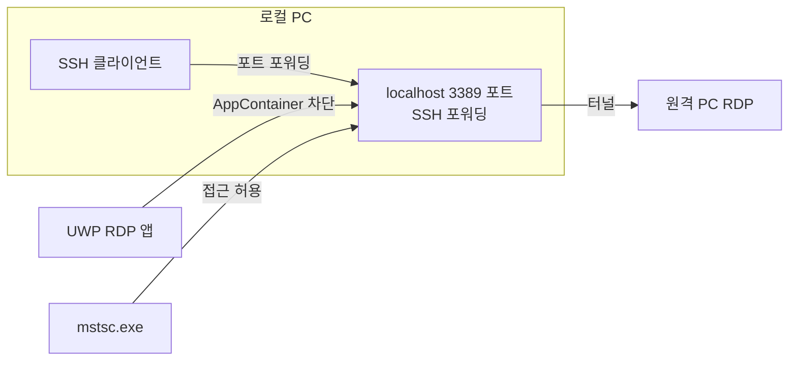

## 개요

Windows 11 환경에서 **SSH 터널링**으로 원격 네트워크에 연결한 뒤, 해당 네트워크 내 PC로 **RDP(원격 데스크톱)** 접속을 시도할 때 다음과 같은 현상이 발생할 수 있다.

- **mstsc.exe**(데스크톱용 RDP 클라이언트)로 `localhost:3389` 접속 → **정상 연결**
- **Microsoft Store 버전 Remote Desktop(UWP)** 앱으로 동일한 `localhost:3389` 접속 → **"다른 연결로 인해 원격 컴퓨터와의 연결이 종료되었습니다. 오류 코드: 0x516, 확장 오류 코드: 0x0"** 메시지와 함께 연결 실패

즉, SSH 포트 포워딩으로 열어 둔 로컬 포트에는 기존 Win32 RDP 클라이언트만 접근 가능하고, UWP RDP 앱은 같은 설정으로는 연결되지 않는다. 이 글은 **오류 0x516**이 이 환경에서 왜 발생하는지, 그리고 **UWP 앱에서 SSH 터널을 통한 RDP 접속**을 가능하게 하는 해결 방법을 정리한다.

**대상 독자**: SSH 터널 + RDP 조합으로 원격 PC에 접속하는 사용자, Windows UWP 앱의 네트워크 격리 정책에 관심 있는 독자.

---

## 오류 코드 0x516의 의미

**오류 코드 0x516**(확장 오류 코드 0x0)은 RDP 연결이 실패할 때 자주 나타나는 일반적인 오류 코드다. Microsoft Q&A와 문서에 따르면, 이 오류는 다음 같은 상황에서 발생할 수 있다.

- 서버와 클라이언트 간 **통신 문제**(잘못된 IP, 비활성/차단된 포트, 인증 프로토콜 불일치)
- **다른 사용자 세션**이 이미 해당 원격 PC에 연결된 경우
- **네트워크 연결 자체가 수립되지 않은 경우**에도 "다른 연결로 인해 연결이 종료되었다"는 문구가 함께 표시될 수 있음

즉, 메시지가 반드시 "다른 사용자가 접속했다"는 뜻이 아니라, **연결이 아예 이루어지지 않았을 때**에도 0x516이 나올 수 있다. **확장 오류 코드 0x0**은 추가 상세 정보가 없음을 의미한다.

---

## 원인: UWP AppContainer 격리와 루프백 제한

mstsc.exe에서는 되고 UWP 앱에서만 실패하는 이유는 **UWP 앱의 네트워크 격리 정책** 때문이다.

### UWP와 AppContainer

UWP 앱은 **AppContainer**라는 샌드박스 환경에서 실행된다. Microsoft 문서에 따르면:

> 보안상의 이유로, 일반적인 방법으로 설치된 UWP 앱은 **자신이 설치된 디바이스로의 네트워크 호출(루프백)을 할 수 없도록** 제한된다.

따라서 **개발/디버깅 환경이 아닌 일반 설치 상태**에서는 UWP 앱이 `127.0.0.1` 등 로컬 주소로 접속하는 것이 **기본적으로 차단**된다. 반면 **mstsc.exe**는 Win32 애플리케이션으로 이 격리 대상이 아니므로, SSH 터널이 만든 로컬 포트(예: 127.0.0.1:3389)에 그대로 접근할 수 있다.

### 동작 차이 요약

| 구분 | mstsc.exe (Win32) | Remote Desktop UWP 앱 |
|------|-------------------|------------------------|
| 루프백(127.0.0.1) 접근 | 허용 | 기본 차단 |
| SSH 터널 localhost:3389 | 연결 가능 | 0x516 등 연결 실패 |

이 제한은 Microsoft Learn, Stack Overflow 등에서 **AppContainer 네트워크 격리의 정책**으로 설명되어 있으며, "로컬 네트워크 루프백 허용(Allow local network loopback)" 같은 **예외 설정**을 통해 완화할 수 있다고 안내하고 있다.

---

## 연결 구조와 실패 지점 (다이어그램)

아래 다이어그램은 SSH 터널을 통한 RDP 연결에서, **UWP 앱**과 **mstsc**가 localhost에 접근할 때 어떤 차이가 있는지 요약한다.



- **mstsc.exe**: 루프백 제한이 없어 `localhost:3389`로 접속 가능 → SSH 터널을 통해 원격 PC에 연결된다.
- **UWP RDP 앱**: AppContainer 정책으로 루프백 접근이 막혀, localhost로의 연결 시도 자체가 실패하고 그 결과로 0x516 등이 나타난다.

---

## 해결 방법: 루프백 예외 부여

UWP 앱에 **로컬 루프백 접근 권한**을 예외로 부여하면, SSH 터널의 localhost 포트로도 RDP 연결이 가능해진다. Windows에 포함된 **CheckNetIsolation** 도구로 개별 앱에 루프백 예외를 줄 수 있다.

### 1. 관리자 권한으로 실행할 명령

**명령 프롬프트** 또는 **PowerShell**을 **관리자 권한**으로 연 뒤, 다음을 실행한다.

```bat
checknetisolation LoopbackExempt -a -n=Microsoft.RemoteDesktop_8wekyb3d8bbwe
```

- `Microsoft.RemoteDesktop_8wekyb3d8bbwe`는 Microsoft Store 버전 **Remote Desktop** 앱의 **패키지 패밀리 이름(PackageFamilyName)** 이다.
- 이 명령은 해당 UWP 앱을 **루프백 예외 목록에 추가**한다.

### 2. 패키지 이름 확인이 필요한 경우

다른 UWP 앱이나 패키지 이름이 기억나지 않을 때는 PowerShell에서 다음으로 확인할 수 있다.

```powershell
Get-AppxPackage *RemoteDesktop* | Select-Object Name, PackageFamilyName
```

출력된 `PackageFamilyName`을 `-n=` 뒤에 그대로 넣으면 된다.

### 3. 예외 적용 여부 확인

다음 명령으로 현재 루프백 예외 목록을 볼 수 있다.

```bat
checknetisolation LoopbackExempt -s
```

목록에 `Microsoft.RemoteDesktop_8wekyb3d8bbwe`가 포함되어 있으면 설정이 적용된 것이다. 이후 **UWP Remote Desktop 앱을 다시 실행**한 뒤 `127.0.0.1:3389`(또는 localhost:3389)로 접속하면, SSH 터널을 통한 RDP 연결이 정상적으로 이루어진다.

---

## 문제 재현 및 해결 확인 절차

다음 순서로 재현과 해결을 단계별로 확인할 수 있다.

1. **SSH 터널 설정**  
   로컬에서 `ssh -L 3389:원격PC주소:3389 사용자@SSH서버` 를 실행해, 로컬 포트 3389를 원격 PC의 3389번 포트로 포워딩한다.

2. **mstsc로 정상 동작 확인**  
   `mstsc /v:127.0.0.1:3389` 로 접속해 원격 데스크톱이 뜨는지 확인한다. 이 단계가 되면 SSH 터널과 원격 PC RDP는 정상이다.

3. **Store(UWP) 앱으로 실패 재현**  
   Microsoft Store 버전 Remote Desktop 앱을 열고 `127.0.0.1:3389` 로 연결을 시도한다. 루프백 예외 전에는 오류 0x516 등으로 연결이 종료되는 것을 확인할 수 있다.

4. **루프백 예외 설정**  
   관리자 권한으로 `checknetisolation LoopbackExempt -a -n=Microsoft.RemoteDesktop_8wekyb3d8bbwe` 를 실행한다.

5. **UWP 앱으로 재접속**  
   예외 적용 후 동일하게 Store 앱에서 `127.0.0.1:3389` 로 다시 연결하면, 정상적으로 원격 PC에 접속되는지 확인한다.

---

## 결론

- **원인**: Microsoft Store 버전 Remote Desktop(UWP) 앱은 **AppContainer** 정책 때문에 기본적으로 **로컬 루프백(127.0.0.1)** 에 대한 네트워크 접근이 **차단**되어 있다. SSH 터널은 로컬 포트(예: 3389)를 열기 때문에, UWP 앱 입장에서는 "자기 장치의 localhost"로 접속하는 것이 되고, 이 접속이 막혀 0x516 같은 오류가 발생한다.
- **해결**: **CheckNetIsolation**으로 해당 UWP 앱에 **루프백 예외**를 부여하면, UWP 앱에서도 localhost를 통한 RDP 연결이 가능해져 오류 0x516이 해결된다.
- **한 줄 요약**: SSH 터널 + RDP 사용 시 UWP RDP 앱에서 0x516이 나오면, UWP의 루프백 제한 때문이므로 `checknetisolation LoopbackExempt -a -n=Microsoft.RemoteDesktop_8wekyb3d8bbwe` 로 루프백 예외를 추가하면 된다.

---

## 참고 문헌

- [Remote Desktop (App Store version) can't connect to localhost](https://serverfault.com/questions/1098656/remote-desktop-app-store-version-cant-connect-to-localhost) — Server Fault. SSH 터널 후 Store 버전 RDP가 localhost에 연결되지 않는 사례와 CheckNetIsolation 해결 제안.
- [What "other connection" causes Error code: 0x516 using Remote Desktop](https://learn.microsoft.com/en-us/answers/questions/1166478/what-other-connection-causes-error-code-0x516-usin) — Microsoft Q&A. 오류 0x516의 일반적인 원인(통신 문제, 포트, 인증, 다른 세션 등) 설명.
- [Can't see localhost from UWP app](https://stackoverflow.com/questions/34589522/cant-see-localhost-from-uwp-app) — Stack Overflow. UWP 앱의 네트워크 격리(루프백 차단)와 기능적 동작 설명.
- [Deploying and debugging UWP apps](https://learn.microsoft.com/en-us/windows/uwp/debug-test-perf/deploying-and-debugging-uwp-apps) — Microsoft Learn. UWP 앱 배포·디버깅 및 "Allow local network loopback" 옵션 안내.
- [UWP Enable local network loopback](https://stackoverflow.com/questions/33259763/uwp-enable-local-network-loopback) — Stack Overflow. CheckNetIsolation으로 루프백 예외 추가/제거 방법.
