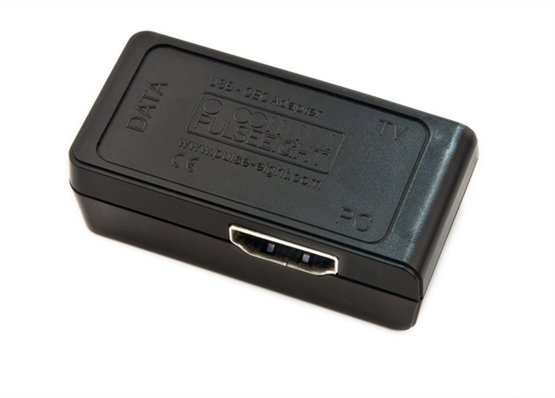

만약에 PC를 HDMI 케이블로 TV에 연결하여 사용하면서, PC의 전원 상태에 따라 TV도 자동으로 켜지거나 꺼지게 만들고 싶은 상황이라고 가정하자. 이를 가능하게 해주는 기술이 바로 **HDMI-CEC**이다. 하지만 일반적인 PC에서는 HDMI-CEC 기능을 바로 활용하기 어려운 경우가 많다. 이번 포스트에서는 HDMI-CEC란 무엇인지, 그리고 왜 PC에서는 기본적으로 사용이 힘든지를 설명하고, Pulse-Eight사의 USB HDMI-CEC 어댑터를 이용해 PC와 TV의 전원을 연동시키는 방법과 예시를 소개하겠다. 마지막으로 이 기술의 장점과 유의 사항까지 살펴보겠다.

## HDMI-CEC란 무엇인가?

HDMI-CEC는 소비자 전자기기 제어(Consumer Electronics Control)의 약자이며, HDMI 케이블을 통해 TV와 각종 기기가 서로 제어 신호를 주고받을 수 있게 하는 기술이다. 쉽게 말해, HDMI 연결만으로 한 기기의 리모컨이나 전원 조작이 다른 기기에 전달될 수 있다. 예를 들어 TV 리모컨 하나로 HDMI로 연결된 셋톱박스나 PC의 일부 기능을 조작할 수 있게 되는 것이다.

제조사마다 HDMI-CEC를 부르는 이름이 제각각이라 혼란스러울 수 있다. 아래는 주요 TV 제조사의 HDMI-CEC 마케팅 명칭 예시이다.

| 제조사   | HDMI-CEC 명칭        |
|----------|----------------------|
| Samsung  | Anynet+ (애니넷플러스) |
| LG       | Simplink (심플링크)   |
| Sony     | BRAVIA Sync (브라비아 싱크) |
| Panasonic| VIERA Link (비에라 링크) |

각 이름은 다르지만 기본적으로 동일한 HDMI-CEC 기능을 나타내며, 모두 HDMI 케이블을 통한 기기 간 상호 제어를 의미한다. 예를 들어 삼성 TV의 Anynet+나 LG의 Simplink 설정을 켜두면, HDMI-CEC 호환 기기 간에 전원이나 볼륨 조작 신호를 주고받을 수 있다.

## Intel NUC 및 일반 PC에서 HDMI-CEC 사용이 어려운 이유

일반적인 데스크탑 PC나 노트북의 HDMI 출력에는 HDMI-CEC 신호 제어 기능이 기본적으로 빠져 있는 경우가 많다. 대부분의 PC용 그래픽 카드(내장 GPU 포함)가 HDMI-CEC를 아예 지원하지 않거나, 지원하더라도 매우 제한적으로만 지원하기 때문이다. 쉽게 말해, PC를 TV와 HDMI로 연결하더라도 PC 쪽에서는 TV에게 “전원을 켜/꺼라” 같은 CEC 제어 명령을 보낼 수 없는 경우가 많다는 뜻이다.

특히 소형 폼팩터 PC로 인기 있는 Intel NUC 시리즈의 경우도 모델에 따라 HDMI-CEC 지원 여부가 다르다. 일부 최신 NUC 모델들은 BIOS 수준에서 제어되는 온보드(On-board) CEC 컨트롤러를 내장하기 시작했지만, 이마저도 양방향 전원 온/오프 제어까지만 지원한다. 즉, NUC에 따라 기본적으로 가능한 CEC 기능이 “PC와 TV를 서로 켜고 끄는” 정도로 제한되며, 그 외의 세부 제어(예: 볼륨 조절이나 입력 전환 등의 명령)는 지원되지 않을 수 있다.

또한 상당수의 NUC 모델이나 일반 PC 메인보드는 아예 CEC 신호를 처리할 하드웨어가 없어서, HDMI-CEC를 사용하려면 추가 장치가 필요하다. Intel의 공식 문서에서도 외부 CEC 어댑터를 메인보드의 CEC 헤더에 연결하여 HDMI-CEC를 구현할 수 있다고 안내하고 있다. 이러한 외장형 CEC 어댑터는 Intel에서 직접 제공하지 않고 주로 Pulse-Eight이나 GORITE 같은 서드파티 업체 제품을 활용하도록 되어 있다. 결국 일반 PC 환경에서는 별도의 HDMI-CEC 어댑터 없이는 이 기능을 쓰기 어렵다는 결론이 나온다.

## Pulse-Eight USB CEC 어댑터의 역할과 설치 방법

그렇다면 별도의 HDMI-CEC 어댑터란 무엇인지 설명하겠다. 여기서 소개할 Pulse-Eight사의 USB-HDMI CEC 어댑터는, PC와 TV 사이에 연결하여 PC가 HDMI-CEC 신호를 주고받을 수 있게 해주는 작은 중계 장치이다. 이 어댑터를 활용하면 PC도 HDMI-CEC 네트워크에 참여하여 TV나 AV기기와 상호 제어를 할 수 있게 된다.

Pulse-Eight USB-CEC 어댑터의 실물 모습이다. 손바닥 위에 올려둘 수 있을 정도로 작은 플라스틱 박스로 이루어져 있다. 한쪽 면에는 “TV” 표시의 HDMI 포트가 있고 반대쪽에는 “PC” 표시의 HDMI 포트가 있어, PC와 TV 사이의 HDMI 신호 경로 중간에 이 어댑터를 삽입하게 된다. 또한 옆면에 “DATA”라고 표시된 USB 포트가 있어 PC와 USB 케이블로 연결되며, 이를 통해 CEC 제어 명령을 주고받는 역할을 한다.

설치 방법은 비교적 간단하다. 우선 PC의 HDMI 출력과 어댑터의 PC측 HDMI 포트를 연결하고, 어댑터의 TV측 HDMI 포트에는 TV로 향하는 HDMI 케이블을 연결한다. 그 다음 어댑터를 PC의 USB 포트에 연결하면 하드웨어적 준비는 완료된다. 요약하면 PC ↔ (USB) ↔ CEC 어댑터 ↔ (HDMI) ↔ TV 형태로 배선하는 것이다. 어댑터를 연결하면 PC와 TV가 동일한 HDMI-CEC 버스 상에서 통신할 수 있게 되며, 남은 것은 소프트웨어 세팅이다.

PC 쪽에서는 Pulse-Eight가 제공하는 CEC 제어 프로그램(예: libCEC 드라이버와 “CEC-Tray” 유틸리티)를 설치하여 사용해야 한다. 이 소프트웨어는 어댑터를 통해 PC가 HDMI-CEC 명령을 보내거나 받도록 설정해준다. 참고로 Kodi와 같은 미디어 센터 프로그램을 사용 중이라면, 별도 플러그인 연동을 통해 Kodi에서 TV를 제어하거나 반대로 TV 리모컨으로 Kodi를 조작할 수 있다. Pulse-Eight 어댑터는 Windows, Linux, MacOS 등 다양한 OS에서 지원되므로, 자신이 선호하는 HTPC 플랫폼에서 활용할 수 있다.

## PC와 TV 전원 연동 구현 예시

이제 실제 시나리오로, PC와 TV의 전원을 어떻게 연동할 수 있는지 예를 들어 보겠다. 앞서 언급한 Intel NUC의 온보드 CEC 기능이 있는 경우라면 BIOS 설정에서 *“Wake on TV”* 또는 *“Standby by TV”* 등의 옵션을 통해 구현할 수 있지만, 여기서는 Pulse-Eight USB-CEC 어댑터를 사용하는 일반적인 방법을 다루겠다.

1. PC를 켜면 TV도 자동으로 켜지기: PC가 완전히 꺼져있는 상태에서 전원을 켜거나 절전 모드에서 재개될 때, CEC 어댑터가 TV에 “전원 켜기” 신호를 보내도록 설정할 수 있다. 이렇게 해두면 HTPC의 전원 버튼만 눌러도 TV가 함께 켜지고 자동으로 해당 HDMI 입력으로 전환된다. 실제로 Pulse-Eight 어댑터는 PC의 전원이 들어오는 것을 감지하여 HDMI-CEC 호환 TV의 전원을 자동으로 켜는 기능을 제공하며, 이를 통해 PC와 TV 전원을 연동시킬 수 있다.

1. PC가 꺼지거나 일정 시간 유휴(절전) 상태가 되면 TV도 끄기: 반대로, PC 사용을 마치고 절전 모드로 들어가거나 화면 보호기 활성화 등으로 일정 시간 유휴 상태가 되면 TV도 자동으로 대기 모드(꺼짐)로 전환되게 할 수 있다. 예를 들어 CEC-Tray 유틸리티에서 PC가 일정 시간(예: 2분) 입력이 없을 때 TV를 끄는 “스크린세이버” 기능을 활성화하면, PC 미사용 2분 후 TV 전원을 꺼지고 마우스/키보드 입력으로 PC가 깨날 때 TV 전원도 다시 켜지도록 만들 수 있다. 이렇게 하면 자리를 비워 PC가 잠자기 상태로 들어갈 때 TV도 자동으로 꺼지므로 전원을 일일이 끌 필요가 없어진다.

이러한 연동을 위해서는 PC 측 소프트웨어 설정이 한 번 필요하다. Pulse-Eight의 CEC-Tray 프로그램에서 “PC 시작 시 TV 켜기” 옵션이나 “화면 미사용 시 TV 끄기” 옵션 등을 체크하고 저장하면, 해당 설정이 어댑터에 기억되어 이후부터 자동으로 동작하게 된다. 또한 Windows 환경에서는 제공된 `tv_on.cmd`와 `tv_off.cmd` 스크립트를 활용하여 PC 시작 시 TV를 켜거나 종료 시 TV를 끄는 동작을 배치 파일로 실행할 수 있다. 예컨대 `tv_on.cmd` 파일을 시작 프로그램에 넣어두면 PC 부팅 때 자동으로 TV를 켜고, `tv_off.cmd`에 PC 종료 명령을 추가하여 평소 이 파일로 시스템을 종료하면 TV 끄기 신호를 보낸 뒤 PC가 꺼지도록 응용할 수 있다 ([Turn the TV on or off using a USB-CEC adapter with a Windows batch script : Pulse-Eight](https://support.pulse-eight.com/support/solutions/articles/30000027391-turn-on-off-tv-using-usb-cec-adapter-windows-batch-script-#)).

## HDMI-CEC 활용의 장점 및 유의 사항

HDMI-CEC를 활용하여 PC와 TV의 전원을 연동하면 얻을 수 있는 장점과, 알아두면 좋을 유의 사항은 다음과 같다.

장점:  

- 원터치 전원 및 입력 전환: PC 한 대로 TV까지 제어되므로 전원 버튼 한 번으로 전체 시스템이 켜지고 꺼져서 편리하다. 예를 들어 HTPC를 켜면 TV도 켜지고 해당 HDMI 입력으로 자동 전환되므로, 리모컨이나 TV 버튼을 별도로 누를 필요가 없다.  
- 리모컨 통합: HDMI-CEC를 이용하면 TV 리모컨 하나로 PC의 미디어 재생을 제어할 수 있다. 앞서 소개한 대로 Kodi 같은 소프트웨어와 연동하면 친숙한 TV 리모컨으로 HTPC를 제어할 수 있어서 가족들도 쉽게 사용할 수 있다. 반대로 PC에서 재생 시작/정지 시 TV에 신호를 보내 자동으로 입력 전환을 한다거나 하는 연동도 가능하여 전체적인 사용자 경험이 향상된다.  
- 에너지 절약: PC와 TV의 전원이 연동되어 있으면 사용하지 않을 때 TV를 깜빡 잊고 켜둔 채 두는 일이 줄어들어 전력을 아낄 수 있다. 예를 들어 PC가 절전 상태로 들어가면 TV도 알아서 꺼지므로 장시간 TV가 빈 화면으로 켜져 있는 일을 방지할 수 있다.

유의 사항:  

- TV의 CEC 설정 확인: 대부분의 TV는 HDMI-CEC 기능이 기본값으로 꺼져있거나, 제조사 고유 이름으로 옵션이 존재한다. 반드시 TV 설정 메뉴에서 HDMI-CEC 기능(예: Anynet+, Simplink 등)을 “사용”으로 켜두어야 PC와 TV 연동이 가능하다. 또한 TV마다 CEC 지원 수준이 달라 일부 기능은 TV에 따라 동작하지 않을 수도 있음을 유념해야 한다.  
- 호환성 및 추가 설정: PC ↔ TV 사이에 사운드바나 AV리시버 같은 다른 HDMI 기기가 있다면 CEC 신호가 제대로 전달되는지 확인이 필요하다. 대부분의 최신 AV 기기는 CEC를 중계하지만, 기기에 따라 설정을 추가로 만져야 할 수 있다. 그리고 PC의 운영체제별로 필요한 드라이버/소프트웨어(libCEC 등)를 설치해야 하며, Windows의 경우 CEC-Tray를 자동 시작에 넣는 등 약간의 초기 설정이 요구된다.  
- PC USB 전원 설정: Pulse-Eight USB-CEC 어댑터의 “PC 켤 때 TV 켜기” 기능은 PC의 USB 포트 전원이 완전히 꺼졌다가 들어올 때 동작한다. 따라서 메인보드 BIOS에서 S4/S5(off) 상태에서도 USB에 전력을 계속 공급하는 “USB 충전” 기능이 활성화되어 있다면 이를 꺼야 한다. 그렇지 않으면 PC가 꺼져 있어도 어댑터에 전원이 계속 들어와 동작을 트리거하지 못할 수 있다.  
- HDMI 신호 및 해상도 제한: 이 어댑터는 HDMI 신호를 증폭하거나 재클럭(reclock)하지 않는 수동 패시브 장치이다. 그 때문에 너무 긴 HDMI 케이블을 사용하거나 고해상도 신호(예: 4K 60Hz HDR 등)를 보낼 경우 신호 세기 저하로 영상 출력에 문제가 생길 수 있다. 제조사에서는 1080p HD 해상도에서는 총 5m, 4K UHD 해상도에서는 총 2m 이하의 HDMI 케이블 길이를 권장하고 있으며, 4K 60Hz 이상의 대역폭이 필요한 경우 현재 모델은 완벽 지원이 어렵다고 밝히고 있다. 최신 규격(HDMI 2.1 등)을 활용해야 한다면 이러한 제약을 참고해야 한다.

이와 같이 HDMI-CEC 기능과 Pulse-Eight USB-CEC 어댑터를 활용하면, PC와 TV를 하나의 통합된 시스템처럼 편리하게 운용할 수 있다. 초보자 분들도 개념만 이해하면 비교적 쉽게 따라 할 수 있는 작업이니, 거실 HTPC 구축이나 회의실 PC-디스플레이 연동 등에 관심이 있다면 한 번 시도해 보기를 권장한다. 😊

## 참고 자료

- [인텔® NUC용 HDMI CEC 정보](https://www.intel.co.kr/content/www/kr/ko/support/articles/000023500/intel-nuc/intel-nuc-kits.html)
- [Pulse-Eight 제품 페이지 – *USB-HDMI CEC Adapter](https://www.pulse-eight.com/p/104/usb-hdmi-cec-adapter)
- [Turn on/off TV using USB-CEC Adapter (Windows Batch script)](https://support.pulse-eight.com/support/solutions/articles/30000027391-turn-on-off-tv-using-usb-cec-adapter-windows-batch-script-#)