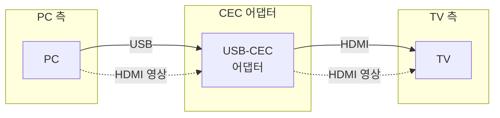
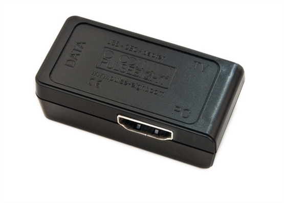

## 개요

PC를 HDMI로 TV에 연결해 쓰는 환경에서, **PC 전원을 켜면 TV도 켜지고, PC를 끄거나 절전하면 TV도 꺼지게** 만들고 싶다면 **HDMI-CEC**를 활용하면 된다. 이 포스트에서는 HDMI-CEC의 개념, PC에서 사용이 까다로운 이유, **Pulse-Eight USB HDMI-CEC 어댑터**를 이용한 구체적인 설치·설정 방법, 전원 연동 시나리오, 그리고 장단점·유의사항까지 정리한다.

**추천 대상:** 거실 HTPC 구축, 회의실 PC–디스플레이 연동, 원터치로 PC·TV 전원을 함께 제어하고 싶은 사용자.

---

## HDMI-CEC란 무엇인가?

**HDMI-CEC**는 소비자 전자기기 제어(Consumer Electronics Control)의 약자로, HDMI 케이블 한 줄로 TV와 연결된 기기들이 **제어 신호**를 주고받게 하는 프로토콜이다. 한 기기의 리모컨이나 전원 조작이 같은 HDMI 버스에 붙은 다른 기기로 전달될 수 있다. 예를 들어 TV 리모컨 하나로 HDMI로 연결된 셋톱박스나 PC의 재생·전원을 조작할 수 있다.

제조사마다 HDMI-CEC를 부르는 이름이 다르다. 아래는 주요 TV 제조사의 HDMI-CEC 관련 명칭 예시이다.

| 제조사   | HDMI-CEC 명칭        |
|----------|----------------------|
| Samsung  | Anynet+ (애니넷플러스) |
| LG       | Simplink (심플링크)   |
| Sony     | BRAVIA Sync (브라비아 싱크) |
| Panasonic| VIERA Link (비에라 링크) |

이름만 다를 뿐, 동일한 HDMI-CEC 표준을 쓰며 HDMI 케이블을 통한 기기 간 상호 제어를 의미한다. 삼성의 Anynet+, LG의 Simplink 등을 TV 설정에서 켜두면, CEC 호환 기기 간에 전원·볼륨·입력 전환 신호를 주고받을 수 있다.

---

## Intel NUC 및 일반 PC에서 HDMI-CEC 사용이 어려운 이유

일반적인 데스크탑·노트북의 HDMI 출력에는 **CEC 제어 기능이 빠져 있는 경우가 많다.** 대부분의 PC용 GPU(내장 포함)가 HDMI-CEC를 지원하지 않거나, 지원하더라도 매우 제한적이기 때문이다. 즉, PC를 TV와 HDMI로 연결해도 PC 쪽에서 TV에게 “전원 켜/꺼” 같은 CEC 명령을 보내기 어려운 환경이 대부분이다.

Intel NUC처럼 소형 폼팩터 PC도 **모델에 따라** CEC 지원 여부가 다르다. 일부 최신 NUC는 BIOS에서 제어되는 **온보드(On-board) CEC**를 지원하지만, 인텔 문서에 따르면 **양방향 전원 온/오프** 정도만 지원한다. 볼륨 조절·입력 전환 등 세부 제어는 지원하지 않을 수 있으며, 많은 NUC·일반 PC 메인보드는 CEC 신호를 다루는 하드웨어 자체가 없어 **외부 CEC 어댑터**가 필요하다. 인텔은 외부 CEC 어댑터를 메인보드의 CEC 헤더에 연결해 HDMI-CEC를 쓰도록 안내하며, Pulse-Eight·GORITE 같은 서드파티 제품을 사용하도록 되어 있다. 결국 **일반 PC 환경에서는 별도 HDMI-CEC 어댑터 없이는 CEC를 쓰기 어렵다**는 점을 전제로 두면 된다.

---

## Pulse-Eight USB CEC 어댑터의 역할과 설치 방법

### 어댑터가 하는 일

**Pulse-Eight USB-HDMI CEC 어댑터**는 PC와 TV 사이에 끼워 넣어, PC가 HDMI-CEC 신호를 주고받을 수 있게 해주는 작은 중계 장치이다. 이 어댑터를 쓰면 PC도 HDMI-CEC 버스에 참여해 TV·AV 기기와 상호 제어할 수 있다.

### 연결 구조

아래는 PC, CEC 어댑터, TV 간 연결 관계를 단순화한 흐름이다.

```mermaid
flowchart LR
  subgraph PcSide["PC 측"]
    Pc["PC"]
  end
  subgraph AdapterSide["CEC 어댑터"]
    CecAdapter["USB-CEC</br>어댑터"]
  end
  subgraph TvSide["TV 측"]
    Tv["TV"]
  end
  Pc -->|"USB"| CecAdapter
  CecAdapter -->|"HDMI"| Tv
  Pc -.->|"HDMI 영상"| CecAdapter
  CecAdapter -.->|"HDMI 영상"| Tv
```

실제 배선은 **PC HDMI 출력 → 어댑터 PC측 HDMI 포트**, **어댑터 TV측 HDMI 포트 → TV HDMI 입력**, **어댑터 DATA(USB) 포트 → PC USB** 로 연결한다. 영상은 HDMI로 그대로 통과하고, CEC 제어는 USB를 통해 PC 소프트웨어와 주고받는다.

### 제품 외형과 포트

Pulse-Eight USB-CEC 어댑터는 손바닥만 한 플라스틱 박스 크기이다. 한쪽에는 **"TV"** 표시의 HDMI 포트, 반대쪽에는 **"PC"** 표시의 HDMI 포트가 있고, 옆면에 **"DATA"** 라고 된 USB 포트가 있다. PC와 TV 사이 HDMI 경로 **중간**에 어댑터를 넣고, USB로 PC에 연결해 CEC 명령을 주고받는다.

### 설치 절차 요약

1. **하드웨어 연결**  
   PC HDMI 출력 ↔ 어댑터 PC측 HDMI, 어댑터 TV측 HDMI ↔ TV HDMI 입력, 어댑터 USB ↔ PC USB.  
   즉, **PC ↔ (USB) ↔ CEC 어댑터 ↔ (HDMI) ↔ TV** 구조로 배선한다.

2. **소프트웨어 설치**  
   Pulse-Eight가 제공하는 **libCEC** 드라이버와 **CEC-Tray** 같은 제어 유틸리티를 설치한다. 이 소프트웨어가 어댑터를 통해 PC에서 HDMI-CEC 명령을 보내고 받도록 한다.  
   Kodi를 쓰는 경우 플러그인 연동으로 Kodi에서 TV를 제어하거나, TV 리모컨으로 Kodi를 조작할 수 있다. Pulse-Eight 어댑터는 Windows, Linux, macOS를 지원하므로 HTPC 용도로 다양한 환경에서 쓸 수 있다.

---

## PC와 TV 전원 연동 구현 예시

Intel NUC 중 **온보드 CEC**를 지원하는 모델이라면 BIOS에서 “Wake on TV”, “Standby by TV” 같은 옵션으로 전원 연동을 설정할 수 있다. 여기서는 **Pulse-Eight USB-CEC 어댑터**를 쓰는 일반적인 방법을 기준으로 한다.

### 시나리오 1: PC를 켜면 TV도 자동으로 켜지기

PC가 꺼진 상태에서 전원을 넣거나, 절전(S3/S4/S5)에서 복귀할 때 CEC 어댑터가 TV에 **전원 켜기** 신호를 보내도록 설정할 수 있다. 이렇게 해두면 HTPC 전원만 켜도 TV가 함께 켜지고, 해당 HDMI 입력으로 전환된다. Pulse-Eight 어댑터는 PC 전원 인가를 감지해 HDMI-CEC 호환 TV의 전원을 자동으로 켜는 동작을 지원하며, 이로 PC·TV 전원 연동이 가능해진다.

### 시나리오 2: PC 종료·절전 시 TV도 끄기

반대로 PC를 끄거나 일정 시간 유휴 후 절전 모드로 들어가면 TV도 **대기(꺼짐)** 상태로 보내도록 할 수 있다. CEC-Tray에서 “일정 시간(예: 2분) 입력 없을 때 TV 끄기” 같은 스크린세이버/유휴 옵션을 켜두면, PC 미사용 2분 후 TV 전원이 꺼지고, 마우스·키보드로 PC를 깨우면 TV 전원도 다시 켜지게 할 수 있다. 자리를 비울 때 TV를 따로 끌 필요가 줄어든다.

### 소프트웨어 설정 요점

- **CEC-Tray**  
  “PC 시작 시 TV 켜기”, “화면 미사용 시 TV 끄기” 등 옵션을 체크해 저장하면, 설정이 어댑터에 반영되어 이후 자동으로 동작한다.

- **Windows 배치 스크립트**  
  Pulse-Eight 제공 스크립트인 `tv_on.cmd`, `tv_off.cmd`를 활용할 수 있다.  
  - **시작 시 TV 켜기:** `tv_on.cmd`를 시작 프로그램(예: `C:\Users\<사용자>\AppData\Roaming\Microsoft\Windows\Start Menu\Programs\Startup`)에 넣는다.  
  - **종료 시 TV 끄기:** `tv_off.cmd` 내용 끝에 `shutdown -s -t 5` 등을 추가해, 이 배치 파일로 PC를 종료할 때 TV 끄기 신호를 보낸 뒤 PC가 꺼지게 할 수 있다.  
  TV가 특정 HDMI 포트(예: 3번)로 전환되어야 한다면 스크립트 마지막 줄에 `-s -p 3`처럼 포트 번호를 지정할 수 있다. 자세한 내용은 Pulse-Eight 지원 문서를 참고하면 된다.

---

## HDMI-CEC 활용의 장점 및 유의 사항

### 장점

- **원터치 전원·입력 전환**  
  PC 한 대로 TV까지 제어되므로, 전원 버튼 한 번으로 시스템 전체가 켜지고 꺼져 사용이 편하다. HTPC를 켜면 TV도 켜지고 해당 HDMI 입력으로 자동 전환되므로 리모컨을 따로 누를 필요가 줄어든다.

- **리모컨 통합**  
  HDMI-CEC를 쓰면 TV 리모컨 하나로 PC 미디어 재생을 제어할 수 있다. Kodi 등과 연동하면 가족도 TV 리모컨만으로 HTPC를 다룰 수 있고, PC에서 재생을 시작·정지할 때 TV에 신호를 보내 입력 전환을 맞추는 식의 연동도 가능해 사용자 경험이 좋아진다.

- **에너지 절약**  
  PC와 TV 전원이 연동되면, 사용하지 않을 때 TV를 켜둔 채 잊어버리는 경우가 줄어든다. PC가 절전으로 들어가면 TV도 꺼지므로, 장시간 빈 화면으로 TV가 켜져 있는 상황을 줄일 수 있다.

### 유의 사항

- **TV의 CEC 설정**  
  대부분의 TV는 HDMI-CEC가 기본값으로 꺼져 있거나, 제조사별 이름(Anynet+, Simplink 등)으로 되어 있다. TV 설정 메뉴에서 해당 기능을 **사용**으로 켜야 PC–TV 연동이 동작한다. TV마다 CEC 지원 수준이 달라 일부 기능은 동작하지 않을 수 있다.

- **중간 기기(사운드바·AV 리시버)**  
  PC와 TV 사이에 사운드바·AV 리시버가 있으면 CEC 신호가 제대로 넘어가는지 확인이 필요하다. 대부분 최신 기기는 CEC를 중계하지만, 기기별로 설정을 추가로 만져야 할 수 있다.  
  PC 쪽에서는 OS별로 libCEC·CEC-Tray 등 필요한 드라이버·소프트웨어를 설치하고, Windows라면 CEC-Tray를 자동 시작에 넣는 등 초기 설정이 필요하다.

- **PC USB 전원**  
  Pulse-Eight 어댑터의 “PC 켤 때 TV 켜기” 동작은 **PC USB 전원이 완전히 꺼졌다가 들어올 때** 트리거된다. 메인보드 BIOS에서 S4/S5(완전 종료) 상태에서도 USB에 전원을 주는 “USB 충전” 기능이 켜져 있으면, PC가 꺼져 있어도 어댑터에 전원이 계속 들어와 “PC 켜짐”을 감지하지 못할 수 있다. 이 경우 BIOS에서 해당 옵션을 끄는 것이 좋다.

- **HDMI 케이블 길이·해상도**  
  이 어댑터는 HDMI 신호를 증폭·재클럭하지 않는 **패시브** 장치이다. HDMI 케이블이 너무 길거나 4K 60Hz HDR 등 고해상도·고대역폭을 쓰면 신호 품질이 떨어져 화면에 잡음·불안정이 생길 수 있다. 제조사는 1080p HD에서 총 5m, 4K UHD에서 총 2m 이하의 HDMI 케이블 길이를 권장하며, 4K 60Hz 이상 대역폭이 필요하면 현재 모델로는 제한이 있을 수 있다고 안내한다. 4K를 쓰는 경우 어댑터를 영상 경로에 넣지 않고, PC–HDMI–TV 입력 1, PC–USB–CEC 어댑터–HDMI–TV 입력 2 처럼 **CEC만 별도 HDMI**로 연결하는 우회 구성이 권장되는 경우도 있다.

---

## 트러블슈팅 요약

| 현상 | 확인·조치 |
|------|-----------|
| TV가 켜지지 않거나 반응 없음 | TV 설정에서 HDMI-CEC(Anynet+/Simplink 등) 사용 여부 확인. 어댑터 USB·HDMI 연결 재확인. |
| PC 켤 때 TV가 안 켜짐 | BIOS에서 S4/S5 시 USB 전원 공급(USB 충전) 비활성화. CEC-Tray 자동 시작·“PC 시작 시 TV 켜기” 옵션 확인. |
| 4K에서 화면 깨짐·불안정 | 케이블 길이 2m 이하 권장. 필요 시 CEC만 별도 HDMI 포트로 연결하는 구성 검토. |
| TV가 다른 HDMI 입력으로 전환됨 | `tv_on.cmd` 등에서 TV의 실제 HDMI 포트 번호에 맞게 `-p` 옵션 지정. |

---

## 마치며

HDMI-CEC와 Pulse-Eight USB-CEC 어댑터를 쓰면 PC와 TV를 하나의 시스템처럼 전원·입력을 연동해 쓸 수 있다. 개념만 잡으면 비교적 따라 하기 쉬운 편이므로, 거실 HTPC나 회의실 PC–디스플레이 연동에 관심이 있다면 한 번 시도해 보길 권한다.

---

## 참고 자료

- [인텔® NUC용 HDMI CEC 정보](https://www.intel.co.kr/content/www/kr/ko/support/articles/000023500/intel-nuc/intel-nuc-kits.html) — 온보드 CEC 지원 NUC 목록, BIOS 설정 요약.
- [Pulse-Eight USB-HDMI CEC Adapter 제품 페이지](https://www.pulse-eight.com/p/104/usb-hdmi-cec-adapter) — 제품 사양, HDMI 케이블 거리·해상도 안내.
- [Turn on/off TV using USB-CEC Adapter (Windows Batch script)](https://support.pulse-eight.com/support/solutions/articles/30000027391-turn-on-off-tv-using-usb-cec-adapter-windows-batch-script-) — tv_on.cmd, tv_off.cmd 사용법 및 시작·종료 시 연동 방법.
