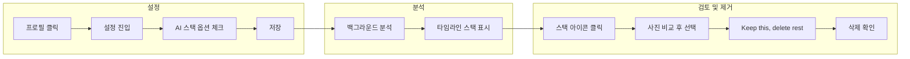
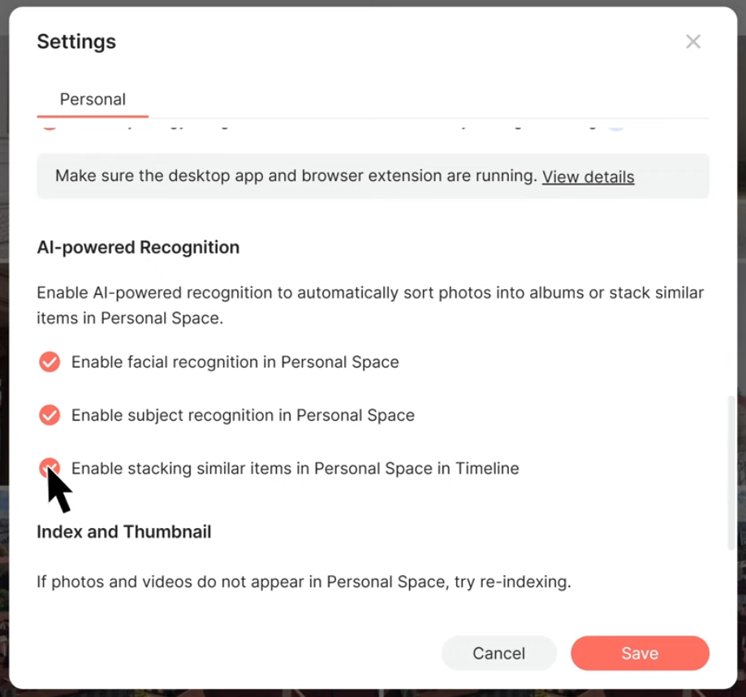
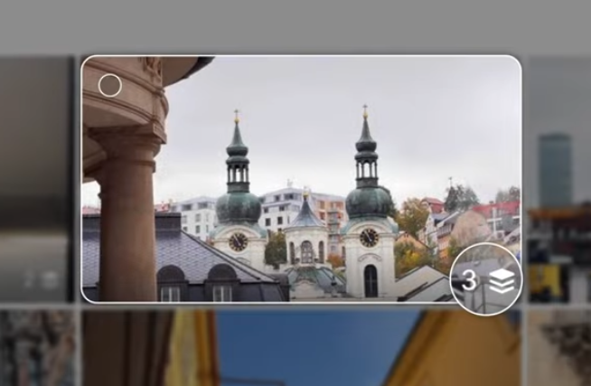
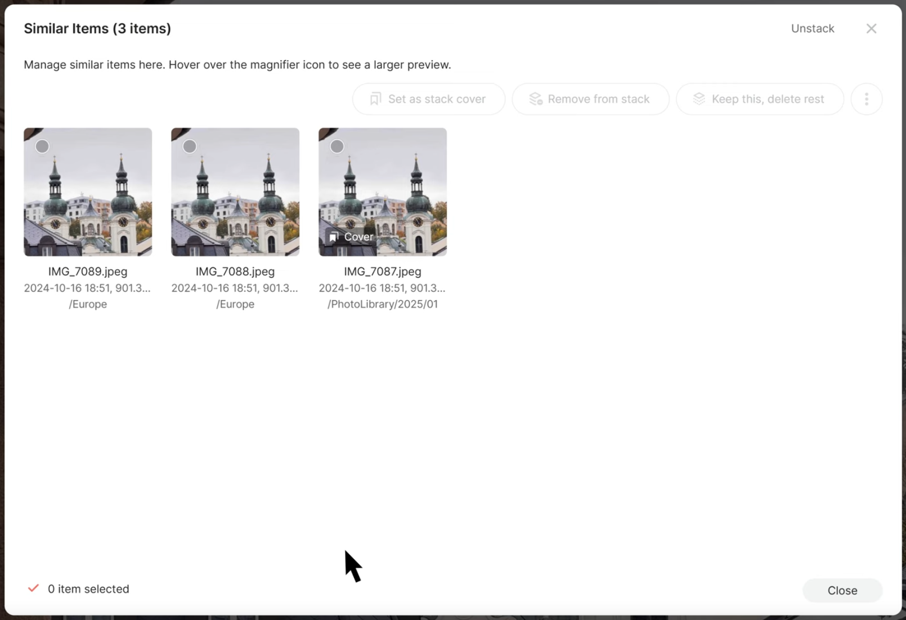
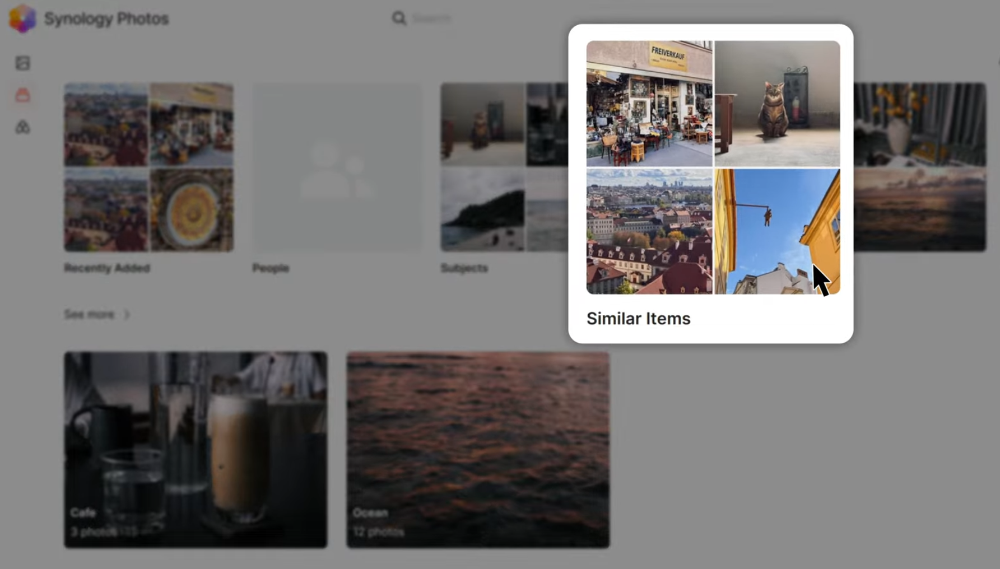

## 도입: 왜 중복 사진 정리가 필요한가

Synology Photos를 쓰다 보면 **같은 장면이 여러 장** 쌓이는 경우가 많다. 한 이벤트에서 연사 촬영을 하거나, 스마트폰·카메라·클라우드 백업이 겹치면서 동일·유사 사진이 반복 저장되기도 한다. 이런 중복은 저장 공간을 낭비할 뿐 아니라, 타임라인과 앨범을 지저분하게 만들어 원하는 사진을 찾기 어렵게 한다. 수작업으로 하나씩 비교해 지우는 것은 시간이 많이 들고 실수 가능성도 있다.

Synology Photos는 **AI 기반 유사 항목 스택(Stack)** 기능으로, 비슷한 사진들을 자동으로 묶어 준다. 이 기능을 쓰면 타임라인에서 스택 아이콘만 보고도 중복·유사 사진을 빠르게 찾을 수 있고, 한 번에 "이것만 남기고 나머지 삭제" 같은 선택까지 할 수 있다. 아래에서는 이 기능을 **활성화하는 방법**, **스택을 확인하고 중복을 제거하는 절차**, 그리고 **Similar Items 앨범**을 활용하는 요령까지 단계별로 정리한다.



위 영상에서는 Synology Photos에서 AI 기능을 활용해 중복·유사 사진을 찾고 제거하는 전체 흐름을 시각적으로 소개한다. 본문과 함께 보면 설정과 조작 순서를 더 쉽게 따라 할 수 있다.

---

## 핵심 개념: 스택(Stack)과 AI 인식

**스택(Stack)**이란 Synology Photos에서 서로 비슷한 사진들을 한 묶음으로 보여 주는 단위다. 완전히 동일한 파일뿐 아니라, 같은 장면을 조금 다르게 찍은 연사·유사 샷도 하나의 스택으로 묶인다. 스택에는 **대표 사진 한 장**이 타임라인에 보이고, 우측 상단에 **겹쳐진 사진 모양의 스택 아이콘**과 함께 스택에 포함된 **사진 개수**가 표시된다.

이 묶음은 **AI-powered Recognition**으로 만들어진다. Synology Photos가 백그라운드에서 사진을 분석해 유사도를 판단하고, 비슷한 항목끼리 자동으로 스택으로 묶는다. 따라서 이 기능을 쓰려면 먼저 **Personal Space(개인 공간) 타임라인에서 유사 항목 스택** 옵션을 켜야 한다. 한 번 활성화하면 새로 추가되는 사진뿐 아니라 기존 라이브러리에도 분석이 적용되며, 사진 수에 따라 **분석에 시간이 다소 걸릴 수 있다**.

---

## 전체 워크플로우 개요

중복·유사 사진을 찾아 제거하는 과정은 다음 순서로 이어진다. AI 기능 활성화 → 백그라운드 분석 대기 → 타임라인 또는 Similar Items 앨범에서 스택 확인 → 스택 열어서 검토 → 남길 사진 선택 후 나머지 삭제.

```mermaid
flowchart LR
  subgraph enableStep["설정"]
    nodeA[프로필 클릭]
    nodeB[설정 진입]
    nodeC["AI 스택 옵션 체크"]
    nodeD[저장]
  end
  subgraph waitStep["분석"]
    nodeE[백그라운드 분석]
    nodeF[타임라인 스택 표시]
  end
  subgraph reviewStep["검토 및 제거"]
    nodeG[스택 아이콘 클릭]
    nodeH[사진 비교 후 선택]
    nodeKeep["Keep this, delete rest"]
    nodeJ[삭제 확인]
  end
  nodeA --> nodeB --> nodeC --> nodeD
  nodeD --> nodeE --> nodeF
  nodeF --> nodeG --> nodeH --> nodeKeep --> nodeJ
```

---

## 1단계: AI 기능 활성화

Synology Photos에서 유사 항목 스택을 쓰려면 **AI-powered Recognition** 설정에서 타임라인 스택 옵션을 켜야 한다. 설정 경로는 다음과 같다.

* Synology Photos 웹 또는 앱에 로그인한 뒤, 우측 상단의 **프로필 아이콘**을 클릭한다.
* 메뉴에서 **설정(Setting)** 을 선택한다.
* **AI-powered Recognition** 섹션을 찾는다.
* **"Enable stacking similar items in Personal Space in Timeline"** 항목을 **체크**한다. (공유 공간(Shared Space)용 옵션이 있다면 필요에 따라 함께 켠다.)
* **저장(Save)** 버튼을 눌러 반영한다.

저장 후 Synology Photos는 백그라운드에서 라이브러리 사진을 분석하기 시작한다. 사진·동영상 수가 많을수록 분석 완료까지 시간이 걸리며, 시스템 절전·하이버네이션 시에는 작업이 지연될 수 있다. 분석이 끝나면 타임라인 썸네일 우측 상단에 스택 아이콘과 숫자가 나타난다.

---

## 2단계: 타임라인에서 "스택" 아이콘 확인

AI 분석이 완료되면 **타임라인(Timeline)** 보기에서 비슷한 사진들이 스택으로 묶여 보인다. 각 스택은 **한 장의 대표 썸네일**로 표시되고, 그 썸네일 **우측 상단**에 **겹쳐진 사진 모양의 스택 아이콘**과 **스택에 포함된 사진 수**가 함께 표시된다.

* Synology Photos에서 **개인 공간(Personal Space)** 의 **타임라인** 보기를 연다.
* 썸네일 우측 상단에 **스택 아이콘**과 **숫자**(예: 3, 5)가 있는 항목을 찾는다. 숫자는 해당 스택에 묶인 사진 개수를 의미한다.
* 스택이 없는 사진은 유사한 항목이 없다고 판단된 것이므로, 중복 정리 관점에서는 그대로 두면 된다.

---

## 3단계: 중복 사진 검토 및 제거

스택 아이콘이 붙은 항목을 클릭하면, 그 스택에 묶인 **모든 사진**을 한꺼번에 볼 수 있다. 여기서 **남길 사진 한 장**을 고르고, 나머지를 삭제할 수 있다.

* 타임라인에서 **스택 아이콘이 있는 썸네일**을 **클릭**한다.
* 스택 뷰가 열리면 목록에 포함된 사진들이 보인다. **확대경 아이콘**으로 각 사진을 크게 보면서 품질·구도·원하는 장면을 비교한다.
* **남기고 싶은 사진 한 장**을 **선택(체크)** 한다.
* **"Keep this, delete rest"** 버튼을 누르면, 선택한 사진만 남고 스택의 나머지 사진은 휴지통으로 이동한다.
* 확인 팝업에서 **삭제(Delete)** 를 한 번 더 눌러 완료한다.

실수로 잘못된 사진을 남겼다면, 삭제 후 휴지통에서 복구할 수 있는지 Synology Photos·DSM 휴지통 정책을 확인하는 것이 좋다. 중요한 스택은 삭제 전에 한 번 더 비교해 보는 습관을 들이면 안전하다.

---

## 보너스: "Similar Items" 앨범 활용

스택된 모든 항목은 **Similar Items** 앨범에 자동으로 모인다. 타임라인을 일일이 스크롤하지 않고, 이 앨범만 열어도 중복·유사 사진 후보를 한눈에 볼 수 있다.

* Synology Photos 좌측 메뉴에서 **앨범(Album)** 아이콘을 클릭한다.
* **Similar Items** 앨범을 선택한다.
* 앨범 안에는 스택으로 묶인 사진들만 모여 있다. 각 항목을 클릭해 2단계·3단계와 같이 스택을 열고, 남길 사진을 선택한 뒤 "Keep this, delete rest"로 정리하면 된다.

대량으로 중복을 정리할 때는 타임라인보다 **Similar Items 앨범**부터 보는 편이 효율적이다.

---

## 사용 시 유의사항과 한계

* **분석 시간**: 라이브러리가 클수록 AI 분석이 끝나기까지 시간이 걸린다. "Detection scheduled" 등 메시지가 보이면 작업이 대기 중이므로, NAS가 절전 모드에 빠지지 않도록 하거나 인덱싱이 끝날 때까지 기다리는 것이 좋다.
* **Personal vs Shared Space**: 유사 항목 스택은 **Personal Space**와 **Shared Space**에서 각각 설정할 수 있다. 공유 공간도 정리하려면 해당 공간의 설정에서 스택 옵션을 별도로 활성화해야 한다.
* **삭제는 복구 가능 여부 확인**: "Keep this, delete rest"로 지운 사진은 Synology Photos·DSM 휴지통으로 가는 경우가 많다. 휴지통 비우기 전에 복구할 수 있는지, 그리고 휴지통 보존 기간을 확인해 두는 것이 안전하다.
* **완전 동일 vs 유사**: 스택은 "완전히 같은 파일"뿐 아니라 "비슷한 장면"까지 묶을 수 있다. 따라서 스택을 열었을 때 실제로는 다른 순간을 담은 사진이 함께 묶여 있을 수 있으니, 삭제 전 반드시 눈으로 확인하는 것이 좋다.

---

## 요약 체크리스트

이 글을 따라 한 뒤에는 아래를 할 수 있어야 한다.

| 항목 | 내용 |
|------|------|
| AI 스택 활성화 | 프로필 → 설정 → AI-powered Recognition에서 Personal Space 타임라인 스택 옵션 켜기 |
| 스택 위치 확인 | 타임라인 썸네일 우측 상단 스택 아이콘·숫자로 유사 사진 묶음 찾기 |
| 검토 및 제거 | 스택 클릭 → 남길 사진 선택 → "Keep this, delete rest" → 삭제 확인 |
| Similar Items 활용 | 앨범 → Similar Items에서 스택된 항목만 모아서 일괄 검토·제거 |

---

## 마무리

Synology Photos의 **AI 기반 유사 항목 스택**을 쓰면, 수작업 비교 없이도 중복·유사 사진을 빠르게 찾고 정리할 수 있다. AI 기능을 켜고, 타임라인 또는 Similar Items 앨범에서 스택을 확인한 뒤, 남길 사진만 선택하고 나머지를 삭제하는 흐름만 익혀 두면 저장 공간을 확보하고 라이브러리를 깔끔하게 유지하는 데 도움이 된다. 모바일 앱(iOS·Android)에도 동일한 스택·중복 제거 기능이 제공될 예정이므로, 공식 릴리스 노트를 참고해 활용하면 좋다.

---

## 참고 문헌

* [Synology Photos – 소중한 추억을 안전하게 보존](https://www.synology.com/ko-kr/dsm/feature/photos) — Synology 공식 제품 소개
* [Similar stacks, face tagging, and more in Synology Photos web 1.8 \| Synology Community](https://community.synology.com/enu/forum/1/post/192278) — 스택 중복·유사 샷 기능 공지 및 커뮤니티 논의
* [Synology Photos – 중복 사진 찾기 및 제거 (YouTube)](https://www.youtube.com/watch?v=1ukpiqwQnC8) — 본문에서 인용한 동영상 가이드
