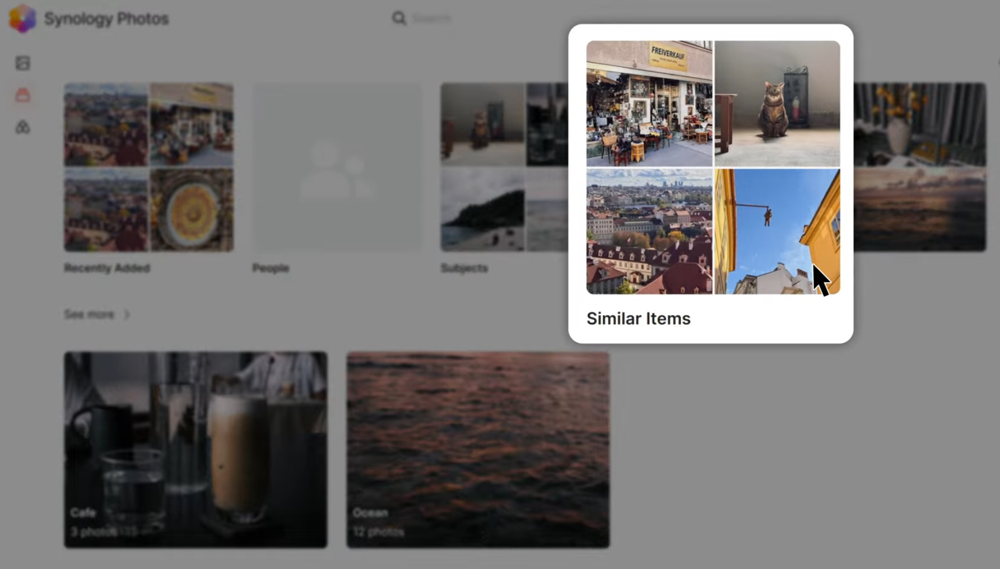

Synology Photos를 사용하다 보면 사진이 중복되어 저장되는 경우가 종종 있다. 같은 사진을 여러 번 업로드하거나, 백업 과정에서 중복이 발생하기도 한다. 이렇게 쌓인 중복 사진들은 저장 공간을 낭비하고, 사진 라이브러리를 복잡하게 만들 수 있다.



위 영상에서는 Synology Photos에서 **AI 기능을 활용하여** 쉽고 빠르게 중복 사진을 찾아 제거하는 방법을 소개한다. 몇 단계만 따라 하면, 깔끔하게 정리된 사진 벽을 만들 수 있다.

## 1단계: AI 기능 활성화

Synology Photos의 AI 기능은 비슷한 사진들을 자동으로 감지하여 스택으로 묶는 기능이다. 이 기능을 활성화해야 중복 사진을 찾을 수 있다.

* Synology Photos에 접속하여 우측 상단의 **프로필 아이콘**을 클릭한다.
* **설정** 메뉴를 선택한다.
* **AI-powered Recognition** 섹션에서 "Enable stacking similar items in Personal Space in Timeline" 옵션을 **체크**한다.
* **저장** 버튼을 클릭한다.

AI 기능이 활성화되면 백그라운드에서 사진들을 분석하기 시작한다. 시간이 다소 걸릴 수 있으니 잠시 기다려야 한다.

## 2단계: "스택" 아이콘 확인

AI 분석이 완료되면, Synology Photos 타임라인에서 비슷한 사진들이 스택 아이콘으로 표시된다. 이 아이콘을 통해 중복 가능성이 있는 사진들을 쉽게 찾을 수 있다.

* Synology Photos **타임라인**을 확인해야 한다.
* 각 사진 썸네일 우측 상단에 **스택 아이콘** (겹쳐진 사진 모양)이 표시된 사진들을 찾아야 한다. 아이콘 숫자는 스택된 사진의 개수를 나타낸다.

## 3단계: 중복 사진 검토 및 제거

스택 아이콘을 클릭하면 스택된 사진들을 자세히 볼 수 있다. 여기서 불필요한 중복 사진들을 선택하여 제거할 수 있다.

* 스택 아이콘이 있는 사진을 **클릭**한다.
* 스택된 사진 목록이 나타난다. 각 사진을 **확대경 아이콘**으로 자세히 보면서 중복 여부를 확인한다.
* 삭제하고 싶은 사진을 **체크**한다.
* "Keep this, delete rest" 버튼을 클릭하면 선택된 사진만 남기고 나머지는 삭제된다.
* 삭제 확인 팝업에서 **삭제** 버튼을 클릭한다.

## 보너스 팁: "Similar Items" 앨범 활용

Synology Photos는 스택된 모든 사진들을 "Similar Items" 앨범에 자동으로 모아준다. 이 앨범을 활용하면 더욱 편리하게 중복 사진들을 관리할 수 있다.

* Synology Photos 좌측 메뉴에서 **앨범** 아이콘을 클릭한다.
* **Similar Items** 앨범을 선택한다.
* 이 앨범에서 스택된 모든 사진들을 한눈에 확인하고, 2, 3단계와 동일하게 중복 사진을 검토하고 제거할 수 있다.

## 마무리

Synology Photos의 AI 기능을 활용하면 번거로운 수작업 없이 간편하게 중복 사진을 찾아 제거할 수 있다. 이 방법을 통해 저장 공간을 확보하고, 더욱 깔끔하고 효율적인 사진 라이브러리를 관리할 수 있다.

## 참고

* [https://www.youtube.com/watch?v=1ukpiqwQnC8](https://www.youtube.com/watch?v=1ukpiqwQnC8)
* [https://community.synology.com/enu/forum/1/post/192278](https://community.synology.com/enu/forum/1/post/192278)
* [https://www.synology.com/ko-kr/dsm/feature/photos](https://www.synology.com/ko-kr/dsm/feature/photos)