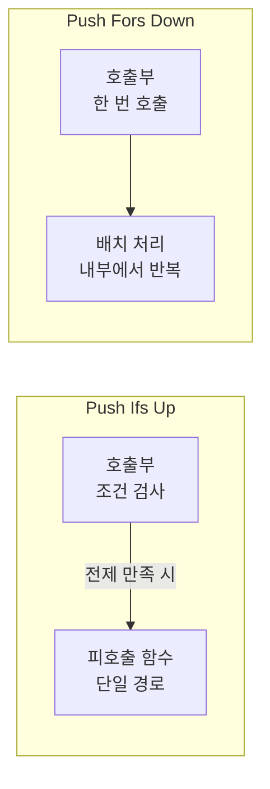
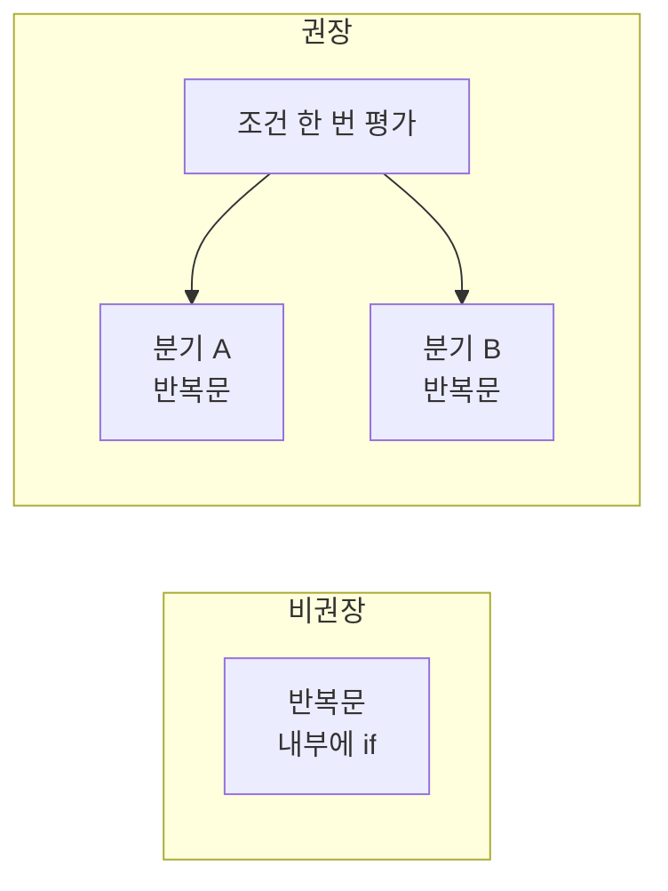

## 개요

본 글은 **Push Ifs Up and Fors Down**이라는 코드 최적화 휴리스틱을 다룬다. 조건문(if)은 가능한 한 **호출부(caller)**로 올리고, 반복문(for/foreach)은 **하위 레벨**로 내리거나 **배치(batch)** 단위로 처리하는 접근이다. 이 원칙은 [matklad의 2023년 노트](https://matklad.github.io/2023/11/15/push-ifs-up-and-fors-down.html)에서 정리된 바 있으며, C#·Rust·일반적인 명령형 코드에 모두 적용할 수 있다.

**이 포스트가 도움이 되는 대상**

- 조건문·반복문이 난잡하게 얽힌 레거시를 정리하려는 개발자
- 성능과 가독성을 동시에 잡고 싶은 백엔드·라이브러리 작성자
- 클린 코드·리팩토링 실전 패턴을 찾는 팀

---

## 원칙 요약

두 가지 규칙은 서로 보완적이다.

| 원칙 | 의미 | 효과 |
|------|------|------|
| **Push Ifs Up** | 조건 검사는 호출하는 쪽에서 하고, 피호출 함수는 전제가 만족된 경우만 다룬다. | 제어 흐름이 한곳에 모여 복잡도·중복·버그 감소. |
| **Push Fors Down** | 반복은 가능하면 배치 API나 하위 레이어에서 한 번에 처리한다. | 조건 평가 횟수 감소, 벡터화·캐시 활용 등 성능 이득. |

아래 Mermaid 다이어그램은 두 원칙의 **제어 흐름 차이**를 요약한다.



---

## 조건문을 호출부로 올리기 (Push Ifs Up)

함수 **안**에서 `if`로 전제조건을 검사하는 대신, **호출하는 쪽**에서 검사하고 타입·계약으로 “이 함수는 전제가 만족될 때만 호출된다”를 표현하는 방식이다.

### 동기

- **제어 흐름 집중**: `if`가 여러 함수에 흩어져 있으면 같은 조건이 반복되고, 데드 브랜치를 찾기 어렵다. 한 함수에 모으면 중복·불필요 분기가 눈에 잘 들어온다.
- **단일 책임**: 피호출 함수는 “유효한 입력만 처리”하는 직선형 로직에 집중하고, “유효한지 판단”은 호출부 책임으로 둔다.
- **전제 검사 최소화**: 전제를 위로 올리면 호출 체인 위쪽 한 곳에서만 검사해도 되어, 전체 검사 횟수가 줄어드는 경우가 많다.

### 예시: null·전제 검사

**비권장 (조건문이 함수 내부):**

```csharp
public void Frobnicate(Walrus? walrus)
{
    if (walrus == null)
        return;

    // walrus를 처리하는 로직
}
```

**권장 (조건문을 호출부로):**

```csharp
// 호출부
if (walrus is not null)
    Frobnicate(walrus);

// 피호출 함수: null이 아님을 전제
public void Frobnicate(Walrus walrus)
{
    // walrus를 처리하는 로직만 담당
}
```

C#에서는 nullable 참조 타입(`Walrus?`)과 null 검사 후 non-null 보장을 활용하면, “호출부에서 검사 후 넣어준다”는 계약을 타입으로도 표현할 수 있다.

### “Enum 해체” 리팩터링

여러 단계에서 같은 조건이 enum/match로 반복되는 경우, 조건을 위로 올려 한 번만 분기하게 만드는 패턴이다.

**Before: 조건이 데이터 구조로 재등장**

```csharp
enum Result { Foo(int x); Bar(string y); }

void Main() => g(f());

Result f() => condition ? Result.Foo(x) : Result.Bar(y);

void g(Result e)
{
    switch (e) {
        case Result.Foo(var x): Foo(x); break;
        case Result.Bar(var y): Bar(y); break;
    }
}
```

**After: 조건을 호출부로 올려 한 번만 분기**

```csharp
void Main()
{
    if (condition)
        Foo(x);
    else
        Bar(y);
}
```

조건이 한 곳에만 나타나므로 동작이 읽기 쉽고, 불필요한 enum·중간 타입을 줄일 수 있다.

---

## 반복문을 하위 레벨로 내리기 (Push Fors Down)

“많은 것은 많게” 다루는 데이터 지향 사고다. 호출부에서 `for`/`foreach`로 하나씩 호출하기보다, **배치 단위 API**를 두고 반복·벡터화는 하위 레이어에서 처리하도록 한다.

### 동기

- **성능**: 배치로 처리하면 초기화·분기 비용을 분산시키고, 벡터화·캐시 친화적 접근이 가능해진다. [벡터화 인터프리터](https://venge.net/graydon/talks/VectorizedInterpretersTalk-2023-05-12.pdf) 등 극단적 사례에서도 동일한 아이디어가 쓰인다.
- **표현력**: “컬렉션 전체에 대한 연산”을 한 단위로 생각하면, jQuery 스타일의 컬렉션 API나 선형대수 식처럼 사고하기 쉬워진다.

### 예시: 단일 호출 vs 배치 호출

**비권장 (호출부에서 반복):**

```csharp
foreach (var walrus in walruses)
    Frobnicate(walrus);
```

**권장 (반복을 하위로):**

```csharp
public void FrobnicateBatch(IEnumerable<Walrus> walruses)
{
    foreach (var walrus in walruses)
    {
        // 배치 내부에서 반복; 필요 시 벡터화·최적화 적용
    }
}

// 호출부
FrobnicateBatch(walruses);
```

배치 API가 있으면 나중에 정렬 순서 변경, 필드별 SoA 처리, 병렬화 등을 한 곳에서 적용하기 수월하다.

---

## 조건문과 반복문 조합

두 원칙을 같이 쓰면, 반복문 **안**에서 매번 도는 조건을 반복문 **밖**으로 빼서 한 번만 평가하게 할 수 있다.



**비권장 (루프 안에서 조건 반복 평가):**

```csharp
foreach (var walrus in walruses)
{
    if (condition)
        walrus.Frobnicate();
    else
        walrus.Transmogrify();
}
```

**권장 (조건을 위로, 반복을 아래로):**

```csharp
if (condition)
{
    foreach (var walrus in walruses)
        walrus.Frobnicate();
}
else
{
    foreach (var walrus in walruses)
        walrus.Transmogrify();
}
```

이렇게 하면 조건이 한 번만 평가되고, 분기 예측·벡터화에도 유리해질 수 있다. [TigerBeetle](https://www.tigerbeetle.com/)처럼 제어 평면에서 결정을 한 번 내리고, 데이터 평면에서는 배치 단위로 처리하는 구조와도 맞닿아 있다.

---

## 실전 적용 팁

1. **전제조건 문서화**: “이 메서드는 null이 아닌 인자만 받는다”처럼 호출부 책임을 주석·XML 문서로 명시하면, 나중에 리팩터링할 때 안전하다.
2. **배치 API 설계**: 기존에 `ProcessOne`만 있다면 `ProcessBatch(IEnumerable<T>)`를 추가하고, `ProcessOne`은 `ProcessBatch(Enumerable.Repeat(item, 1))` 등으로 위임하는 식으로 정리할 수 있다.
3. **점진적 적용**: 한 번에 모든 호출부를 바꾸지 말고, 새 코드부터 “조건은 위로, 반복은 배치로”를 적용하고, 핫 경로나 복잡한 분기부터 단계적으로 리팩터링한다.

---

## 결론

- **Push Ifs Up**: 조건문을 호출부로 올려 제어 흐름을 한곳에 모으고, 피호출 함수는 전제가 만족된 경우만 다루게 하면 가독성과 유지보수성이 좋아진다.
- **Push Fors Down**: 반복을 배치·하위 레이어로 내리면 조건 평가 횟수 감소와 벡터화·캐시 활용으로 성능 이득을 얻을 수 있다.
- 두 원칙을 함께 쓰면 “조건은 한 번, 반복은 배치 단위”로 코드를 정리할 수 있어, C#을 비롯한 객체 지향·명령형 코드에서도 실용적으로 쓸 수 있다.

---

## 참고 문헌

- [Push Ifs Up And Fors Down](https://matklad.github.io/2023/11/15/push-ifs-up-and-fors-down.html) — matklad, 2023. 원칙의 출처와 Rust 예시, enum 해체·배치 처리 설명.
- [How to break out of an IF statement](https://stackoverflow.com/questions/29297305/how-to-break-out-of-an-if-statement) — Stack Overflow. 중첩 `if` 제어 흐름을 정리하는 방법들(메서드 추출, early return 등).
- [Vectorized Interpreters (Graydon Hoare, 2023)](https://venge.net/graydon/talks/VectorizedInterpretersTalk-2023-05-12.pdf) — 배치·벡터화 관점에서 “Push Fors Down”과 연결되는 발표 자료.
