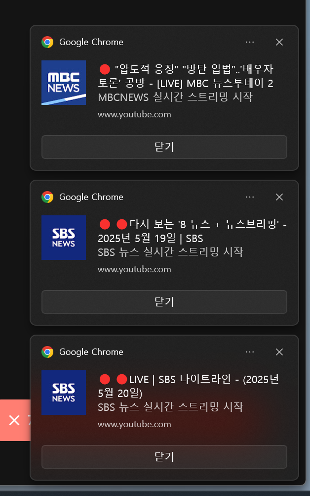

Windows 10/11의 기본 토스트 알림(Toast Notification) 플랫폼은 **같은 AppUserModelID**로 보낸 알림을 **한 번에 하나씩**만 배너로 표시하도록 설계되어 있다. 이는 사용자 경험을 위한 의도적인 설계이지만, 때로는 여러 알림을 동시에 표시해야 하는 상황이 발생할 수 있다. "한 번에 여러개의 알림을 나란히" 띄우기 위해 여러 가지 방법을 시도해 보았다.

## 문제 상황

Windows의 알림 시스템은 기본적으로 다음과 같은 제한사항을 가지고 있다:

1. 알림은 순차적으로만 표시됨
2. 이전 알림이 닫혀야 다음 알림이 표시됨
3. 동시에 여러 알림을 표시할 수 없음

이러한 제한사항은 사용자 경험을 위한 것이지만, 특정 상황에서는 여러 알림을 동시에 표시해야 할 필요가 있다.

## 목표

||
|:---:|
|알림 배너가 여려개 표시되는 모습|

위 이미지는 Windows 알림 시스템에서 여러 개의 알림 배너가 동시에 표시되는 모습을 보여준다. 각 알림은 서로 다른 내용을 가지고 있으며, 화면 우측 하단에 겹치지 않게 배치되어 있다.

각 알림은 독립적으로 표시되며, 사용자가 원하는 순서대로 닫을 수 있다. 이러한 방식으로 여러 알림을 동시에 표시함으로써 사용자는 중요한 정보를 놓치지 않고 한눈에 확인할 수 있다.

## 여러 개의 알림 배너를 띄우는 방법 조사

[C# 앱에서 로컬 알림 메시지 보내기](https://learn.microsoft.com/ko-kr/windows/apps/design/shell/tiles-and-notifications/send-local-toast?tabs=uwp)를 사용해서 아래와 같이 코드를 작성하면 "첫 번째 알림"이 표시되고 닫아야지만 "두 번때 알림"이 표시되는 문제?가 있다.

```csharp
using System;
using System.Runtime.InteropServices;
using Microsoft.Toolkit.Uwp.Notifications;
using Windows.UI.Notifications;

class Program
{
    // (선택) 런타임에 AppUserModelID 설정
    [DllImport("shell32.dll", CharSet = CharSet.Unicode, SetLastError = true)]
    static extern int SetCurrentProcessExplicitAppUserModelID(string AppID);

    static void Main(string[] args)
    {
        // 시작 메뉴에 동일한 AppUserModelID를 가진 .lnk가 있어야 합니다
        const string AppID = "MyCompany.MyConsoleApp";
        SetCurrentProcessExplicitAppUserModelID(AppID);

        // 첫 번째 토스트
        new ToastContentBuilder()
            .AddArgument("id", "toast1")
            .AddText("첫 번째 알림")
            .AddText("콘솔 앱에서 보냄")
            .Show(toast =>
            {
                toast.Tag = "toast1";
                toast.Group = "group1";
            });

        // 두 번째 토스트
        new ToastContentBuilder()
            .AddArgument("id", "toast2")
            .AddText("두 번째 알림")
            .AddText("연속 호출로 표시됨")
            .Show(toast =>
            {
                toast.Tag = "toast2";
                toast.Group = "group1";
            });

        Console.WriteLine("알림을 보냈습니다. Enter 키로 종료합니다.");
        Console.ReadLine();
    }
}
```

## 시도 했던 방법들

여러 가지 방법을 시도했지만 모두 원하는 결과를 얻지 못했으며, 그 과정에서 시도했던 방법들과 코드를 정리해보았다.

### 1. 단일 AppUserModelID로 연속 전송

**방법**: 하나의 AppUserModelID를 설정한 후, 같은 프로세스에서 `Show()`를 3회 호출

```csharp
// NuGet: Microsoft.Toolkit.Uwp.Notifications
using Microsoft.Toolkit.Uwp.Notifications;

// ...

var appId = "MyCompany.App.ToastDemo";
DesktopNotificationManagerCompat.RegisterAumidAndComServer<NotificationActivator>(appId);
DesktopNotificationManagerCompat.RegisterActivator<NotificationActivator>();

for (int i = 1; i <= 3; i++)
{
    new ToastContentBuilder()
        .AddText($"알림 {i}")
        .AddText($"{i}번째 알림입니다.")
        .Show();  // 같은 AppID로 순차 표시
}
```

> **결과**: 세 알림이 모두 큐에 쌓이지만, 화면에는 하나씩 차례대로만 나타남.

### 2. COM 인터롭으로 `.lnk` 직접 생성

**방법**: `IShellLinkW`·`IPropertyStore`를 직접 구현해 시작 메뉴 바로가기(.lnk)에 AppUserModelID 속성 삽입

```csharp
// (간략화된 예시)
var link = (IShellLinkW)new CShellLink();
link.SetPath(exePath);
// … 워킹 디렉토리, 아이콘 설정 생략 …
var props = (IPropertyStore)link;
var key = new PROPERTYKEY(new Guid(...), 5);
using (var pv = new PropVariant(appId))
{
    props.SetValue(ref key, pv);
    props.Commit();
}
((IPersistFile)link).Save(shortcutPath, true);
```

> **결과**: COM 호출 중 `AccessViolationException`이 빈번히 발생했고, 안정적으로 바로가기를 만들 수 없었음.

### 3. Windows Community Toolkit `DesktopNotificationManagerCompat`

**방법**: 툴킷 헬퍼에 맡겨 AUMID 등록과 바로가기 생성을 자동 처리

```csharp
DesktopNotificationManagerCompat.RegisterAumidAndComServer<NotificationActivator>(appId);
DesktopNotificationManagerCompat.RegisterActivator<NotificationActivator>();

new ToastContentBuilder()
    .AddText("동시 알림 테스트")
    .AddText("툴킷 사용한 토스트")
    .Show();
```

> **결과**: 바로가기 생성은 자동화되었지만, 알림은 여전히 “한 번에 하나”만 배너에 표시되었음.

### 4. 멀티 프로세스 + 멀티 AUMID 전략

**방법**: 같은 EXE를 3개의 프로세스로 실행해, 각자 다른 AUMID로 알림 전송

```csharp
// 마스터 프로세스
if (args.Length == 0)
{
    for (int i = 1; i <= 3; i++)
        Process.Start(exePath, i.ToString());
    return;
}
// 자식 프로세스
string aumid = $"MyCompany.App.ToastDemo.{args[0]}";
DesktopNotificationManagerCompat.RegisterAumidAndComServer<NotificationActivator>(aumid);
DesktopNotificationManagerCompat.RegisterActivator<NotificationActivator>();
new ToastContentBuilder()
    .AddText($"동시 알림 #{args[0]}")
    .AddText("각기 다른 AUMID 사용")
    .Show();
```

> **결과**: 거의 동시에 요청을 보내지만, 실제로는 프로세스별 `.lnk` 생성 타이밍이나 권한 문제로 몇몇 알림이 누락되거나 순차 표시되었음.

## 왜 한 번에 여러 개 토스트 알림을 표시하기 어려운가?

Windows 10/11의 토스트 알림 시스템은 **같은 AppUserModelID**(앱 식별자)로 전송된 알림을 **한 번에 하나씩**만 배너로 표시하도록 설계되어 있다. 이 동작 방식은 다음과 같은 이유로 도입되었다:

1. **사용자 경험(UX) 보호**
   한꺼번에 여러 알림이 화면에 우르르 등장하면 사용자가 정보 과부하를 겪고, 중요한 알림을 놓칠 수 있다. 따라서 시스템 차원에서 알림을 순차적으로 보여 주어 주목도를 높이고, 알림 센터(Action Center)를 통해 여러 알림을 한눈에 확인하도록 유도한다.

2. **리소스 관리 및 안정성**
   동시에 다수의 UI 요소를 렌더링하고 애니메이션을 실행하면 시스템 자원(그래픽, 메모리 등)에 부담을 주고, 다른 프로세스와의 충돌 가능성을 높일 수 있다. 이를 방지하기 위해 운영체제는 같은 출처의 토스트 알림을 큐에 넣고 차례로 처리한다.

3. **앱 식별자(AppUserModelID) 기반 분류**
   Windows는 **앱 식별자**를 기준으로 알림을 그룹화·관리한다. 같은 AppUserModelID를 사용하는 알림들은 하나의 "앱 배너"로 묶여 순차 표시되는 반면, **서로 다른 AppUserModelID**를 사용하면 물리적으로 별개의 앱 알림으로 인식되어 **동시에** 여러 배너를 띄울 수 있다. 다만 이 방법은 앱을 설치할 때마다 각 AUMID에 해당하는 바로가기를 생성·등록해야 하는 등 구현 복잡도가 매우 높다.

## 결론 및 권장 대안

1. **OS 정책 인지**
   Windows 10/11은 "같은 앱(같은 AUMID)" 알림을 순차적으로만 표시하도록 의도적으로 설계되어 있다.
2. **알림 센터 활용**
   여러 개의 정보를 한 번에 보내야 한다면, 하나의 토스트에 핵심 정보를 담고 나머지는 **알림 센터**에서 확인하도록 유도하는 것이 좋다.
3. **그룹화·태그**
   `[1/3]`, `[2/3]`, `[3/3]` 형식으로 제목에 순번을 붙여 사용자에게 연속된 알림임을 알려주는 방법이 있다.
4. **커스텀 팝업**
   Windows 기본 토스트가 아닌, WPF/WinForms를 이용한 **자체 알림 창**을 구현하면 원하는 위치·개수만큼 마음껏 띄울 수 있다.

Windows 토스트 알림을 "한 번에 3개 이상 나란히" 띄우는 것은 결국 **OS 차원의 제약**과 **복잡한 배포 로직**(AUMID별 바로가기 등록)에 부딪혀 현실적으로 어렵다. 위 실패 사례를 참고하여, 시스템 정책에 맞춘 대체 설계를 고민해 보는 것이 좋다.

**결론: Chrome이 어떻게 여러개의 알림 배너를 표시 했는지 모르겠다.**

## 참고

* [C# 앱에서 로컬 알림 메시지 보내기](https://learn.microsoft.com/ko-kr/windows/apps/design/shell/tiles-and-notifications/send-local-toast?tabs=uwp)
* [Multiple Toast Notifications Windows 10 - Microsoft Community](https://answers.microsoft.com/en-us/windows/forum/all/multiple-toast-notifications-windows-10/7198d51c-cb04-4c3f-993a-7120a04d9435)
* [Send a local toast notification from a C# app - Microsoft Docs](https://docs.microsoft.com/windows/apps/design/shell/tiles-and-notifications/send-local-toast)