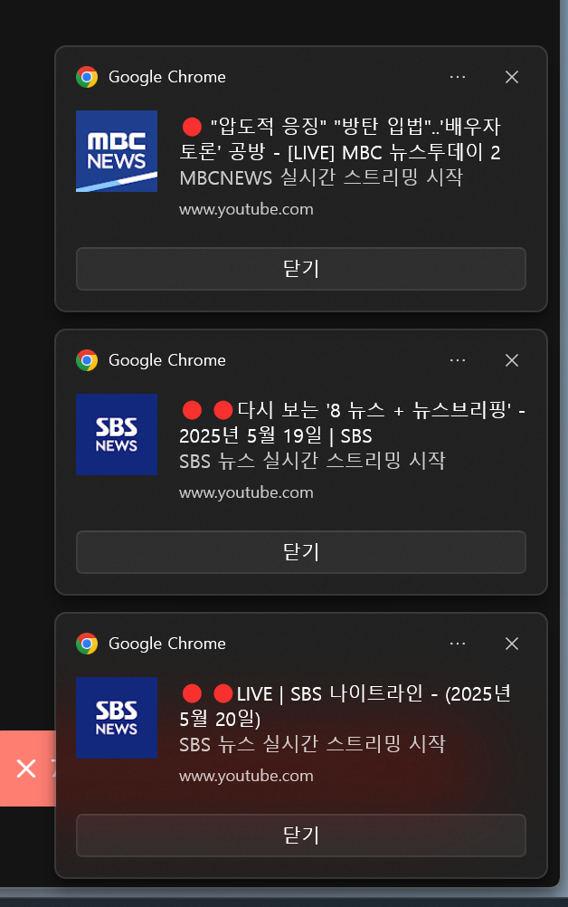
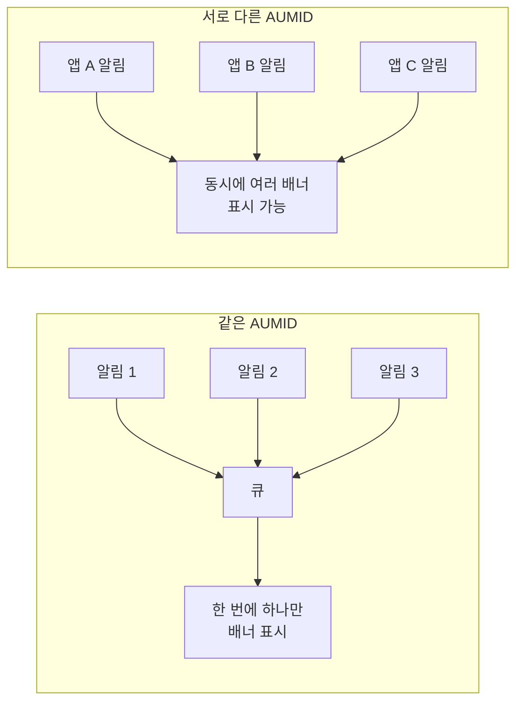

## 개요

이 글은 **Windows 10/11의 토스트 알림(Toast Notification)** 을 다루며, **같은 앱에서 여러 개의 알림 배너를 동시에** 화면에 띄우고 싶을 때 맞닥뜨리는 제한과 그 이유, 시도했던 방법들, 그리고 현실적인 대안을 정리한다.

**추천 대상**

- C# 또는 Win32/ UWP 환경에서 Windows 토스트 알림을 사용하는 개발자
- 여러 건의 알림을 “나란히” 배너로 표시해야 하는 요구사항을 검토 중인 기획·설계 담당자
- 같은 AppUserModelID(AUMID)로 연속 전송 시 한 번에 하나만 표시되는 동작의 원인을 알고 싶은 사람

**다루는 내용**

- Windows 토스트 알림의 “한 번에 하나씩” 동작과 문제 상황
- 단일 AUMID 연속 전송, COM으로 `.lnk` 생성, Windows Community Toolkit, 멀티 프로세스·멀티 AUMID 등 시도한 방법과 결과
- 왜 여러 개를 동시에 표시하기 어려운지(UX·리소스·앱 식별자 정책)
- 결론 및 권장 대안(알림 센터 활용, 그룹화, 커스텀 팝업 등)

---

## 문제 상황

Windows 10/11의 기본 토스트 알림 플랫폼은 **같은 AppUserModelID**로 보낸 알림을 **한 번에 하나씩**만 배너로 표시하도록 설계되어 있다. 이는 사용자 경험을 위한 의도적인 설계이지만, 여러 알림을 동시에 표시해야 하는 상황에서는 다음과 같은 제한이 문제가 된다.

1. **알림은 순차적으로만 표시됨** — 큐에 쌓인 순서대로 하나씩만 배너에 노출된다.
2. **이전 알림이 닫혀야 다음 알림이 표시됨** — 사용자가 닫거나 타임아웃되기 전까지 다음 알림은 대기한다.
3. **동시에 여러 배너를 띄울 수 없음** — 같은 앱(같은 AUMID) 기준으로 한 배너만 허용된다.

이러한 제한은 “알림 폭주”를 막고 주목도를 높이기 위한 것이지만, 모니터링·배치 결과·다중 이벤트 표시 등에서는 **여러 배너를 나란히** 보여 주는 것이 필요할 수 있다.

---

## 목표 화면

|  |
| :---: |
| 알림 배너가 여러 개 표시되는 모습 |

위 이미지는 Windows 알림 시스템에서 여러 개의 알림 배너가 동시에 표시되는 모습을 보여 준다. 각 알림은 서로 다른 내용을 가지며, 화면 우측 하단에 겹치지 않게 배치되어 있다. 각 알림은 독립적으로 표시되고, 사용자가 원하는 순서대로 닫을 수 있다. 이처럼 여러 알림을 동시에 표시하면 사용자는 중요한 정보를 놓치지 않고 한눈에 확인할 수 있다. (참고: 이 동작은 같은 AUMID가 아닌, 서로 다른 앱·AUMID에서 오는 알림이 함께 표시될 때의 모습에 가깝다.)

---

## 기본 사용법과 “한 번에 하나만” 동작

[C# 앱에서 로컬 알림 메시지 보내기](https://learn.microsoft.com/en-us/windows/apps/design/shell/tiles-and-notifications/send-local-toast)(Microsoft Learn)를 따라 아래와 같이 코드를 작성하면, **"첫 번째 알림"이 표시되고 닫아야만 "두 번째 알림"이 표시되는** 동작을 보인다.

```csharp
using System;
using System.Runtime.InteropServices;
using Microsoft.Toolkit.Uwp.Notifications;
using Windows.UI.Notifications;

class Program
{
    [DllImport("shell32.dll", CharSet = CharSet.Unicode, SetLastError = true)]
    static extern int SetCurrentProcessExplicitAppUserModelID(string AppID);

    static void Main(string[] args)
    {
        const string AppID = "MyCompany.MyConsoleApp";
        SetCurrentProcessExplicitAppUserModelID(AppID);

        new ToastContentBuilder()
            .AddArgument("id", "toast1")
            .AddText("첫 번째 알림")
            .AddText("콘솔 앱에서 보냄")
            .Show(toast =>
            {
                toast.Tag = "toast1";
                toast.Group = "group1";
            });

        new ToastContentBuilder()
            .AddArgument("id", "toast2")
            .AddText("두 번째 알림")
            .AddText("연속 호출로 표시됨")
            .Show(toast =>
            {
                toast.Tag = "toast2";
                toast.Group = "group1";
            });

        Console.WriteLine("알림을 보냈습니다. Enter 키로 종료합니다.");
        Console.ReadLine();
    }
}
```

동일한 `AppID`로 두 개의 토스트를 연속 호출해도, 화면에는 한 번에 하나의 배너만 나타나고, 첫 번째를 닫은 뒤에야 두 번째가 나타난다.

---

## 시도했던 방법들

여러 가지 방법을 시도했지만 모두 “동일 AUMID 앱에서 여러 배너를 동시에” 띄우는 목표에는 도달하지 못했다. 시도한 방법과 결과를 요약한다.

### 1. 단일 AppUserModelID로 연속 전송

**방법**: 하나의 AUMID를 설정한 후, 같은 프로세스에서 `Show()`를 여러 번 호출한다.

```csharp
// NuGet: Microsoft.Toolkit.Uwp.Notifications
using Microsoft.Toolkit.Uwp.Notifications;

var appId = "MyCompany.App.ToastDemo";
DesktopNotificationManagerCompat.RegisterAumidAndComServer<NotificationActivator>(appId);
DesktopNotificationManagerCompat.RegisterActivator<NotificationActivator>();

for (int i = 1; i <= 3; i++)
{
    new ToastContentBuilder()
        .AddText($"알림 {i}")
        .AddText($"{i}번째 알림입니다.")
        .Show();
}
```

**결과**: 세 알림이 모두 큐에 쌓이지만, 화면에는 **하나씩 차례대로만** 나타난다. 동시에 여러 배너가 나란히 표시되지는 않는다.

### 2. COM 인터롭으로 `.lnk` 직접 생성

**방법**: `IShellLinkW`, `IPropertyStore` 등을 사용해 시작 메뉴 바로가기(.lnk)에 AppUserModelID 속성을 직접 넣는다.

```csharp
// (간략화된 예시)
var link = (IShellLinkW)new CShellLink();
link.SetPath(exePath);
var props = (IPropertyStore)link;
var key = new PROPERTYKEY(new Guid(...), 5);
using (var pv = new PropVariant(appId))
{
    props.SetValue(ref key, pv);
    props.Commit();
}
((IPersistFile)link).Save(shortcutPath, true);
```

**결과**: COM 호출 중 `AccessViolationException`이 자주 발생했고, 안정적으로 바로가기를 만들기 어려웠다. 이 경로로는 AUMID만 바꿔도 “한 번에 하나” 제한은 그대로다.

### 3. Windows Community Toolkit `DesktopNotificationManagerCompat`

**방법**: 툴킷 헬퍼로 AUMID 등록과 바로가기 생성을 자동 처리한 뒤 토스트 전송.

```csharp
DesktopNotificationManagerCompat.RegisterAumidAndComServer<NotificationActivator>(appId);
DesktopNotificationManagerCompat.RegisterActivator<NotificationActivator>();

new ToastContentBuilder()
    .AddText("동시 알림 테스트")
    .AddText("툴킷 사용한 토스트")
    .Show();
```

**결과**: 바로가기 생성은 자동화되지만, **알림은 여전히 “한 번에 하나”만** 배너에 표시된다.

### 4. 멀티 프로세스 + 멀티 AUMID 전략

**방법**: 같은 EXE를 여러 프로세스로 띄우고, 각 프로세스마다 서로 다른 AUMID를 부여해 알림을 전송한다.

```csharp
if (args.Length == 0)
{
    for (int i = 1; i <= 3; i++)
        Process.Start(exePath, i.ToString());
    return;
}

string aumid = $"MyCompany.App.ToastDemo.{args[0]}";
DesktopNotificationManagerCompat.RegisterAumidAndComServer<NotificationActivator>(aumid);
DesktopNotificationManagerCompat.RegisterActivator<NotificationActivator>();
new ToastContentBuilder()
    .AddText($"동시 알림 #{args[0]}")
    .AddText("각기 다른 AUMID 사용")
    .Show();
```

**결과**: 이론상 서로 다른 “앱”으로 인식되어 여러 배너가 나올 수 있으나, 프로세스별 `.lnk` 생성 타이밍·권한·등록 순서 등으로 인해 **일부 알림이 누락되거나 순차 표시되는** 경우가 많았다. 운영·배포 복잡도도 크게 증가한다.

---

## 왜 한 번에 여러 개의 토스트를 표시하기 어려운가?

Windows 10/11의 토스트 알림 시스템은 **같은 AppUserModelID**로 전송된 알림을 **한 번에 하나씩**만 배너로 표시하도록 설계되어 있다. 그 이유는 대략 다음과 같다.

1. **사용자 경험(UX) 보호**  
   한꺼번에 많은 알림이 쏟아지면 정보 과부하가 되고, 중요한 알림을 놓치기 쉽다. 그래서 같은 앱에서는 순차적으로만 보여 주고, 알림 센터(Action Center)에서 나머지를 확인하도록 유도한다.

2. **리소스 관리 및 안정성**  
   동시에 많은 UI 요소를 렌더링·애니메이션하면 그래픽·메모리 등에 부담이 가고, 다른 프로세스와 충돌 가능성도 커진다. 같은 출처의 토스트는 큐에 넣어 차례로 처리한다.

3. **앱 식별자(AUMID) 기반 분류**  
   Windows는 **앱 식별자**로 알림을 그룹화한다. **같은 AUMID**의 알림은 하나의 “앱”으로 묶여 순차 표시되고, **서로 다른 AUMID**를 쓰면 서로 다른 앱으로 인식되어 이론상 여러 배너를 동시에 띄울 수 있다. 다만 AUMID별로 시작 메뉴 바로가기 등록이 필요해 구현·배포가 복잡해진다.

아래 다이어그램은 같은 AUMID로 여러 토스트를 보낼 때와, 서로 다른 AUMID를 쓸 때의 동작 차이를 요약한다.


```mermaid
flowchart LR
    subgraph sameAumid["같은 AUMID"]
        A1["알림 1"]
        A2["알림 2"]
        A3["알림 3"]
        Q["큐"]
        Single["한 번에 하나만</br>배너 표시"]
        A1 --> Q
        A2 --> Q
        A3 --> Q
        Q --> Single
    end

    subgraph diffAumid["서로 다른 AUMID"]
        B1["앱 A 알림"]
        B2["앱 B 알림"]
        B3["앱 C 알림"]
        Multi["동시에 여러 배너</br>표시 가능"]
        B1 --> Multi
        B2 --> Multi
        B3 --> Multi
    end
```

- **같은 AUMID**: 알림이 큐에 쌓이고, **한 번에 하나만** 배너로 표시된다.
- **서로 다른 AUMID**: 각각 다른 “앱”으로 취급되어, **동시에 여러 배너**가 표시될 수 있다(Chrome 탭별 알림 등이 이에 가깝다).

---

## 결론 및 권장 대안

1. **OS 정책 인지**  
   Windows 10/11은 “같은 앱(같은 AUMID)” 알림을 **순차적으로만** 배너에 표시하도록 의도적으로 설계했다. 이를 우회해 “한 앱에서 여러 배너를 동시에” 띄우는 것은 지원 범위 밖이며, 다양한 시도에도 불구하고 안정적으로 달성하기 어렵다.

2. **알림 센터 활용**  
   여러 건의 정보를 전달해야 한다면, **하나의 토스트**에 가장 중요한 내용만 넣고, 나머지는 **알림 센터**에서 확인하도록 안내하는 구성이 현실적이다.

3. **그룹화·순번 표시**  
   `[1/3]`, `[2/3]`, `[3/3]`처럼 제목에 순번을 넣어 연속된 알림임을 알려 주면, 사용자가 큐에 더 쌓여 있음을 인지하는 데 도움이 된다.

4. **커스텀 팝업**  
   Windows 기본 토스트가 아닌 **WPF/WinForms 등으로 만든 자체 알림 창**을 쓰면, 위치와 개수를 자유롭게 제어할 수 있다. 대신 알림 센터 통합·시스템 정책과의 일관성은 직접 고려해야 한다.

정리하면, **같은 AUMID로 “한 번에 3개 이상 나란히” 토스트를 띄우는 것은 OS 설계와 배포 복잡도 때문에 현실적으로 권장하기 어렵다.** 위 실패 사례와 대안을 참고해 시스템 정책에 맞는 설계를 선택하는 것이 좋다.

---

## 참고 문헌

- [Send a local app notification from a C# app](https://learn.microsoft.com/en-us/windows/apps/design/shell/tiles-and-notifications/send-local-toast) — Microsoft Learn. C#에서 로컬 토스트 알림 전송 방법.
- [Send a local toast notification from a C# app](https://docs.microsoft.com/windows/apps/design/shell/tiles-and-notifications/send-local-toast) — Windows apps, Microsoft Docs. 토스트 콘텐츠 구성 및 Tag/Group, 만료 시간 등.
- [App notification content documentation (adaptive, interactive toasts)](https://learn.microsoft.com/en-us/windows/apps/develop/notifications/app-notifications/adaptive-interactive-toasts) — Microsoft Learn. 알림 콘텐츠 및 인터랙션 가이드.
