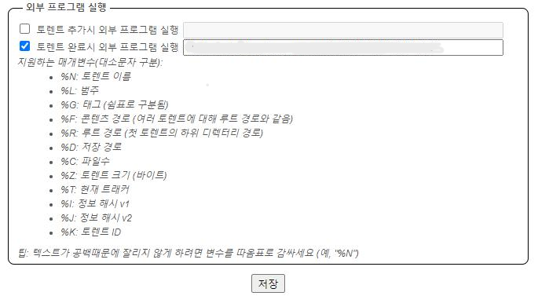

토렌트로 다운로드한 파일들을 매번 수동으로 정리하는 것이 번거롭다. 특히 영화나 드라마와 같은 미디어 파일을 자주 다운로드하는 경우, 파일을 적절한 폴더로 이동시키고 압축을 해제하는 작업을 자동화하면 시간을 크게 절약할 수 있다. 이런 자동화를 구현하기 위해서는 토렌트 클라이언트의 "다운로드 완료 시 외부 프로그램 실행" 기능을 활용하면 된다.

||
|:---:|
|“다운로드 완료 시 외부 프로그램 실행” 메뉴|

외부 프로그램 실행시 동작하는 스크립트의 개념과 실행 방법, 주요 기능, 그리고 출력되는 로그 파일을 확인하는 방법을 단계별로 다룬다. 이 스크립트는 지정한 파일 또는 디렉터리 내의 미디어 파일(`.mkv`, `.mp4`)이나 압축 아카이브(`.rar`)를 목적지 폴더로 복사・압축 해제하며, 작업 과정을 상세한 로그로 기록한다. 마지막으로 폴더 구조를 정리하고 완료 시점을 로그에 남기는 자동화된 워크플로우를 제공한다.

```python
# 사용법
# J:\test.py "J:\Torrent\IP\Zombieland Double Tap 2019 PROPER HYBRID 2160p UHD Blu-ray Remux DoVi HDR DTS-HD MA 7.1-HDT.mkv" "Zombieland Double Tap 2019 PROPER HYBRID 2160p UHD Blu-ray Remux DoVi HDR DTS-HD MA 7.1-HDT.mkv" "IP_test"
# J:\test.py "J:\Torrent\IP\Spin.Me.Round.2022.1080p.BluRay.H264.AAC.MP4-MTDz.mp4" "Spin.Me.Round.2022.1080p.BluRay.H264.AAC.MP4-MTDz.mp4" "IP_test"
# J:\test.py "J:\Torrent\IP\Thor 2011 br 10bit hdr dts hevc-d3g\Thor (2011) UltraHD BluRay HDR10 10Bit 2160p Dts-HDMa7.1 HEVC-d3g.mkv" "Thor 2011 br 10bit hdr dts hevc-d3g" "IP_test"
# J:\test.py "J:\Torrent\IP\The Revenant 2015 2160p UHD BluRay Hybrid DV HDR10+ DDP 7.1 x265-BiTOR" "The Revenant 2015 2160p UHD BluRay Hybrid DV HDR10+ DDP 7.1 x265-BiTOR" "IP_test"
# J:\test.py "J:\Torrent\IP\The.Core.2003.HDR.2160p.WEB.H265-HEATHEN" "The.Core.2003.HDR.2160p.WEB.H265-HEATHEN" "IP_test"

import os
import sys
import shutil
from datetime import datetime
import time
from pathlib import Path
import rarfile
import psutil
import re

def printLog(message):
    with open(log_file, "a", encoding="utf-8") as f:
        f.write(message + "\n")
    print(message)

def disk_usage_check():
    condition = True
    while condition:
        read = 0
        write = 0
        disk_io_counters = psutil.disk_io_counters(perdisk=True)
        
        for disk, counters in disk_io_counters.items():
            if disk == "PhysicalDrive1":
                read = counters.read_bytes
                write = counters.write_bytes
        
        time.sleep(60)
        disk_io_counters = psutil.disk_io_counters(perdisk=True)
        for disk, counters in disk_io_counters.items():
            if disk == "PhysicalDrive1":
                if 600 < int((counters.read_bytes - read)/(1024 ** 2) + (counters.write_bytes - write)/(1024 ** 2)):
                    printLog(datetime.now().strftime("%Y-%m-%d %H:%M") + " : Read {:.2f} MB/m".format((counters.read_bytes - read)/(1024 ** 2)) + ", Write {:.2f} MB/m".format((counters.write_bytes - write)/(1024 ** 2)))
                    print("Usage is too high")
                else:
                    condition = False
    print("Usage is low")

def format_movie_title_1(input_str):
    # 영화 제목과 연도 추출
    match = re.search(r'^(.+)\.(\d{4})\.', input_str)
    if match:
        movie_title = match.group(1).replace('.', ' ')
        year = match.group(2)
        formatted_title = f"{movie_title} ({year})"
        return formatted_title
    else:
        return format_movie_title_2(input_str)

def format_movie_title_2(input_str):
    # 영화 제목과 연도 추출
    match = re.search(r'^(.+?)\s+(\d{4})\s+', input_str)
    if match:
        movie_title = match.group(1)
        year = match.group(2)
        formatted_title = f"{movie_title} ({year})"
        return formatted_title
    else:
        return input_str

def process_file(file, destination):
    file_size_bytes = os.path.getsize(file)
    file_size_gb = file_size_bytes / (1024 ** 3)
    printLog("{:.2f} GB".format(file_size_gb) + " : " + file)

    if file.endswith(".mkv") or file.endswith(".mp4"):
        # disk_usage_check()
        shutil.copy(file, destination)

    if file.endswith(".rar"):
        # disk_usage_check()
        rar_file = rarfile.RarFile(file)
        try:
            rar_file.extractall(path=destination)
            rar_file.close()
        except:
            # os.remove(tmp_file)
            printLog("Error extract")
            sys.exit()

def process_directory(directory, destination):
    for root, dirs, files in os.walk(directory):
        for file in files:
            full_path = os.path.join(root, file)
            process_file(full_path, destination)

print("The script name is:", sys.argv[0])
print("The first argument is:", sys.argv[1])
print("The second argument is:", sys.argv[2])
print("The thrid argument is:", sys.argv[3])

# Set variables for file paths
file_path = sys.argv[1]
file_name = sys.argv[2]
parent_dir = sys.argv[3]
tmp_file = "J:\dostuff_is_doing_stuff.tmp"
log_file = "J:\Log\{}_{}.log".format(datetime.now().strftime("%Y-%m-%d_%H-%M"), file_name)

printLog("Log file name : " + log_file)

with open(log_file, "w", encoding="utf-8") as f:
    f.write(datetime.now().strftime("%Y-%m-%d %H:%M") + "\n")
    f.write("J:\\test.py " + "\"" + file_path + "\" \"" + file_name  + "\" \"" + parent_dir + "\"\n\n")
    f.write("file_path  : " + file_path + "\n")
    f.write("file_path  : \"" + str(Path(file_path).parent) + "\"\n")
    f.write("file_name  : " + file_name + "\n")
    f.write("parent_dir : " + parent_dir + "\n")

printLog(datetime.now().strftime("%Y-%m-%d %H:%M") + " : Start")

if file_name.endswith(".mkv") or file_name.endswith(".mp4"):
    new_folder = os.path.splitext(file_name)[0]
else:
    new_folder = file_name
new_folder = format_movie_title_1(new_folder)
destination = "W:\Torrent\\" + parent_dir + "\\" + new_folder
# print("Destination folder name : " + new_folder)
shutil.rmtree(destination, ignore_errors=True)
folder = Path(destination)
folder.mkdir(parents=True, exist_ok=True)
printLog(f"Folder created at {destination}")

if os.path.isfile(file_path):
    print("Is file : " + file_path)
    file_size_bytes = os.path.getsize(file_path)
    file_size_gb = file_size_bytes / (1024 ** 3)
    printLog("{:.2f} GB".format(file_size_gb) + " : " + file_path)
    # disk_usage_check()
    shutil.copy(file_path, destination)
else:
    process_directory(file_path, destination)

            
printLog(datetime.now().strftime("%Y-%m-%d %H:%M") + " : Complete")
printLog("Dir : \"" + destination + "\"")
for file in os.scandir(destination):
    if file.is_file():
        file_size_bytes = os.path.getsize(file)
        file_size_gb = file_size_bytes / (1024 ** 3)
        printLog("{:.2f} GB".format(file_size_gb) + " : " + file.name)

printLog(datetime.now().strftime("%Y-%m-%d %H:%M") + " : Done")
os.rename(Path(log_file), str(Path(log_file).parent) + "\\Done_" + Path(log_file).name)
```

## qBittorrent 설정

1. **환경 설정 열기**
   `도구` → `옵션` → `다운로드` 탭으로 이동합니다.

1. **완료 시 외부 프로그램 실행**

||
|:---:|
|“다운로드 완료 시 외부 프로그램 실행” 메뉴|

- “다운로드가 완료되었을 때 외부 프로그램 실행” 체크박스를 활성화합니다.
- **명령행**에 다음과 같은 형태로 입력합니다.

     ```text
     C:\Python39\python.exe "J:\test.py" "%F" "%N" "%L"
     ```

- `%F` : 다운로드된 **전체 경로** 
- `%N` : 토렌트 이름
- `%L` 부분은 위 스크립트의 세 번째 인자인 `parent_dir`입니다. 토렌트 클라이언트에서 설정 한 범주에 따라 바뀐다.

1. 적용 후 테스트

토렌트 하나를 다운로드 완료시키고, 로그(`J:\Log\…`)와 `W:\Torrent\IP_test\…` 폴더가 제대로 생성되는지 확인한다.

## 주의사항

- **절대경로**를 정확하게 입력해야 한다. Python 실행 경로(`python.exe`)와 스크립트 위치(`J:\test.py`) 모두이다.
- 스크립트의 세 번째 인자인 `parent_dir`는 클라이언트 인자 기능 제한에 따라 고정값으로 넣어주는 것이 무난하다.
- 토렌트 파일 이름에 한글이나 특수문자가 있으면, 인코딩 이슈가 발생할 수 있으니 테스트 후 문제가 있으면 클라이언트 설정에서 UTF-8 옵션을 활성화해야 한다.
- Windows 방화벽이나 보안 소프트웨어에서 Python 스크립트의 실행을 차단하지 않는지 확인해야 한다.

이제 토렌트 다운로드가 끝나면 클라이언트가 자동으로 `test.py`를 실행하여, 지정된 목적지 폴더(`W:\Torrent\IP_test\…`)로 미디어 파일을 정리・이동해 줄 것이다.

## 스크립트 인자 설명

스크립트는 총 세 개의 명령행 인자를 받습니다.

| 인자 위치   | 변수명          | 설명                                          |
| ------- | ------------ | ------------------------------------------- |
| 첫 번째 인자 | `file_path`  | 처리 대상 파일(`.mkv`, `.mp4`, `.rar`) 또는 디렉터리 경로 |
| 두 번째 인자 | `file_name`  | 작업에 사용될 표시명 (로그 파일명 일부 및 새 폴더명 기반)          |
| 세 번째 인자 | `parent_dir` | 복사・압축 해제된 파일을 저장할 상위 폴더명                    |

예시:

```powershell
# 단일 파일 처리
J:\test.py "J:\Torrent\IP\Zombieland...HDT.mkv" \
           "Zombieland Double Tap 2019 PROPER HYBRID..." \
           "IP_test"
```

## 주요 기능 및 워크플로우

1. **로그 파일 생성**

   - 실행 시각과 인자를 기반으로 `J:\Log\YYYY-MM-DD_HH-MM_<file_name>.log` 형식의 로그 파일을 생성한다.
2. **파일 사이즈 및 경로 출력**

   - 처리 대상의 파일 크기를 GB 단위로 계산한 뒤, 로그와 콘솔에 출력한다.
3. **디스크 I/O 모니터링 (주석 처리 가능)**

   - `psutil`을 이용해 특정 디스크(`PhysicalDrive1`)의 읽기/쓰기 속도를 측정하고, 임계치(600 MB/min)를 초과하면 경고 로그를 남긴다.
4. **파일 복사 및 압축 해제**

   - `.mkv` 또는 `.mp4` 파일은 곧바로 목적지 폴더로 복사한다.
   - `.rar` 파일은 `rarfile` 모듈로 압축을 풀어 목적지 폴더에 저장한다.
5. **폴더명 자동 포맷팅**

   - 정규식을 사용해 영화 제목과 연도를 추출하여 `"Movie Title (YYYY)"` 형식의 폴더명으로 변환한다.
6. **결과 출력 및 폴더 정리**

   - 스크립트 실행 완료 후, 대상 폴더 내 파일 목록과 각 파일 크기를 다시 로그에 기록한다.
   - 최종적으로 로그 파일명 앞에 `Done_` 접두사를 붙여 완료 상태를 표시한다.

## 실행 예시

```powershell
# 디렉터리 단위로 처리
J:\test.py "J:\Torrent\IP" "IP" "IP_test"
```

1. `J:\Torrent\IP` 폴더 내의 모든 `.mkv`, `.mp4`, `.rar` 파일을 순회
2. 각각의 미디어 파일은 `W:\Torrent\IP_test\{영화제목 (연도)}` 폴더로 복사
3. 압축 파일은 동일한 위치에 풀어 저장
4. `J:\Log\2025-05-22_19-45_IP.log` 파일에 작업 내역과 결과를 기록

## 로그 파일 확인 방법

로그에는 다음 정보가 포함된다.

1. **실행 시작 시각**
2. **인자 값**
3. **각 파일별 크기 및 처리 결과**
4. **이상 징후(디스크 과부하) 경고**
5. **최종 완료 시각 및 대상 폴더 경로**

```text
2025-05-22 19:45  
J:\test.py "J:\Torrent\IP" "IP" "IP_test"  

Log file name : J:\Log\2025-05-22_19-45_IP.log  
2025-05-22 19:45 : Start  
4.50 GB : J:\Torrent\IP\Zombieland...
...  
2025-05-22 19:47 : Complete  
Dir : "W:\Torrent\IP_test\Zombieland Double Tap (2019)"  
4.50 GB : Zombieland Double Tap...
2025-05-22 19:47 : Done  
```

## 커스터마이징 팁

- **디스크 모니터링 비활성화**: `disk_usage_check()` 호출부를 주석 처리하거나 제거한다.
- **지원 포맷 추가**: `process_file` 함수 내 `file.endswith` 조건에 확장자를 추가한다.
- **로그 레벨 조정**: `printLog()` 함수에 로깅 레벨(정보, 경고, 오류) 파라미터를 추가해 세부 제어가 가능하다.

이 스크립트는 대용량 미디어 파일의 복사 및 압축 해제를 자동화하여 일일이 수동으로 처리해야 하는 수고를 덜어주는 것이다. 본 글에서 소개한 사용법과 커스터마이징 방법을 참고하여, 각자의 워크플로우에 맞게 스크립트를 확장・응용하는 것이 좋다.
