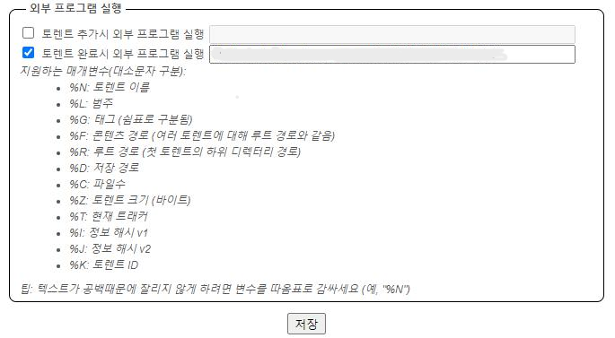
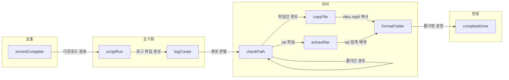

## 개요

토렌트로 받은 영화·드라마 등 미디어 파일을 매번 수동으로 폴더에 옮기고 압축을 푸는 작업은 반복적이고 시간이 든다. **다운로드 완료 시 외부 프로그램 실행** 기능을 쓰면, 완료 직후 지정한 스크립트가 자동으로 파일을 목적지로 복사·압축 해제하고, 폴더명을 `영화제목 (연도)` 형태로 정리해 준다.

이 글에서는 그런 **자동 파일 정리 스크립트**의 동작 개념, 인자 설명, qBittorrent 설정, 로그 확인 방법까지 단계별로 다룬다. Python과 qBittorrent를 쓰는 Windows 사용자를 대상으로 한다.

||
|:---:|
|“다운로드 완료 시 외부 프로그램 실행” 메뉴|

---

## 전제 조건

- **Windows** 환경
- **Python 3** (예: 3.9) 및 `rarfile`, `psutil` 패키지 설치
- **qBittorrent** 등 토렌트 클라이언트에서 “다운로드 완료 시 외부 프로그램 실행” 지원
- 스크립트·로그·토렌트·목적지 경로에 대한 **쓰기 권한**

---

## 워크플로우 개요

다운로드 완료 후 스크립트가 호출되면 대략 아래 순서로 동작한다.


```mermaid
flowchart LR
  subgraph triggerGroup["호출"]
    nodeA[torrentComplete]
  end
  subgraph initGroup["초기화"]
    nodeB[scriptRun]
    nodeC[logCreate]
  end
  subgraph processGroup["처리"]
    nodeD[checkPath]
    nodeE[copyFile]
    nodeF[extractRar]
    nodeG[formatFolder]
  end
  subgraph finishGroup["완료"]
    nodeH[completeDone]
  end
  nodeA -->|"다운로드 완료"| nodeB
  nodeB -->|"로그 파일 생성"| nodeC
  nodeC -->|"경로 판별"| nodeD
  nodeD -->|"파일인 경우"| nodeE
  nodeD -->|"폴더인 경우"| nodeD
  nodeE -->|"mkv, mp4 복사"| nodeG
  nodeF -->|"rar 압축 해제"| nodeG
  nodeD -->|"rar 파일"| nodeF
  nodeG -->|"폴더명 포맷"| nodeH
```

- **torrentComplete** → 토렌트 클라이언트가 다운로드 완료 시 스크립트 호출  
- **scriptRun** → 인자 파싱, 목적지 폴더 준비  
- **logCreate** → `J:\Log\YYYY-MM-DD_HH-MM_<file_name>.log` 로그 파일 생성  
- **checkPath** → 첫 번째 인자가 **파일**인지 **디렉터리**인지 판별  
- **copyFile** → `.mkv`, `.mp4` 파일을 목적지로 복사  
- **extractRar** → `.rar` 파일을 목적지에서 압축 해제  
- **formatFolder** → 정규식으로 영화 제목·연도 추출 후 `제목 (연도)` 폴더명 사용  
- **done** → 완료 시각·대상 폴더·파일 목록 로그 기록 후 로그 파일명에 `Done_` 접두사 부여  

---

## 스크립트 인자 설명

스크립트는 **세 개의 명령행 인자**를 받는다.

| 인자 위치   | 변수명          | 설명                                          |
| ---------- | --------------- | --------------------------------------------- |
| 첫 번째 인자 | `file_path`     | 처리 대상 파일(`.mkv`, `.mp4`, `.rar`) 또는 디렉터리 경로 |
| 두 번째 인자 | `file_name`     | 로그 파일명·폴더명에 사용할 표시명                        |
| 세 번째 인자 | `parent_dir`    | 복사·압축 해제된 결과를 둘 상위 폴더명                    |

예:

```powershell
# 단일 파일
J:\test.py "J:\Torrent\IP\Zombieland...HDT.mkv" "Zombieland Double Tap 2019 PROPER..." "IP_test"

# 디렉터리(폴더 내 모든 미디어/rar 처리)
J:\test.py "J:\Torrent\IP" "IP" "IP_test"
```

---

## 전체 스크립트 및 사용 예시

아래 스크립트는 인자를 받아 로그를 남기고, 파일이면 복사·압축 해제, 폴더면 내부를 순회하며 동일 규칙으로 처리한다. 목적지 경로·로그 경로·디스크 모니터링 대상은 환경에 맞게 수정하면 된다.

```python
# 사용법 예:
# J:\test.py "J:\Torrent\IP\Zombieland Double Tap 2019 PROPER HYBRID 2160p UHD Blu-ray Remux DoVi HDR DTS-HD MA 7.1-HDT.mkv" "Zombieland Double Tap 2019 PROPER HYBRID 2160p UHD Blu-ray Remux DoVi HDR DTS-HD MA 7.1-HDT.mkv" "IP_test"
# J:\test.py "J:\Torrent\IP\Thor 2011 br 10bit hdr dts hevc-d3g\Thor (2011) UltraHD BluRay HDR10 10Bit 2160p Dts-HDMa7.1 HEVC-d3g.mkv" "Thor 2011 br 10bit hdr dts hevc-d3g" "IP_test"

import os
import sys
import shutil
from datetime import datetime
import time
from pathlib import Path
import rarfile
import psutil
import re

def printLog(message):
    with open(log_file, "a", encoding="utf-8") as f:
        f.write(message + "\n")
    print(message)

def disk_usage_check():
    condition = True
    while condition:
        read = 0
        write = 0
        disk_io_counters = psutil.disk_io_counters(perdisk=True)

        for disk, counters in disk_io_counters.items():
            if disk == "PhysicalDrive1":
                read = counters.read_bytes
                write = counters.write_bytes

        time.sleep(60)
        disk_io_counters = psutil.disk_io_counters(perdisk=True)
        for disk, counters in disk_io_counters.items():
            if disk == "PhysicalDrive1":
                if 600 < int((counters.read_bytes - read)/(1024 ** 2) + (counters.write_bytes - write)/(1024 ** 2)):
                    printLog(datetime.now().strftime("%Y-%m-%d %H:%M") + " : Read {:.2f} MB/m".format((counters.read_bytes - read)/(1024 ** 2)) + ", Write {:.2f} MB/m".format((counters.write_bytes - write)/(1024 ** 2)))
                    print("Usage is too high")
                else:
                    condition = False
    print("Usage is low")

def format_movie_title_1(input_str):
    match = re.search(r'^(.+)\.(\d{4})\.', input_str)
    if match:
        movie_title = match.group(1).replace('.', ' ')
        year = match.group(2)
        formatted_title = f"{movie_title} ({year})"
        return formatted_title
    else:
        return format_movie_title_2(input_str)

def format_movie_title_2(input_str):
    match = re.search(r'^(.+?)\s+(\d{4})\s+', input_str)
    if match:
        movie_title = match.group(1)
        year = match.group(2)
        formatted_title = f"{movie_title} ({year})"
        return formatted_title
    else:
        return input_str

def process_file(file, destination):
    file_size_bytes = os.path.getsize(file)
    file_size_gb = file_size_bytes / (1024 ** 3)
    printLog("{:.2f} GB".format(file_size_gb) + " : " + file)

    if file.endswith(".mkv") or file.endswith(".mp4"):
        shutil.copy(file, destination)

    if file.endswith(".rar"):
        rar_file = rarfile.RarFile(file)
        try:
            rar_file.extractall(path=destination)
            rar_file.close()
        except Exception:
            printLog("Error extract")
            sys.exit(1)

def process_directory(directory, destination):
    for root, dirs, files in os.walk(directory):
        for file in files:
            full_path = os.path.join(root, file)
            process_file(full_path, destination)

print("The script name is:", sys.argv[0])
print("The first argument is:", sys.argv[1])
print("The second argument is:", sys.argv[2])
print("The third argument is:", sys.argv[3])

file_path = sys.argv[1]
file_name = sys.argv[2]
parent_dir = sys.argv[3]
tmp_file = "J:\\dostuff_is_doing_stuff.tmp"
log_file = "J:\\Log\\{}_{}.log".format(datetime.now().strftime("%Y-%m-%d_%H-%M"), file_name)

printLog("Log file name : " + log_file)

with open(log_file, "w", encoding="utf-8") as f:
    f.write(datetime.now().strftime("%Y-%m-%d %H:%M") + "\n")
    f.write("J:\\test.py " + "\"" + file_path + "\" \"" + file_name + "\" \"" + parent_dir + "\"\n\n")
    f.write("file_path  : " + file_path + "\n")
    f.write("file_path  : \"" + str(Path(file_path).parent) + "\"\n")
    f.write("file_name  : " + file_name + "\n")
    f.write("parent_dir : " + parent_dir + "\n")

printLog(datetime.now().strftime("%Y-%m-%d %H:%M") + " : Start")

if file_name.endswith(".mkv") or file_name.endswith(".mp4"):
    new_folder = os.path.splitext(file_name)[0]
else:
    new_folder = file_name
new_folder = format_movie_title_1(new_folder)
destination = "W:\\Torrent\\" + parent_dir + "\\" + new_folder
shutil.rmtree(destination, ignore_errors=True)
folder = Path(destination)
folder.mkdir(parents=True, exist_ok=True)
printLog(f"Folder created at {destination}")

if os.path.isfile(file_path):
    print("Is file : " + file_path)
    file_size_bytes = os.path.getsize(file_path)
    file_size_gb = file_size_bytes / (1024 ** 3)
    printLog("{:.2f} GB".format(file_size_gb) + " : " + file_path)
    shutil.copy(file_path, destination)
else:
    process_directory(file_path, destination)

printLog(datetime.now().strftime("%Y-%m-%d %H:%M") + " : Complete")
printLog("Dir : \"" + destination + "\"")
for file in os.scandir(destination):
    if file.is_file():
        file_size_bytes = os.path.getsize(file)
        file_size_gb = file_size_bytes / (1024 ** 3)
        printLog("{:.2f} GB".format(file_size_gb) + " : " + file.name)

printLog(datetime.now().strftime("%Y-%m-%d %H:%M") + " : Done")
os.rename(Path(log_file), str(Path(log_file).parent) + "\\Done_" + Path(log_file).name)
```

---

## 주요 기능 요약

1. **로그 파일 생성**  
   실행 시각·인자 기준으로 `J:\Log\YYYY-MM-DD_HH-MM_<file_name>.log` 생성.

2. **파일 크기·경로 출력**  
   처리 대상 크기를 GB 단위로 로그·콘솔에 기록.

3. **디스크 I/O 모니터링(선택)**  
   `psutil`로 특정 디스크(`PhysicalDrive1`) 읽기/쓰기 속도 측정, 600 MB/min 초과 시 경고. 필요 없으면 `disk_usage_check()` 호출부를 주석 처리.

4. **파일 복사·압축 해제**  
   `.mkv`, `.mp4` → 목적지로 복사. `.rar` → `rarfile`로 목적지에 압축 해제.

5. **폴더명 자동 포맷**  
   정규식으로 제목·연도 추출 후 `"제목 (YYYY)"` 형태의 폴더명 사용.

6. **완료 처리**  
   대상 폴더 내 파일 목록·크기 재기록 후, 로그 파일명 앞에 `Done_` 붙여 완료 표시.

---

## qBittorrent 설정

1. **환경 설정**  
   `도구` → `옵션` → `다운로드` 탭.

2. **완료 시 외부 프로그램 실행**  
   - “다운로드가 완료되었을 때 외부 프로그램 실행” 체크.
   - **명령행** 예시:

   ```text
   C:\Python39\python.exe "J:\test.py" "%F" "%N" "%L"
   ```

   - `%F`: 다운로드된 항목의 **전체 경로**(파일 또는 폴더).
   - `%N`: 토렌트 이름.
   - `%L`: 카테고리 이름 → 스크립트의 세 번째 인자 `parent_dir`에 해당. 클라이언트 제한에 따라 고정값(예: `IP_test`)을 쓰는 편이 안정적일 수 있다.

3. **적용 후 확인**  
   테스트용 토렌트를 하나 완료한 뒤, `J:\Log\` 아래 로그와 `W:\Torrent\IP_test\` 등 목적지 폴더가 예상대로 생성·채워지는지 확인한다.

||
|:---:|
|“다운로드 완료 시 외부 프로그램 실행” 메뉴|

---

## 로그 파일 확인

로그에는 다음이 포함된다.

1. 실행 시작 시각  
2. 넘겨받은 인자  
3. 파일별 크기·처리 결과  
4. (사용 시) 디스크 과부하 경고  
5. 완료 시각·대상 폴더 경로·최종 파일 목록  

예시:

```text
2025-05-22 19:45
J:\test.py "J:\Torrent\IP" "IP" "IP_test"

Log file name : J:\Log\2025-05-22_19-45_IP.log
2025-05-22 19:45 : Start
4.50 GB : J:\Torrent\IP\Zombieland...
...
2025-05-22 19:47 : Complete
Dir : "W:\Torrent\IP_test\Zombieland Double Tap (2019)"
4.50 GB : Zombieland Double Tap...
2025-05-22 19:47 : Done
```

---

## 주의사항 및 트러블슈팅

- **경로**  
  Python 실행 파일(`python.exe`)과 스크립트 경로(`J:\test.py`)는 **절대 경로**로 정확히 입력한다.

- **세 번째 인자 `parent_dir`**  
  클라이언트 인자 치환 제한 때문에, 고정 문자열(예: `IP_test`)을 쓰는 구성을 권장할 수 있다.

- **인코딩**  
  토렌트·파일명에 한글·특수문자가 있으면 인코딩 오류가 날 수 있다. qBittorrent에서 UTF-8 관련 옵션을 켜고, 스크립트·콘솔 인코딩을 맞춘다.

- **보안·방화벽**  
  Windows 방화벽·백신이 Python 스크립트 실행을 막지 않는지 확인한다.

- **예외 처리**  
  스크립트에서는 `except:` 대신 `except Exception:`을 사용하고, 실패 시 `sys.exit(1)`로 종료 코드를 남기면 디버깅에 유리하다.

---

## 커스터마이징 팁

- **디스크 모니터링 끄기**  
  `disk_usage_check()` 호출부를 주석 처리하거나 제거.

- **지원 확장자 추가**  
  `process_file` 안의 `file.endswith` 조건에 `.avi`, `.mov` 등 원하는 확장자를 추가.

- **로그 세분화**  
  `printLog()`에 레벨(정보/경고/오류) 인자를 두어, 나중에 로그 필터링·분석이 쉽게 할 수 있다.

---

## 정리

토렌트 다운로드 완료 후 **외부 프로그램 실행**으로 이 스크립트를 호출하면, 미디어·압축 파일을 지정 폴더로 자동 복사·압축 해제하고, `영화제목 (연도)` 형식으로 정리할 수 있다. 로그로 실행 이력을 남기고, 디스크 부하가 걱정되면 모니터링을 끄거나, 확장자·경로를 자신의 환경에 맞게 바꿔 쓰면 된다. 위 설정·주의사항·팁을 참고해 워크플로우에 맞게 확장·응용하면 된다.
