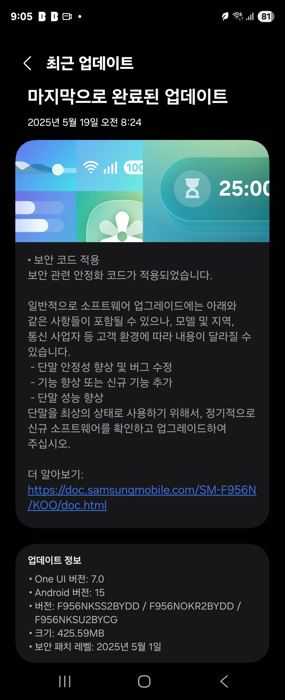
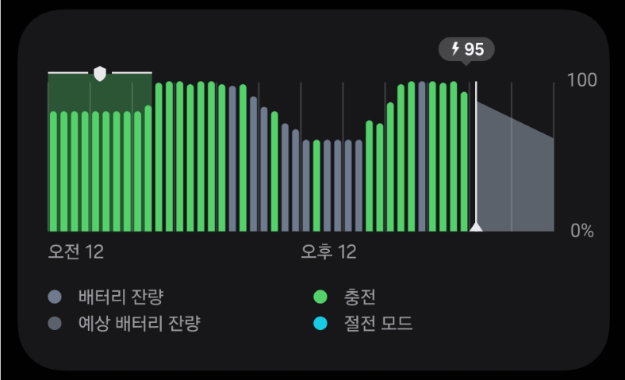
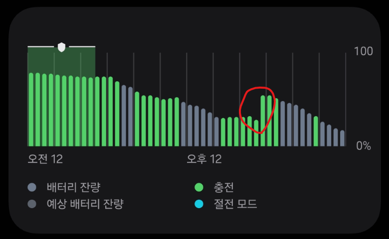
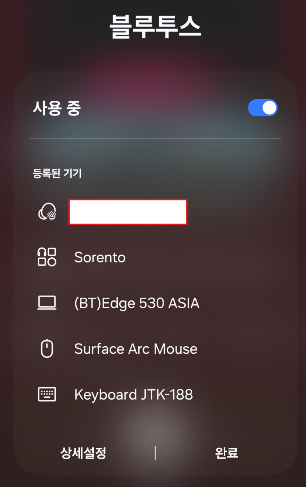
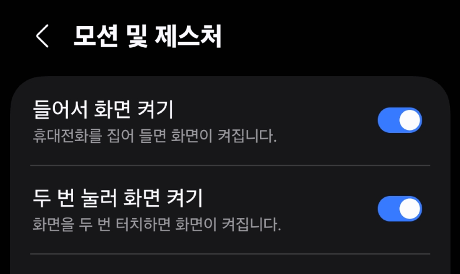

Samsung Galaxy Z Fold 6에서 One UI 7.0 업데이트 이후 발견된 여러 버그들에 대해 정리해보았다. 이 글에서는 배터리 관련 문제, 무선 이어폰 연결 문제, 그리고 잠금 화면 관련 이슈들을 자세히 다룰 예정이다.

## 버전 정보

||
|:---:|
|버전 정보|

Z Fold 6을 사용 중이며 2025년 5월 19일에 최신 One UI 7.0을 받았다.

## 문제 증상

발견된 주요 문제점:

- 배터리 측정 오류
- 충전 상태 표시 이상
- 무선 충전 시 과열 현상
- 무선 이어폰 연결 불안정
- 블루투스 오디오 라우팅 문제
- 노크온 기능 동작 불량

### 배터리 관련

1. 배터리 측정이 정확하지 않음

    |||
    |:---:|:---:|
    |정상 상황|비정상 상황|

    폰 화면 우측 상단에 표시되는 배터리양이 정확하지 않다는 느낌을 받고 있었는데, 충전 내용을 살펴보니 갑자기 충전량이 급 상승한 이력이 있음.

1. 배터리 충전 중 표시 이상

    충전 하지 않고 있어도 충전중이라고 떠 있는 경우가 종종 있음

1. 수면중 배터리 보호 활성화 + 무선 충전 -> 과열

    업데이트 이전에는 큰 문제 없이 사용하고 있었는데, 업데이트 이후에는 수면 이후에 배터리도 충전되지 않고 과열이 발생하고 있는 증상이 있음

### 무선 이어폰 관련

1. 연결 안됨

    ||
    |:---:|
    |연결 안됨|

    무선 이어폰을 귀에 꼽고 연결 되었다는 효과음을 확인한 뒤에도 폰화면에서는 연결 되어 있지 않고, 터치를 해봐도 다시 연결 되지 않음(결국, 폰을 재부팅한 이후에나 이어폰과 연결 할 수 있었음)

1. 연결이 되어 있음에도 스피커에서 소리남

    무선 이어폰으로 음악을 듣고 있다가 전화가 와서 이어폰을 탭하여 전화를 받았음, 폰의 전화 앱에서는 블루투스 아이콘이 활성화 되어 있었지만 정작 소리는 폰의 스피커에서 나오고 있음

### 잠금 해제 관련

1. 노크온 동작 안함

    ||
    |:---:|
    |노크온 설정 화면|

    "두 번 눌러 화면 켜기"가 활성화 되어 있지만 노크온 기능이 동작하지 않기 시작하면 재부팅을 하기 전에는 노크온 기능이 동작하지 않는다.

## 결론

삼성의 One UI는 사용자 경험을 크게 향상시켰고, 특히 Z Fold 시리즈는 혁신적인 제품이라고 생각한다. 하지만 이번 One UI 7.0 업데이트에서 발생한 버그들은 사용자 경험을 크게 해치는 요소이다.

특히 배터리 관련 문제는 일상적인 사용에 직접적인 영향을 미치며, 무선 이어폰 연결 문제와 잠금 해제 관련 버그는 기본적인 기능의 신뢰성을 해치는 심각한 문제이다.

삼성은 이러한 문제들을 신속하게 인지하고 해결하기를 바란다. 사용자들이 기대하는 것은 단순한 기능의 존재가 아니라, 안정적이고 신뢰할 수 있는 사용자 경험이다. 이번 업데이트에서 발생한 버그들이 빠르게 수정되어 삼성 제품의 품질과 신뢰성이 다시 한번 입증되기를 기대한다.
