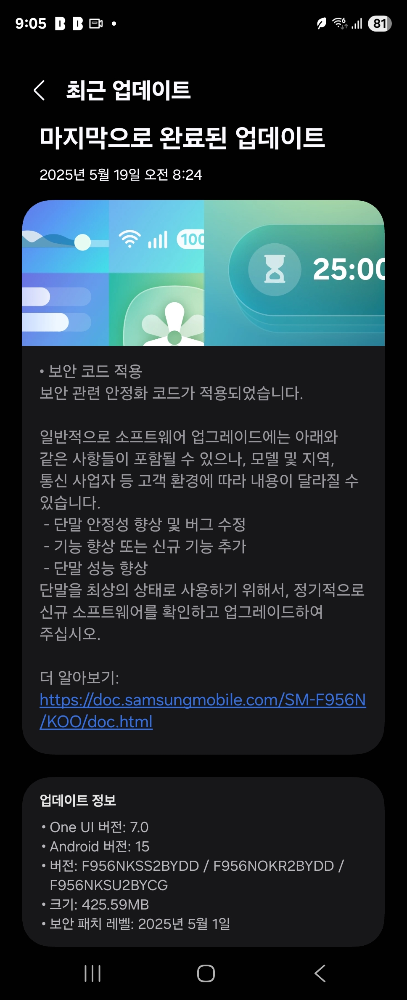
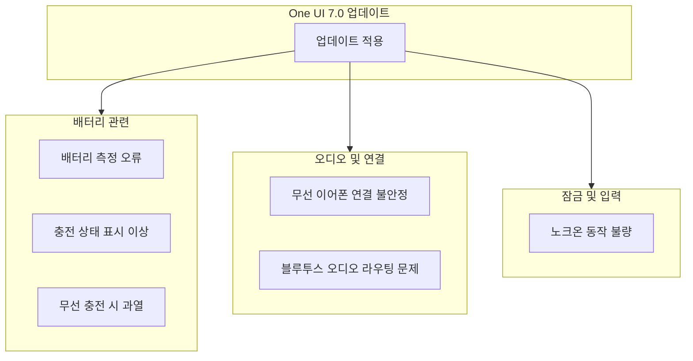
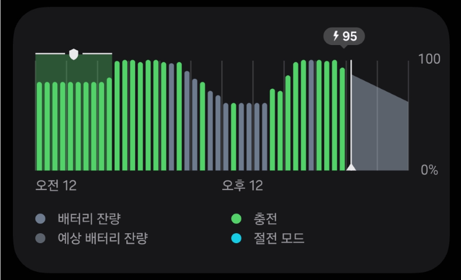
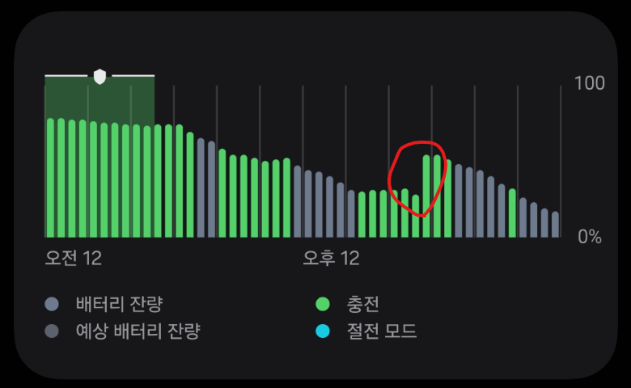
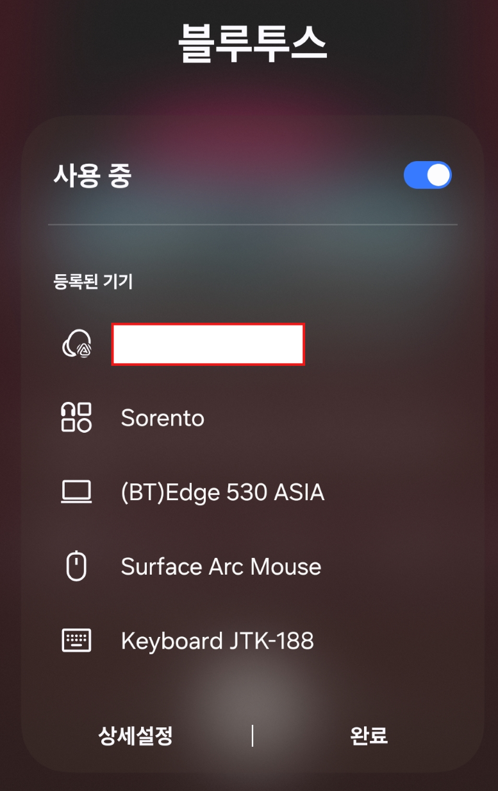
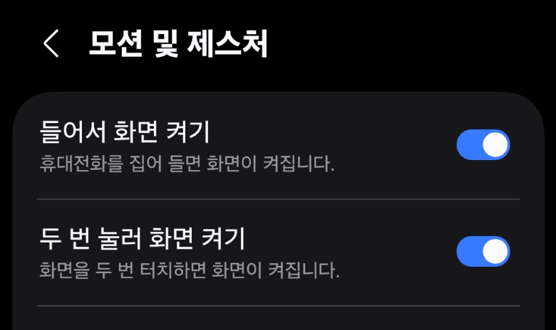

## 개요

본문은 **Samsung Galaxy Z Fold 6**에 **One UI 7.0**을 적용한 뒤 실제 사용 중 발견한 버그들을 정리한 리포트다. 제품 정보, 추천 대상, 버그 분류 구조, 상세 증상, 재현 조건, 임시 대응, 종합 평가, 참고 문헌까지 포함해 재현과 보고에 활용할 수 있도록 구성했다.

### 제품 및 소프트웨어 정보

| 항목 | 내용 |
|------|------|
| 기기 | Samsung Galaxy Z Fold 6 |
| OS | Android (One UI 7.0) |
| 업데이트 수신일 | 2025년 5월 19일 |

### 이 글을 추천하는 대상

- 갤럭시 Z Fold 6에 One UI 7.0을 적용했거나 적용 예정인 사용자
- 동일·유사 증상을 겪고 원인 파악이나 임시 대응이 필요한 사용자
- 버그 리포트 작성·수집에 관심 있는 기술 블로거·QA·지원 담당자

---

## 버전 및 환경 정보

||
|:---:|
|소프트웨어 업데이트 화면 (One UI 7.0)|

Z Fold 6 기준 2025년 5월 19일 배포분 **One UI 7.0**을 적용한 환경에서 아래 증상들을 확인했다.

---

## 버그 분류 구조

One UI 7.0 적용 후 관찰된 이슈를 영역별로 나누면 아래와 같다. Mermaid 다이어그램으로 분류 구조를 요약했다.

```mermaid
flowchart TB
    subgraph oneUi7["One UI 7.0 업데이트"]
        Update["업데이트 적용"]
    end
    subgraph batteryGroup["배터리 관련"]
        BatteryMeasure["배터리 측정 오류"]
        ChargingDisplay["충전 상태 표시 이상"]
        WirelessOverheat["무선 충전 시 과열"]
    end
    subgraph audioGroup["오디오 및 연결"]
        EarbudsConnect["무선 이어폰 연결 불안정"]
        AudioRouting["블루투스 오디오 라우팅 문제"]
    end
    subgraph lockGroup["잠금 및 입력"]
        KnockOn["노크온 동작 불량"]
    end
    Update --> batteryGroup
    Update --> audioGroup
    Update --> lockGroup
```

---

## 문제 증상 상세

### 배터리 관련

#### 1. 배터리 측정이 정확하지 않음

|||
|:---:|:---:|
|정상 상황|비정상 상황 (급상승 구간)|

상단 우측 배터리 아이콘 수치가 실제 체감과 다르게 느껴졌고, 충전 이력을 보면 **충전량이 짧은 시간에 급격히 상승한 구간**이 반복적으로 기록되어 있었다. 측정/보정 로직 이상 가능성을 의심할 수준이다.

#### 2. 충전 중 표시 이상

충전기를 연결하지 않았는데도 **상태바 또는 설정 화면에 "충전 중"으로 표시**되는 경우가 있다. 재연속성은 환경에 따라 다르나, 사용 중 여러 번 목격했다.

#### 3. 수면 중 배터리 보호 + 무선 충전 시 과열

업데이트 전에는 무선 충전과 수면 중 배터리 보호를 함께 사용해도 큰 문제가 없었으나, **One UI 7.0 적용 후**에는 수면 모드에서 무선 충전 시 **충전이 거의 되지 않거나 중단되고 기기가 과열**되는 현상이 발생했다. 재부팅 후에도 동일 조건에서 재현될 수 있다.

---

### 무선 이어폰 관련

#### 1. 연결되지 않음 (연결 UI 불일치)

||
|:---:|
|이어폰 연결 실패 시 UI 예시|

무선 이어폰을 착용한 뒤 **연결 완료 효과음**은 들렸지만, **폰 화면에서는 "연결됨"으로 표시되지 않는** 경우가 있다. 설정에서 수동으로 연결을 시도해도 유지되지 않았고, **기기 재부팅 후에야 정상 연결**되는 경험이 반복되었다.

#### 2. 연결된 상태에서 스피커로 소리 출력 (오디오 라우팅 오류)

무선 이어폰으로 음악을 듣다가 **전화 수신 후 이어폰에서 수화**했는데, 전화 앱에는 블루투스 아이콘이 활성화되어 있음에도 **실제 음성은 기기 스피커**로만 출력되었다. 블루투스 오디오 라우팅이 전화 통화 시점에 잘못 선택되는 버그로 보인다.

---

### 잠금 해제 관련

#### 1. 노크온(두 번 눌러 화면 켜기) 동작 불량

||
|:---:|
|노크온 설정 화면|

**"두 번 눌러 화면 켜기"**가 켜져 있어도, 특정 시점 이후에는 **노크온이 전혀 동작하지 않는다**. 재부팅하기 전까지는 복구되지 않으며, 설정을 껐다 켜도 해결되지 않았다.

---

## 재현 조건 및 임시 대응

| 증상 | 재현 조건 (관찰된 경우) | 임시 대응 |
|------|------------------------|-----------|
| 배터리 측정 오류 | 일상 사용·충전 후 시간 경과 | 주기적 재부팅, 배터리 통계 확인 |
| 충전 중 표시 이상 | 불규칙 | 화면 꺼두기·재부팅 후 재확인 |
| 무선 충전 과열 | 수면 모드 + 무선 충전 | 유선 충전 사용, 수면 시 무선 충전 비사용 |
| 이어폰 미연결 | 블루투스 켜진 상태에서 이어폰 착용 | 기기 재부팅 후 재연결 |
| 스피커로 소리 | 이어폰 연결 상태에서 전화 수신·수화 | 통화 후 블루투스 재연결 또는 재부팅 |
| 노크온 무반응 | 사용 중 특정 시점 이후 | 기기 재부팅 |

---

## 종합 평가

### 장점

- One UI 7.0과 Z Fold 6 조합은 폴더블 UX와 멀티태스킹 측면에서 여전히 강점이 있다.
- 삼성 공식 소프트웨어 업데이트 채널을 통해 패치 가능성이 있어, 사용자 리포트가 누적되면 개선이 기대된다.

### 단점

- **배터리·충전·블루투스·잠금 화면** 등 일상에서 자주 쓰는 기능에서 버그가 겹쳐, 신뢰성과 사용성에 직접 영향을 준다.
- 특히 전화 수화 시 오디오 라우팅 오류, 노크온 무반응은 **기본 기능의 안정성**을 해치는 수준이다.

### 한 줄 평

One UI 7.0은 기능적으로 매력적이나, Z Fold 6 환경에서 배터리·오디오·잠금 관련 버그가 눈에 띄어, 패치 전까지는 위 재현 조건을 피하고 임시 대응을 적용해 사용하는 것을 권한다.

---

## 참고 문헌

1. [One UI | Samsung US](https://www.samsung.com/us/apps/one-ui/) — 삼성 One UI 소개 및 기능 안내
2. [One UI Design Guidelines | Samsung Developer](https://developer.samsung.com/one-ui) — One UI 디자인 가이드라인 및 폴더블·대형 화면 가이드
3. [Galaxy Z Fold6 | Samsung Global](https://www.samsung.com/global/galaxy/galaxy-z-fold6/) — 갤럭시 Z Fold 6 제품 정보

---

삼성 One UI는 갤럭시 사용자 경험의 핵심이며, Z Fold 시리즈는 폴더블 장치로서 차별화된 가치를 제공한다. 다만 이번 One UI 7.0에서 관찰된 버그들은 일상 사용에 직접 영향을 주므로, 삼성 측의 신속한 인지와 패치를 기대한다. 사용자에게 필요한 것은 기능의 존재만이 아니라 **안정적이고 예측 가능한 동작**이다. 이번 버그들이 빠르게 수정되어 갤럭시 제품의 품질과 신뢰성이 다시 한 번 입증되기를 바란다.
