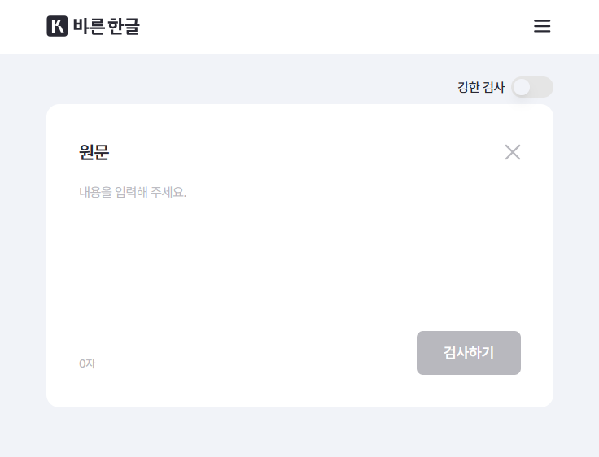
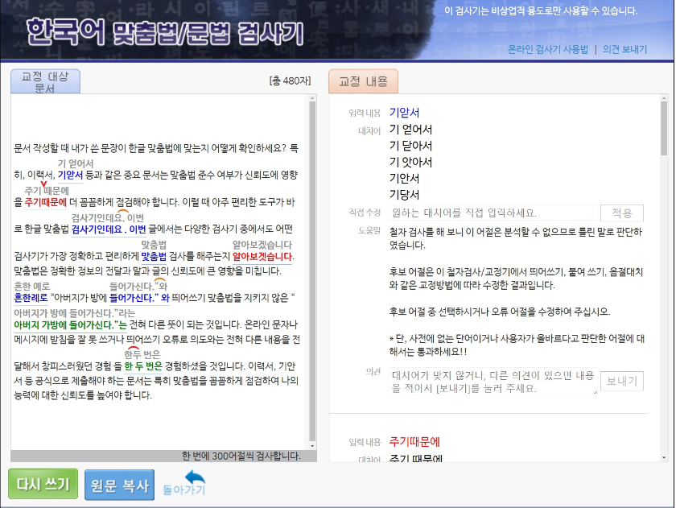

2025년 5월, 나라맞춤법검사기([https://nara-speller.co.kr/speller)](https://nara-speller.co.kr/speller)가 전면 리뉴얼되었다. 이번 업데이트는 디자인부터 기능까지 전반적인 개선을 목표로 하여, 사용자 편의성과 검사 정확도를 모두 높이는 데 중점을 두었다.

||
|:---:|
|신규 UI 모습|

## 반응형 인터페이스 개선

리뉴얼된 검사기는 반응형 UI로 전환되었다. 이로 인해 PC 환경뿐만 아니라 스마트폰이나 태블릿에서도 최적화된 화면 구성을 제공한다. 화면 상단의 복잡한 메뉴를 최소화하고, 텍스트 입력창과 검사 버튼을 눈에 잘 띄는 위치에 배치함으로써 처음 방문하는 사용자라도 별도의 학습 없이 바로 검사를 수행할 수 있도록 개선되었다.

||
|:---:|
|이전 UI 모습|

## 검사 성능 및 용량 향상

검사 속도와 처리 용량도 크게 향상되었다. 이전에는 최대 약 3,000자 정도의 텍스트만 오류 없이 검사할 수 있었으나, 이번 업데이트로 한 번에 최대 5,000자까지 입력해도 원활하게 검사 결과를 제공할 수 있게 변경되었다. 또한 서버 구조와 내부 알고리즘이 재정비되어 대용량 문서를 처리하는 데 걸리는 시간이 단축되었으며, 사용자 요청이 몰릴 때도 안정적으로 응답할 수 있는 처리 능력을 확보하였다. 그 결과 블로거나 직장인 등 긴 글을 자주 다루는 사용자도 이전보다 빠르고 정확하게 검사 결과를 확인할 수 있게 되었다.

## 교정 결과 정확도 강화

맞춤법·문법 교정 기능 역시 한층 강화되었다. 문장 단위 문맥 분석 기능이 보완되어 단순 오타뿐만 아니라 문맥상 어색한 표현도 함께 감지할 수 있게 되었다. 아울러 최근 사용 빈도가 높아진 신조어와 외래어를 반영하기 위해 예외 처리 규칙집을 확장하였다. 이로 인해 최신 맞춤법 규정뿐만 아니라 실제 언론 및 출판 현장에서 자주 쓰이는 표현까지 함께 고려하여 교정 결과를 제공한다.

## 도움말 및 가이드 확충

사용자를 위한 도움말과 가이드 페이지도 새롭게 추가되었다. 검사기 사용 방법과 자주 묻는 질문을 정리한 가이드 페이지([https://nara-speller.co.kr/guide)](https://nara-speller.co.kr/guide)를 통해 초보자도 기능을 손쉽게 이해하고 활용할 수 있도록 하였다. 검사 결과 화면에서는 특정 교정 항목 위에 마우스를 올리면 해당 오류가 발생한 이유를 간략히 설명해 주는 팝업 도움말 기능이 추가되어, 조치 근거를 더욱 명확히 파악할 수 있도록 지원한다.

## 향후 계획

이번 리뉴얼을 통해 나라맞춤법검사기는 단순한 교정 도구를 넘어 문장 전체의 가독성과 자연스러운 표현까지 고민하는 ‘실용적인 교정 플랫폼’으로 거듭났다. 앞으로도 지속적인 기능 보강과 최적화를 통해 더욱 편리하고 정확한 글쓰기 환경을 제공할 계획이다.

## 참고자료

* https://nara-speller.co.kr/speller
* https://channelpnu.pusan.ac.kr/news/articleView.html?idxno=37377
* https://www.seoul.co.kr/news/peoples/2024/03/05/20240305020003&wlog_tag3=naver