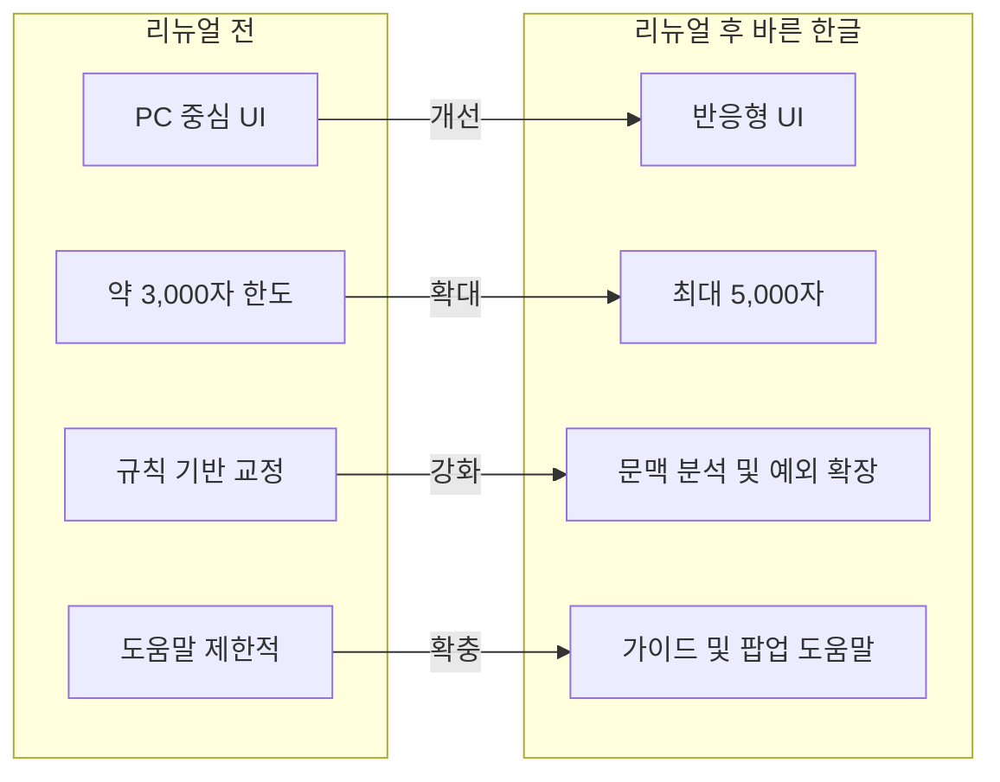
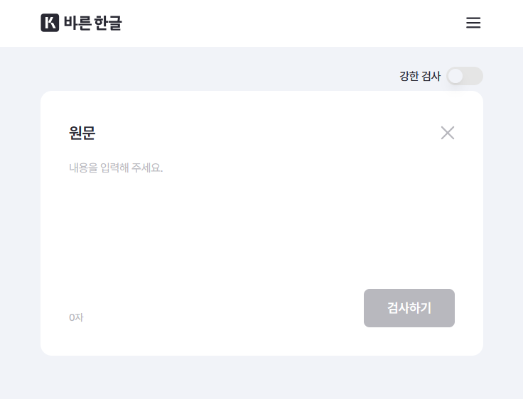
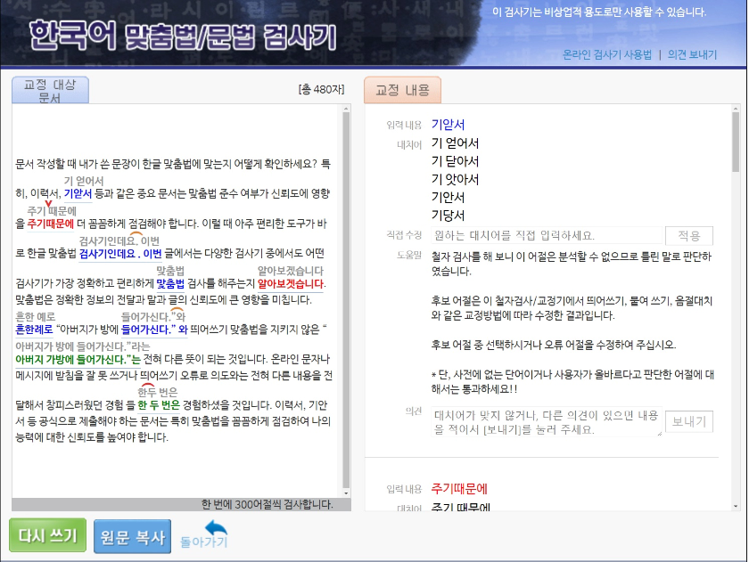

## 개요

2025년 5월, **나라맞춤법검사기**가 24년 만에 **바른 한글**이라는 이름으로 전면 리뉴얼되었다. 부산대학교 인공지능연구실과 ㈜나라인포테크가 공동 운영하는 이 서비스는 1994년 출시 이후 국민 맞춤법 검사기로 자리 잡았으며, 이번 개편으로 디자인·기능·성능 전반이 개선되었다.

### 서비스 정보

| 항목 | 내용 |
|------|------|
| **서비스명** | 바른 한글 (구 한국어 맞춤법·문법 검사기) |
| **제공** | 부산대학교 인공지능연구실, ㈜나라인포테크 |
| **URL** | [https://nara-speller.co.kr/speller](https://nara-speller.co.kr/speller) |
| **가이드** | [https://nara-speller.co.kr/guide](https://nara-speller.co.kr/guide) |
| **검사 한도** | 한 번에 최대 약 5,000자 (리뉴얼 후) |
| **비용** | 개인 사용자 무료 (기업·기관용 유료 라이선스 별도) |

### 추천 대상

- 블로그·에세이·보고서 등 **긴 글을 쓰는 작성자**
- **취업준비생·대학생** (자기소개서, 과제 문법 점검)
- **편집·출판·콘텐츠 담당자** (맞춤법·문법 일차 검수)
- **모바일·태블릿**에서 글을 쓰는 사용자
- **신조어·외래어**가 많은 텍스트를 다루는 사용자

---

## 리뉴얼 구조와 흐름

리뉴얼은 접근성·용량·정확도·이해도 네 가지 축을 중심으로 진행되었다. 아래 다이어그램은 기존 서비스에서 바른 한글으로 전환될 때 강화된 영역을 요약한다.

```mermaid
flowchart LR
  subgraph BeforeRenewal["리뉴얼 전"]
    A1["PC 중심 UI"]
    A2["약 3,000자 한도"]
    A3["규칙 기반 교정"]
    A4["도움말 제한적"]
  end
  subgraph AfterRenewal["리뉴얼 후 바른 한글"]
    B1["반응형 UI"]
    B2["최대 5,000자"]
    B3["문맥 분석 및 예외 확장"]
    B4["가이드 및 팝업 도움말"]
  end
  A1 -->|"개선"| B1
  A2 -->|"확대"| B2
  A3 -->|"강화"| B3
  A4 -->|"확충"| B4
```

---

## 반응형 인터페이스 개선

리뉴얼된 검사기는 **반응형 UI**로 전환되었다. PC뿐 아니라 스마트폰·태블릿에서도 최적화된 화면을 제공한다. 상단 메뉴를 정리하고, 텍스트 입력창과 검사 버튼을 눈에 띄게 배치해 **첫 방문자도 별도 학습 없이** 검사를 실행할 수 있도록 했다.

| 신규 UI | 이전 UI |
|:---:|:---:|
|  |  |

기존 시스템은 모바일 사용이 불편하고 화면 자동 조정이 부족해 활용에 제약이 있었다. 개편 후에는 다양한 기기에서 **분량 제한 없이** 텍스트를 입력하고, **상세한 교정 결과**를 빠르게 확인할 수 있다.

---

## 검사 성능 및 용량 향상

검사 **속도**와 **처리 용량**이 크게 향상되었다.

- **이전**: 한 번에 최대 약 3,000자 수준에서 안정적 검사
- **이후**: 한 번에 **최대 5,000자**까지 입력 가능, 원활한 검사 결과 제공

서버 구조와 내부 알고리즘이 재정비되어 대용량 문서 처리 시간이 줄었고, 접속이 몰려도 **안정적인 응답**을 목표로 했다. 블로거나 직장인처럼 긴 글을 자주 다루는 사용자에게 특히 유리하다.

---

## 교정 결과 정확도 강화

맞춤법·문법 **교정 품질**이 한층 강화되었다.

- **문장 단위 문맥 분석** 보완: 단순 오타를 넘어 문맥상 어색한 표현까지 감지
- **신조어·외래어** 반영: 예외 처리 규칙집 확장으로 최신 맞춤법과 언론·출판 현장 표현 반영
- **7만 여 개 규칙** 기반 검사: 생성형 AI보다 **오탈자·맞춤법 규칙 위반**을 정확히 짚어 내는 데 강점이 있다는 평가가 있다.

따라서 **자기소개서·과제** 등 정확한 문면이 중요한 문서의 1차 검수 도구로 적합하다.

---

## 도움말 및 가이드 확충

사용자를 위한 **도움말·가이드**가 새로 보강되었다.

- **사용법·FAQ**: [바른 한글 사용법](https://nara-speller.co.kr/guide) 페이지에서 검사기 활용 방법과 자주 묻는 질문을 확인할 수 있다.
- **검사 결과 화면**: 특정 교정 항목에 마우스를 올리면 해당 오류가 발생한 **이유를 간략히 설명**하는 팝업 도움말이 표시되어, 조치 근거를 파악하기 쉬워졌다.
- **사용자 피드백**: 검사 결과창 하단의 **오류 제보 기능**으로 잘못된 교정·미검출 오류를 제보할 수 있으며, 제보가 실제 시스템 개선에 반영되는 사례가 있다.

---

## 향후 계획

바른 한글은 단순 교정 도구를 넘어 **문장 가독성과 자연스러운 표현**까지 고려하는 실용적 교정 플랫폼으로 자리 매김하는 것을 목표로 한다. 지속적인 기능 보강과 최적화를 통해 더 편리하고 정확한 글쓰기 환경을 제공할 예정이며, **맞춤법 규칙 기반 검사와 생성형 AI의 장점을 접목**하는 방향에 대한 관심도 개발 측에서 밝혀 왔다. 한편 **개인 사용자에 대한 무료 제공**은 계속 유지할 계획이다.

---

## 종합 평가

### 장점

- **반응형 UI**로 PC·모바일·태블릿 모두에서 사용하기 편함
- **5,000자**까지 한 번에 검사 가능해 긴 글 작성자에게 유리
- **문맥 분석·신조어·외래어** 반영으로 교정 정확도와 현장 적합도 향상
- **오류 제보·가이드·팝업 도움말**로 사용자 참여와 이해도 증대
- **개인 무료** 서비스 유지로 접근성 확보

### 단점 및 한계

- 광고가 성능에 일부 영향을 줄 수 있으나, 무료 서비스 유지를 위해 운영 측에서 불가피하다고 설명한 바 있음
- 기능 확대에 따라 특정 상황에서의 처리 속도 등 보완 여지는 계속 모니터링될 필요가 있음

### 한 줄 평

24년 만의 전면 리뉴얼을 통해 **바른 한글**은 국민 맞춤법 검사기의 접근성·용량·정확도·이해도를 골고루 끌어올린, 실무와 학습 모두에 쓸 만한 무료 교정 플랫폼이다.

---

## 참고 문헌

1. **바른 한글 맞춤법·문법 검사기 (공식)**  
   [https://nara-speller.co.kr/speller](https://nara-speller.co.kr/speller)

2. **채널PNU — 부산대 맞춤법 검사기, 24년 만에 '바른 한글'로 새단장**  
   [https://channelpnu.pusan.ac.kr/news/articleView.html?idxno=37377](https://channelpnu.pusan.ac.kr/news/articleView.html?idxno=37377)

3. **서울신문 — "퇴직해도 '맞춤법 검사기'는 계속 무료 서비스"**  
   [https://www.seoul.co.kr/news/peoples/2024/03/05/20240305020003](https://www.seoul.co.kr/news/peoples/2024/03/05/20240305020003)
