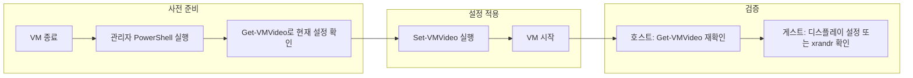

## 개요

Hyper-V의 **기본 세션(Basic Session)** 은 RDP가 아닌 가상화된 콘솔로 연결되며, 기본 제공 해상도(최대 1920×1080)를 넘기 어렵다. **향상된 세션(Enhanced Session)** 을 쓰면 RDP 기반으로 해상도와 디바이스 리디렉션을 자유롭게 조절할 수 있지만, 은행·금융 사이트 등 보안이 중요한 환경에서는 향상된 세션 사용이 제한되는 경우가 많다. 이때 호스트에서 PowerShell의 `Set-VMVideo`·`Get-VMVideo` cmdlet으로 VM 비디오 설정을 직접 바꾸면, 기본 세션에서도 더 높은 해상도를 사용할 수 있다.

**이 포스트에서 다루는 내용**

- 기본 세션과 향상된 세션의 차이, 해상도 제한이 생기는 이유
- `Get-VMVideo`·`Set-VMVideo` 개요와 **ResolutionType**(Single / Maximum / Default) 옵션 설명
- VM 전원 상태·사전 준비·실행 단계·적용 확인
- Windows·Linux 게스트별 확인 방법 및 주의사항(Gen1/Gen2, Linux hyperv_fb 한계)
- 문제 발생 시 점검 항목과 대응 방법

**추천 대상**: Hyper-V로 Windows·Linux VM을 쓰면서 기본 세션에서 고해상도가 필요한 사용자, 은행·전용 앱 때문에 향상된 세션을 쓰지 못하는 환경에서 해상도를 높이고 싶은 관리자.

---

## 기본 세션과 해상도 제한

Hyper-V 연결 방식에는 **기본 세션**과 **향상된 세션**이 있다.

| 구분 | 기본 세션 | 향상된 세션 |
|------|-----------|-------------|
| 프로토콜 | VM 콘솔(가상 비디오 어댑터) | RDP |
| 해상도 | VM 비디오 설정에 종속(기본 최대 1920×1080 수준) | RDP 클라이언트에서 선택·동적 조절 가능 |
| 클립보드·프린터 등 | 미지원 | 지원 |
| 보안 정책 | 일부 금융·은행 사이트에서 허용 | 일부 환경에서 차단 |

따라서 **향상된 세션을 쓸 수 없는 경우**에는, VM의 비디오 설정 자체를 올려야 기본 세션에서 고해상도를 쓸 수 있다. 이 설정을 PowerShell로 하는 것이 이 가이드의 목표다.

---

## Hyper-V 비디오 어댑터 이해

Hyper-V는 호스트에 **Synthetic Video Adapter**를 에뮬레이션해 게스트 OS에 가상 비디오 어댑터를 제공한다. 기본 세션에서는 이 어댑터가 제공하는 해상도 목록 중 하나만 선택 가능하고, 연결 후 동적 리사이즈는 지원되지 않는다.

- **Gen2 VM**: 합성 비디오 메모리(VRAM)가 충분해 더 높은 해상도(예: 2560×1440, 3840×2160) 지원에 유리하다.
- **Gen1 VM**: VRAM 제한으로 최대 해상도가 낮아질 수 있으며, Linux 게스트의 `hyperv_fb` 드라이버는 64MB 등 제한이 있어 특정 고해상도가 적용되지 않을 수 있다.

해상도를 바꾸려면 **VM이 종료(Off)된 상태**에서 호스트의 `Set-VMVideo`를 실행해야 한다.

---

## Set-VMVideo·Get-VMVideo 개요

### Get-VMVideo: 현재 비디오 설정 조회

지정한 VM의 비디오 설정(해상도, ResolutionType 등)을 보려면 호스트 PowerShell에서 다음을 실행한다.

```powershell
PS> Get-VMVideo -VMName "VM01"
```

출력에는 `ResolutionType`, `HorizontalResolution`, `VerticalResolution` 등이 포함된다.

### Set-VMVideo: 해상도 설정 변경

VM의 비디오 해상도를 변경할 때 사용한다. 예: VM01을 2560×1440을 **최대 해상도**로 허용하도록 설정.

```powershell
PS> Set-VMVideo -VMName "VM01" -HorizontalResolution 2560 -VerticalResolution 1440 -ResolutionType Maximum
```

`-ResolutionType`을 생략하면 **Default**가 적용되어, 입력한 해상도 값이 무시될 수 있으므로, 원하는 동작에 맞게 **Single** 또는 **Maximum**을 명시하는 것이 좋다.

---

## ResolutionType 옵션 설명

`Set-VMVideo`의 `-ResolutionType`은 “지정한 해상도를 어떻게 해석할지”를 정한다.

| 값 | 의미 | 사용 시점 |
|----|------|-----------|
| **Single** | 지정한 해상도 **단일 고정**. 해당 해상도만 지원한다. | 한 가지 해상도만 쓰고 싶을 때(예: 1920×1080만 사용). |
| **Maximum** | 지정한 해상도를 **최대**로 두고, 그 이하 표준 해상도는 모두 허용. | 4K까지 허용하되, 필요 시 더 낮은 해상도도 선택 가능하게 할 때. |
| **Default** | Microsoft 표준 해상도 목록만 사용. **HorizontalResolution·VerticalResolution 값은 무시**된다. | 특별한 요구가 없을 때(실무에서는 Single/Maximum 사용을 권장). |

- **Single**: “이 해상도만 쓴다”가 명확할 때.
- **Maximum**: 호스트·모니터에 맞춰 여유 있게 상한만 올리고, 게스트에서 여러 해상도 중 선택하게 할 때.

---

## 해상도 설정 작업 흐름

아래 순서는 VM 해상도를 안전하게 변경하고 검증하는 흐름이다.



- **사전 준비**: VM 완전 종료 후, 관리자 권한 PowerShell에서 현재 비디오 설정 확인.
- **설정 적용**: `Set-VMVideo`로 해상도·ResolutionType 지정 후 VM 시작.
- **검증**: 호스트에서 `Get-VMVideo`, 게스트에서 OS별 방법으로 해상도 확인.

---

## VM 전원 상태 및 사전 준비

`Set-VMVideo`는 **VM이 종료(Off)된 상태**에서만 적용된다. 실행 중인 VM에 대해 호출하면 오류가 나거나 변경이 반영되지 않는다.

1. **VM 종료**: Hyper-V 관리자 또는 `Stop-VM`으로 대상 VM을 완전히 종료한다.
2. **관리자 PowerShell**: 호스트에서 **관리자 권한**으로 PowerShell을 연다.
3. **현재 설정 확인**: `Get-VMVideo -VMName "<VM이름>"`으로 해상도·ResolutionType을 기록해 둔다.
4. **호스트·게스트 제약 고려**: 호스트 모니터·그래픽이 지원하는 범위를 넘는 해상도는 설정하지 않는다. 게스트에는 Hyper-V 통합 서비스(Windows) 또는 Linux의 `hyperv_fb`·게스트 도구가 제대로 설치되어 있어야 고해상도가 올바르게 표시된다.

---

## 해상도 설정 실행 단계

### 1. VM 종료

Hyper-V 관리자에서 해당 VM을 Shutdown(또는 PowerShell `Stop-VM`)한다.

### 2. 현재 설정 확인

호스트 PowerShell에서:

```powershell
PS> Get-VMVideo -VMName "VM01"
```

현재 `HorizontalResolution`, `VerticalResolution`, `ResolutionType`을 확인한다.

### 3. Set-VMVideo로 해상도 설정

예: 최대 2560×1440까지 허용.

```powershell
PS> Set-VMVideo -VMName "VM01" -HorizontalResolution 2560 -VerticalResolution 1440 -ResolutionType Maximum
```

고정 해상도만 쓰려면 `-ResolutionType Single`을 사용한다.

### 4. VM 시작 및 적용 확인

VM을 시작한 뒤 다음으로 검증한다.

- **호스트**: `Get-VMVideo -VMName "VM01"` 또는 `Set-VMVideo ... -Passthru`로 변경 결과 확인.
- **Windows 게스트**: 설정 > 시스템 > 디스플레이에서 해상도 확인. 필요 시 `dxdiag` 또는 디스플레이 설정 화면 사용.
- **Linux 게스트**: `xrandr` 또는 해당 배포판의 디스플레이 설정으로 확인.

PowerShell로 숫자만 빠르게 보려면:

```powershell
PS> (Get-VMVideo -VMName "VM01").HorizontalResolution
PS> (Get-VMVideo -VMName "VM01").VerticalResolution
```

설정한 값(예: 2560, 1440)과 일치하면 적용된 것이다.

---

## 실행 전후 상태 확인

**호스트**에서 변경 전후를 비교할 수 있다.

```powershell
# 실행 전
PS> Get-VMVideo -VMName "VM01"
# HorizontalResolution : 1024
# VerticalResolution   : 768
# ResolutionType       : Default

# Set-VMVideo 실행 (위 참조)
PS> Set-VMVideo -VMName "VM01" -HorizontalResolution 2560 -VerticalResolution 1440 -ResolutionType Maximum

# 실행 후
PS> Get-VMVideo -VMName "VM01"
# HorizontalResolution : 2560
# VerticalResolution   : 1440
# ResolutionType       : Maximum
```

`Set-VMVideo`에 `-Passthru`를 붙이면 변경된 VMVideo 객체가 바로 반환되어, 한 줄로 설정과 출력을 함께 확인할 수 있다.

**게스트**에서는 Windows는 디스플레이 설정·dxdiag, Linux는 `xrandr` 등으로 실제 출력 해상도를 확인한다.

---

## 주의사항 및 한계

- **실시간 동적 리사이즈**: Linux의 기본 `hyperv_fb` 드라이버는 실행 중 해상도 변경을 지원하지 않는다. 해상도를 바꾸려면 VM 재시작이 필요하다.
- **Integration Services**: Windows 게스트는 통합 서비스를 최신으로 유지하는 것이 좋다. Linux 게스트는 `linux-vm-tools`(xRDP 등) 설치 후 향상된 세션 모드를 고려할 수 있다.
- **Gen1 vs Gen2**: Gen1 VM은 VRAM 제한으로 일부 고해상도가 적용되지 않을 수 있다. 가능하면 Gen2 VM을 사용하는 것이 유리하다.
- **다중 모니터**: 기본 세션은 다중 디스플레이를 지원하지 않으며, 단일 모니터 기준으로 설정을 검증하는 것이 안전하다.

---

## 문제 발생 시 대응 방법

설정 후에도 해상도가 바뀌지 않거나 오류가 나면 아래를 순서대로 점검한다.

| 점검 항목 | 내용 |
|-----------|------|
| **VM 전원** | VM이 완전히 종료된 상태에서만 `Set-VMVideo`가 적용된다. |
| **권한** | PowerShell을 **관리자 권한**으로 실행했는지, Hyper-V 관리 권한이 있는지 확인한다. |
| **해상도 값** | 호스트·게스트가 지원하는 범위를 벗어나지 않는지 확인한다. 지나치게 높으면 출력이 나오지 않을 수 있다. |
| **ResolutionType** | `Default`면 입력값이 무시되므로, 원하는 동작에 맞게 **Single** 또는 **Maximum**을 지정한다. |
| **게스트 드라이버** | Windows·Linux 모두 Hyper-V 통합 서비스·드라이버가 최신인지 확인한다. Linux는 `hyperv_fb` 관련 커널 모듈 로드 여부를 확인한다. |
| **재시도** | VM을 완전 종료한 뒤 다시 시도하거나, 필요 시 호스트 재부팅 후 재적용해 본다. |

원하는 해상도를 기본 세션으로 얻기 어렵다면, **향상된 세션** 또는 **RDP**로 접속해 자동 리사이징을 쓰는 방법도 있다. 단, 보안 정책상 허용되는 경우에만 사용한다.

---

## 결론

PowerShell의 `Set-VMVideo`·`Get-VMVideo`를 사용하면 **향상된 세션을 쓸 수 없는 환경**에서도 기본 세션의 해상도 상한을 넘어설 수 있다. VM을 종료한 뒤 적용하고, `ResolutionType`을 Single 또는 Maximum으로 명시하면 원하는 해상도 동작을 얻기 쉽다. Gen2 VM과 최신 통합 서비스·드라이버를 함께 사용하면 Windows·Linux 게스트 모두에서 고해상도 활용이 수월해진다.

---

## 참고 문헌

- [Set-VMVideo (Hyper-V) - Microsoft Learn](https://learn.microsoft.com/en-us/powershell/module/hyper-v/set-vmvideo?view=windowsserver2025-ps)
- [Get-VMVideo (Hyper-V) - Microsoft Learn](https://learn.microsoft.com/en-us/powershell/module/hyper-v/get-vmvideo?view=windowsserver2025-ps)
- [Limitations of the video driver (hyperv_fb.c) in Linux Integration Services - GitHub LIS/lis-next #318](https://github.com/LIS/lis-next/issues/318)
- [How to get the right Hyper-V window size in Windows 11 - TechTarget](https://www.techtarget.com/searchvirtualdesktop/tutorial/How-to-get-the-right-Hyper-V-window-size-in-Windows-11)
