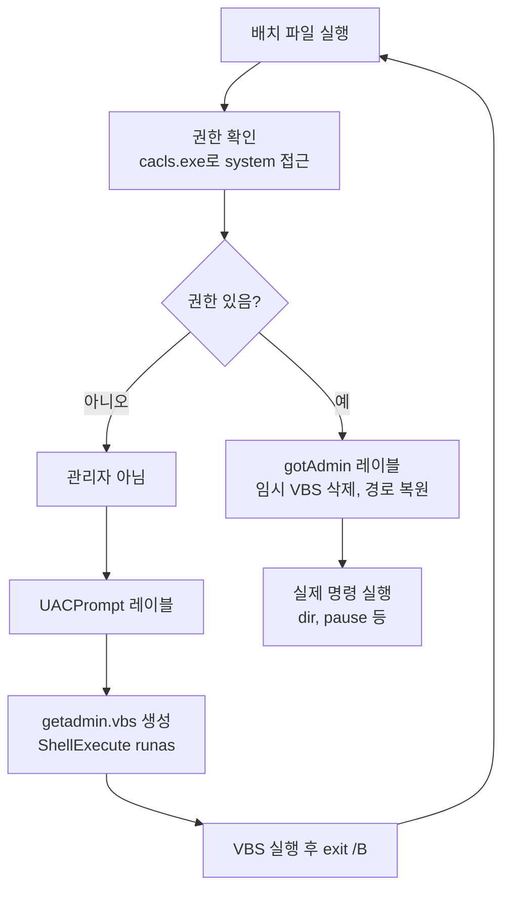

## 개요

**BatchGotAdmin**은 Windows CMD 배치 파일(.bat)이 실행 시 **관리자 권한(Administrator Privilege)** 이 없으면 UAC(User Account Control) 팝업을 띄워 사용자 승인 후 같은 스크립트를 관리자 권한으로 재실행하도록 하는 패턴입니다. 시스템 폴더 수정, 레지스트리 변경, 서비스 제어 등 고권한 작업을 배치로 자동화할 때 그대로 붙여 넣어 사용할 수 있습니다.

| 항목 | 내용 |
|------|------|
| **역할** | 배치 파일에서 관리자 권한 자동 요청(UAC 승인 후 상승 실행) |
| **지원 환경** | Windows Vista 이후, **CMD**(명령 프롬프트). PowerShell에서는 `Start-Process -Verb RunAs` 등 별도 방식 사용 |
| **대상 독자** | 배치 스크립트 작성자, 시스템 관리자, 배포·설정 자동화 담당자 |

Windows Vista부터 도입된 UAC는 고권한 작업 전에 사용자 동의를 받아 악성 코드의 무단 상승을 막습니다. 이 스크립트는 그 UAC를 **배치 안에서** 정식으로 한 번 호출해, 이후 코드가 모두 관리자 권한으로 실행되게 합니다.


## 사용법

1. 아래 **전체 스크립트**를 배치 파일 상단에 그대로 붙여 넣습니다.
2. `:gotAdmin` 레이블 아래, `dir`·`pause` 자리에 **실제로 실행할 관리자 권한 명령**을 넣습니다.
3. 파일을 `.bat`로 저장한 뒤 더블 클릭하거나, 다른 스크립트/작업 스케줄러에서 호출합니다.  
   → 권한이 없으면 UAC 창이 뜨고, "예" 선택 시 같은 배치가 관리자로 다시 실행됩니다.

**기본 문법(템플릿):** 스크립트 블록은 순서를 바꾸지 않고, 본인 명령만 `:gotAdmin` 다음에 추가합니다.


## BatchGotAdmin 스크립트 전체 코드

```batch
@REM 관리자 권한을 획득하는 팝업을 보여주는 스크립트
:: BatchGotAdmin
:-------------------------------------
REM  --> Check for permissions
>nul 2>&1 "%SYSTEMROOT%\system32\cacls.exe" "%SYSTEMROOT%\system32\config\system"

REM --> If error flag set, we do not have admin.
if '%errorlevel%' NEQ '0' (
    echo Requesting administrative privileges...
    goto UACPrompt
) else (
    goto gotAdmin
)

:UACPrompt
    echo Set UAC = CreateObject^("Shell.Application"^) > "%temp%\getadmin.vbs"
    echo UAC.ShellExecute "%~s0", "", "", "runas", 1 >> "%temp%\getadmin.vbs"
    "%temp%\getadmin.vbs"
    exit /B

:gotAdmin
    if exist "%temp%\getadmin.vbs" ( del "%temp%\getadmin.vbs" )
    pushd "%CD%"
    CD /D "%~dp0"
:--------------------------------------

@REM "아래쪽에 수행할 명령어를 시작하면 된다."
dir
pause
```


## 동작 흐름 (Mermaid)




## 옵션/매개변수 (스크립트 블록별 역할)

배치 파일에는 별도 옵션 스위치가 없습니다. 대신 **블록 단위**로 동작이 정해져 있으므로, 아래 표를 참고해 수정할 부분만 건드립니다.

| 블록 / 레이블 | 역할 | 비고 |
|---------------|------|------|
| `cacls.exe ... config\system` | 현재 프로세스가 시스템 config에 접근 가능한지 확인 | 권한 없으면 `errorlevel` ≠ 0 |
| `if '%errorlevel%' NEQ '0'` | 권한 없음 → `UACPrompt`, 있음 → `gotAdmin` | 분기만 변경 시 동작 깨질 수 있음 |
| `:UACPrompt` | `%temp%\getadmin.vbs` 생성 후 실행 | `Shell.Application`으로 `%~s0`을 `runas`로 재실행 |
| `exit /B` | 현재 배치 세션만 종료 | VBS가 새 프로세스로 배치를 띄운 뒤 필요 |
| `:gotAdmin` | 임시 VBS 삭제, `pushd`/`CD /D "%~dp0"`로 작업 디렉터리 복원 | 여기 아래에 본인 명령 추가 |
| `%~s0` | 현재 배치 파일의 짧은 경로(8.3 형식) | VBS에서 재실행할 대상 |
| `%~dp0` | 현재 배치 파일이 있는 디렉터리 경로 | 관리자로 재실행 후에도 같은 폴더에서 동작하도록 |

**주요 변수**

* `%SYSTEMROOT%`: Windows 설치 경로(예: `C:\Windows`)
* `%temp%`: 임시 폴더. VBS 생성/삭제에 사용
* `errorlevel`: 직전 명령의 종료 코드. 0이면 성공


## 코드 동작 원리 (상세)

### 1. 권한 확인 (`cacls.exe` 사용)

```batch
>nul 2>&1 "%SYSTEMROOT%\system32\cacls.exe" "%SYSTEMROOT%\system32\config\system"
```

* `cacls.exe`는 파일 ACL(Access Control List)을 조회하는 Windows 명령입니다.
* `config\system`은 보호된 시스템 리소스이므로, 관리자 권한이 없으면 접근 실패 시 `errorlevel`이 0이 아닌 값으로 설정됩니다.
* `>nul 2>&1`로 출력을 숨겨 사용자에게 오류 메시지가 보이지 않게 합니다.

### 2. 관리자 권한 요청 분기

```batch
if '%errorlevel%' NEQ '0' (
    echo Requesting administrative privileges...
    goto UACPrompt
) else (
    goto gotAdmin
)
```

* `errorlevel`이 0이 아니면(권한 없음) `:UACPrompt`로 가서 UAC를 띄웁니다.
* 이미 관리자로 실행 중이면 `:gotAdmin`으로 넘어가 곧바로 본문 명령을 실행합니다.

### 3. UAC 팝업 생성 및 재실행 (VBScript 활용)

```batch
echo Set UAC = CreateObject^("Shell.Application"^) > "%temp%\getadmin.vbs"
echo UAC.ShellExecute "%~s0", "", "", "runas", 1 >> "%temp%\getadmin.vbs"
"%temp%\getadmin.vbs"
exit /B
```

* `Shell.Application`의 `ShellExecute`로 **현재 배치 파일(`%~s0`)** 을 **runas**(관리자로 실행)로 다시 실행합니다.
* 마지막 인자 `1`은 창을 보이게 하는 옵션입니다.
* `exit /B`로 현재 배치만 종료하고, 새로 뜬 관리자 배치가 나머지 작업을 수행합니다.

### 4. 관리자 권한 상태에서의 정리 및 작업 디렉터리

```batch
:gotAdmin
    if exist "%temp%\getadmin.vbs" ( del "%temp%\getadmin.vbs" )
    pushd "%CD%"
    CD /D "%~dp0"
```

* 임시 VBS 파일을 삭제합니다.
* `pushd "%CD%"`와 `CD /D "%~dp0"`로 스크립트가 있는 폴더로 이동해, 이후 명령이 의도한 경로에서 실행되도록 합니다.

### 5. 실제 명령 실행 부분

`:gotAdmin` 블록 바로 아래에, 관리자 권한이 필요한 명령을 넣습니다. 예: `xcopy`, `reg add`, `sc config`, 네트워크 설정, 방화벽 규칙 등.


## 예시

### 예시 1: system32에 드라이버 복사

```batch
:: :gotAdmin 아래에 추가
copy "mydriver.sys" "%SYSTEMROOT%\system32\drivers\mydriver.sys"
sc config mydriver start= demand
pause
```

### 예시 2: 레지스트리 항목 추가

```batch
:: :gotAdmin 아래에 추가
reg add "HKLM\SOFTWARE\MyApp" /v "InstallPath" /t REG_SZ /d "C:\MyApp" /f
pause
```

### 예시 3: 방화벽 규칙 등록

```batch
:: :gotAdmin 아래에 추가
netsh advfirewall firewall add rule name="MyService" dir=in action=allow protocol=TCP localport=9000
pause
```

위와 같이 **BatchGotAdmin 블록 + 본인 명령**만 넣으면, 더블 클릭 시 UAC 한 번 승인 후 모두 관리자 권한으로 실행됩니다.


## 주의사항

* **UAC가 꺼져 있으면** 이 방식으로는 "관리자 권한 요청" 창이 뜨지 않습니다. UAC가 동작하는 환경에서만 의미가 있습니다.
* **`%temp%`** 에 쓰기 권한이 필요합니다. 임시 폴더가 꽉 차거나 권한이 없으면 VBS 생성이 실패할 수 있습니다.
* **보안 솔루션**에 따라 `getadmin.vbs` 같은 임시 스크립트가 차단되거나 경고가 뜰 수 있습니다. 신뢰할 수 있는 환경에서만 사용하고, 불필요한 관리자 상승 요청은 피하는 것이 좋습니다.
* **스크립트 경로**에 **한글·공백**이 많으면 일부 환경에서 VBS 호출이 실패할 수 있습니다. 가능하면 짧은 영문 경로 사용을 권장합니다.


## FAQ

**Q. PowerShell에서도 같은 방식으로 할 수 있나요?**  
A. PowerShell은 `Start-Process -FilePath "powershell.exe" -Verb RunAs -ArgumentList ...` 처럼 `-Verb RunAs`로 상승 실행할 수 있습니다. BatchGotAdmin은 **CMD 배치(.bat)** 전용 패턴입니다.

**Q. UAC 창이 안 뜨고 그냥 끝나요.**  
A. UAC가 비활성화됐거나, `%temp%` 쓰기 실패, VBS 차단 가능성을 확인해 보세요. 관리자 계정으로 이미 로그인한 상태에서 UAC가 "알리지 않음"으로 설정돼 있으면 창이 안 뜰 수 있습니다.

**Q. 다른 배치 파일을 관리자로 실행하려면?**  
A. VBS에서 `%~s0` 대신 그 배치 파일 경로를 넣으면 됩니다. 예: `UAC.ShellExecute "C:\Scripts\Other.bat", "", "", "runas", 1`

**Q. Linux의 sudo와 비슷한가요?**  
A. 동의를 한 번 받아 프로세스를 상승 실행한다는 점에서 비슷합니다. 다만 Windows에서는 사용자가 UAC에서 "예"를 눌러야 하며, 비밀번호를 입력하는 방식은 정책에 따라 다릅니다.


## (선택) 유닉스/리눅스와의 대응

| Windows (이 글) | Linux/Unix |
|-----------------|------------|
| BatchGotAdmin + UAC | `sudo ./script.sh` 또는 `sudo -s` 후 스크립트 실행 |
| 관리자 권한으로 한 번 승인 후 전체 스크립트 상승 | 터미널에서 한 번 sudo 인증 후 명령 실행 |
| `runas` | `sudo`, `su`, `doas` 등 |

Linux에서는 스크립트 상단에 `#!/bin/bash`와 필요한 경우 `sudo`로 특정 명령만 상승시키는 방식이 일반적입니다. Windows는 UAC로 **프로세스 단위** 승인이 이루어지므로, 이 배치 패턴으로 "이 .bat 전체를 관리자로 실행"하게 됩니다.


## 결론

**[CMD]** BatchGotAdmin 패턴을 사용하면 Windows 배치 파일에서 **관리자 권한**을 한 번 요청(UAC)한 뒤, 동일 스크립트를 상승된 권한으로 재실행할 수 있습니다. 지원 환경은 Windows Vista 이후 **CMD**이며, 사용법은 스크립트 상단 고정 블록 유지 + `:gotAdmin` 아래에 본인 명령 추가입니다. 옵션/매개변수는 없고 블록별 역할은 위 표를 참고하면 되며, 실전 예시와 주의사항·FAQ를 적용해 시스템 자동화와 배포 스크립트에 활용할 수 있습니다.
