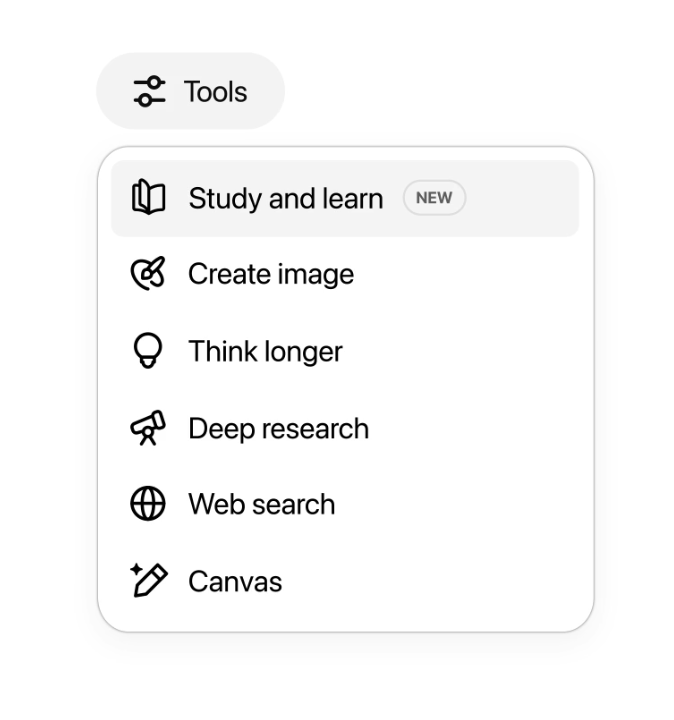

안녕하십니까, 여러분. 오늘은 OpenAI가 최근 출시한 **ChatGPT Study Mode**에 대해 소개하고자 합니다. 이 새로운 기능은 기존의 ChatGPT를 넘어서 학습에 특화된 AI 튜터로서의 역할을 수행하도록 설계되었습니다.

## ChatGPT Study Mode란?

ChatGPT Study Mode는 OpenAI가 교육 분야에 특화하여 개발한 새로운 AI 학습 도구입니다. 기존의 ChatGPT가 일반적인 대화형 AI였다면, Study Mode는 학습 과정에서 학생들이 겪는 어려움을 해결하고, 더 효과적인 학습을 돕기 위해 특별히 설계되었습니다.

### 주요 특징

- **학습 목적 특화:** 일반적인 대화가 아닌 학습 목적에 맞춘 응답 제공
- **단계별 학습 가이드:** 복잡한 개념을 단계별로 분해하여 설명
- **맞춤형 학습 경로:** 개인의 학습 수준과 이해도에 맞는 맞춤형 학습 계획 제시
- **실습 및 연습 문제:** 이론 학습과 함께 실습 문제를 통한 이해도 확인
- **학습 진도 추적:** 학습자의 진도를 파악하고 적절한 피드백 제공

## Study Mode의 핵심 기능

### 적응형 학습 지원

Study Mode는 학습자의 현재 이해 수준을 파악하고, 그에 맞는 적절한 난이도의 설명을 제공합니다. 예를 들어, 수학 문제를 풀 때 단순히 답만 알려주는 것이 아니라, 문제 해결 과정을 단계별로 설명하고, 학습자가 어려워하는 부분을 파악하여 추가 설명을 제공합니다.

### 대화형 학습 경험

기존의 일방향적인 학습 방식과 달리, Study Mode는 대화형 학습을 통해 학습자의 궁금증을 즉시 해결할 수 있습니다. "왜 이렇게 되는 거지?"라는 질문에 대해 즉시 답변을 받을 수 있어, 학습의 연속성을 유지할 수 있습니다.

### 다양한 학습 스타일 지원

시각적 학습자, 청각적 학습자, 읽기/쓰기 학습자 등 다양한 학습 스타일에 맞는 설명 방식을 제공합니다. 필요에 따라 다이어그램, 예시, 비유 등을 활용하여 개념을 명확하게 전달합니다.

## 활용 사례

### 학교 교육

- **수학 학습:** 복잡한 수학 개념을 단계별로 설명하고, 실습 문제를 통한 이해도 확인
- **과학 실험:** 실험 과정과 원리를 설명하고, 가상 실험을 통한 학습 지원
- **언어 학습:** 문법 설명, 어휘 학습, 대화 연습 등을 통한 종합적인 언어 능력 향상

### 자기주도 학습

- **온라인 강의 보조:** 온라인 강의를 들으면서 이해가 안 되는 부분에 대한 즉시 질의응답
- **프로젝트 학습:** 프로젝트 진행 과정에서 필요한 지식과 기술에 대한 안내
- **시험 준비:** 시험 범위에 대한 체계적인 복습과 문제 풀이 지원

### 직업 교육

- **기술 습득:** 프로그래밍, 디자인, 마케팅 등 다양한 직무 기술 학습 지원
- **인증 시험 준비:** 각종 자격증 시험에 대한 체계적인 학습 계획 수립
- **실무 적용:** 이론을 실무에 적용하는 방법에 대한 구체적인 가이드

## 기존 교육 도구와의 차이점

### 전통적인 교육 도구

- **교과서:** 정적인 정보 제공, 개인별 맞춤화 어려움
- **온라인 강의:** 일방향적 전달, 즉시 질의응답 불가능
- **과외:** 높은 비용, 시간과 장소의 제약

### ChatGPT Study Mode

- **적응형 학습:** 개인의 이해도에 맞춘 맞춤형 설명
- **24/7 학습 지원:** 언제든지 질문하고 답변받을 수 있는 환경
- **비용 효율성:** 상대적으로 낮은 비용으로 고품질 학습 지원
- **무한한 인내심:** 같은 질문을 여러 번 해도 일관된 답변 제공

## 향후 전망

ChatGPT Study Mode는 교육 분야의 혁신을 가져올 잠재력을 가지고 있습니다. 특히 다음과 같은 발전 방향이 기대됩니다:

### 개인화 학습의 확산

AI 기술의 발전과 함께 더욱 정교한 개인화 학습이 가능해질 것입니다. 학습자의 학습 패턴, 강점과 약점을 분석하여 최적화된 학습 경로를 제시할 수 있게 됩니다.

### 교육 격차 해소

지리적, 경제적 제약으로 인한 교육 격차를 줄이는 데 기여할 수 있습니다. 인터넷만 연결되어 있다면 누구나 고품질의 교육을 받을 수 있는 환경이 조성됩니다.

### 교사 역할의 변화

AI가 기본적인 지식 전달을 담당하게 되면서, 교사의 역할은 더욱 창의적이고 감성적인 교육 활동에 집중할 수 있게 됩니다.

## 결론

ChatGPT Study Mode는 AI 기술이 교육 분야에 본격적으로 도입되는 중요한 이정표입니다. 이 도구를 통해 학습자들은 더욱 효과적이고 개인화된 학습 경험을 할 수 있게 되었습니다.

다만, AI는 완벽한 해결책이 아니며, 인간 교사의 역할과 상호 보완적인 관계를 유지해야 합니다. AI의 장점을 활용하면서도 인간만이 할 수 있는 창의성, 감성, 사회성 교육의 중요성을 잊지 말아야 합니다.

여러분도 ChatGPT Study Mode를 활용하여 새로운 학습 경험을 시작해보시기 바랍니다. AI와 함께하는 학습의 새로운 시대가 시작되었습니다!

## 참고 자료

- [OpenAI ChatGPT Study Mode 공식 페이지](https://openai.com/ko-KR/index/chatgpt-study-mode/)