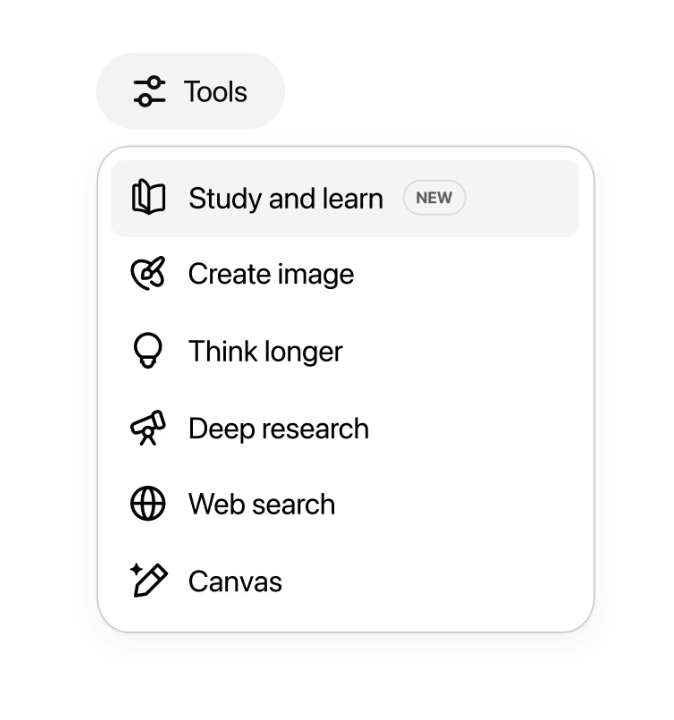
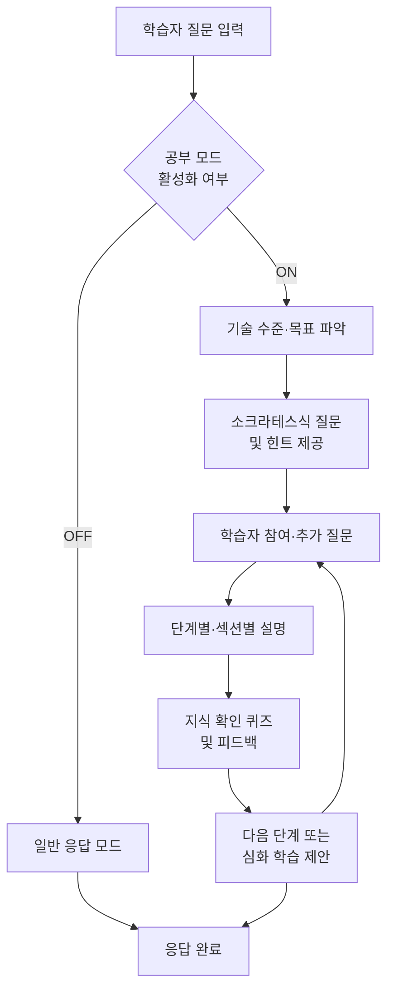

## 개요

**ChatGPT 공부 모드(Study Mode)**는 OpenAI가 2025년 7월 29일 공개한, **학습에 특화된 AI 튜터** 기능이다. 기존 ChatGPT가 질문에 대해 직접적인 답을 제시하는 반면, 공부 모드는 **빠른 해답 대신 단계별 지침·유도 질문·힌트**를 제공해 학습자가 스스로 이해하도록 돕는다. Free, Plus, Pro, Team 계정으로 로그인한 사용자가 이용할 수 있으며, ChatGPT Edu에는 몇 주 내 적용 예정이다.

### 이 글에서 다루는 내용

- 공부 모드의 설계 원리와 일반 모드와의 차이
- 인터랙티브 프롬프트, 맞춤형 지원, 지식 확인 등 **핵심 기능**
- **활용 사례**(학교 교육, 자기주도 학습, 직업 교육)
- 전통 교육 도구·일반 ChatGPT와의 **비교**
- **전망** 및 참고 자료

### 추천 대상

- 초·중·고·대학생 및 평생 학습자: 숙제 지원, 시험 준비, 새 주제 탐색 시 **이해 중심**으로 쓰고 싶은 사람
- 교사·교육 관계자: AI 활용 수업 설계 시 공부 모드의 특성과 한계를 알고 싶은 사람
- ChatGPT를 이미 쓰는 사용자: “답만 알려주는” 사용을 넘어 **학습 효과**를 높이고 싶은 사람

---

## ChatGPT 공부 모드란?

ChatGPT는 이미 전 세계적으로 널리 쓰이는 학습 도구가 되었지만, “실제로 학습을 돕는지”, “이해를 돕지 않고 답만 제시하지는 않는지”에 대한 논란이 있어 왔다. **공부 모드는 이런 우려에 대응해**, 학생이 목표와 스킬 수준에 맞춰 **유도 질문**을 받고, **참여와 상호작용**을 통해 “무언가를 완료하는 것”이 아니라 **학습**하도록 설계되었다.

OpenAI는 교사·과학자·교육학 전문가와 협력해 **심층 학습을 지원하는 행동**을 반영한 맞춤형 시스템 지침을 공부 모드에 적용했다. 적극적 참여 유도, 인지 부하 관리, 메타인지·자아 성찰, 호기심 촉진, 실행 가능한 피드백 제공 등이 포함되며, 이는 학습 과학 연구를 바탕으로 한다.

---

## 공부 모드의 핵심 기능

### 기능 요약

| 기능 | 설명 |
|------|------|
| **인터랙티브 프롬프트** | 답을 직접 주기보다 소크라테스식 질문, 힌트, 자아 성찰 프롬프트로 이해를 유도하고 적극적 학습을 촉진 |
| **추가 지원 응답** | 정보를 주제 간 연결성을 고려한 따라가기 쉬운 섹션으로 구성하고, 적절한 양의 맥락으로 흥미를 유지·인지 부하 완화 |
| **맞춤형 지원** | 기술 수준을 묻는 질문과 이전 대화 기억을 바탕으로 사용자 맞춤 수업 제공 |
| **지식 확인** | 퀴즈·주관식 질문과 맞춤형 피드백으로 진행 상황 추적, 기억 강화, 새 맥락 적용 능력 향상 |
| **유연성** | 대화 도중 공부 모드를 켜거나 끌 수 있어, 대화별 학습 목표에 맞게 조정 가능 |

### 공부 모드 동작 흐름

아래 다이어그램은 학습자가 공부 모드를 사용할 때의 전형적인 흐름을 단순화한 것이다.

```mermaid
flowchart TD
    Start["학습자 질문 입력"]
    Start --> CheckMode{"공부 모드</br>활성화 여부"}
    CheckMode -->|"ON"| AdaptLevel["기술 수준·목표 파악"]
    CheckMode -->|"OFF"| NormalResp["일반 응답 모드"]
    AdaptLevel --> Socratic["소크라테스식 질문</br>및 힌트 제공"]
    Socratic --> Engage["학습자 참여·추가 질문"]
    Engage --> Sectioned["단계별·섹션별 설명"]
    Sectioned --> Quiz["지식 확인 퀴즈</br>및 피드백"]
    Quiz --> NextStep["다음 단계 또는</br>심화 학습 제안"]
    NextStep --> Engage
    NormalResp --> EndNode["응답 완료"]
    NextStep --> EndNode
```

- **노드 ID**: `Start`, `CheckMode`, `AdaptLevel` 등 공백 없이 camelCase·PascalCase 사용, 예약어 미사용.
- **라벨**: 괄호·특수문자 포함 시 `"..."` 로 감쌌고, 줄바꿈은 ` ` 사용.

### 적응형 학습 지원

공부 모드는 학습자의 **현재 이해 수준**을 파악하고, 그에 맞는 난이도와 분량의 설명을 제공한다. 예를 들어 수학 문제에서는 “답만 알려주기”보다 **문제 해결 과정을 단계별로** 설명하고, 막히는 부분을 파악해 추가 설명이나 힌트를 준다.

### 대화형 학습 경험

일방향 강의나 정적 자료와 달리, 공부 모드에서는 “왜 이렇게 되지?” 같은 질문에 **즉시 대화형으로** 답할 수 있어 학습의 연속성이 유지된다. 24시간 이용 가능한 “모든 것을 알고 있는 도우미”처럼 느껴진다는 대학생 피드백도 있다.

### 다양한 학습 스타일 지원

시각·청각·읽기·쓰기 등 학습 스타일에 맞춰 설명 방식을 조절할 수 있도록 설계되어 있으며, 필요 시 다이어그램·예시·비유를 활용해 개념을 전달한다.

---

## 활용 사례

### 학교 교육

- **수학**: 복잡한 개념을 단계별로 분해하고, 유도 질문과 실습 문제로 이해도 확인
- **과학**: 실험 과정과 원리 설명, 가상 실험을 통한 학습 지원
- **언어**: 문법·어휘·대화 연습을 통한 종합적 언어 능력 향상

### 자기주도 학습

- **온라인 강의 보조**: 강의 중 이해되지 않는 부분에 대한 즉시 질의응답
- **프로젝트 학습**: 프로젝트 진행에 필요한 지식·기술 안내
- **시험 준비**: 범위에 맞춘 체계적 복습과 문제 풀이 지원

실제 대학생 사용 사례에서는 “여러 번 배우려 했던 개념(예: 사인파 위치 인코딩)을 공부 모드로 3시간 세션 후 자신 있게 이해했다”는 후기도 있다.

### 직업 교육

- **기술 습득**: 프로그래밍, 디자인, 마케팅 등 직무 기술 학습
- **인증 시험 준비**: 자격증 시험용 학습 계획 수립
- **실무 적용**: 이론을 실무에 적용하는 방법에 대한 구체적 가이드

---

## 기존 교육 도구와의 차이점

### 전통적인 교육 도구

| 도구 | 한계 |
|------|------|
| **교과서** | 정적 정보, 개인 맞춤화 어려움 |
| **온라인 강의** | 일방향 전달, 즉시 질의응답 어려움 |
| **과외·튜터** | 비용·시간·장소 제약 |

### 일반 ChatGPT vs 공부 모드

| 구분 | 일반 ChatGPT | 공부 모드 |
|------|--------------|-----------|
| **응답 방식** | 질문에 대한 직접적 답변 위주 | 유도 질문·힌트·단계별 설명 위주 |
| **목표** | 요청 충족 | 이해도 향상·메타인지 촉진 |
| **맞춤화** | 대화 맥락 기반 | 기술 수준·목표·이전 대화 반영 |
| **진행 추적** | 제한적 | 지식 확인 퀴즈·피드백으로 진행 상황 추적 |

공부 모드는 “숙제를 대신 해결해 주는” 것이 아니라, **학습자가 스스로 깊게 생각하도록** 유도하는 데 초점을 둔 점이 핵심 차이이다.

---

## 제약사항과 향후 전망

### 현재 제약

- 공부 모드는 **맞춤형 시스템 지침**으로 동작하며, 여러 대화 간 일관성·실수 가능성이 있다. OpenAI는 학생 피드백을 반영해 개선한 뒤, 효과가 검증된 행동을 **모델에 직접 훈련**시키는 방향을 검토 중이다.
- 더 깊은 맞춤화(기술 수준·목표별), 대화 기반 목표 설정·진행 추적, 복잡한 개념의 **시각화** 등은 앞으로 탐색할 예정이다.

### 향후 전망

- **개인화 학습 확대**: 학습 패턴·강점·약점 분석을 통한 최적화된 학습 경로 제시
- **교육 격차 완화**: 인터넷만 있으면 고품질 학습 지원 접근 가능
- **교사 역할 변화**: AI가 기초 지식 전달을 보조하고, 교사는 창의·감성·사회성 교육에 더 집중

OpenAI는 **NextGenAI** 이니셔티브를 통해 대학·연구기관과 협력하며, AI가 학습 결과에 미치는 영향을 연구하고 있다. 공부 모드는 “ChatGPT를 이용한 학습 향상”이라는 긴 여정의 **첫걸음**으로 위치한다.

---

## 결론

ChatGPT 공부 모드는 **“답 주기”가 아닌 “이해시키기”**에 초점을 둔, 교육 특화 AI 튜터의 실험이다. 인터랙티브 프롬프트, 맞춤형 지원, 지식 확인, 대화 중 온오프 전환 등을 통해 학교·자기주도·직업 교육 전반에서 활용할 수 있다.

AI는 완벽한 해결책이 아니며, **인간 교사와 상호 보완**하는 관계가 중요하다. 공부 모드를 활용하면서도, 창의성·감성·사회성 교육은 사람이 담당하는 영역임을 인식하는 것이 좋다.  
ChatGPT에서 **‘공부하고 배워요’**를 선택해 질문하면 공부 모드를 바로 사용할 수 있다.

---

## 참고 자료

- [OpenAI – 공부 모드를 소개합니다 (한국어)](https://openai.com/ko-KR/index/chatgpt-study-mode/) — 공식 발표, 설계 원리, 주요 기능, 학생 피드백 요약
- [ChatGPT에서 공부 모드 사용하기](https://chatgpt.com/studymode) — 공부 모드 진입 및 사용 방법
- [OpenAI – NextGenAI 이니셔티브 소개](https://openai.com/index/introducing-nextgenai/) — 교육·연구 분야 AI 활용 및 OpenAI의 대학·연구기관 협력
