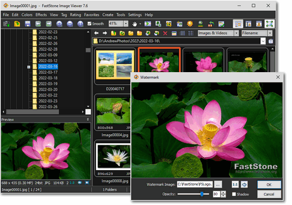

**FastStone Image Viewer**는 빠르고 안정적이며 사용자 친화적인 이미지 browser, converter, editor이다. 2025년 현재 버전 8.1까지 출시되어 지속적인 업데이트를 제공하고 있으며, 가정 사용자에게는 완전 무료로 제공되는 것이 큰 장점이다.

## 주요 기능과 특징

###️ 강력한 이미지 관리 기능

FastStone Image Viewer는 다음과 같은 핵심 기능들을 제공한다:

- **이미지 viewing 및 management**
- **이미지 comparison** 기능
- **Red-eye removal** (적목 현상 제거)
- **Email 전송** 기능
- **Resizing** 및 **cropping**
- **Retouching** 및 **color adjustment**

### 혁신적인 Full-screen Mode

이 소프트웨어의 가장 독특한 특징 중 하나는 직관적인 full-screen mode이다. 이 모드에서는:

- **EXIF 정보**에 빠른 접근이 가능하다
- **Thumbnail browser** 기능을 제공한다
- 화면의 네 모서리에 마우스를 대면 숨겨진 toolbar가 나타난다
- 주요 기능들에 즉시 접근할 수 있다

### 고품질 확대 및 슬라이드쇼

- **High quality magnifier** 기능
- **150개 이상의 transitional effect**가 포함된 musical slideshow
- **Lossless JPEG transition**
- **Drop shadow effect**
- **Image annotation** 기능
- **Scanner support**
- **Histogram** 표시

## Version 8.1의 새로운 기능

FastStone Image Viewer 8.1에서는 다음과 같은 주요 개선사항과 새로운 기능들이 추가되었다:

### 사용자 인터페이스 개선
- **Modern style의 Open/Save dialog** - 더욱 현대적인 스타일로 개선된 파일 열기/저장 대화상자
- **현재 파일 위치 표시** - Menu toolbar에서 현재 파일 위치와 전체 파일 수를 표시
- **Thumbnail 표시 옵션** - "Import Photos and Videos"의 "Select files manually" 옵션에서 thumbnail 아래에 filename 또는 date/time 중 선택하여 표시 가능

### 이미지 Format 지원 강화
- **WEBP 이미지 지원** - WEBP 이미지에 대한 native read/write 지원 추가
- **HEIC/HEIF 성능 향상** - 더 빠른 HEIC/HEIF thumbnail 생성
- **Video thumbnail 개선** - 향상된 video thumbnail 생성 기능

### 기능 개선사항
- **EXIF 기반 batch-renaming** - HEIC/HEIF 이미지를 date/time으로 batch-rename할 때 EXIF "date taken" 정보 활용
- **Symbolic link 지원** - Symbolic link 폴더로 파일을 드래그 앤 드롭할 수 없던 버그 수정
- **기타 개선사항** - 다양한 성능 향상 및 버그 수정

## 지원 Format

### 일반 이미지 Format
FastStone Image Viewer는 모든 주요 그래픽 format을 지원한다:

- **BMP, JPEG, JPEG 2000**
- **Animated GIF, PNG, PCX**
- **PSD, EPS, TIFF**
- **WMF, ICO, CUR, TGA**
- **WEBP** (Version 8.1에서 native read/write 지원 추가)
- **HEIC/HEIF** (향상된 thumbnail 생성 성능)

### Digital Camera RAW Format
디지털 카메라의 RAW format도 광범위하게 지원한다:

- **Canon**: CR2, CR3, CRW
- **Nikon**: NEF, NRW
- **Pentax**: PEF
- **Fujifilm**: RAF, RWL
- **Minolta/Sony**: MRW, ARW, SR2, SRF
- **Olympus**: ORF
- **Samsung**: SRW
- **Sigma**: X3F
- **Panasonic**: RW2
- **Adobe**: DNG

## 왜 FastStone Image Viewer를 선택해야 하는가?

### 완전 무료 (가정 사용자)
- **No Adware** - 광고 소프트웨어 없음
- **No Spyware** - 스파이웨어 없음
- 가정 사용자에게 완전 무료 제공

### 뛰어난 성능
- 빠른 로딩 속도
- 안정적인 동작
- 최적화된 코드로 성능 향상

### 사용자 친화적 인터페이스
- 직관적인 UI 디자인
- 혁신적인 full-screen mode
- 편리한 keyboard shortcut

## 설치 및 다운로드

FastStone Image Viewer 8.1은 [공식 웹사이트](https://www.faststone.org/FSViewerDetail.htm)에서 다운로드할 수 있다. 설치 과정은 매우 간단하며, Windows registry를 사용하지 않고 설정을 application folder에 저장하는 portable 방식을 지원한다.

## 결론

FastStone Image Viewer 8.1은 이미지 관리와 편집을 위한 종합적인 솔루션이다. 무료 소프트웨어임에도 불구하고 상용 프로그램에 버금가는 기능을 제공하며, 특히 대량의 이미지를 다루는 사용자나 디지털 사진 애호가들에게 매우 유용한 도구이다.

Version 8.1에서는 modern style UI 개선, WEBP format 지원, HEIC/HEIF 성능 향상 등 시대에 맞는 기능들이 추가되어 더욱 완성도 높은 소프트웨어가 되었다. 특히 최신 이미지 format들에 대한 지원이 강화되어 현대적인 디지털 환경에서도 충분히 활용할 수 있다.

빠른 성능, 직관적인 인터페이스, 그리고 광범위한 format 지원으로 인해 이미지 뷰어를 찾고 있다면 반드시 고려해볼 만한 소프트웨어이다.