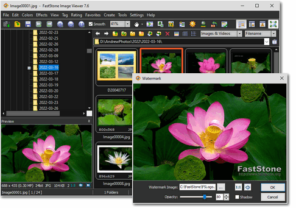
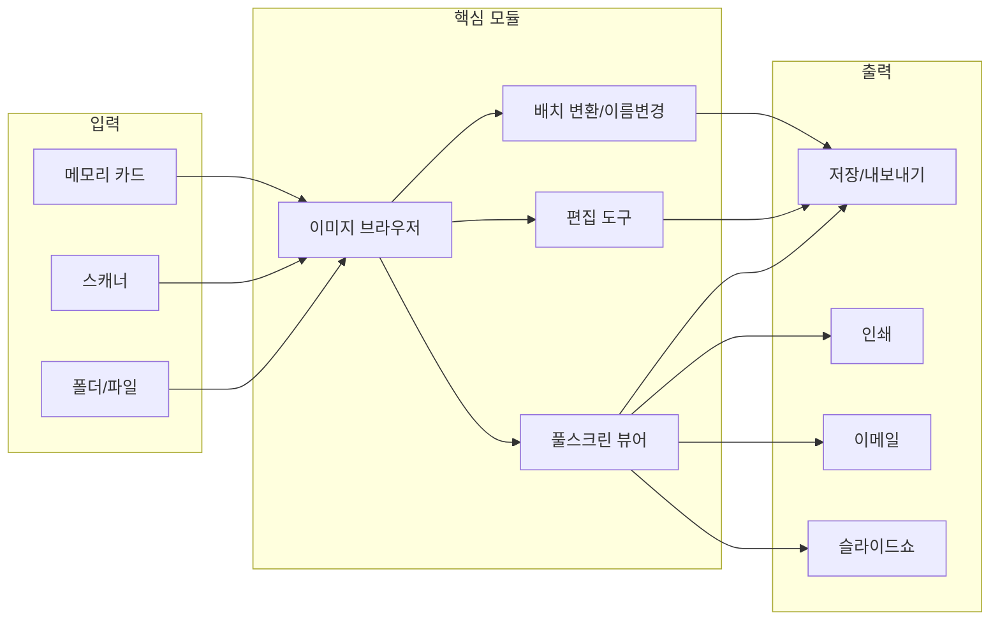

**FastStone Image Viewer**는 Windows용 무료 이미지 브라우저·변환·편집기이다. 빠른 속도, 안정성, 직관적인 풀스크린 모드로 오랫동안 사진 관리·뷰잉 도구로 자리 잡았으며, 2025년 기준 8.x 라인에서 WEBP·HEIC 지원 강화, 모던 UI 등이 추가된 8.1 버전을 중심으로 기능과 사용성을 정리한다.

---

## 개요

### 소프트웨어 정보

| 항목 | 내용 |
|------|------|
| **이름** | FastStone Image Viewer |
| **버전** | 8.1 (본문 기준, 현재 공식 사이트는 8.3 제공) |
| **플랫폼** | Windows |
| **라이선스** | 가정용 무료 (No Adware, No Spyware) |
| **공식 사이트** | [FastStone Image Viewer 상세](https://www.faststone.org/FSViewerDetail.htm) |

가정 사용자에게는 광고·스파이웨어 없이 무료로 제공되며, 상업적 사용은 별도 라이선스가 필요하다. 설치형과 portable 버전을 모두 지원하여 USB 등으로 휴대해 사용할 수 있다.

### 추천 대상

- **일반 사용자**: 사진 폴더를 빠르게 탐색하고 간단한 리사이즈·크롭·보정이 필요한 경우
- **사진 애호가**: RAW·HEIC·WEBP 등 다양한 포맷과 EXIF 확인, 배치 변환·이름 변경이 필요한 경우
- **업무 활용**: 대량 이미지 비교·선별, 연락처 시트·이미지 스트립 제작, 스캐너 연동이 필요한 경우

---

## 전체 구조와 기능 흐름

FastStone Image Viewer는 뷰어·편집·배치 처리·생성 도구가 한 환경에 통합되어 있다. 핵심 모듈 관계는 아래와 같이 요약할 수 있다.

```mermaid
flowchart LR
  subgraph Input["입력"]
    Folder["폴더/파일"]
    Scanner["스캐너"]
    Card["메모리 카드"]
  end
  subgraph Core["핵심 모듈"]
    Browser["이미지 브라우저"]
    Viewer["풀스크린 뷰어"]
    Editor["편집 도구"]
    Batch["배치 변환/이름변경"]
  end
  subgraph Output["출력"]
    Save["저장/내보내기"]
    Print["인쇄"]
    Email["이메일"]
    Slideshow["슬라이드쇼"]
  end
  Folder --> Browser
  Scanner --> Browser
  Card --> Browser
  Browser --> Viewer
  Browser --> Editor
  Browser --> Batch
  Viewer --> Save
  Editor --> Save
  Batch --> Save
  Viewer --> Print
  Viewer --> Email
  Viewer --> Slideshow
```

- **이미지 브라우저**: Windows 탐색기와 유사한 폴더 트리·썸네일 뷰로 폴더 단위 탐색.
- **풀스크린 뷰어**: 화면 네 모서리 마우스 오버 시 툴바 표시, EXIF·썸네일·줌 등 즉시 접근.
- **편집 도구**: 리사이즈·크롭·적목 제거·컬러 조정·도장·힐링 브러시·텍스트·도형 등.
- **배치 처리**: 일괄 변환·이름 변경(EXIF 날짜 활용 가능), HEIC/HEIF 등 포맷 지원.

---

## 주요 기능 상세

### 이미지 뷰잉 및 관리

- **뷰잉**: BMP, JPEG, JPEG 2000, GIF, PNG, PCX, PSD, EPS, TIFF, WMF, ICO, CUR, TGA, WEBP, HEIC/HEIF 및 주요 디지털 카메라 RAW 포맷 지원.
- **관리**: 파일 태깅·평점(1~5), 드래그 앤 드롭으로 복사·이동·순서 변경, 상세/목록 뷰에서 선택 유지.
- **비교**: 최대 4장까지 나란히 배치해 선별·비교.

### 풀스크린 모드

- 화면 네 모서리에 마우스를 가져가면 숨겨진 툴바가 나타나 EXIF, 썸네일 브라우저, 줌·이전/다음 등에 즉시 접근.
- 실제 풀스크린에서 이미지에 집중하면서도 기능 접근성이 뛰어나다는 점이 특징이다.

### 고품질 확대 및 슬라이드쇼

- **확대기**: 한 번에 클릭으로 고품질 확대, 100% 실제 크기 전환 등.
- **슬라이드쇼**: 150개 이상 전환 효과, MP3·WMA·WAV 등 음악 지원, 무손실 JPEG 전환, 드롭 섀도우·이미지 어노테이션 옵션.
- **스캐너**: 이미지 획득·배치 스캔 후 PDF·TIFF·JPEG·PNG 저장.

### 편집·보정

- 리사이즈/리샘플(11가지 알고리즘), 회전/뒤집기, 크롭, 샤프닝/블러, 밝기·컬러·커브·레벨 조정.
- 적목 제거, 클론 스탬프·힐링 브러시, 텍스트·선·사각형·타원·콜아웃 등 그리기, 워터마크·드롭 섀도우·스케치·오일 페인팅 등 효과.

---

## Version 8.1의 새로운 기능

8.1에서는 UI 현대화, 포맷 지원 강화, 배치·파일 처리 개선이 이루어졌다.

### 사용자 인터페이스

- **모던 스타일 Open/Save 대화상자**: 파일 열기·저장 창이 현대적인 스타일로 개선.
- **현재 파일 위치·총 개수 표시**: 메뉴 툴바에 현재 파일 인덱스/전체 파일 수 표시.
- **썸네일 표시 옵션**: "Import Photos and Videos"의 "Select files manually"에서 썸네일 아래에 파일명 또는 날짜/시간 중 선택 표시 가능.

### 이미지 포맷 지원

- **WEBP**: WEBP 이미지에 대한 네이티브 읽기/쓰기 지원 추가.
- **HEIC/HEIF**: 썸네일 생성 속도 향상.
- **비디오 썸네일**: 비디오 썸네일 생성 품질·호환성 개선.

### 기능·안정성

- **EXIF 기반 배치 이름 변경**: HEIC/HEIF를 날짜/시간으로 일괄 이름 변경 시 EXIF "date taken" 사용.
- **심볼릭 링크 지원**: 심볼릭 링크 폴더로 파일 드래그 앤 드롭이 되지 않던 문제 수정.
- 기타 성능 개선 및 버그 수정.

---

## 지원 포맷

### 일반 이미지 포맷

- BMP, JPEG, JPEG 2000, Animated GIF, PNG, PCX
- PSD, EPS, TIFF, WMF, ICO, CUR, TGA
- WEBP (8.1부터 네이티브 읽기/쓰기)
- HEIC/HEIF (Windows 10/11에서는 WIC 코덱 활용, 8.1에서 썸네일 성능 향상)

### 디지털 카메라 RAW

- Canon: CR2, CR3, CRW
- Nikon: NEF, NRW
- Pentax: PEF
- Fujifilm: RAF, RWL
- Minolta/Sony: MRW, ARW, SR2, SRF
- Olympus: ORF
- Samsung: SRW
- Sigma: X3F
- Panasonic: RW2
- Adobe: DNG

---

## 장단점 및 활용 시나리오

### 장점

- **가정용 무료**: 광고·스파이웨어 없이 개인 사용에 적합.
- **빠른 로딩·안정적 동작**: 대용량 폴더·네트워크 경로에서도 비교적 안정적.
- **풀스크린 UX**: 숨겨진 툴바로 화면을 가리지 않고 기능 접근.
- **포맷 폭**: 일반 래스터·RAW·WEBP·HEIC까지 폭넓게 지원.
- **배치 처리**: 변환·이름 변경·EXIF 기반 템플릿으로 대량 작업에 유리.
- **Portable 지원**: 설치 없이 폴더 복사만으로 사용 가능.

### 단점 및 제한

- **Windows 전용**: macOS·Linux 미지원.
- **상업용 유료**: 사무실·상업 환경에서는 별도 라이선스 필요.
- **고급 편집**: 포토샵 수준의 레이어·고급 보정은 외부 편집기 연동이 필요할 수 있음.

### 활용 시나리오

- 디지털 카메라·스마트폰에서 가져온 HEIC/JPEG 빠른 검토·선별
- 웹·문서용 이미지 리사이즈·포맷 변환 일괄 처리
- EXIF 날짜 기준으로 파일명 일괄 정리
- 스캔 문서·사진을 PDF·TIFF로 배치 저장
- 연락처 시트·이미지 스트립·슬라이드쇼 exe 제작

---

## 설치 및 다운로드

- **다운로드**: [FastStone Image Viewer 다운로드 페이지](https://www.faststone.org/FSViewerDownload.htm)에서 설치형(exe), zip, portable 버전을 받을 수 있다.
- **설치**: exe 실행 후 안내에 따라 설치하면 되며, 설치 시 Windows 레지스트리를 쓰지 않고 애플리케이션 폴더에 설정을 저장하는 portable 방식을 선택할 수도 있다.
- **한국어**: 공식 다국어 버전에 한국어가 포함되어 있다.

---

## 종합 평가

### 한 줄 평

가정·개인 사용자에게 추천할 만한 **무료 Windows 이미지 뷰어·간이 편집·배치 변환** 올인원이다. 8.1에서 WEBP·HEIC 지원과 모던 UI, 심볼릭 링크 수정 등으로 실사용성이 더욱 좋아졌다.

### 참고 문헌

1. [FastStone Image Viewer - Official Detail](https://www.faststone.org/FSViewerDetail.htm) — 공식 기능 소개 및 버전 히스토리
2. [FastStone Image Viewer - Download](https://www.faststone.org/FSViewerDownload.htm) — 공식 다운로드(설치형·portable)
3. [FastStone - Main](https://www.faststone.org/) — FastStone 제품 라인업 및 개요
