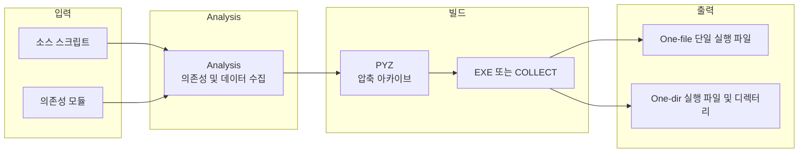

Python으로 개발한 애플리케이션을 다른 사용자에게 배포할 때, 대상 환경에 Python이 설치되어 있지 않은 경우가 많다. **PyInstaller**는 스크립트와 의존성을 한데 묶어 Windows·Linux·macOS에서 실행 가능한 독립 실행 파일을 만들어 주는 대표적인 도구다. 이 글에서는 설치부터 고급 옵션, 실무 예제, 트러블슈팅, 배포·보안까지 한 번에 정리한다.

## 개요

### PyInstaller란?

**PyInstaller**는 Python 애플리케이션을 대상 OS용 독립 실행형 실행 파일(Windows `.exe`, Linux·macOS 실행 파일)로 변환하는 패키징 도구다. Python 인터프리터와 필요한 라이브러리를 함께 묶기 때문에, 사용자 PC에 Python을 설치하지 않아도 동작한다.

### 주요 특징

- **크로스 플랫폼**: Windows, Linux, macOS에서 사용 가능하다. 단, 각 OS용 실행 파일은 해당 OS에서 PyInstaller를 실행해 빌드해야 한다(크로스 컴파일 미지원).
- **One-file / One-dir**: 모든 것을 단일 실행 파일로 뽑을 수도 있고, 디렉터리 형태로 뽑을 수도 있다.
- **의존성 자동 탐지**: import 관계를 따라 필요한 모듈·패키지를 자동으로 포함한다.
- **다양한 Python 버전**: Python 3.8 이상을 지원하며, numpy·matplotlib·PyQt·wxPython 등 주요 패키지와 호환된다.
- **GUI 지원**: Tkinter, PyQt, wxPython 등 GUI 앱을 콘솔 창 없이 배포할 수 있다.

### 추천 대상

- **데스크톱·내부 도구 개발자**: 클라이언트에 Python을 설치하지 않고 단일 실행 파일로 배포하고 싶을 때
- **Flask 등 웹 앱 개발자**: 서버가 아닌 로컬 실행용 래퍼나 간단한 서버 실행 파일이 필요할 때
- **데이터·스크립트 배포 담당자**: 스크립트를 비개발자에게 전달할 때 실행 환경 통일이 필요할 때
- **CI/CD 파이프라인**: 빌드 산출물을 실행 파일로 고정하고 싶을 때

---

## PyInstaller 빌드 흐름

PyInstaller는 대략 다음 단계로 동작한다. 한 번 이해해 두면 옵션과 `.spec` 수정 시 도움이 된다.



- **Analysis**: 진입점 스크립트와 import를 분석해 필요한 바이너리·데이터·hidden import 목록을 만든다.
- **PYZ**: 순수 Python 바이트코드를 하나의 압축 아카이브로 묶는다.
- **EXE / COLLECT**: `--onefile`이면 EXE 하나에 모두 넣고, `--onedir`이면 실행 파일과 라이브러리 디렉터리를 만든다.

---

## 설치 및 기본 사용

### pip로 설치

```bash
pip install pyinstaller
```

설치 확인:

```bash
pyinstaller --version
```

### 기본 사용: 스크립트 하나를 실행 파일로

```bash
pyinstaller your_script.py
```

실행 후 다음이 생긴다.

- `dist/your_script/`: 실행 파일과 라이브러리(기본값은 **onedir**)
- `build/`: 중간 빌드 산출물
- `your_script.spec`: 빌드 설정 파일(재사용·수정용)

### One-file로 단일 실행 파일 만들기

```bash
pyinstaller --onefile your_script.py
```

이 경우 `dist/` 아래에 실행 파일 하나만 생성된다. 실행 시 임시 디렉터리에 압축을 풀고 실행하므로, 첫 실행이 다소 느릴 수 있다.

---

## 고급 CLI 옵션

### `--onefile` vs `--onedir`

| 옵션 | 결과 | 특징 |
|------|------|------|
| `--onefile` | 단일 실행 파일 | 배포는 간단, 실행 시 압축 해제로 인한 지연 가능 |
| `--onedir` (기본) | 실행 파일 + 디렉터리 | 실행이 빠르고, 디버깅·파일 교체가 수월함 |

```bash
# 단일 파일
pyinstaller --onefile script.py

# 디렉터리 형태
pyinstaller --onedir script.py
```

### GUI 앱: 콘솔 창 숨기기 (`--windowed`)

Windows에서 콘솔 창을 띄우지 않으려면:

```bash
pyinstaller --onefile --windowed your_gui_app.py
```

### 아이콘 지정

```bash
pyinstaller --onefile --icon=app.ico your_script.py
```

### 데이터·리소스 포함 (`--add-data`)

Windows에서는 세미콜론(`;`), Linux·macOS에서는 콜론(`:`)으로 “원본 경로”와 “번들 내 상대 경로”를 구분한다.

```bash
# Windows
pyinstaller --onefile --add-data "data.txt;." your_script.py

# Linux / macOS
pyinstaller --onefile --add-data "data.txt:." your_script.py
```

### 자동 탐지되지 않는 모듈 포함 (`--hidden-import`)

런타임에만 import되거나 동적 경로에 있는 모듈은 `--hidden-import`로 명시한다.

```bash
pyinstaller --onefile --hidden-import=module_name your_script.py
```

### 통합 예제

```bash
pyinstaller \
    --onefile \
    --windowed \
    --icon=app.ico \
    --name="MyApplication" \
    --add-data "resources/*;resources/" \
    --hidden-import=pkg_resources.py2_warn \
    your_script.py
```

---

## .spec 파일 활용

최초 `pyinstaller your_script.py` 실행 시 생성되는 `.spec` 파일을 수정하면 재현 가능한 빌드와 세밀한 제어가 가능하다.

### 기본 .spec 구조

```python
# -*- mode: python ; coding: utf-8 -*-

block_cipher = None

a = Analysis(
    ['your_script.py'],
    pathex=[],
    binaries=[],
    datas=[],
    hiddenimports=[],
    hookspath=[],
    hooksconfig={},
    runtime_hooks=[],
    excludes=[],
    win_no_prefer_redirects=False,
    win_private_assemblies=False,
    cipher=block_cipher,
    noarchive=False,
)

pyz = PYZ(a.pure, a.zipped_data, cipher=block_cipher)

exe = EXE(
    pyz,
    a.scripts,
    [],
    exclude_binaries=True,
    name='your_script',
    debug=False,
    bootloader_ignore_signals=False,
    strip=False,
    upx=True,
    console=True,
    disable_windowed_traceback=False,
    argv_emulation=False,
    target_arch=None,
    codesign_identity=None,
    entitlements_file=None,
)

coll = COLLECT(
    exe,
    a.binaries,
    a.zipfiles,
    a.datas,
    strip=False,
    upx=True,
    upx_exclude=[],
    name='your_script',
)
```

### .spec 수정 예: 데이터·hidden import·exclude

```python
# -*- mode: python ; coding: utf-8 -*-

block_cipher = None

a = Analysis(
    ['main.py'],
    pathex=['/path/to/your/project'],
    binaries=[],
    datas=[
        ('resources', 'resources'),
        ('config.ini', '.'),
    ],
    hiddenimports=[
        'pkg_resources.py2_warn',
        'requests',
    ],
    hookspath=[],
    hooksconfig={},
    runtime_hooks=[],
    excludes=[
        'tkinter',
        'matplotlib',
    ],
    win_no_prefer_redirects=False,
    win_private_assemblies=False,
    cipher=block_cipher,
    noarchive=False,
)

pyz = PYZ(a.pure, a.zipped_data, cipher=block_cipher)

exe = EXE(
    pyz,
    a.scripts,
    a.binaries,
    a.zipfiles,
    a.datas,
    [],
    name='MyApp',
    debug=False,
    bootloader_ignore_signals=False,
    strip=False,
    upx=True,
    upx_exclude=[],
    runtime_tmpdir=None,
    console=False,
    icon='app.ico',
)
```

### .spec으로 빌드

```bash
pyinstaller your_script.spec
```

---

## 실무 사용 예제

### Flask 웹 앱 패키징

```python
# app.py
from flask import Flask

app = Flask(__name__)

@app.route('/')
def hello():
    return "Hello, World!"

if __name__ == '__main__':
    app.run(debug=True)
```

```bash
pyinstaller --onefile --add-data "templates;templates" --add-data "static;static" app.py
```

Windows가 아닌 환경에서는 `;` 대신 `:`를 사용한다.

### Tkinter GUI 앱 패키징

```python
# gui_app.py
import tkinter as tk
from tkinter import messagebox

def show_message():
    messagebox.showinfo("Information", "Hello from PyInstaller!")

root = tk.Tk()
root.title("Sample GUI App")

button = tk.Button(root, text="Click Me!", command=show_message)
button.pack(pady=20)

root.mainloop()
```

```bash
pyinstaller --onefile --windowed --icon=app.ico gui_app.py
```

### 외부 라이브러리(pandas, matplotlib 등) 사용 시

동적 import나 플러그인 구조 때문에 자동 분석에서 빠지는 모듈은 `--hidden-import`로 넣는다.

```bash
pyinstaller --onefile --hidden-import=pandas --hidden-import=numpy --hidden-import=matplotlib data_processor.py
```

---

## 최적화 및 문제 해결

### 파일 크기 줄이기

- **불필요한 모듈 제외**: `--exclude-module` 또는 `.spec`의 `excludes`에 `tkinter`, `unittest`, `matplotlib` 등 미사용 모듈을 지정한다.
- **UPX 사용**: UPX를 설치한 뒤 `--upx-dir`로 경로를 주면 바이너리 압축으로 용량을 줄일 수 있다.
- **가상환경**: 필요한 패키지만 설치한 venv에서 PyInstaller를 실행하면 불필요한 패키지가 포함되는 것을 막을 수 있다.

### ModuleNotFoundError

런타임에 특정 모듈을 찾을 수 없다는 오류가 나면, 해당 모듈을 `--hidden-import`에 추가한다.

```bash
pyinstaller --onefile --hidden-import=missing_module your_script.py
```

### 패키징된 앱에서 데이터 파일 경로

PyInstaller는 실행 시 파일을 임시 디렉터리(`sys._MEIPASS`)에 풀어 둔다. 리소스 경로는 아래처럼 처리하는 것이 안전하다.

```python
import sys
import os

def resource_path(relative_path):
    """ PyInstaller 번들 내 리소스의 절대 경로를 반환한다. """
    try:
        base_path = sys._MEIPASS
    except Exception:
        base_path = os.path.abspath(".")
    return os.path.join(base_path, relative_path)

# 사용 예
data_file = resource_path('data/config.txt')
```

### Windows에서 DLL 누락

특정 DLL이 필요하면 `--add-binary`로 포함시킨다.

```bash
pyinstaller --onefile --add-binary "path/to/library.dll;." your_script.py
```

### import·성능 관련 팁

- 필요한 것만 import하고, 사용하지 않는 대형 라이브러리는 `excludes`로 제외한다.
- 무거운 모듈은 필요 시점에만 import하는 lazy loading을 고려할 수 있다.

---

## 가상환경·배포·테스트

### 가상환경 사용 권장

의존성을 최소화하고 재현 가능한 빌드를 위해 venv에서 PyInstaller를 실행하는 것이 좋다.

```bash
python -m venv pyinstaller_env

# Windows
pyinstaller_env\Scripts\activate
# Linux / macOS
source pyinstaller_env/bin/activate

pip install pyinstaller
pip install -r requirements.txt

pyinstaller --onefile your_script.py
```

### 배포 전 테스트

- Python이 설치되지 않은 깨끗한 환경에서 실행해 본다.
- 가능하면 대상 OS·비트(32/64)를 맞춰 테스트한다.

### 설치 프로그램(선택)

Windows에서는 NSIS, Inno Setup 등으로 설치 패키지를 만들 수 있다. `dist/` 아래 실행 파일을 설치 스크립트에서 복사·바로가기 생성하면 된다.

---

## 보안 고려사항

- **역공학**: PyInstaller 번들은 역공학이 가능하다. 민감한 로직·키는 코드에 직접 넣지 말고, 환경 변수나 외부 설정으로 분리한다.
- **난독화**: 필요 시 PyArmor 등으로 스크립트를 난독화한 뒤 PyInstaller로 패키징할 수 있다. 완전한 보호는 아니며, 사용 조건을 확인해야 한다.
- **민감 정보**: API 키 등은 `os.environ` 또는 별도 설정 파일로 주입하는 방식을 권장한다.

---

## 결론

PyInstaller는 Python 스크립트를 독립 실행 파일로 배포할 때 가장 널리 쓰이는 도구다. 다음을 지키면 실무에서 안정적으로 사용할 수 있다.

- **가상환경**에서 필요한 패키지만 설치한 뒤 빌드해 의존성을 최소화한다.
- **.spec**으로 옵션을 고정하고, 데이터·hidden import·exclude를 명시해 재현 가능한 빌드를 만든다.
- **리소스 경로**는 `sys._MEIPASS`를 기준으로 하는 헬퍼 함수를 사용한다.
- **배포 전**에는 Python이 없는 환경에서 반드시 한 번씩 실행해 본다.

더 세부적인 옵션·훅·플랫폼별 주의사항은 공식 매뉴얼과 Python 패키징 가이드를 참고하면 좋다.

---

## 참고 문헌

1. [PyInstaller Documentation (stable)](https://pyinstaller.org/en/stable/) — 공식 매뉴얼, 옵션·spec·트러블슈팅
2. [pip documentation](https://pip.pypa.io/) — pip 설치·업그레이드
3. [Python Packaging User Guide](https://packaging.python.org/) — Python 패키징·배포 전반
