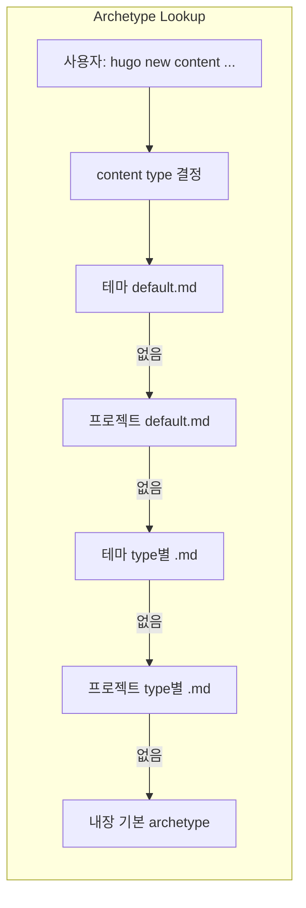
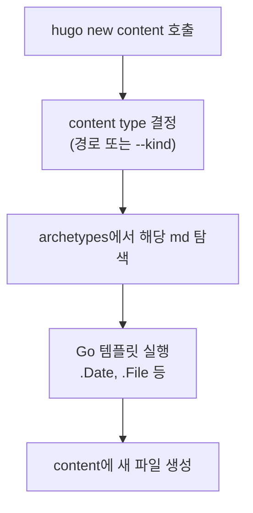

Hugo는 빠르고 유연한 정적 사이트 생성기로, 다양한 콘텐츠 타입을 효율적으로 관리할 수 있는 강력한 기능을 제공한다. 그중 **Archetypes**는 새 콘텐츠 생성 시 Front Matter와 본문 구조를 템플릿으로 자동 채워 주어, 일관성과 워크플로우 자동화를 가능하게 하는 핵심 기능이다. 이 글에서는 Archetypes의 개념부터 고급 활용(커스텀 타입, Go 템플릿 함수, leaf bundle, `--kind` 지정)까지 한 번에 정리한다.

## Archetypes란?

**Archetype**은 Hugo에서 **새 콘텐츠를 만들 때 사용하는 템플릿**이다. `hugo new content <경로>`를 실행하면, 해당 콘텐츠 타입에 맞는 archetype 파일을 찾아 그 내용으로 새 파일을 만든다. Front Matter뿐 아니라 본문(body)도 미리 채워 넣을 수 있어, 문서 포맷을 통일하고 반복 작업을 줄일 수 있다.

### 핵심 개념 정리

- **템플릿 기반 생성**: 미리 정의한 템플릿으로 동일한 구조의 콘텐츠를 반복 생성
- **메타데이터 자동화**: `date`, `draft`, `title` 등 Front Matter 기본값을 자동 설정
- **타입별 분리**: 블로그 포스트, 문서 페이지, 갤러리 등 콘텐츠 타입마다 서로 다른 archetype 사용
- **Go 템플릿 지원**: `{{ .Date }}`, `{{ replace .File.ContentBaseName ... }}` 등으로 동적 값 주입

## 디렉토리 구조와 파일 배치

Archetypes는 프로젝트 루트의 `archetypes/` 디렉토리에 둔다. 테마나 모듈에도 `archetypes/`를 가질 수 있으며, Hugo는 **lookup 순서**에 따라 어떤 파일을 쓸지 결정한다.

### 기본 디렉토리 구조 예시

```
your-hugo-site/
├── archetypes/
│   ├── default.md          # 기본 템플릿 (타입 미매칭 시 사용)
│   ├── post.md             # 블로그 포스트용
│   ├── posts.md            # content/posts/ 아래 생성 시 사용 (section 이름과 매칭)
│   ├── page.md             # 일반 페이지용
│   └── galleries/
│       ├── images/
│       │   └── .gitkeep     # leaf bundle용 하위 디렉토리 유지
│       └── index.md        # 갤러리 leaf bundle용
├── content/
├── layouts/
└── config.toml
```

- **default.md**: 어떤 타입에도 매칭되지 않을 때 사용하는 fallback.
- **`<section>.md`** (예: `posts.md`): `content/posts/xxx.md`처럼 해당 section 아래에 생성할 때 사용.
- **Leaf bundle**: `archetypes/galleries/`처럼 하위 디렉터리와 `index.md`를 두면, `hugo new content galleries/이름` 시 같은 구조로 `content/galleries/이름/`이 만들어진다. 하위 디렉터리를 만들려면 그 안에 최소 한 개 파일(예: `.gitkeep`)이 있어야 한다.

## Archetype Lookup 순서

`hugo new content <경로>` 실행 시 Hugo는 **content type**(보통 상위 디렉터리 이름)에 맞는 archetype을 다음 순서로 찾는다.



예: 테마가 `my-theme`이고 `hugo new content posts/my-first-post.md`를 실행하면,

1. `themes/my-theme/archetypes/default.md`
2. `archetypes/default.md`
3. `themes/my-theme/archetypes/posts.md`
4. `archetypes/posts.md`
5. 위가 모두 없으면 Hugo 내장 기본 archetype

**프로젝트의 `archetypes/`에 넣은 파일이 테마보다 우선하지 않는다.** default는 프로젝트가, 타입별은 테마가 먼저 검사된다. 따라서 테마를 쓰더라도 프로젝트에서 타입별 archetype을 쓰려면 `archetypes/posts.md` 등을 두면 된다.

## 기본 Archetype 문법 (YAML·TOML·JSON)

Archetype 파일은 일반 콘텐츠 파일처럼 **Front Matter + 본문** 형태다. Front Matter와 본문 안에 **Go 템플릿 액션**을 넣을 수 있으며, **콘텐츠를 생성하는 그 순간 한 번만** 실행된다.

### 공식 기본 default (YAML 예시)

Hugo 공식 문서의 기본 default archetype은 다음과 비슷하다.

```yaml
---
date: '{{ .Date }}'
draft: true
title: '{{ replace .File.ContentBaseName `-` ` ` | title }}'
---
```

- **`.Date`**: 새 콘텐츠 생성 시각 (RFC3339).
- **`.File.ContentBaseName`**: 확장자를 뺀 파일 이름 (예: `my-first-post`). `replace`로 `-`를 공백으로 바꾼 뒤 `title`로 첫 글자 대문자 처리하면 "My First Post" 같은 제목이 만들어진다.

TOML이라면:

```toml
+++
date = '{{ .Date }}'
draft = true
title = '{{ replace .File.ContentBaseName `-` ` ` | title }}'
+++
```

JSON은 키와 문자열 값 안의 따옴표를 이스케이프해서 사용하면 된다.

### 날짜 포맷 커스터마이즈

`date`를 `2006-01-02` 형태만 쓰고 싶다면 `time` 함수를 사용한다.

```yaml
---
date: '{{ time.Now.Format "2006-01-02" }}'
draft: true
title: '{{ replace .File.ContentBaseName `-` ` ` | title }}'
---
```

Archetype에서 사용 가능한 주요 컨텍스트는 다음과 같다.

| 변수/객체 | 설명 |
|-----------|------|
| `.Date` | 생성 시각 (RFC3339 문자열) |
| `.File` | 현재 생성 중인 파일 정보 (ContentBaseName 등) |
| `.Type` | content type (상위 디렉터리 이름 또는 `--kind`로 지정한 값) |
| `.Site` | 사이트 전역 객체 |

Hugo 템플릿 함수는 [공식 함수 문서](https://gohugo.io/functions/)에서 그대로 사용할 수 있다.

## 기본 사용법: 새 포스트·페이지 생성

### 새 포스트 생성

```bash
# content/posts/ 아래에 새 포스트 (archetypes/posts.md 사용)
hugo new content posts/my-new-post.md

# content/post/ 라면 archetypes/post.md 사용
hugo new content post/2025-08-06-my-article.md
```

### 새 페이지 생성

```bash
# 루트에 about 페이지 (default 또는 page archetype)
hugo new content about.md

# 하위 경로
hugo new content company/team.md
```

### Archetype 강제 지정: `--kind`

같은 경로라도 **다른 archetype**을 쓰고 싶을 때는 `--kind`으로 content type을 덮어쓴다.

```bash
# articles section에 만들지만 tutorials archetype 사용
hugo new content --kind tutorials articles/getting-started.md
```

이때 `archetypes/tutorials.md`가 사용된다. archetype 디렉터리 구조는 예를 들어 다음과 같이 둘 수 있다.

```
archetypes/
├── default.md
├── articles.md
└── tutorials.md
```

## 본문까지 채우는 Archetype (Include content)

Front Matter뿐 아니라 **본문(body)**도 미리 넣을 수 있다. 문서 사이트에서 함수 설명 페이지를 항상 같은 형식으로 만들 때 유용하다.

예: `archetypes/functions.md`

```markdown
---
date: '{{ .Date }}'
draft: true
title: '{{ replace .File.ContentBaseName `-` ` ` | title }}'
---

한 줄로 이 함수가 무엇을 하는지 설명 (3인칭 단수 현재형). 예: `someFunction` returns the string `s` repeated `n` times.

## Signature

```text
func someFunction(s string, n int) string
```

## Examples

실제 사용 예를 코드 블록으로 작성.

## Notes

추가 설명이나 주의사항.
```

이렇게 하면 `hugo new content functions/someFunction.md` 시 제목과 본문 골격이 자동으로 채워진다. 본문 안에도 `{{ ... }}`를 넣을 수 있지만, **한 번만** 실행되므로 동적 갱신이 필요한 부분은 레이아웃/단축코드 등 빌드 시마다 실행되는 템플릿에서 처리하는 것이 좋다.

## Leaf Bundle Archetype

이미지·첨부 파일을 한 폴더에 묶는 **leaf bundle**용 디렉터리 구조도 archetype으로 정의할 수 있다.

예: 갤러리용 leaf bundle

```
archetypes/
├── galleries/
│   ├── images/
│   │   └── .gitkeep
│   └── index.md
└── default.md
```

`archetypes/galleries/index.md` 내용은 일반 archetype과 동일하게 Front Matter + 본문을 쓰면 된다.

생성:

```bash
hugo new content galleries/bryce-canyon
```

결과:

```
content/galleries/bryce-canyon/
├── images/
│   └── .gitkeep
└── index.md
```

하위 디렉터리를 유지하려면 그 안에 최소 한 개 파일이 있어야 하므로, 빈 `.gitkeep`을 두는 방식이 많이 쓰인다.

## 실전 워크플로우 요약



- **명확한 콘텐츠 구조 설계**: 블로그/문서/갤러리 등 타입별로 필요한 Front Matter와 본문 골격을 먼저 정리한다.
- **일관된 메타데이터**: `draft`, `date`, `title`, `description`, `tags` 등을 archetype에 표준화해 두면 검토와 배포가 수월해진다.
- **동적 값 활용**: `replace`, `title`, `time.Now.Format` 등으로 파일명·날짜 기반 값을 자동 채운다.
- **leaf bundle**: 이미지·리소스를 함께 두는 콘텐츠는 해당 타입용 archetype 디렉터리를 만들어 재사용한다.

## 자주 겪는 문제와 확인 사항

- **의도한 archetype이 적용되지 않을 때**: lookup 순서를 확인한다. 테마에 같은 이름의 archetype이 있으면 테마 것이 먼저 쓰일 수 있다. 프로젝트 `archetypes/<type>.md` 존재 여부와 `hugo new content`에 넘기는 경로(어떤 section 아래인지)를 맞춘다.
- **`.File.ContentBaseName`과 파일명**: 파일명에 `-`를 넣어 두면 `replace`로 공백으로 바꿔 제목을 만들기 쉽다. (예: `2025-08-06-hugo-archetypes-guide` → "2025 08 06 Hugo Archetypes Guide")
- **날짜/시간대**: `date`는 기본적으로 생성 시점의 로컬 시간이 RFC3339로 들어간다. 포맷을 바꾸려면 `time.Now.Format "2006-01-02"` 형태를 사용하고, 사이트 전역 시간대는 `config`의 `timeZone`을 참고한다.
- **본문 템플릿**: 본문에 넣은 `{{ }}`는 생성 시 한 번만 실행된다. 빌드할 때마다 바뀌어야 하는 값은 레이아웃이나 shortcode에서 처리해야 한다.

## 정리

- **Archetypes**는 `hugo new content`로 새 콘텐츠를 만들 때 쓰는 **템플릿**으로, Front Matter와 본문을 한 번에 채워 준다.
- **default.md**와 **타입별 .md** (예: `posts.md`)를 `archetypes/`에 두고, **lookup 순서**를 이해하면 테마와의 우선순위를 제어할 수 있다.
- **Go 템플릿**으로 `.Date`, `.File.ContentBaseName`, `replace`, `time.Now.Format` 등을 활용하면 제목·날짜를 자동화할 수 있다.
- **본문 포함**, **leaf bundle 구조**, **`--kind`**까지 활용하면 블로그·문서·갤러리 등 다양한 콘텐츠 타입을 일관되게 생성할 수 있다.

성공적인 활용을 위해 사이트의 콘텐츠 타입을 먼저 나누고, 타입별로 하나의 archetype을 설계한 뒤, 필요에 따라 leaf bundle이나 `--kind`로 세분화하는 순서를 추천한다.

## 참고 문헌

- [Hugo Archetypes 공식 문서](https://gohugo.io/content-management/archetypes/) — Archetype 개념, lookup 순서, leaf bundle, `--kind` 설명
- [Hugo Front Matter 가이드](https://gohugo.io/content-management/front-matter/) — `date`, `draft`, `lastmod`, `params` 등 필드 정의
- [Hugo Template Functions](https://gohugo.io/functions/) — Archetype에서 사용 가능한 `replace`, `title`, `time` 등 함수 참고
