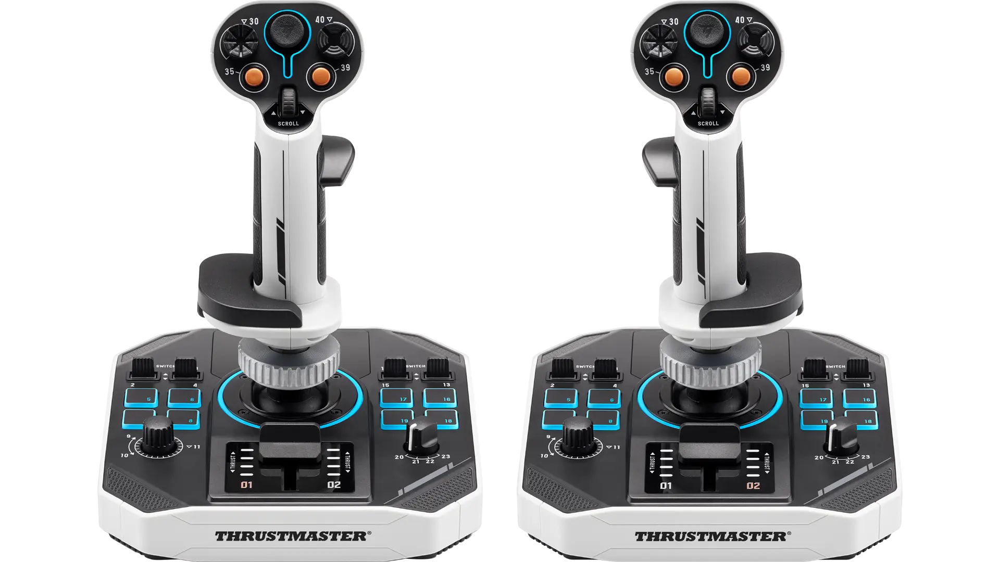
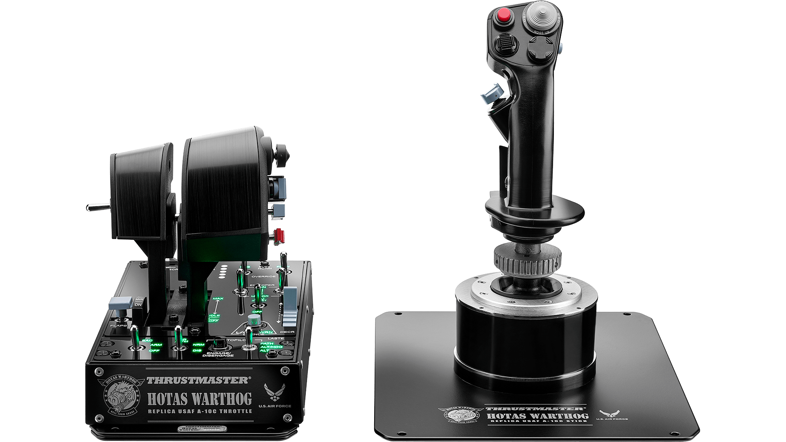

우주 시뮬레이션 게임의 세계에서 가장 중요한 것은 무엇일까? 바로 **정밀한 제어**와 **몰입감**이다. Thrustmaster에서 출시한 **Sol-R 2 HOSAS Space Sim Duo**는 이러한 요구사항을 완벽하게 충족시키는 최고급 우주 시뮬레이션 컨트롤러다. 이번 글에서는 이 혁신적인 HOSAS 시스템의 모든 특징과 장점을 자세히 살펴보겠다.

## HOSAS란 무엇인가?

**HOSAS(Hands On Stick And Stick)**는 전통적인 HOTAS(Hands On Throttle And Stick)와는 다른 개념이다. 양손에 각각 조이스틱을 들고 조작하는 방식으로, 우주 시뮬레이션에서 6축 자유도를 완벽하게 제어할 수 있게 해준다.

### HOSAS vs HOTAS 비교

| 특징 | HOSAS | HOTAS |
|------|-------|-------|
||||
| 제어 방식 | 양손 조이스틱 | 조이스틱 + 스로틀 |
| 6축 제어 | 완벽한 6축 제어 | 제한적 6축 제어 |
| 우주 시뮬 최적화 | ⭐⭐⭐⭐⭐ | ⭐⭐⭐ |
| 지상 시뮬 최적화 | ⭐⭐⭐ | ⭐⭐⭐⭐⭐ |

## Sol-R 2 HOSAS Space Sim Duo 핵심 특징

### 🎮 88개의 액션 버튼

Sol-R 2 HOSAS는 놀라운 **88개의 프로그래밍 가능한 버튼**을 제공한다. 각 조이스틱마다:
- **21개의 버튼** (총 42개)
- **2개의 트리거** (더블 트리거 포함)
- **2개의 햇 스위치**
- **1개의 미니스틱**
- **1개의 썸휠**
- **중앙 스로틀** (각 조이스틱에 내장)

### 🎯 16비트 정밀도

**H.E.A.R.T.(HallEffect AccuRate Technology™)**를 탑재하여 16비트 정밀도를 제공한다:
- **X, Y, Z축**: 물리적 6축
- **가상 축**: 10개 (썸휠, 미니스틱, 스로틀)
- **무한 수명**: 홀 효과 센서로 마모 없음

### 🌈 RGB 조명 시스템

11개의 **T.A.R.G.E.T 소프트웨어 제어 RGB 존**을 통해 완전한 우주 몰입감을 제공한다:
- 각 버튼별 개별 조명 제어
- 게임 상태에 따른 동적 색상 변화
- 완전 커스터마이징 가능

## 디자인과 인체공학

### 🎨 아이코닉 디자인

최고의 SF 블록버스터 영화에서 영감을 받은 디자인:
- **독특한 색상 조합**
- **미래지향적 실루엣**
- **프리미엄 소재 사용**

### 🖐️ 최대 편안함

**2가지 설정 가능한 구성**과 **8개의 안정성 지지대**:
- **손목 받침대**: 장시간 사용에도 편안함
- **엄지 받침대**: 좌우손 설정 모두 지원
- **안정성 지지대**: 탁상 고정용 8개 지지대

## 기술적 사양

### 📏 물리적 크기
- **너비**: 196mm
- **깊이**: 196mm  
- **높이**: 247mm
- **무게**: 2,539g

### 🔌 연결 및 호환성
- **USB-C 케이블**: 분리 가능한 2개 케이블
- **플랫폼**: PC 전용
- **소프트웨어**: T.A.R.G.E.T 고급 프로그래밍 소프트웨어

## T.A.R.G.E.T 소프트웨어

### 🛠️ 고급 프로그래밍 기능

**T.A.R.G.E.T**는 Thrustmaster 컨트롤러를 위한 완전한 소프트웨어 솔루션이다:

- **테스트 및 설정**: 모든 컨트롤러 기능 테스트
- **프로그래밍**: 복잡한 매크로 및 시퀀스 생성
- **통합 제어**: 여러 Thrustmaster 장치 동시 제어
- **게임 프리셋**: 인기 게임용 내장 프리셋
- **커스텀 프리셋**: 사용자 정의 설정 생성

### 🎮 지원 게임

- **Star Citizen**
- **Elite Dangerous**
- **No Man's Sky**
- **Microsoft Flight Simulator**
- **DCS World**
- **X-Plane**

## 생태계 호환성

### 🔄 모듈러 디자인

Sol-R 2 HOSAS는 Thrustmaster 생태계와 완벽하게 호환된다:

- **AVA 베이스 호환**: Sol-R 그립을 AVA 베이스에 장착 가능
- **Viper/Hornet 그립 호환**: Sol-R 베이스에 다른 그립 장착 가능
- **미래 확장성**: 향후 출시될 그립들과도 호환

## 패키지 구성

### 📦 박스 내용물

- **Sol-R 베이스 2개**
- **Sol-R 그립 2개**
- **분리 가능한 손목 받침대 2개**
- **엄지 받침대 2개** (+ 좌우손 설정용 커버 2개)
- **안정성 지지대 8개**
- **분리 가능한 USB-C 케이블 2개**
- **보증 정보**

## 가격 및 구매 정보

### 💰 가격
- **미국**: $399.99
- **한국**: 약 550,000원 (예상)

### 🛒 구매처
- **Thrustmaster 공식 스토어**
- **Amazon USA**
- **전 세계 주요 리테일러**

## 장단점 분석

### ✅ 장점

1. **완벽한 6축 제어**: 우주 시뮬레이션에 최적화
2. **88개 버튼**: 거의 모든 기능을 버튼으로 제어 가능
3. **16비트 정밀도**: 극도로 정밀한 조작
4. **RGB 조명**: 완전한 몰입감
5. **모듈러 디자인**: 확장성과 호환성
6. **인체공학적 설계**: 장시간 사용에도 편안함

### ⚠️ 단점

1. **높은 가격**: 프리미엄 제품의 높은 가격대
2. **학습 곡선**: HOSAS 시스템 적응에 시간 필요
3. **공간 요구**: 두 개의 조이스틱으로 인한 공간 필요
4. **PC 전용**: 콘솔 게임 미지원

## 결론

Thrustmaster Sol-R 2 HOSAS Space Sim Duo는 우주 시뮬레이션 게임을 위한 **궁극의 컨트롤러**다. 88개의 버튼, 16비트 정밀도, RGB 조명, 모듈러 디자인 등 모든 면에서 최고급 사양을 제공한다.

### 🎯 추천 대상

- **우주 시뮬레이션 게임 매니아**
- **Star Citizen, Elite Dangerous 플레이어**
- **최고급 게임 하드웨어를 원하는 사용자**
- **정밀한 제어가 필요한 시뮬레이션 게임 플레이어**

### 💡 구매 고려사항

1. **예산**: 프리미엄 가격대를 감당할 수 있는지 확인
2. **공간**: 두 개의 조이스틱을 위한 충분한 공간 확보
3. **학습 의지**: HOSAS 시스템 적응을 위한 시간 투자
4. **게임 라이브러리**: 우주 시뮬레이션 게임 보유 여부

Sol-R 2 HOSAS Space Sim Duo는 단순한 게임 컨트롤러가 아닌, **우주 탐험의 꿈을 현실로 만들어주는 도구**다. 만약 우주 시뮬레이션 게임에 진지하게 임하고 있다면, 이 제품은 확실히 고려해볼 만한 투자다.

**참고 자료:**
- [Thrustmaster Sol-R 2 HOSAS 공식 페이지](https://www.thrustmaster.com/en-us/products/sol-r-2-hosas-space-sim-duo/)
- [T.A.R.G.E.T 소프트웨어 다운로드](http://ts.thrustmaster.com) 