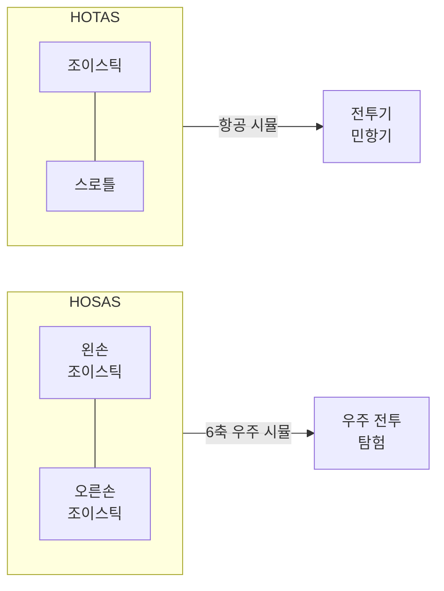
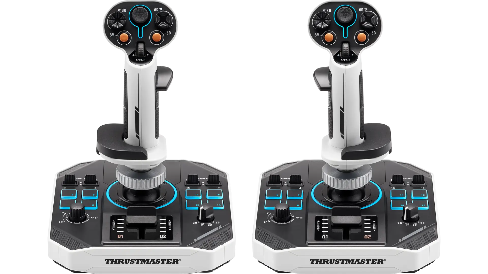
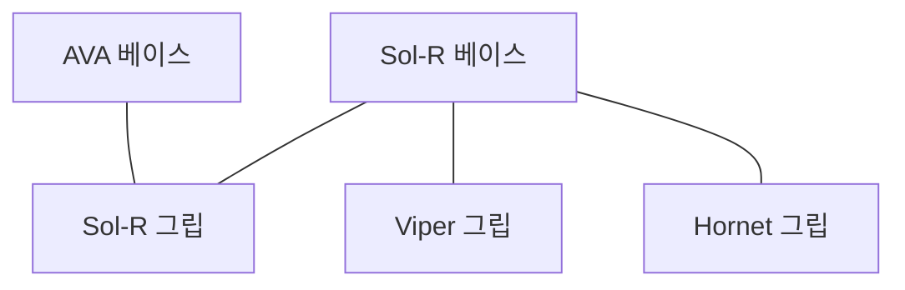

## 개요

**Thrustmaster Sol-R 2 HOSAS Space Sim Duo**는 우주 시뮬레이션에 특화된 **HOSAS(Hands On Stick And Stick)** 듀오 조이스틱이다. 88개의 프로그래밍 가능한 버튼, 16비트 H.E.A.R.T. 정밀도, 11존 RGB 조명, T.A.R.G.E.T 소프트웨어 연동으로 Star Citizen·Elite Dangerous·No Man's Sky 등 6축 자유도 제어가 중요한 게임에 최적화되어 있다. 본문에서는 제품 구조, 사양, 사용성, 장단점을 정리하고 추천 대상과 구매 시 고려사항을 제시한다.

### 제품 정보 요약

| 항목 | 내용 |
|------|------|
| 제품명 | Sol-R 2 HOSAS Space Sim Duo |
| 플랫폼 | PC 전용 |
| 가격 | $399.99 (미국), 국내 약 55만 원대 예상 |
| 레벨 | Advanced |
| 최적 용도 | 우주 시뮬레이션 (전투·탐험) |

### 추천 대상

- **우주 시뮬레이션 매니아**: Star Citizen, Elite Dangerous, No Man's Sky 등 장시간 플레이하는 유저
- **6축 정밀 제어 필요 사용자**: 호버·선회·전투 시 동시 축 제어가 중요한 플레이어
- **고급 입력 장치를 원하는 유저**: HOTAS에서 HOSAS로 전환하거나, 첫 HOSAS 구매 고려자
- **Thrustmaster 생태계 사용자**: 기존 베이스·그립과 호환해 확장하고 싶은 사용자

---

## HOSAS란 무엇인가?

**HOSAS(Hands On Stick And Stick)**는 한 손에 스로틀, 한 손에 조이스틱을 쓰는 **HOTAS(Hands On Throttle And Stick)**와 달리, **양손에 조이스틱을 각각 잡는 구성**이다. 우주 공간에서 전후·좌우·상하 이동과 피치·요·롤을 동시에 다루는 **6축 자유도** 제어에 유리하며, 전투 시 반응 속도와 세밀한 조작이 중요한 우주 시뮬에 적합하다.

### HOSAS vs HOTAS 비교

| 특징 | HOSAS | HOTAS |
|------|-------|-------|
| 제어 방식 | 양손 조이스틱 | 조이스틱 + 스로틀 |
| 6축 제어 | 완벽한 6축 제어 | 제한적 6축 제어 |
| 우주 시뮬 최적화 | ⭐⭐⭐⭐⭐ | ⭐⭐⭐ |
| 지상/항공 시뮬 최적화 | ⭐⭐⭐ | ⭐⭐⭐⭐⭐ |

구조를 도식화하면 다음과 같다.

```mermaid
flowchart LR
  subgraph hosas["HOSAS"]
    leftStick["왼손</br>조이스틱"]
    rightStick["오른손</br>조이스틱"]
    leftStick --- rightStick
  end
  subgraph hotas["HOTAS"]
    stick["조이스틱"]
    throttle["스로틀"]
    stick --- throttle
  end
  hosas -->|"6축 우주 시뮬"| useCase1["우주 전투</br>탐험"]
  hotas -->|"항공 시뮬"| useCase2["전투기</br>민항기"]
```

---

## Sol-R 2 HOSAS Space Sim Duo 핵심 특징

### 88개의 액션 버튼

Sol-R 2 HOSAS는 **총 88개의 프로그래밍 가능한 버튼**을 제공한다. 조이스틱 한 개당:

- **21개 버튼** (듀오 기준 42개)
- **트리거 2개** (더블 트리거 1개 포함)
- **햇 스위치 2개**
- **미니스틱 1개**
- **썸휠 1개**
- **중앙 스로틀** (각 그립 내장)

두 개의 그립을 합쳐 88개 액션으로 무기·실드·시스템·맵 등을 키보드 없이 배치하기에 충분하다.

### 16비트 정밀도 (H.E.A.R.T.)

**H.E.A.R.T.(HallEffect AccuRate Technology™)** 홀 효과 센서 기반으로 **물리 6축(X, Y, Z)**과 **가상 축 10개**(썸휠, 미니스틱, 스로틀)에 **16비트 정밀도**를 제공한다. 마모가 거의 없는 홀 효과 방식으로 장기 사용 시에도 정밀도가 유지된다.

### RGB 조명 시스템

**11개의 T.A.R.G.E.T 제어 RGB 존**으로 버튼·그립 영역을 구역별 색상 지정할 수 있다. 게임 상태에 따라 색을 바꾸거나, 프로필별로 고정 색을 두어 가독성과 몰입감을 높일 수 있다.

---

## 디자인과 인체공학

### 아이코닉 디자인

SF 블록버스터에서 영감을 받은 실루엣과 색상으로, 데스크 환경에서 시각적으로도 구분이 잘 된다. 프리미엄 소재와 마감으로 단순 게임 패드가 아닌 시뮬레이션 장비 느낌을 준다.

### 편안함과 안정성

- **손목 받침대**: 분리 가능한 손목 받침대로 장시간 플레이 시 부담을 줄인다.
- **엄지 받침대**: 좌우손 설정에 맞춰 교체 가능한 엄지 받침대와 커버가 포함된다.
- **안정성 지지대 8개**: 베이스 하단에 장착해 탁상 고정력을 높인다.

---

## 기술적 사양

| 구분 | 사양 |
|------|------|
| 너비 | 196 mm |
| 깊이 | 196 mm |
| 높이 | 247 mm |
| 무게 | 2,539 g |
| 연결 | USB-C (분리 가능 케이블 2개) |
| 플랫폼 | PC 전용 |
| 소프트웨어 | T.A.R.G.E.T (테스트·설정·매크로·프리셋) |

---

## T.A.R.G.E.T 소프트웨어

**T.A.R.G.E.T(Thrustmaster Advanced pRogramming Graphical EdiTor)**는 Thrustmaster 비행 장치용 설정·커스터마이징 도구다.

- **테스트 및 설정**: 축·버튼·감도 확인 및 보정
- **매크로·스크립트**: 한 버튼에 복합 입력·시퀀스 할당
- **프로필**: 게임별 프리셋 저장·전환
- **다중 장치**: 여러 Thrustmaster USB 장치를 하나의 가상 장치로 통합 가능
- **내장 프리셋**: 인기 타이틀용 기본 매핑 제공

### 지원·호환 게임 예시

- Star Citizen  
- Elite Dangerous  
- No Man's Sky  
- Microsoft Flight Simulator  
- DCS World  
- X-Plane  

---

## 생태계 호환성

Sol-R 2 HOSAS는 Thrustmaster 생태계와 **모듈러 호환**을 제공한다.

- **AVA 베이스**: Sol-R 그립을 AVA 베이스에 장착 가능 (별도 구매).
- **Viper / Hornet 그립**: Sol-R 베이스에 다른 그립 장착 가능 (별도 구매).
- 향후 출시 그립과의 호환으로 확장 여지가 있다.

```mermaid
flowchart TB
  solRBase["Sol-R 베이스"]
  solRGrip["Sol-R 그립"]
  avaBase["AVA 베이스"]
  viperGrip["Viper 그립"]
  hornetGrip["Hornet 그립"]
  solRBase --- solRGrip
  avaBase --- solRGrip
  solRBase --- viperGrip
  solRBase --- hornetGrip
```

---

## 패키지 구성

- Sol-R 베이스 2개  
- Sol-R 그립 2개  
- 분리 가능한 손목 받침대 2개  
- 엄지 받침대 2개 + 좌우손 설정용 커버 2개  
- 안정성 지지대 8개  
- 분리 가능한 USB-C 케이블 2개  
- 보증 정보  

---

## 가격 및 구매 정보

- **미국**: $399.99 (Thrustmaster e-shop 등)
- **한국**: 약 550,000원 전후 예상 (환율·유통에 따라 변동)

공식 이숍·Amazon USA·전 세계 주요 리테일러에서 구매할 수 있다. 구매 시 공식 채널(예: [eshop.thrustmaster.com](https://eshop.thrustmaster.com/))을 이용하는 것이 안전하다.

---

## 장단점 분석

### 장점

1. **6축 제어에 최적화**: 우주 시뮬의 전후·상하·선회를 양손 스틱으로 자연스럽게 제어할 수 있다.  
2. **88개 버튼**: 대부분의 기능을 키보드 없이 조이스틱만으로 처리 가능하다.  
3. **16비트 정밀도**: H.E.A.R.T.로 미세 조작과 장기 사용 시 안정성이 뛰어나다.  
4. **RGB 조명**: T.A.R.G.E.T 연동으로 구역별 색상·프로필 설정이 가능하다.  
5. **모듈러 설계**: 베이스·그립 교체로 확장성과 호환성이 좋다.  
6. **인체공학**: 손목·엄지 받침대와 지지대로 장시간 사용 시 피로를 줄인다.  

### 단점

1. **가격대**: 프리미엄 제품이라 초기 비용이 높다.  
2. **학습 곡선**: HOSAS 배치와 게임별 키 매핑에 익숙해질 시간이 필요하다.  
3. **공간**: 듀오 구성이라 책상 공간과 배치가 필요하다.  
4. **PC 전용**: 콘솔에서는 사용할 수 없다.  

---

## 종합 평가

Thrustmaster Sol-R 2 HOSAS Space Sim Duo는 **우주 시뮬레이션 전용으로 설계된 최상위 HOSAS**에 가깝다. 88개 버튼, 16비트 정밀도, RGB 조명, T.A.R.G.E.T 연동, 모듈러 생태계까지 갖춘 점에서 Star Citizen·Elite Dangerous 등에 진지하게 몰입하는 유저에게 적합하다. 가격과 공간·학습 비용을 감수할 수 있다면, 6축 제어와 몰입감을 한 단계 끌어올리는 투자 가치가 있다.

**한 줄 평**: 우주 시뮬에 올인하는 유저를 위한 고사양 HOSAS 듀오로, 정밀도와 확장성에서 강점이 뚜렷하다.

---

## 참고 문헌

1. [Thrustmaster – Sol-R 2 HOSAS Space Sim Duo 공식 제품 페이지](https://www.thrustmaster.com/en-us/products/sol-r-2-hosas-space-sim-duo/)  
2. [Thrustmaster – T.A.R.G.E.T Advanced Programming Software 소개 및 다운로드](https://www.thrustmaster.com/news/t-a-r-g-e-t-advanced-programming-software/)  
3. [Thrustmaster – 공식 이숍 (Sol-R 2 HOSAS 구매)](https://eshop.thrustmaster.com/en_us/sol-r-2-hosas.html)  
