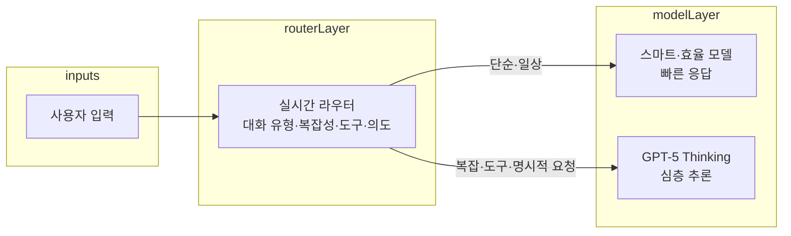

## 개요

2025년 8월 7일, OpenAI는 그동안 공개한 모델 중 **가장 스마트하고 빠르며 유용한** AI 모델 **GPT-5**를 정식 출시했다. 코딩, 수학, 글쓰기, 건강, 시각 인식 등 전 분야에서 이전 모델을 넘어서는 성능을 보이며, 단순한 대화 도구를 넘어 **실제 문제 해결 도구**로 자리 잡고 있다.

**이 포스트가 도움이 되는 독자**

- GPT-5와 이전 모델(GPT-4o, o3 등)의 차이를 한눈에 알고 싶은 개발자·기획자
- API·가격·가용성·컨텍스트 길이 등 실무 스펙을 정리해 보고 싶은 엔지니어
- 코딩·글쓰기·건강·에이전트 등 활용 영역별 성능과 한계를 파악하고 싶은 사용자
- Safe Completions·라우팅·추론 모드 등 아키텍처와 안전성 정책에 관심 있는 연구자·PM

아래에서는 **통합 시스템 아키텍처**, **핵심 벤치마크·모델 라인업**, **기술적 혁신·API·가격·활용**, **참고 문헌**까지 규칙에 맞춰 체계적으로 정리한다.

---

## 통합 시스템 아키텍처

GPT-5는 **하나의 통합 시스템**으로, 세 가지 구성 요소가 실시간 라우터에 의해 조합되어 동작한다.

| 구성 요소 | 역할 |
|-----------|------|
| **스마트·효율 모델** | 대부분의 질문에 빠르게 답변 |
| **깊은 추론 모델 (GPT-5 Thinking)** | 복잡한 문제를 위한 심층 사고 |
| **실시간 라우터** | 대화 유형·복잡성·도구 필요성·사용자 의도에 따라 적절한 모델 자동 선택 |

사용자가 "이것에 대해 깊이 생각해봐"처럼 **명시적으로 요청**하거나, 복잡한 문제를 제시하면 라우터가 **추론 모드**를 활성화한다. 라우터는 사용자 전환·선호도·측정된 정확성 등 **실제 신호**로 지속 학습하며, 사용 한도 도달 시에는 각 모델의 **mini** 버전이 나머지 쿼리를 처리한다.

향후에는 이 **스마트·추론·라우터** 기능을 **단일 모델**로 통합할 계획이다.

---

## GPT-5의 핵심 특징

### 코딩

- **복잡한 프론트엔드 생성** 능력이 크게 향상되었고, **대규모 저장소 디버깅** 성능도 개선되었다.
- 단일 프롬프트로 반응형 웹사이트·앱·게임을 만들 수 있으며, **미적 감각·타이포그래피·여백**에 대한 이해가 높다.
- Cursor, Windsurf, GitHub Copilot, Codex CLI 등 **에이전트 코딩** 환경에서 강점을 보인다.

### 글쓰기 및 창작

- **문학적 깊이와 리듬**을 갖춘 글쓰기가 가능하며, 구조적 모호성(무운율 오행시·자유시 등)을 더 잘 처리한다.
- 보고서·이메일·메모 작성·편집 능력이 향상되었고, **아첨(sycophancy)** 비율이 낮아져 과도한 동의·불필요한 이모지가 줄었다.

### 건강

- **HealthBench**에서 이전 모델 대비 크게 향상된 성능을 보인다.
- 사용자 맥락·지식 수준·지역에 맞춘 **정확하고 신뢰할 수 있는 응답**을 제공하며, 잠재적 우려를 플래그하고 질문을 통해 더 도움이 되는 답변을 이끌어 낸다.
- **의료 전문가를 대체하지 않고**, 보조 도구로서의 역할을 강조한다.

---

## 벤치마크 성능

GPT-5는 여러 벤치마크에서 **새로운 최고 기록**을 세웠다.

| 영역 | 벤치마크 | 결과 (요약) |
|------|----------|-------------|
| **수학** | AIME 2025 (도구 없음) | 94.6% |
| **코딩** | SWE-bench Verified | 74.9% |
| **코딩** | Aider Polyglot | 88% |
| **멀티모달** | MMMU | 84.2% |
| **건강** | HealthBench Hard | 46.2% |
| **과학** | GPQA (GPT-5 Pro, 도구 없음) | 88.4% |

추론 모드에서는 **LongFact·FActScore** 등에서 o3 대비 **환각이 약 6배 감소**했고, ChatGPT 생산 트래픽 표본에서는 GPT-4o 대비 **사실 오류 최대 약 20% 감소**, o3 대비 **사실 오류 최대 약 70% 감소**로 보고되었다.

---

## GPT-5 모델 라인업

### GPT-5 (메인 모델)

- **용도**: 코딩·에이전트 작업에 최적화된 최상위 모델
- **가격 (발표 시점 기준)**  
  - 입력: $1.25/100만 토큰  
  - 캐시된 입력: $0.125/100만 토큰  
  - 출력: $10.00/100만 토큰  

### GPT-5 mini

- **용도**: 명확한 작업용 **빠르고 저렴한** 버전
- **가격**  
  - 입력: $0.25/100만 토큰  
  - 캐시된 입력: $0.025/100만 토큰  
  - 출력: $2.00/100만 토큰  

### GPT-5 nano

- **용도**: 요약·분류 등 **가장 빠르고 저렴한** 버전
- **가격**  
  - 입력: $0.05/100만 토큰  
  - 캐시된 입력: $0.005/100만 토큰  
  - 출력: $0.40/100만 토큰  

### GPT-5 Pro

- **용도**: 가장 **도전적·복잡한** 작업용, 확장된 추론
- **특징**: 더 오래 생각해 **최고 품질·포괄적 답변** 제공
- **성능**: 1,000개 이상의 경제적 가치가 있는 실제 추론 프롬프트에서, 외부 전문가가 **GPT-5 Pro를 67.8% 선호**했으며, 주요 오류는 약 22% 감소했다.

> 실제 가격·모델명은 [OpenAI API 가격 정책](https://openai.com/ko-KR/api/pricing/) 및 [개발자 문서](https://platform.openai.com/docs/pricing)에서 최신 정보를 확인하는 것이 좋다.

---

## 기술적 혁신

### 더 빠르고 효율적인 사고

- **OpenAI o3 대비 50~80% 적은 출력 토큰**으로 더 나은 성능을 낸다.
- 시각적 추론·에이전트 코딩·대학원 수준 과학 문제 등에서 **효율성이 향상**되었다.

### 향상된 정확성·신뢰성·정직성

- **사실 오류 감소**: 생산 트래픽 표본에서 GPT-4o 대비 최대 약 20%, 추론 모드에서는 o3 대비 최대 약 70% 감소.
- **환각**: LongFact·FActScore에서 o3 대비 약 **6배 감소**.
- **기만·과신 감소**: 불가능한 작업·불완전한 정보에 대해 한계를 더 정확히 인식하고 전달하며, 기만율은 o3 4.8% → GPT-5 추론 2.1%, 존재하지 않는 이미지에 대한 자신감 있는 답변은 o3 86.7% → GPT-5 9%로 줄었다.

### 새로운 안전성 접근: Safe Completions

- **거절 기반 안전성**에서 벗어나, **가능한 한 도움이 되는 답변**을 하면서도 **안전 경계 내**에 머무르도록 훈련했다.
- **투명한 거절**: 거절이 필요할 때 **이유를 명확히 설명**하고 안전한 대안을 제시한다.
- **이중 사용 도메인**(예: 바이러스학)에서 더 **유연하고 세밀한** 대응이 가능하다. 자세한 내용은 [강한 거절에서 안전한 완성으로](https://openai.com/ko-KR/index/gpt-5-safe-completions/) 참고.

### 개발자를 위한 신규 API 기능

| 기능 | 설명 |
|------|------|
| **reasoning_effort** | minimal / low / medium / high — 사고 시간·속도·품질 트레이드오프 제어 |
| **verbosity** | low / medium / high — 기본 응답 길이 제어 (명시적 지시가 있으면 지시 우선) |
| **Custom Tools** | JSON 대신 **평문**으로 도구 호출 가능, 정규식·문맥 자유 문법으로 형식 제약 가능 |
| **도구 사용** | 병렬 도구 호출, 내장 도구(웹 검색·파일 검색·이미지 생성 등) 강화 |
| **컨텍스트** | 입력 272,000 토큰 + 추론·출력 128,000 토큰 = **총 400,000 토큰** |

---

## 활용 방안

### 기업 활용

- **BNY Mellon, California State University, Figma, Intercom, Lowe's, Morgan Stanley, SoftBank, T-Mobile** 등이 직원 대상 AI로 이미 도입했으며, **500만 명** 규모의 유료 사용자가 ChatGPT 비즈니스 제품을 사용 중이다.
- API 기반 운영 재구성을 통해 **새로운 사용 사례**를 만들 수 있다.

### 개발자 활용

- **Codex CLI**를 통한 코딩 지원, 복잡한 프론트엔드·대규모 저장소 디버깅, **단일 프롬프트**로 완전한 웹 애플리케이션 생성이 가능하다.
- Cursor·Windsurf·GitHub Copilot 등과 연동해 **에이전트 코딩** 워크플로에 활용할 수 있다.

### 개인 사용자 활용

- 일상적인 글쓰기(보고서·이메일·메모), 건강 관련 질문·정보 수집, 창작(시·소설·기사 등)에 활용할 수 있다.

---

## 접근성 및 가격 정책

### ChatGPT 내 사용

- **가용성**: 출시 시점 기준 Free·Plus·Pro·Team에서 사용 가능, Enterprise·Edu는 1주 내 제공 예정.
- **무료 사용자**: 제한된 사용량으로 GPT-5 사용 가능, 한도 도달 시 **GPT-5 mini**로 자동 전환.
- **Plus**: 일상 질문용 기본 모델로 사용 가능.
- **Pro**: **무제한 GPT-5** 및 **GPT-5 Pro** 사용 가능.
- **Team / Enterprise / Edu**: 조직 전체가 GPT-5를 기본 모델로 활용 가능.

### API 사용

- 모든 사용자가 **OpenAI API**를 통해 GPT-5 계열 사용 가능.
- API 모델: `gpt-5`, `gpt-5-mini`, `gpt-5-nano` (ChatGPT 비추론 모델: `gpt-5-chat-latest`).
- **Batch API**로 최대 **50% 비용 절감**, **Priority processing**으로 고속 처리 옵션 제공.
- 최신 가격·할인·지역별 요금은 [OpenAI API 가격](https://openai.com/ko-KR/api/pricing/) 및 [개발자 가격 문서](https://platform.openai.com/docs/pricing)를 참고한다.

---

## 지식 컷오프 및 컨텍스트

- **GPT-5**: 2024년 10월 1일까지의 정보 기준.
- **GPT-5 mini, nano**: 2024년 5월 31일까지의 정보 기준.
- **컨텍스트 윈도우**: 입력 272,000 + 추론·출력 128,000 = **총 400,000 토큰**.

---

## 미래 전망

- **기술**: 스마트·추론·라우터를 **단일 모델**로 통합할 계획이며, 지속적인 성능 향상과 효율적인 추론 시스템 개발이 이어질 전망이다.
- **산업**: 생산성·효율성·창의적 결과물 향상을 위해 기업이 직원에게 AI를 제공하는 흐름이 확대되고, **새로운 직업·역할**이 생길 수 있다.
- **사회**: 전문가 수준 지능의 보급, 창의성·문제 해결 능력 향상 지원, 디지털 격차 완화 등이 논의되고 있다.

---

## 결론

GPT-5는 **단순한 버전 업이 아니라**, 통합 아키텍처·획기적인 성능·실용적인 활용까지 갖춘 **새로운 패러다임**의 AI 시스템이다. 코딩·글쓰기·건강 분야의 뛰어난 성능과 기업 도입·500만 유료 사용자 규모는 이미 **비즈니스 필수 도구**로 자리 잡았음을 보여준다. 앞으로 고급 AI와 인간의 협업이 더욱 깊어지는 가운데, GPT-5는 그 **중요한 이정표**라 할 수 있다.

---

## 참고 문헌

1. [Introducing GPT-5 \| OpenAI](https://openai.com/index/introducing-gpt-5/) — 공식 발표 및 통합 시스템·벤치마크·안전성 요약  
2. [GPT-5와 새로운 시대의 작업 \| OpenAI](https://openai.com/ko-KR/index/gpt-5-new-era-of-work/) — 기업·에이전트·생산성 관점  
3. [OpenAI API 가격 \| OpenAI](https://openai.com/ko-KR/api/pricing/) — 최신 가격·플랜  
4. [Introducing GPT-5 for developers \| OpenAI](https://openai.com/index/introducing-gpt-5-for-developers/) — API·코딩·에이전트·Custom Tools·벤치마크 상세  
5. [강한 거절에서 안전한 완성으로 \| OpenAI](https://openai.com/ko-KR/index/gpt-5-safe-completions/) — Safe Completions 안전성 훈련  
6. [GPT-5 시스템 카드 \| OpenAI](https://openai.com/ko-KR/index/gpt-5-system-card/) — 시스템 구성·평가·안전 조치 요약  
