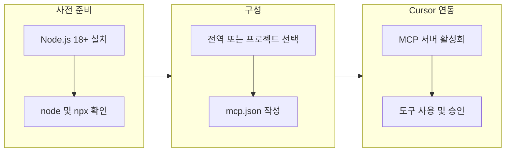

## 개요

**Cursor**에서 웹 자동화가 필요할 때마다 브라우저를 직접 조작하거나 복잡한 스크립트를 작성해야 했다면, 이제 **Playwright MCP**로 그 워크플로우가 달라진다. Microsoft가 공식 배포하는 `@playwright/mcp`는 **Model Context Protocol(MCP)**을 통해 AI 어시스턴트가 브라우저를 직접 제어할 수 있게 해주는 도구다.

기존 웹 스크래핑이나 UI 테스팅 도구와 달리, Playwright MCP는 **접근성 트리 기반의 구조화된 DOM 스냅샷**을 사용해 스크린샷이나 비전 모델 없이도 빠르고 정확한 웹 상호작용을 제공한다. Cursor의 MCP 통합을 통해 **승인 흐름과 안전한 격리 환경**까지 활용할 수 있다.

이 가이드에서는 **대상 독자**, **필요 사항**, **구성 흐름**을 먼저 정리한 뒤, Windows 11 환경을 기준으로 Node.js 설치부터 `.cursor/mcp.json` 작성, 브라우저 옵션, 트러블슈팅까지 **단계별로** 다룬다.

| 항목 | 내용 |
|------|------|
| **추천 대상** | Cursor로 웹 자동화·테스트·스크래핑을 하고 싶은 개발자, Windows·macOS·Linux 사용자 |
| **필요 사항** | Node.js 18+, Cursor, (선택) 브라우저 채널·헤드리스·격리 옵션 이해 |
| **소요 시간** | 최소 구성 약 5분, 옵션 확장 시 10~15분 |

---

## MCP와 @playwright/mcp 소개

### MCP(Model Context Protocol)란

**MCP**는 에디터·에이전트가 외부 도구와 데이터를 안전하게 연결하는 표준 프로토콜이다. Cursor는 MCP를 통해 도구를 켜고 끄며, **승인 흐름**을 제공한다. 구성 위치와 사용 예시는 공식 문서를 참고하면 된다.

- [Cursor – Model Context Protocol](https://docs.cursor.com/context/model-context-protocol)

### @playwright/mcp의 특징

**@playwright/mcp**는 Microsoft가 배포하는 공식 Playwright MCP 서버다.

- 스크린샷·비전 모델 없이 **접근성 트리 기반** 구조화 DOM으로 상호작용
- 요구 사항·기본 구성·실행 옵션은 공식 저장소 README가 가장 정확함

- [GitHub: microsoft/playwright-mcp](https://github.com/microsoft/playwright-mcp)

---

## 설정 흐름 개요

아래 다이어그램은 **최소 구성** 기준 설정 단계를 나타낸다. 전역·프로젝트 중 한 곳에 `mcp.json`을 두고, Cursor에서 MCP 서버를 활성화하면 된다.



---

## 사전 준비: Node.js 설치 (Windows 기준)

- **요구 버전**: 공식 문서 기준 **Node.js 18+**
- Windows PowerShell에서 LTS 설치 예시:

```powershell
winget install OpenJS.NodeJS.LTS -s winget
node -v
npm -v
```

macOS는 `brew install node`, Linux는 배포판 패키지 매니저 또는 NodeSource를 사용하면 된다. 설치 후 `node -v`가 18 이상인지 반드시 확인하자.

---

## 전역/프로젝트 구성 파일 위치

| 범위 | 경로 |
|------|------|
| **전역** | `~/.cursor/mcp.json` (Windows 예: `C:\Users\<사용자>\.cursor\mcp.json`) |
| **프로젝트** | `<프로젝트 루트>/.cursor/mcp.json` |

Cursor 문서의 권장 위치와 예시는 다음에서 확인할 수 있다.

- [Using mcp.json](https://docs.cursor.com/context/mcp#using-mcp-json)

---

## 최소 작동 구성 (권장)

아래 설정은 대부분의 MCP 호환 클라이언트에서 동작하는 **표준 구성**이며, Cursor에서도 그대로 사용할 수 있다.

```json
{
  "mcpServers": {
    "playwright": {
      "command": "npx",
      "args": ["@playwright/mcp@latest"]
    }
  }
}
```

출처: [microsoft/playwright-mcp – Getting started](https://github.com/microsoft/playwright-mcp#getting-started)

---

## 실전 옵션: 브라우저·헤드리스·격리·포트

공식 README의 `--help`에 다양한 옵션이 있다. 자주 쓰는 것만 정리한다.

| 옵션 | 설명 |
|------|------|
| `--browser chrome\|msedge\|firefox\|webkit` | 브라우저 채널 선택 |
| `--headless` | 헤드리스 실행 (기본은 headed) |
| `--caps=vision` | 접근성 외 좌표 클릭 기능 |
| `--caps=pdf` | PDF 생성 도구 포함 |
| `--isolated` | 격리 세션 (초기 로그인 상태는 `--storage-state=path/to/storage.json`) |
| `--block-service-workers` | 서비스워커 차단 |
| `--allowed-origins`, `--blocked-origins` | 허용/차단 목록 (세미콜론 구분) |
| `--port 8931` | 원격(SSE/HTTP) 서버 노출 후, 클라이언트에서 `"url": "http://localhost:8931/mcp"` 로 연결 |

### 예시 1: 격리 세션 + 초기 스토리지 상태

```json
{
  "mcpServers": {
    "playwright": {
      "command": "npx",
      "args": [
        "@playwright/mcp@latest",
        "--isolated",
        "--storage-state=state.json"
      ]
    }
  }
}
```

### 예시 2: 원격 서버로 실행 후 Cursor가 URL로 연결

터미널에서 서버 기동:

```bash
npx @playwright/mcp@latest --port 8931
```

`mcp.json`에서는 URL만 지정:

```json
{
  "mcpServers": {
    "playwright": { "url": "http://localhost:8931/mcp" }
  }
}
```

상세 사용법은 다음을 참고한다.

- [README – Configuration / Standalone](https://github.com/microsoft/playwright-mcp#configuration-file)
- [Standalone MCP server](https://github.com/microsoft/playwright-mcp#standalone-mcp-server)

---

## Cursor에서 켜기: UI와 파일, 두 가지 방식

1. **UI**: Settings → Tools → MCP → Add new global MCP server → 이름·명령·인자 입력  
2. **파일**: `~/.cursor/mcp.json` 또는 프로젝트의 `.cursor/mcp.json`을 직접 작성

Cursor 문서에는 **확장 API**로 프로그램적으로 서버를 등록하는 방식도 소개되어 있다. 엔터프라이즈·자동화 환경에 유용하다.

- [MCP Extension API](https://docs.cursor.com/context/mcp-extension-api)

---

## 다른 배포판과의 비교

| 기준 | @playwright/mcp (공식) | executeautomation/mcp-playwright (커뮤니티) | 기타 커스텀·래퍼형 |
|------|-------------------------|----------------------------------------------|---------------------|
| 배포 | Microsoft 공식 npm (`@playwright/mcp`) | GitHub 커뮤니티 리포지토리 | 다양한 개인·기업 리포지토리 |
| 설치 | `npx @playwright/mcp@latest` | 리포지토리별 상이 | 리포지토리별 상이 |
| 기능 | 접근성 트리 기반, `caps=vision/pdf`, 원격·격리, 풍부한 CLI 옵션 | 대체로 유사하나 최신 기능 추적은 리포마다 편차 | 목적 특화(테스트·크롤링 등) 래퍼 추가 가능 |
| 문서·업데이트 | 활발한 릴리스·문서화 | 유지보수 빈도 가변 | 가변 |
| 권장도 | **기본 선택지로 권장** | 특정 워크플로우에서 대안 | 특수 기능 필요 시 선택 |

- 공식: [microsoft/playwright-mcp](https://github.com/microsoft/playwright-mcp)
- 대안 예시: [executeautomation/mcp-playwright](https://github.com/executeautomation/mcp-playwright), [LobeHub – Playwright MCP 예시](https://lobehub.com/ko/mcp/abhishek0505bit-playwright-mcpserver)

가능하면 **공식 배포판을 먼저 적용**하는 것이 좋다. 최신 Playwright·브라우저 채널 연동과 문서·옵션 일관성에서 이점이 크다.

---

## 보안·승인 및 도구 토글

Cursor는 MCP 도구 사용 시 기본적으로 **사용자 승인**을 요구하며, 토글로 도구 활성/비활성을 관리한다. 이미지·파일 응답을 Base64로 전달하는 형태도 지원한다. 자세한 정책과 보안 체크리스트는 다음을 참고한다.

- [Tool approval · Security](https://docs.cursor.com/context/mcp#security-considerations)

---

## 문제 해결 (Windows 포함)

| 증상 | 대응 |
|------|------|
| 전역·프로젝트 설정이 로드되지 않음 | Windows 11에서 프로젝트 단위 `.cursor/mcp.json` 인식 이슈 사례가 커뮤니티에 보고된 바 있다. [Cursor Forum – Project-level mcp.json not working (Windows 11)](https://forum.cursor.com/t/project-level-mcp-json-configuration-not-working-in-windows11/62182) 참고. UI에서 Disabled → Enabled로 전환해 보자. |
| Node 버전 오류 | `node -v`로 18+ 확인. 낮으면 LTS 재설치 |
| 브라우저 실행 실패 | `--executable-path`로 경로 지정 또는 `--headless`로 테스트 |
| 네트워크 차단 | `--allowed-origins` / `--blocked-origins` 점검, 프록시 환경은 `--proxy-server` / `--proxy-bypass` 사용 |

---

## 빠른 체크리스트

1. Node.js 18 이상 설치 및 `node -v` 확인  
2. `~/.cursor/mcp.json` 또는 프로젝트 `/.cursor/mcp.json`에 표준 구성 추가  
3. 필요 시 `--isolated`, `--headless`, `--caps=vision` / `--caps=pdf` 등 옵션 확장  
4. 보안·승인 정책 확인 후 실제 브라우저 작업 시도  

---

## 참고 자료

1. **공식 Playwright MCP 저장소**  
   [microsoft/playwright-mcp](https://github.com/microsoft/playwright-mcp)

2. **Cursor MCP 가이드**  
   [Cursor – Model Context Protocol](https://docs.cursor.com/context/model-context-protocol)

3. **MCP 서버 추가 방법 (Snyk)**  
   [How to Add a New MCP Server to Cursor](https://snyk.io/articles/how-to-add-a-new-mcp-server-to-cursor/)

4. **Cursor MCP 서버 설정 (Apideck)**  
   [Unlocking AI potential: How to quickly set up a Cursor MCP Server](https://www.apideck.com/blog/unlocking-ai-potential-how-to-quickly-set-up-a-cursor-mcp-server)

5. **다수 MCP 서버 연동 (Composio)**  
   [How to connect Cursor to 100+ MCP Servers within minutes](https://composio.dev/blog/how-to-connect-cursor-to-100-mcp-servers-within-minutes)
