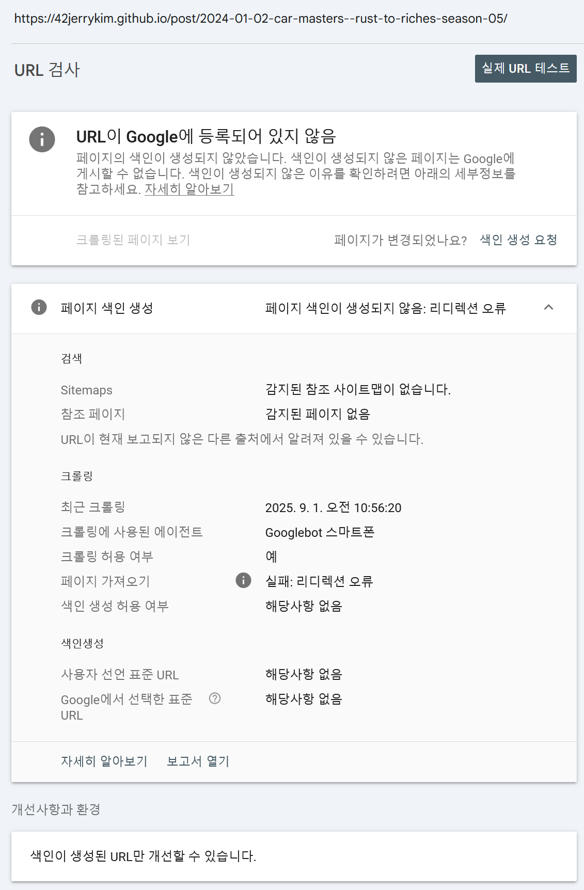
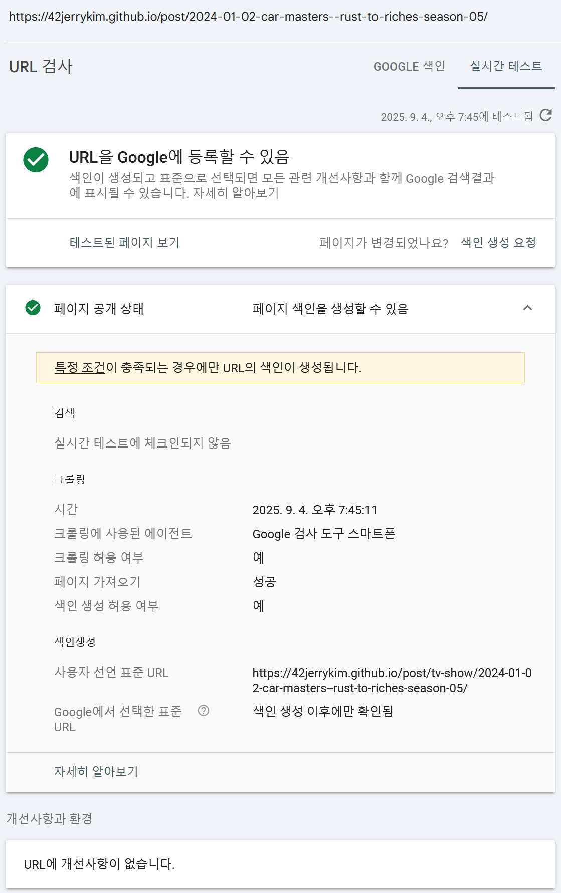

Hugo 정적 사이트 생성기에서 alias를 사용하여 URL을 리다이렉트할 때 발생하는 `noindex` 태그와 그로 인한 SEO 문제에 대해 깊이 있게 분석해보겠습니다. 특히 Google Search Console에서 발생하는 호환성 문제를 해결하는 방법과 canonical 태그의 올바른 사용법을 알아보겠습니다.

||
|:---:|
|문제 상황|

## Hugo Alias의 기본 동작

Hugo에서 alias를 설정하면 다음과 같은 메타 태그가 포함된 HTML 리다이렉트 페이지가 생성됩니다:

```html
<!DOCTYPE html>
<html lang="en-us">
<head>
    <title>https://example.org/posts/new-file-name/</title>
    <link rel="canonical" href="https://example.org/posts/new-file-name/">
    <meta name="robots" content="noindex">
    <meta charset="utf-8">
    <meta http-equiv="refresh" content="0; url=https://example.org/posts/new-file-name/">
</head>
</html>
```

### 각 태그의 역할

1. **Canonical 태그**: 검색 엔진에게 이 페이지의 정식 URL을 알려줍니다
2. **Noindex 태그**: 검색 엔진에게 이 페이지를 색인하지 말라고 지시합니다
3. **Meta Refresh**: 브라우저에게 즉시 새 URL로 리다이렉트하도록 합니다

## SEO 문제점 분석

### Google Search Console 호환성 문제

2025년 8월 기준, Google Search Console의 새 버전에서는 Hugo의 기본 alias 템플릿이 다음과 같은 문제를 일으킵니다:

- **검사 실패**: `noindex` 태그가 있으면 Google이 페이지를 제대로 크롤링하지 못합니다
- **Canonical 인식 실패**: `noindex`로 인해 canonical 관계가 제대로 인식되지 않습니다
- **색인 생성 오류**: Search Console에서 "noindex 관련 색인 생성 오류"가 발생합니다

### SEO 순위 영향

기존에 색인된 URL을 alias로 리다이렉트할 때:

- **링크 이퀴티 손실**: 기존 페이지의 권한이 새 페이지로 완전히 이전되지 않을 수 있습니다
- **크롤링 예산 낭비**: 검색 엔진이 alias 페이지를 크롤링하느라 본 페이지를 덜 크롤링할 수 있습니다
- **사용자 경험 저하**: 리다이렉트가 지연될 수 있습니다

## 해결 방법

### 커스텀 Alias 템플릿 사용

`layouts/alias.html` 파일을 생성하여 `noindex` 태그를 제거합니다:

```html
<!DOCTYPE html>
<html>
<head>
    <title>{{ .Permalink }}</title>
    <link rel="canonical" href="{{ .Permalink }}"/>
    <meta charset="utf-8" />
    <meta http-equiv="refresh" content="0; url={{ .Permalink }}" />
</head>
</html>
```

||
|:---:|
|해결 상홤|

### 301 리다이렉트 사용 (서버 수준)

가능하다면 서버 수준에서 301 리다이렉트를 구현하는 것이 가장 좋습니다:

**Apache (.htaccess)**
```apache
Redirect 301 /old-url /new-url
```

**Nginx**
```nginx
location /old-url {
    return 301 /new-url;
}
```

### Netlify 리다이렉트

Netlify를 사용하는 경우 `_redirects` 파일을 사용합니다:

```
/old-url  /new-url  301
```

## SEO 모범 사례

### Alias 사용 시점

다음과 같은 상황에서 alias를 사용하세요:

- **사이트 구조 변경**: `/blog/post-1` → `/posts/post-1`
- **콘텐츠 통합**: 여러 관련 페이지를 하나로 병합
- **URL 정규화**: `/Post-1` → `/post-1`
- **사이트 이전**: 다른 도메인에서 콘텐츠 이전

### Canonical 태그 최적화

canonical 태그를 올바르게 설정하기 위해:

1. **절대 URL 사용**: 상대 경로가 아닌 완전한 URL 사용
2. **자체 참조**: 모든 페이지에 자신의 canonical URL 포함
3. **일관성 유지**: 모든 유사한 페이지가 동일한 canonical URL 가리키기
4. **HTTPS 우선**: HTTPS URL을 canonical로 설정

### Google Search Console 관리

1. **검색 콘솔에서 모니터링**: 리다이렉트가 제대로 작동하는지 확인
2. **색인 생성 오류 수정**: noindex 관련 오류가 있는지 정기적으로 확인
3. **URL 검사 도구 활용**: 각 alias URL이 올바르게 canonical URL을 가리키는지 확인

## 실제 사례 연구

### HAHWUL 블로그 사례

HAHWUL의 블로그에서 Jekyll에서 Hugo로 마이그레이션할 때 alias를 사용한 사례:

- **문제**: 기존에 색인된 URL들이 noindex로 인해 SEO 점수 하락
- **해결**: 커스텀 alias 템플릿으로 noindex 제거
- **결과**: Google이 alias를 통해 canonical 관계를 제대로 인식

### 커뮤니티 토론

Hugo Discourse에서 비슷한 문제를 겪은 사용자들의 의견:

> "I never saw an issue with the old version of the search console picking up the redirect, or most importantly the 'canonical' as that is what they use to recognise a redirect."

새 Search Console에서는 noindex가 canonical 인식을 방해한다는 보고가 있습니다.

## 기술적 구현 세부사항

### Hugo Alias 생성 방법

```yaml
---
title: "My Old Post"
aliases:
  - /posts/old-url
  - /old-category/old-post
  - /2019/01/01/old-title/
---
```

### Alias 템플릿 변수

Hugo alias 템플릿에서 사용할 수 있는 변수:

- `.Permalink`: 대상 페이지의 완전한 URL
- `.Page`: 대상 페이지의 모든 데이터
- `.Site`: 사이트 전체 정보

## 결론

Hugo alias는 URL 리다이렉션을 위한 강력한 도구지만, 기본 `noindex` 태그가 SEO에 부정적인 영향을 미칠 수 있습니다. 특히 Google Search Console의 새 버전에서는 이 문제가 더욱 두드러집니다.

**권장사항:**

1. **단기 해결**: 커스텀 alias 템플릿으로 noindex 제거
2. **장기 해결**: 서버 수준 301 리다이렉트 구현
3. **모니터링**: Search Console에서 리다이렉트 성능 모니터링
4. **테스트**: 각 alias가 제대로 작동하는지 정기적으로 확인

이러한 접근 방식을 통해 SEO를 유지하면서도 URL 구조를 유연하게 관리할 수 있습니다.

## 참고 자료

1. [Hugo 공식 문서 - URL 관리](https://gohugo.io/content-management/urls/#aliases)
2. [HAHWUL 블로그 - Hugo alias SEO 문제 해결](https://www.hahwul.com/blog/2021/remove-noindex-in-hugo-alias/)
3. [Hugo Discourse - Google Search Console 호환성](https://discourse.gohugo.io/t/aliases-appear-not-to-work-properly-in-the-new-google-search-console/16246)
4. [Google Search Central - 리다이렉트 가이드](https://developers.google.com/search/docs/crawling-indexing/301-redirects)
