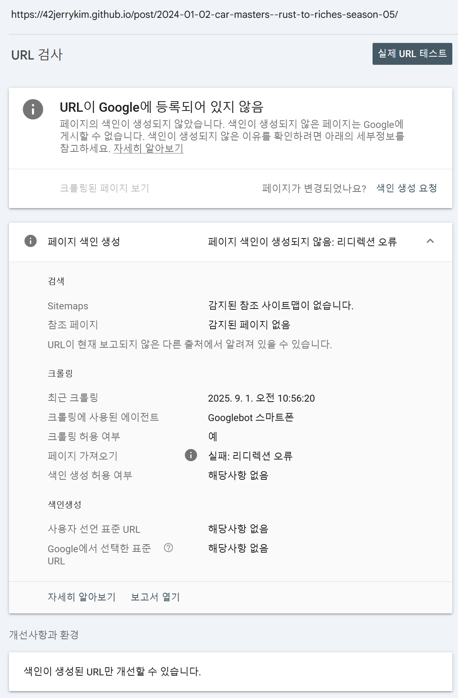
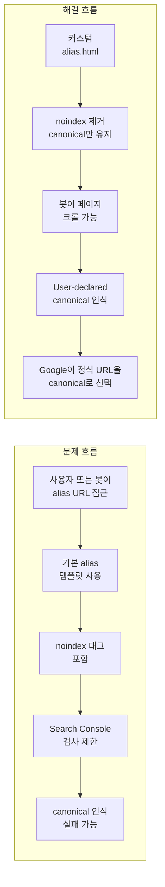
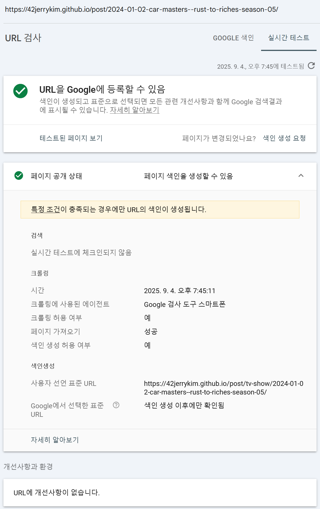

Hugo 정적 사이트에서 **alias**를 사용해 이전 URL을 새 URL로 리다이렉트할 때, 생성되는 HTML에 포함되는 **noindex** 메타 태그가 Google Search Console 및 SEO에 미치는 영향과, **canonical** 태그를 활용한 해결 방법을 정리합니다. 커스텀 alias 템플릿·서버 수준 301 리다이렉트 등 실무에 바로 쓸 수 있는 전략까지 포함했습니다.

||
|:---:|
|문제 상황|

---

## 개요: 이 글에서 다루는 내용

- **Hugo alias의 기본 동작**: 어떤 메타 태그가 붙는지, canonical·noindex·meta refresh의 역할
- **SEO·Search Console에서의 문제**: noindex로 인한 검사 실패·canonical 인식 실패·색인 생성 오류
- **해결 방법**: 커스텀 `alias.html`로 noindex 제거, 서버/호스팅 301 리다이렉트
- **모범 사례**: alias 사용 시점, canonical 최적화, Search Console 관리
- **실제 사례**: HAHWUL 블로그, Hugo Discourse 커뮤니티 사례
- **기술 세부**: alias 정의 방법, alias 템플릿 변수

---

## Hugo Alias의 기본 동작

Hugo에서 페이지에 `aliases`를 설정하면, 각 alias 경로마다 **클라이언트 리다이렉트용 HTML 파일**이 생성됩니다. (일부 Hugo 버전 또는 빌드 환경에서는 아래와 같이 **noindex**가 포함된 형태로 생성될 수 있습니다.)

```html
<!DOCTYPE html>
<html lang="en-us">
<head>
    <title>https://example.org/posts/new-file-name/</title>
    <link rel="canonical" href="https://example.org/posts/new-file-name/">
    <meta name="robots" content="noindex">
    <meta charset="utf-8">
    <meta http-equiv="refresh" content="0; url=https://example.org/posts/new-file-name/">
</head>
</html>
```

### 각 태그의 역할

1. **Canonical 태그** (`link rel="canonical"`): 검색 엔진에게 이 페이지의 **정식 URL**이 무엇인지 알려 줍니다.
2. **Noindex 태그** (`meta name="robots" content="noindex"`): 검색 엔진에게 이 URL을 **색인하지 말 것**을 지시합니다.
3. **Meta Refresh** (`meta http-equiv="refresh"`): 브라우저가 **즉시** 새 URL로 이동하도록 합니다.

즉, “이 주소는 곧바로 정식 URL로 넘어가고, 이 리다이렉트 페이지 자체는 색인하지 마라”는 의미입니다. 사용자 경험상으로는 리다이렉트가 잘 되지만, **Google Search Console 새 버전**에서는 이 noindex 때문에 검사·canonical 인식에 문제가 보고되고 있습니다.

---

## Alias와 noindex가 만든 SEO 이슈 (흐름도)

아래 다이어그램은 “alias URL 접근 → 기본 템플릿의 noindex → Search Console 이슈”와 “noindex 제거·canonical만 유지 → 해결” 흐름을 요약합니다.


```mermaid
flowchart LR
    subgraph problemFlow["문제 흐름"]
        aliasRequest[사용자 또는 봇이</br>alias URL 접근] --> defaultTemplate[기본 alias</br>템플릿 사용]
        defaultTemplate --> noindexTag["noindex 태그</br>포함"]
        noindexTag --> searchConsoleIssue[Search Console</br>검사 제한]
        searchConsoleIssue --> canonicalFail["canonical 인식</br>실패 가능"]
    end
    subgraph solutionFlow["해결 흐름"]
        customTemplate[커스텀</br>alias.html] --> canonicalOnly["noindex 제거</br>canonical만 유지"]
        canonicalOnly --> crawlOk[봇이 페이지</br>크롤 가능]
        crawlOk --> userDeclaredCanonical["User-declared</br>canonical 인식"]
        userDeclaredCanonical --> googleSelectedCanonical[Google이 정식 URL을</br>canonical로 선택]
    end
```

---

## SEO·Search Console에서의 문제점

### Google Search Console 호환성 문제

2025년 8월 기준, **새 Google Search Console**에서는 Hugo 기본 alias 템플릿(noindex가 포함된 형태)을 사용할 때 다음과 같은 현상이 보고됩니다.

- **URL 검사 제한**: noindex가 있으면 Google이 해당 alias URL을 “색인 대상이 아님”으로 처리하며, 검사 도구에서 상세 정보가 제한될 수 있습니다.
- **Canonical 인식 불일치**: noindex와 canonical이 함께 있을 때, 새 Search Console에서 canonical 관계가 기대대로 표시되지 않는 사례가 있습니다.
- **색인 생성 메시지**: “noindex로 인한 색인 생성 제한” 등 관련 메시지가 노출될 수 있습니다.

Hugo Discourse에서는 다음과 같은 경험이 공유되었습니다.

> "I never saw an issue with the old version of the search console picking up the redirect, or most importantly the 'canonical' as that is what they use to recognise a redirect."  
> — 새 Search Console에서는 noindex가 있어 canonical 인식이 제대로 되지 않는 것 같다는 보고가 있습니다.

### SEO·크롤링 관점의 영향

- **링크 이퀴티**: 기존에 색인된 URL을 alias로만 두면, 301이 아닌 meta refresh이기 때문에 신호 전달이 301만큼 명확하지 않을 수 있습니다.
- **크롤링 예산**: alias 페이지를 봇이 계속 방문하면, 본문 페이지 크롤링에 쓰일 예산이 상대적으로 줄어들 수 있습니다.
- **사용자 경험**: meta refresh는 대체로 빠르지만, 서버 수준 301보다는 지연이 있을 수 있습니다.

---

## 해결 방법

### 1) 커스텀 Alias 템플릿으로 noindex 제거

`layouts/alias.html`을 프로젝트에 두면 Hugo 기본 alias 템플릿을 덮어쓸 수 있습니다. **noindex를 제거**하고 **canonical과 meta refresh만** 두는 방식입니다.

`layouts/alias.html` 예시:

```html
<!DOCTYPE html>
<html>
<head>
    <title>{{ .Permalink }}</title>
    <link rel="canonical" href="{{ .Permalink }}"/>
    <meta charset="utf-8" />
    <meta http-equiv="refresh" content="0; url={{ .Permalink }}" />
</head>
</html>
```

이렇게 하면:

- 검색 봇이 alias URL을 크롤할 수 있고,
- `rel="canonical"`로 정식 URL이 명시되며,
- 새 Search Console에서 “User-declared canonical”과 “Google-selected canonical”이 일치하는 것을 확인할 수 있다는 사례가 있습니다.

||
|:---:|
|해결 상황|

### 2) 서버·호스팅 수준 301 리다이렉트 (권장)

가능하다면 **HTTP 301 리다이렉트**를 서버나 호스팅 설정으로 처리하는 것이 가장 좋습니다. 링크 이퀴티 전달과 크롤링 효율 측면에서 유리합니다.

**Apache (.htaccess)**

```apache
Redirect 301 /old-url /new-url
```

**Nginx**

```nginx
location /old-url {
    return 301 /new-url;
}
```

**Netlify** (`_redirects`)

```
/old-url  /new-url  301
```

서버 301을 쓰는 경우, Hugo에서 alias HTML 생성을 끄려면 설정에서 `disableAliases: true`를 고려할 수 있습니다. 이때 리다이렉트 규칙은 Hugo의 [Aliases](https://gohugo.io/methods/page/aliases/) 메서드로 생성한 설정을 배포에 반영하는 방식으로 구성할 수 있습니다.

---

## SEO 모범 사례

### Alias를 쓸 만한 상황

- **사이트 구조 변경**: 예) `/blog/post-1` → `/posts/post-1`
- **콘텐츠 통합**: 여러 비슷한 페이지를 하나의 URL로 통합
- **URL 정규화**: 대소문자·슬래시 통일 (예: `/Post-1` → `/post-1`)
- **사이트·도메인 이전**: 예전 도메인·경로를 새 주소로 연결

### Canonical 태그 설정 원칙

- **절대 URL 사용**: 상대 경로가 아닌 완전한 URL을 canonical에 사용합니다.
- **자체 참조**: 일반 본문 페이지는 자신의 URL을 canonical로 두는 것이 좋습니다.
- **일관성**: 동일한 콘텐츠를 가리키는 여러 URL은 모두 같은 canonical URL을 가리키도록 합니다.
- **HTTPS**: canonical URL은 HTTPS를 사용하는 것이 좋습니다.

### Google Search Console에서의 관리

- **URL 검사**: 중요한 alias URL을 검사 도구로 넣어, canonical이 의도대로 인식되는지 확인합니다.
- **색인 생성 보고서**: noindex·canonical 관련 메시지가 있는지 정기적으로 확인합니다.
- **변경 후 재검사**: alias 템플릿을 바꾼 뒤에는 해당 URL을 제출해 다시 검사해 보는 것이 좋습니다.

---

## 실제 사례

### HAHWUL 블로그 (Jekyll → Hugo 마이그레이션)

- **상황**: Jekyll에서 Hugo로 옮기면서 기존 색인된 URL을 alias로 연결했고, 기본 alias 페이지에 noindex가 포함되어 있었습니다.
- **문제**: Search Console에서 noindex 관련 색인 이슈가 늘고, SEO 지표에 부정적 영향이 있었습니다.
- **대응**: `layouts/alias.html`을 만들어 noindex를 제거하고 canonical과 meta refresh만 두었습니다.
- **결과**: Google이 alias를 통해 정식 URL을 canonical로 인식하게 되었고, noindex 관련 색인 오류가 줄었다고 보고되었습니다.

### Hugo Discourse 커뮤니티

- 커스텀 alias 템플릿으로 noindex를 제거한 뒤, Search Console에서 alias URL을 검사했을 때 “User-declared canonical”과 “Google-selected canonical”이 일치하는 것을 확인한 사례가 있습니다.
- “canonical만으로도 리다이렉트 목적을 충분히 전달할 수 있으므로, noindex는 필수가 아니다”는 의견이 있습니다.

---

## 기술적 구현 세부

### Hugo에서 alias 정의하기

Front matter에 `aliases` 배열을 넣습니다. 사이트 상대 경로·페이지 상대 경로 모두 사용할 수 있습니다.

```yaml
---
title: "My Old Post"
aliases:
  - /posts/old-url
  - /old-category/old-post
  - /2019/01/01/old-title/
---
```

### Alias 템플릿에서 쓸 수 있는 변수

`layouts/alias.html` 안에서는 다음 변수를 사용할 수 있습니다.

- **`.Permalink`**: 리다이렉트 대상 페이지의 **절대 URL**
- **`.Page`**: 대상 페이지의 전체 Page 객체
- **`.Site`**: 사이트 전역 설정·정보

---

## noindex vs canonical 요약

| 구분 | noindex | canonical |
|------|--------|-----------|
| **용도** | “이 URL을 검색 결과에 넣지 마라” | “이 URL의 정식 버전은 저기다” |
| **적합한 경우** | 검색에 노출할 필요가 전혀 없는 페이지 | 같은 콘텐츠의 여러 URL 중 대표 URL 지정 |
| **alias 페이지** | 리다이렉트 페이지만 노출되므로 noindex로 숨기려는 의도가 있었으나, 새 Search Console에서는 canonical 인식을 방해할 수 있음 | canonical만으로 “정식 URL은 여기”라고 알리면, 색인·리다이렉트 인식에 도움이 됨 |

---

## 결론 및 권장사항

Hugo alias는 URL 이전·정리 시 매우 유용하지만, **기본 alias 템플릿에 noindex가 포함된 환경**에서는 Google Search Console과의 호환성·SEO 측면에서 부작용이 있을 수 있습니다.

**권장 순서:**

1. **단기**: `layouts/alias.html` 커스텀 템플릿으로 noindex를 제거하고, canonical과 meta refresh만 유지해 Search Console에서 동작을 확인합니다.
2. **장기**: 가능한 범위에서 **서버·호스팅 301 리다이렉트**로 전환해 링크 이퀴티와 크롤링 효율을 높입니다.
3. **운영**: Search Console에서 alias·정식 URL 관계와 색인 상태를 주기적으로 점검합니다.

이렇게 하면 URL 구조를 유연하게 바꾸면서도 SEO와 검색 노출을 안정적으로 유지할 수 있습니다.

---

## 참고 자료

1. [Hugo 공식 문서 - URL 관리 (Aliases 포함)](https://gohugo.io/content-management/urls/#aliases)
2. [HAHWUL 블로그 - Hugo alias에서 noindex로 인한 SEO 문제 해결](https://www.hahwul.com/blog/2021/remove-noindex-in-hugo-alias/)
3. [Hugo Discourse - Aliases와 새 Google Search Console 호환성 논의](https://discourse.gohugo.io/t/aliases-appear-not-to-work-properly-in-the-new-google-search-console/16246)
