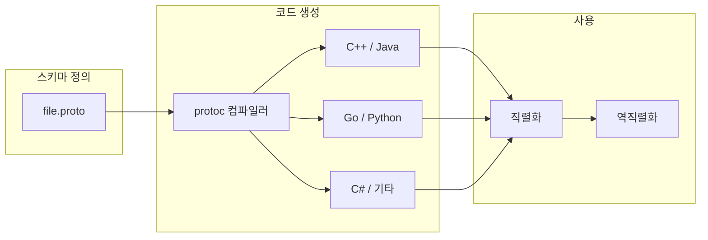

Protocol Buffers(이하 protobuf)는 Google에서 개발한 **언어 중립적·플랫폼 중립적** 확장 가능 데이터 직렬화 메커니즘이다. JSON·XML과 유사한 역할을 하며, 더 작은 크기와 빠른 파싱, 스키마 기반 타입 안전성을 제공한다. 한 번 정의한 `.proto` 스키마로 여러 언어의 소스 코드를 생성해 구조화된 데이터를 읽고 쓸 수 있다.

---

## 개요

### Protocol Buffers가 해결하는 문제

- **데이터 직렬화 표준화**: 언어·플랫폼에 독립적인 이진 표현, 작은 크기와 빠른 파싱
- **크로스 플랫폼 호환성**: 단일 `.proto`에서 다국어 코드 생성, 네트워크 전송 시 호환 보장
- **API 설계 일관성**: 명확한 메시지 구조, 버전 관리와 역·순방향 호환성, 서비스 인터페이스 표준화

### 이 글의 목적과 대상

- **목적**: Proto3 문법, 메시지·필드·서비스 정의, 코드 생성, JSON 대비 특성, 모범 사례를 한 곳에 정리
- **대상**: 백엔드·마이크로서비스·API 설계를 다루는 개발자, gRPC·직렬화 포맷을 선택하려는 팀

### 글의 구성

1. Proto3 핵심 특징과 메시지 타입 정의  
2. 필드 타입·번호·카디널리티(singular, repeated, map)  
3. 고급 기능(enum, nested type, oneof, Any)  
4. RPC 서비스 정의와 옵션  
5. 코드 생성 및 다국어 사용  
6. Protobuf vs JSON, 장단점  
7. 모범 사례(필드 번호, 버전 관리, 성능)  
8. 참고 문헌

---

## Proto3의 핵심 특징

Protocol Buffers 세 번째 버전(Proto3)은 문법 단순화, 기본값 처리 개선, JSON 매핑 지원을 강화했다.

### 간소화된 문법

```proto
syntax = "proto3";

message Person {
  string name = 1;
  int32 id = 2;
  string email = 3;
}
```

### 기본 필드 값 처리

- Proto2에서는 미설정 필드와 기본값을 구분하기 어려웠다.
- Proto3에서는 `optional`을 쓰면 필드 존재 여부를 명시적으로 다룰 수 있다.

### 향상된 JSON 매핑

- Proto3 메시지는 표준에 맞는 JSON 직렬화·역직렬화를 지원하며, REST·로그·디버깅 시 활용하기 좋다.

---

## 메시지 타입 정의하기

### 기본 구조

```proto
syntax = "proto3";

message SearchRequest {
  string query = 1;
  int32 page_number = 2;
  int32 results_per_page = 3;
}
```

### 필드 타입 지정

Protocol Buffers가 지원하는 스칼라 타입과 주요 언어 매핑은 아래와 같다.

| Proto Type | 설명 | C++ Type | Java/Kotlin Type | Python Type |
|------------|------|----------|------------------|-------------|
| double | IEEE 754 배정밀도 | double | double | float |
| float | IEEE 754 단정밀도 | float | float | float |
| int32 | 32비트 정수 | int32_t | int | int |
| int64 | 64비트 정수 | int64_t | long | int/long |
| uint32 | 부호 없는 32비트 | uint32_t | int | int/long |
| uint64 | 부호 없는 64비트 | uint64_t | long | int/long |
| sint32 | 부호 32비트(효율 인코딩) | int32_t | int | int |
| sint64 | 부호 64비트(효율 인코딩) | int64_t | long | int/long |
| fixed32 | 32비트 고정 | uint32_t | int | int/long |
| fixed64 | 64비트 고정 | uint64_t | long | int/long |
| sfixed32 | 32비트 고정(부호 있음) | int32_t | int | int |
| sfixed64 | 64비트 고정(부호 있음) | int64_t | long | int/long |
| bool | 불리언 | bool | boolean | bool |
| string | UTF-8 문자열 | std::string | String | str/unicode |
| bytes | 바이트 배열 | std::string | ByteString | bytes |

### 필드 번호 할당

각 필드에는 **1 이상 536,870,911 이하**의 고유 번호를 부여해야 한다.

- **1–15**: 자주 쓰는 필드(1바이트 인코딩)
- **16–2047**: 중간 빈도(2바이트 인코딩)
- **2048 이상**: 드물게 쓰는 필드

**주의**

- 한 번 쓴 필드 번호는 변경하면 안 된다(호환성 깨짐).
- **19,000–19,999** 구간은 Protocol Buffers 구현용으로 예약되어 있다.

### 필드 카디널리티 (Cardinality)

Proto3에서는 다음 세 가지를 지원한다.

#### Singular (단일 필드)

- **optional**: 존재 여부를 명시적으로 다루는 선택 필드
- 기본 singular 필드: 미설정 시 타입별 기본값(0, 빈 문자열 등)

```proto
message Example {
  optional string name = 1;
  string email = 2;
}
```

#### Repeated (반복 필드)

- 같은 타입의 값을 0개 이상 저장하며, 기본적으로 packed encoding을 사용한다.

```proto
message SearchResponse {
  repeated Result results = 1;
}
```

#### Map (맵 필드)

- 키-값 쌍. 키는 정수 또는 문자열 타입만 가능하다.

```proto
message Project {
  map<string, string> attributes = 1;
}
```

---

## Proto3 메시지와 코드 생성 흐름

아래 다이어그램은 `.proto` 정의부터 다국어 코드 생성·직렬화·역직렬화까지의 흐름을 요약한다.



---

## 고급 기능

### 열거형 (Enums)

```proto
enum Corpus {
  CORPUS_UNSPECIFIED = 0;
  CORPUS_UNIVERSAL = 1;
  CORPUS_WEB = 2;
  CORPUS_IMAGES = 3;
  CORPUS_LOCAL = 4;
  CORPUS_NEWS = 5;
  CORPUS_PRODUCTS = 6;
  CORPUS_VIDEO = 7;
}

message SearchRequest {
  string query = 1;
  Corpus corpus = 2;
}
```

첫 번째 열거값은 **0**으로 두고 `*_UNSPECIFIED` 같은 이름을 쓰는 것이 호환성에 유리하다.

### 중첩 타입 (Nested Types)

```proto
message SearchResponse {
  message Result {
    string url = 1;
    string title = 2;
    repeated string snippets = 3;
  }
  repeated Result results = 1;
}
```

### Oneof

한 번에 하나의 필드만 설정되도록 보장한다.

```proto
message SampleMessage {
  oneof test_oneof {
    string name = 4;
    SubMessage sub_message = 9;
  }
}
```

### Any 타입

타입을 사전에 알 수 없는 메시지를 담을 때 사용한다. `google/protobuf/any.proto`를 import 해야 한다.

```proto
import "google/protobuf/any.proto";

message ErrorStatus {
  string message = 1;
  repeated google.protobuf.Any details = 2;
}
```

---

## 서비스 정의

RPC 서비스 인터페이스를 메시지와 함께 정의할 수 있다. gRPC와 함께 사용되는 전형적인 형태다.

```proto
service SearchService {
  rpc Search(SearchRequest) returns (SearchResponse);
}
```

---

## 옵션 (Options)

언어별 패키지·클래스명·코드 크기 최적화 등을 제어할 수 있다.

```proto
option java_package = "com.example.foo";
option java_outer_classname = "FooProto";
option optimize_for = CODE_SIZE;
```

`optimize_for` 예: `SPEED`, `CODE_SIZE`, `LITE_RUNTIME`.

---

## 코드 생성

### Protocol Compiler 사용

```bash
protoc --proto_path=IMPORT_PATH \
       --cpp_out=DST_DIR \
       --java_out=DST_DIR \
       --python_out=DST_DIR \
       --go_out=DST_DIR \
       path/to/file.proto
```

### 지원 언어

- **C++** / **Java**·**Kotlin** / **Python** / **Go** / **C#** / **Ruby** / **Rust**  
- **Objective-C**, **PHP**, **Dart** 등도 지원된다.  
공식 문서에서 각 언어별 플러그인과 옵션을 확인하는 것이 좋다.

---

## 실제 사용 예제

### 메시지 정의

```proto
syntax = "proto3";

package tutorial;

message Person {
  string name = 1;
  int32 id = 2;
  string email = 3;

  enum PhoneType {
    MOBILE = 0;
    HOME = 1;
    WORK = 2;
  }

  message PhoneNumber {
    string number = 1;
    PhoneType type = 2;
  }

  repeated PhoneNumber phones = 4;
}

message AddressBook {
  repeated Person people = 1;
}
```

### Java에서 빌더로 생성·직렬화·역직렬화

```java
Person john = Person.newBuilder()
    .setId(1234)
    .setName("John Doe")
    .setEmail("jdoe@example.com")
    .addPhones(Person.PhoneNumber.newBuilder()
        .setNumber("555-4321")
        .setType(Person.PhoneType.HOME))
    .build();

try (FileOutputStream output = new FileOutputStream("myfile")) {
  john.writeTo(output);
}

try (FileInputStream input = new FileInputStream("myfile")) {
  Person johnFromFile = Person.parseFrom(input);
}
```

---

## Protocol Buffers의 장점

### 성능

- **작은 크기**: JSON 대비 보통 3~10배 정도 작은 페이로드
- **빠른 파싱**: 이진 형식으로 파싱·생성 속도가 빠름
- **메모리 효율**: 압축된 인코딩으로 메모리 사용이 적음

### 타입 안전성

- 스키마 기반 타입 검증, 컴파일 타임 오류 검출, 런타임에 잘못된 필드 접근 감소

### 호환성

- **역방향**: 구버전 코드가 신규 필드가 추가된 데이터를 읽어도 무시 가능
- **순방향**: 신버전 코드가 구버전 데이터를 읽을 수 있도록 필드 번호·타입 규칙만 지키면 됨
- **언어 독립성**: 동일 스키마로 여러 언어 간 데이터 교환 가능

### 개발 생산성

- 코드 자동 생성, 단일 정의로 다국어 생성, IDE 자동 완성·리팩터링 지원

---

## Protocol Buffers vs JSON

| 특성 | Protocol Buffers | JSON |
|------|------------------|------|
| 크기 | 작음(대략 3~10배 절감) | 상대적으로 큼 |
| 속도 | 파싱·직렬화 빠름 | 상대적으로 느림 |
| 타입 안전성 | 스키마 필수, 타입 검증 | 스키마 선택, 런타임 검증 |
| 가독성 | 이진이라 사람이 보기 어려움 | 텍스트라 읽기·디버깅 용이 |
| 호환성 | 스키마·필드 번호로 관리 | 스키마·버전을 수동 관리 |

REST·로그·설정처럼 사람이 읽어야 하거나 스키마 없이 유연함이 중요하면 JSON이, RPC·내부 서비스·대용량 트래픽에서는 Protobuf가 적합한 경우가 많다.

---

## 모범 사례

### 필드 번호 관리

- 한 번 사용한 번호는 재사용하지 않고, 삭제한 필드 번호는 `reserved`로 표시해 실수로 재사용하지 않도록 한다.
- 번호 구간과 용도를 주석으로 남겨 두면 유지보수에 도움이 된다.

### 메시지 설계

- 메시지는 작고 응집되게 유지하고, 관련 필드는 묶어 두며, 확장 가능성을 고려해 1–15 구간을 자주 쓰는 필드에 할당한다.

### 버전 관리

- 기존 필드 번호·이름 변경을 피하고, 새 필드는 새 번호로 추가한다. 큰 변경은 별도 메시지나 패키지로 나누어 점진적으로 마이그레이션하는 것이 안전하다.

### 성능

- repeated 필드는 기본 packed encoding을 사용하고, 자주 접근하는 필드에 작은 번호를 부여하면 인코딩 크기와 파싱 비용을 줄일 수 있다. 데이터 특성에 맞는 스칼라 타입(sint*, fixed* 등)을 선택한다.

---

## 결론

Protocol Buffers Proto3는 마이크로서비스·클라우드 네이티브 환경에서 **데이터 직렬화와 RPC 스키마**의 사실상 표준으로 널리 쓰인다. 스키마 한 번으로 다국어 코드 생성, 작은 크기, 빠른 파싱, 타입 안전성, 역·순방향 호환성을 얻을 수 있다.  
팀과 서비스 경계에 맞게 `.proto` 설계와 필드 번호·버전 규칙을 지키면, 장기적으로 API 일관성과 성능을 유지하기 수월해진다.

---

## 참고 문헌

1. [Protocol Buffers 공식 문서 (protobuf.dev)](https://protobuf.dev/) — 개요, 언어별 가이드, API 레퍼런스  
2. [Google Developers - Protocol Buffers](https://developers.google.com/protocol-buffers) — 소개, 튜토리얼, 설치 및 사용  
3. [protocolbuffers/protobuf (GitHub)](https://github.com/protocolbuffers/protobuf) — 컴파일러·런타임 소스, 이슈·릴리스
