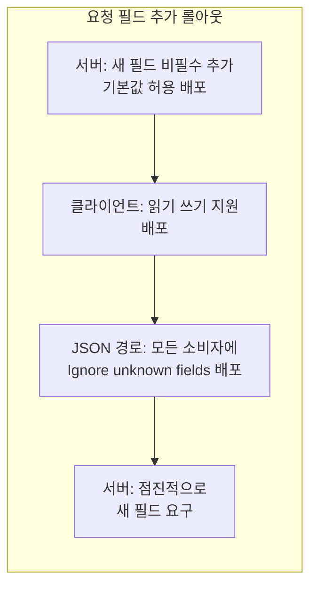
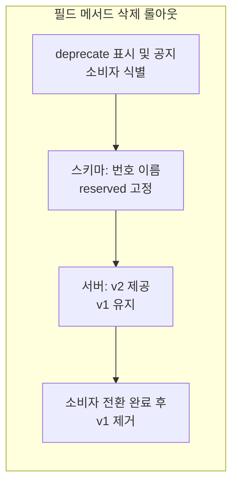

분산 환경에서는 서버와 클라이언트가 동시에 배포되지 않는다. 모바일 앱, 외부 파트너, 레거시 서비스는 갱신 주기가 달라 **구버전 클라이언트가 새 서버와, 새 클라이언트가 구버전 서버와** 만나는 조합이 항상 발생한다. 이때 Proto/메시지·서비스·메서드를 함부로 추가·삭제·변경하면 직렬화 오류, `UNIMPLEMENTED`, 데이터 손상·PII 유출까지 이어질 수 있다. 이 글은 **gRPC/Protobuf에서 API를 안전하게 진화시키기 위한 호환성 원칙과 버저닝 절차**를 정리한다. wire-safe 변경과 파괴적 변경을 구분하고, 서버·클라이언트·ProtoJSON 경로별 체크리스트, 패키지 버저닝·`reserved`·deprecate·`UNIMPLEMENTED` 대응을 실무 관점에서 다룬다.

---

## 핵심 요약

**추가(대체로 안전)**  
새 서비스·메서드·필드·enum 값 추가는 바이너리(wire) 레벨에서 안전하다. 단, 서버가 새 필드를 즉시 필수로 요구하면 구버전 클라이언트가 해당 필드를 보내지 않아 실패할 수 있으므로, 새 필드는 기본값을 허용하는 방식으로 도입해야 한다.

**삭제(대체로 파괴적)**  
RPC·서비스·메서드를 삭제하면 해당 호출에 대해 서버가 **UNIMPLEMENTED**를 반환한다. 메시지 필드를 삭제할 때는 필드 번호와 이름을 반드시 **reserved**로 고정해, 나중에 같은 번호·이름을 재사용해 데이터 손상·PII 누출이 나지 않도록 한다.

**JSON(ProtoJSON) 경유 시 주의**  
ProtoJSON은 미지 필드를 보존하지 않으며, 필드·enum 이름이 직렬화에 포함되므로 스키마 변경이 파싱 오류로 이어질 수 있다. JSON 경로를 쓰는 경우 소비자에 **Ignore unknown fields** 옵션을 배포한 뒤 새 필드를 사용하는 등 단계적 롤아웃이 필요하다.

아래 표는 변경 유형별 wire·프로토콜·동작 관점의 영향을 한눈에 정리한 것이다.

| 변경 유형 | wire/프로토콜 | 동작·실무 |
|-----------|----------------|-----------|
| 요청에 새 필드 추가 | 안전 | 서버가 미설정(기본값) 허용 필요 |
| 응답에 새 필드 추가 | 안전 | 구버전 클라이언트는 미지 필드 무시(바이너리) |
| enum 값 추가 | 안전 | 앱 로직의 완전 switch·매핑 누락 점검 |
| 필드·메서드·서비스 삭제 | 파괴적 | deprecate → 유예 → 삭제 + reserved |
| 패키지·서비스·메서드 이름 변경 | URL 변경 → UNIMPLEMENTED | v1/v2 동시 호스팅으로 이행 |
| ProtoJSON 경로 | 미지 필드 미보존 | Ignore unknown fields·단계 배포 |

---

## 정의·원칙: wire-safe와 호환성

Protobuf **wire format**은 필드를 **필드 번호**로 식별한다. 필드 이름은 생성 코드에서만 쓰이고, 온더와이어에는 번호만 나가므로 **같은 번호를 서로 다른 의미로 재사용하면** 구버전과 신버전이 섞일 때 데이터가 잘못 해석된다. 이를 막기 위해 **필드 삭제 시 해당 번호와 이름을 `reserved`로 봉인**하는 것이 필수다.

**wire-safe(호환)**  
기존 wire 바이트를 구버전·신버전 파서 모두가 안전하게 파싱할 수 있는 변경이다. 예: 새 필드 추가(구버전은 무시), 새 enum 값 추가(구버전은 unknown으로 보존 후 직렬화 시 그대로 전달).

**wire-unsafe(비호환)**  
필드 번호 변경, 타입 변경, 기존 필드 삭제 후 같은 번호 재사용, oneof 구조 변경 등은 wire 호환을 깨뜨리거나 재사용으로 인한 손상·PII 유출 위험이 있으므로 금지하고, 삭제 시에는 반드시 `reserved`를 둔다.

gRPC **프로토콜** 수준에서는 **패키지·서비스·메서드 이름**이 URL을 구성한다. 이름을 바꾸거나 메서드를 제거하면 구버전 클라이언트는 해당 RPC 호출 시 **UNIMPLEMENTED**를 받는다. 호환을 유지하려면 구버전용 서비스를 유지하거나, v2 패키지로 새 서비스를 추가한 뒤 클라이언트가 점진적으로 이전하도록 한다.

---

## 추가 시 안전 조건

**요청에 새 필드**  
서버는 해당 필드가 설정되지 않았을 때(기본값)에도 요청을 성공적으로 처리해야 한다. 필수화는 전면 배포가 끝난 뒤 단계적으로 도입한다.

**응답에 새 필드**  
바이너리 포맷에서는 구버전 클라이언트가 알 수 없는 필드를 자동으로 무시한다. 다만 앱 로직에서 모든 필드를 나열해 처리하는 switch·매핑이 있다면, 새 필드가 빠져 있을 때의 동작을 점검한다.

**enum 값 추가**  
직렬화는 안전하다. 구버전 클라이언트는 unknown enum 값을 정수로 보존하고 재직렬화 시 그대로 넘긴다. 서버는 알 수 없는 enum 값에 대한 기본 처리(무시·매핑·에러)를 정의해 두는 것이 좋다.

---

## 삭제 시 위험과 대응

**서비스·메서드 삭제**  
해당 RPC를 호출하면 서버가 **UNIMPLEMENTED**를 반환한다. 클라이언트는 이 코드를 받으면 v1 폴백·재시도·버전 업그레이드 유도 등으로 대응할 수 있도록 설계한다.

**메시지 필드 삭제**  
삭제한 필드 번호·이름을 **reserved**로 고정하지 않으면, 나중에 같은 번호나 이름을 재사용했을 때 구버전 데이터가 잘못 해석되어 데이터 손상·PII 유출이 발생할 수 있다. `reserved`는 번호와 이름을 각각 별도 문장으로 두며, 같은 `reserved` 문 안에는 번호만 또는 이름만 넣는다.

```text
reserved 3, 4;
reserved "legacy_id";
```

---

## JSON(ProtoJSON) 경유 시

ProtoJSON은 **미지 필드를 보존하지 않으며**, 필드·enum 이름이 JSON 키로 쓰이므로 이름 변경·필드 제거가 파싱 오류로 이어질 수 있다. **Ignore unknown fields** 옵션을 파서에 켜 두면, 신버전에서 추가된 필드를 구버전 클라이언트가 파싱할 때 무시할 수 있다. 서버가 JSON을 생산하거나 게이트웨이를 사용한다면, 구버전 소비자에 이 옵션이 배포된 뒤에 새 필드 값을 사용하도록 롤아웃 순서를 맞춘다.

---

## 롤아웃 절차 개요

추가와 삭제는 각각 단계적 절차를 거치면, 배포 주기가 어긋나도 호환을 유지할 수 있다. 아래 두 다이어그램은 **요청 필드 추가**와 **필드·메서드 삭제** 시 권장 순서를 흐름으로 나타낸 것이다.





추가(요청 필드)는 서버가 먼저 새 필드를 비필수로 받도록 하고, 클라이언트와 JSON 소비자 배포를 맞춘 뒤, 마지막에 서버에서 점진적으로 새 필드를 요구하는 방식이 안전하다. 삭제는 deprecate와 reserved로 재사용을 막고, v2를 병행 제공한 뒤 전환 완료 후 v1을 제거한다.

---

## 서버 개발 체크리스트 (배포 주기 불일치 전제)

- **요청 스키마 추가**  
  새 필드는 미설정이어도 성공해야 한다. 필수화는 전면 배포 완료 후 단계적으로 강제한다.
- **응답 스키마 추가**  
  구버전 클라이언트가 미지 필드를 무시(바이너리)하도록 하고, 앱 로직의 완전 switch·매핑 누락을 점검한다.
- **삭제**  
  즉시 삭제하지 않고, deprecate → 유예 공지 → 실제 삭제 + **reserved**(번호·이름) 고정 절차를 따른다.
- **메서드·서비스 변경**  
  이름·패키지 변경은 URL 해시에 영향을 주어 구버전이 **UNIMPLEMENTED**를 받으므로, **v1/v2 동시 호스팅**으로 이행한다.
- **ProtoJSON 경로**  
  서버가 JSON을 생산하거나 게이트웨이를 쓴다면, 구버전 클라이언트에 **Ignore unknown fields** 설정이 배포되기 전까지 새 필드 값을 사용하지 않도록 한다.
- **Enum 값 추가**  
  알 수 없는 enum 값에 대한 서버 방어(무시·매핑·에러)를 정의한다.
- **CI 규칙**  
  필드 번호 재사용·renumber 금지, 삭제 시 **reserved** 강제, oneof 변경은 새 oneof에 한정해 검사한다.

---

## 클라이언트 개발 체크리스트

- **미지 필드 무시**  
  바이너리에서는 기본적으로 안전하다. JSON 경로는 파서에 **Ignore unknown fields** 지원·활성화를 둔다.
- **새 필드 기본 동작**  
  서버가 새 필드를 요구하기 전까지는 기본값으로 정상 동작하도록 가드한다.
- **Enum 확장 대비**  
  완전 switch 사용 시 default 분기를 두고, 알 수 없는 값은 로깅한다.
- **서비스·메서드 삭제·이동 대비**  
  **UNIMPLEMENTED** 수신 시 재시도 전략 또는 v1 폴백·버전 업그레이드 경로로 유도한다.
- **재시도·백오프·Wait-for-Ready**  
  일시적 실패(UNAVAILABLE, DEADLINE_EXCEEDED)와 프로토콜 실패(UNIMPLEMENTED 등)를 구분해 처리한다.
- **ProtoJSON 사용 시**  
  정수 인코딩(문자열/숫자) 호환성, enums-as-ints 필요 여부를 점검한다.

---

## gRPC 상태 코드 참조 (운영 동작 설계)

| 코드 | 의미 | 운영 대응 |
|------|------|-----------|
| **UNIMPLEMENTED** | 메서드 미존재·압축 미지원 | 버전 전환·폴백·업그레이드 유도 |
| **UNAVAILABLE** | 일시적 불가 | 재시도·백오프 |
| **DEADLINE_EXCEEDED** | 타임아웃 | 타임아웃·부하 재설계 |
| **UNKNOWN** / **INTERNAL** | 직렬화·파싱 실패 등 | 스키마·게이트웨이 설정 점검 |

---

## 버저닝·롤아웃 전략

**패키지 버전**  
`package foo.v1`, `foo.v2`로 패키지를 나누고, 동일 서버에서 v1·v2를 동시에 호스팅한 뒤 클라이언트를 점진적으로 v2로 이전한다. 전환 완료 후 v1을 제거하면, 구버전 호출은 **UNIMPLEMENTED**를 받게 되므로 클라이언트는 반드시 업그레이드해야 한다.

**삭제는 단계적**  
deprecate 표시 → 유예 기간 공지 → 삭제 + **reserved**(번호·이름) 고정. CI에서 필드 번호 변경·재사용 금지, 삭제 필드의 **reserved** 강제 규칙을 검사하면 실수를 줄일 수 있다.

---

## C# 예제: v1 → v2 안전 추가·삭제

아래는 **greet.v1**에서 **greet.v2**로 요청 필드 추가·삭제된 필드 reserved 처리·v1/v2 동시 호스팅·클라이언트 UNIMPLEMENTED 폴백·ProtoJSON 미지 필드 무시**까지 한 번에 보여주는 예제다. 각 코드 블록 앞뒤로 목적과 주의점을 문단으로 두었다.

### Proto 정의: v1

v1은 `name`만 있는 요청과 `message`만 있는 응답이다.

```proto
syntax = "proto3";

package greet.v1;

message HelloRequest {
  string name = 1;
}

message HelloReply {
  string message = 1;
}

service Greeter {
  rpc SayHello(HelloRequest) returns (HelloReply);
}
```

### Proto 정의: v2 (필드 추가·reserved)

v2에서는 요청에 `optional string locale = 2`를 추가하고, 삭제된 필드 번호 3·4와 이름 `legacy_id`를 **reserved**로 봉인해 재사용을 막는다.

```proto
syntax = "proto3";

package greet.v2;

message HelloRequest {
  string name = 1;
  optional string locale = 2;  // 추가: 비설정도 허용
  reserved 3, 4;
  reserved "legacy_id";
}

message HelloReply {
  string message = 1;
}

service Greeter {
  rpc SayHello(HelloRequest) returns (HelloReply);
}
```

### 서버: v1/v2 동시 호스팅, 새 필드 기본값 허용

v1·v2 서비스를 한 앱에 등록하고, v2의 `SayHello`에서는 `locale`이 비어 있어도 기본값(예: en-US)으로 처리해 구버전 클라이언트와 호환되게 한다.

```csharp
using Grpc.Core;
using greet.v1;
using greet.v2;

var builder = WebApplication.CreateBuilder(args);
builder.Services.AddGrpc();
var app = builder.Build();

app.MapGrpcService<GreeterServiceV1>();
app.MapGrpcService<GreeterServiceV2>();

app.Run();

public sealed class GreeterServiceV1 : greet.v1.Greeter.GreeterBase
{
    public override Task<greet.v1.HelloReply> SayHello(greet.v1.HelloRequest request, ServerCallContext context)
        => Task.FromResult(new greet.v1.HelloReply { Message = $"Hello, {request.Name}" });
}

public sealed class GreeterServiceV2 : greet.v2.Greeter.GreeterBase
{
    public override Task<greet.v2.HelloReply> SayHello(greet.v2.HelloRequest request, ServerCallContext context)
    {
        var locale = string.IsNullOrWhiteSpace(request.Locale) ? "en-US" : request.Locale;
        var greeting = locale.StartsWith("ko", StringComparison.OrdinalIgnoreCase) ? "안녕하세요" : "Hello";
        return Task.FromResult(new greet.v2.HelloReply { Message = $"{greeting}, {request.Name}" });
    }
}
```

### 클라이언트: UNIMPLEMENTED 시 v1 폴백

v2 클라이언트로 호출하다가 **UNIMPLEMENTED**(서버에 v2가 없거나 메서드 제거)를 받으면 v1 클라이언트로 폴백하는 예시다.

```csharp
using Grpc.Net.Client;
using Grpc.Core;

var channel = GrpcChannel.ForAddress("https://localhost:5001");
var clientV2 = new greet.v2.Greeter.GreeterClient(channel);

try
{
    var reply = await clientV2.SayHelloAsync(new greet.v2.HelloRequest { Name = "Jerry", Locale = "ko-KR" });
    Console.WriteLine(reply.Message);
}
catch (RpcException ex) when (ex.StatusCode == StatusCode.Unimplemented)
{
    var clientV1 = new greet.v1.Greeter.GreeterClient(channel);
    var reply = await clientV1.SayHelloAsync(new greet.v1.HelloRequest { Name = "Jerry" });
    Console.WriteLine(reply.Message);
}
```

### JSON(ProtoJSON): 미지 필드 무시

ProtoJSON 파서에 **ignoreUnknownFields: true**를 두면, 구버전 스키마로 파싱할 때 신버전에서 추가된 필드는 무시된다.

```csharp
using Google.Protobuf;
using Google.Protobuf.Reflection;

var settings = new JsonParser.Settings(recursionLimit: 100, typeRegistry: TypeRegistry.Empty, ignoreUnknownFields: true);
var parser = new JsonParser(settings);

string json = "{\"name\":\"Jerry\",\"locale\":\"ko-KR\",\"unknown\":123}";
var req = parser.Parse<greet.v2.HelloRequest>(json);  // unknown 필드는 무시
```

---

## 마무리: 적용·판단 기준

- **추가**는 가능한 한 비필수·기본값 허용으로 하고, **삭제**는 deprecate → reserved → v2 병행 → v1 제거 순서를 지킨다.
- **ProtoJSON**을 쓰면 미지 필드 보존이 없으므로, Ignore unknown fields와 배포 순서를 맞춘다.
- **UNIMPLEMENTED**는 버전 이전·폴백·업그레이드 유도 신호로 활용하고, **UNAVAILABLE**·**DEADLINE_EXCEEDED**는 재시도·타임아웃 정책으로 구분해 처리한다.

이 글을 읽은 뒤에는 다음을 할 수 있으면 좋다: (1) wire-safe와 파괴적 변경을 구분해 설명할 수 있다, (2) 필드·메서드 추가·삭제 시 서버·클라이언트·JSON 경로별 체크리스트를 적용할 수 있다, (3) reserved·deprecate·v1/v2 동시 호스팅·UNIMPLEMENTED 폴백을 설계에 반영할 수 있다.

---

## 참고 문서

- [Protocol Buffers – Updating / Wire safety](https://protobuf.dev/programming-guides/proto3/#updating)
- [ProtoJSON – JSON wire safety](https://protobuf.dev/programming-guides/json/#json-wire-safety)
- [Microsoft – Versioning gRPC services](https://learn.microsoft.com/en-us/aspnet/core/grpc/versioning)
- [gRPC – Error handling / Status codes](https://grpc.io/docs/guides/error/)
- [Google Cloud – API Versioning (AIP-185)](https://cloud.google.com/apis/design/versioning)
