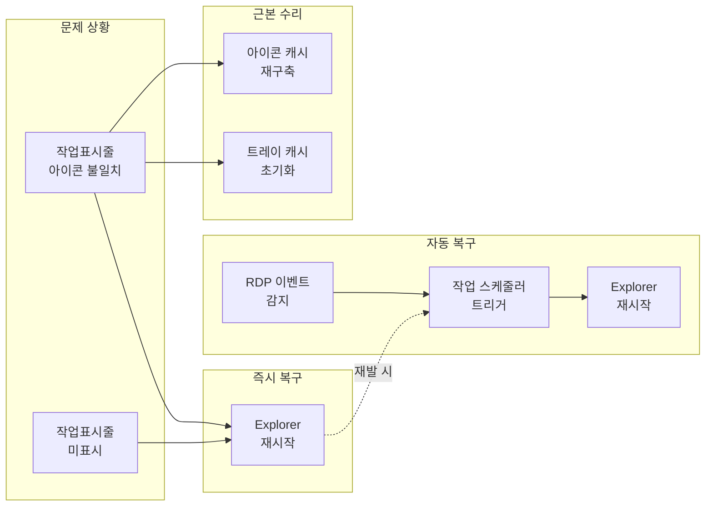
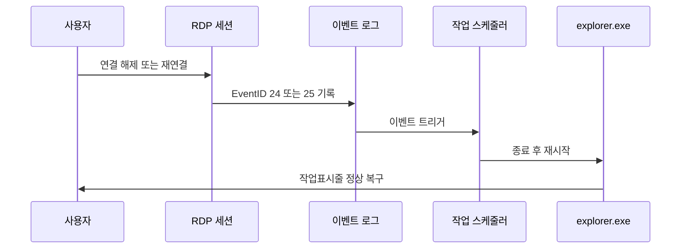

## 개요

원격 데스크톱(MSTSC)으로 PC1 → PC2에 접속할 때 다음과 같은 문제가 반복될 수 있습니다.

- **문제 1**: 원격 연결 중 작업표시줄 아이콘과 실제 실행 중인 프로그램이 불일치
- **문제 2**: 원격 종료 후 PC2 로컬 로그인 시에도 아이콘·실행 프로그램 불일치 지속
- **문제 3**: 작업표시줄 자체가 보이지 않음(자동 숨김 아님). 재현 시 `Explorer` 재시작으로만 복구 가능

이 글은 **즉시 복구 방법**, **근본 수리**(아이콘·트레이 캐시 정리), 그리고 **RDP 연결/해제 이벤트 기반 자동 복구**(작업 스케줄러)까지 정리합니다. 정책상 MSTSC만 허용되는 환경을 전제로 합니다.

**추천 대상**: Windows 11(및 10)에서 RDP를 자주 사용하는 사용자, 사내 원격 지원·관리자.

---

## 문제의 핵심 원인

- RDP 세션 전환 과정에서 `explorer.exe`(셸·작업표시줄)가 **글리치 상태**로 남아, 아이콘 매핑·표시가 꼬임
- 아이콘·트레이 캐시 손상으로 빈 아이콘, 잘못된 아이콘 지속
- 해상도·스케일 불일치와 일부 셸 커스터마이저(StartAllBack, ExplorerPatcher 등)가 문제를 증폭

---

## 해결 흐름 요약

아래 다이어그램은 수동 복구·자동 복구·근본 수리의 관계를 요약합니다.



---

## 문제 완화: Persistent bitmap caching 끄기

- **mstsc** 실행 → **옵션 표시(Show Options)** → **환경(Experience)** 탭 → **Persistent bitmap caching** 체크 해제 → 연결 설정 저장
- 오래된 비트맵을 재사용하는 캐시가 UI 잔상·틀린 툴바/작업표시줄을 유발할 수 있어, 문제 발생 시 해제를 권장합니다.  
- 참고: [Microsoft Q&A - remote desktop cache / Permanently caching bitmaps](https://learn.microsoft.com/en-us/answers/questions/430008/remote-desktop-cache-permanently-caching-bitmaps)

---

## 즉시 복구(수동)

**방법 1**: 작업 관리자(`Ctrl+Shift+Esc`) → **Windows Explorer** 우클릭 → **재시작**

**방법 2**: PowerShell에서 다음 한 줄로 동일 처리

```powershell
Stop-Process -Name explorer -Force; Start-Sleep -Milliseconds 800; Start-Process explorer.exe
```

**방법 3**: CMD 한 줄(창 없이 실행)

```cmd
powershell -NoProfile -WindowStyle Hidden -Command "Stop-Process -Name explorer -Force; Start-Sleep -Milliseconds 800; Start-Process explorer.exe"
```

위 방법은 문제 1~3 모두에 효과적입니다.

---

## 자동 복구(권장): RDP 연결/해제 시 Explorer 자동 재시작

RDP 이벤트를 트리거로 `explorer.exe`를 자동 재시작하면, 재발 시에도 사용자가 개입할 필요가 없습니다.

### 사용 이벤트 로그 및 ID

- **이벤트 로그**: `Microsoft-Windows-TerminalServices-LocalSessionManager/Operational`
- **이벤트 ID 24**: 세션 연결 끊김(Disconnect)
- **이벤트 ID 25**: 세션 재연결(Reconnect)

작업 스케줄러에서는 **사용자가 로그온한 경우에만 실행**, **최고 권한으로 실행**으로 설정하는 것이 좋습니다.

### 자동화 플로우(Mermaid)



### 작업 스케줄러 등록(명령줄)

PowerShell/CMD에서 아래 두 작업을 등록하면 됩니다.

**Disconnect(연결 끊김) 시 Explorer 재시작**

```cmd
schtasks /Create /TN "FixTaskbar_OnRDP_Disconnect" /TR "powershell.exe -NoProfile -WindowStyle Hidden -Command \"Stop-Process -Name explorer -Force; Start-Sleep -Milliseconds 800; Start-Process explorer.exe\"" /SC ONEVENT /EC "Microsoft-Windows-TerminalServices-LocalSessionManager/Operational" /MO "<QueryList><Query Id='0' Path='Microsoft-Windows-TerminalServices-LocalSessionManager/Operational'><Select Path='Microsoft-Windows-TerminalServices-LocalSessionManager/Operational'>*[System[(EventID=24)]]</Select></Query></QueryList>" /IT /RL HIGHEST /F
```

**Reconnect(재연결) 시 Explorer 재시작**

```cmd
schtasks /Create /TN "FixTaskbar_OnRDP_Reconnect" /TR "powershell.exe -NoProfile -WindowStyle Hidden -Command \"Stop-Process -Name explorer -Force; Start-Sleep -Milliseconds 800; Start-Process explorer.exe\"" /SC ONEVENT /EC "Microsoft-Windows-TerminalServices-LocalSessionManager/Operational" /MO "<QueryList><Query Id='0' Path='Microsoft-Windows-TerminalServices-LocalSessionManager/Operational'><Select Path='Microsoft-Windows-TerminalServices-LocalSessionManager/Operational'>*[System[(EventID=25)]]</Select></Query></QueryList>" /IT /RL HIGHEST /F
```

- **`/IT`**: 대화형 사용자 세션에서만 실행되어, 서비스 세션에서의 불필요한 실행을 방지
- **`/RL HIGHEST`**: 권한 부족으로 인한 Explorer 재시작 실패를 예방

---

## 아이콘 불일치/빈 아이콘의 근본 수리(1회성)

아이콘 캐시와 트레이 아이콘 캐시를 재구축하면 작업표시줄 아이콘 불일치가 해소됩니다.

### 1) 아이콘 캐시 재구축

```powershell
Stop-Process -Name explorer -Force
Remove-Item "$env:LOCALAPPDATA\Microsoft\Windows\Explorer\iconcache_*" -Force -ErrorAction SilentlyContinue
Remove-Item "$env:LOCALAPPDATA\IconCache.db" -Force -ErrorAction SilentlyContinue
Start-Process explorer.exe
```

### 2) 트레이(알림 영역) 아이콘 캐시 초기화

```cmd
taskkill /f /im explorer.exe
reg delete "HKCU\Software\Classes\Local Settings\Software\Microsoft\Windows\CurrentVersion\TrayNotify" /v IconStreams /f
reg delete "HKCU\Software\Classes\Local Settings\Software\Microsoft\Windows\CurrentVersion\TrayNotify" /v PastIconsStream /f
start explorer.exe
```

---

## 예방 팁

- PC1/PC2 **해상도·스케일**을 가급적 맞추면 RDP 전환 시 셸 글리치가 줄어듭니다.
- Windows 업데이트와 **GPU 드라이버**를 최신으로 유지합니다.
- **Remote Procedure Call (RPC)** 서비스가 자동·실행 중인지 확인합니다.
- **StartAllBack**, **ExplorerPatcher** 등 셸 커스터마이저는 문제 재현 시 일시 비활성 후 재현 여부를 검증합니다.

---

## 참고 자료

| 구분 | 링크 |
|------|------|
| 작업표시줄 미표시·재시작 복구 | [AnyViewer - Remote Desktop Connection Can't See Taskbar](https://www.anyviewer.com/how-to/remote-desktop-connection-cannot-see-taskbar-8657.html) |
| 작업표시줄 미표시 (Windows 10) | [TheWindowsClub - Taskbar not visible in Remote Desktop](https://www.thewindowsclub.com/taskbar-not-visible-in-remote-desktop-on-windows-10) |
| 아이콘 캐시 재구축 (Windows 11) | [ElevenForum - Rebuild icon cache in Windows 11](https://www.elevenforum.com/t/rebuild-icon-cache-in-windows-11.2049/) |
| 아이콘 캐시 재구축 (상세) | [Winhelponline - How to Rebuild Icon Cache in Windows](https://www.winhelponline.com/blog/how-to-rebuild-the-icon-cache-in-windows/) |
| 트레이·작업표시줄 아이콘 복구 | [How-To Geek - Fix Hidden Taskbar Icons on Windows 11](https://www.howtogeek.com/fix-hidden-taskbar-icons-windows-11/) |
| RDP 이벤트 로그·포렌식 | [Windows OS Hub - RDP connection logs](https://woshub.com/rdp-connection-logs-forensics-windows/) |
| Persistent bitmap caching | [Microsoft Q&A - Permanently caching bitmaps](https://learn.microsoft.com/en-us/answers/questions/430008/remote-desktop-cache-permanently-caching-bitmaps) |
