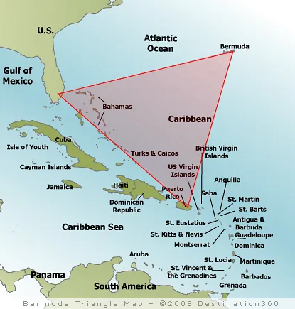
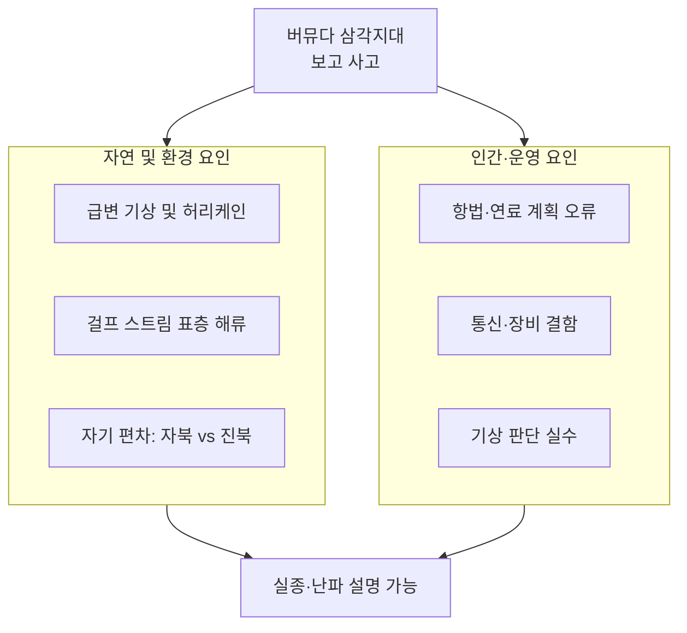

## 개요: 버뮤다 삼각지대란 무엇인가

**버뮤다 삼각지대(Bermuda Triangle)** 는 일반적으로 미국 **플로리다–버뮤다–푸에르토리코**를 잇는 북대서양의 넓은 해역을 가리키는 대중 용어다. 데블스 트라이앵글(Devil's Triangle)이라고도 불린다. 그러나 **미국 지명위원회(U.S. Board on Geographic Names)** 는 이 이름을 공식 지명으로 인정하지 않으며, 경계도 저자마다 1.3~3.9백만 km² 등으로 제각각이다.

[NOAA](https://oceanservice.noaa.gov/facts/bermudatri.html)(미국 국립해양대기청)와 미 해안경비대·해군은 **초자연적 현상의 증거는 없으며**, 보고된 사건 상당수는 기상·해류·항법 오류·인간 오류 등 자연적·인간적 요인으로 설명된다고 명시한다. 이 포스트는 공신력 있는 자료를 바탕으로 **전설의 기원, 데이터가 말하는 것, 과학적 설명, 대표 사건 미니 리뷰**를 체계적으로 정리한다.

**추천 대상**: 버뮤다 삼각지대 전설과 과학적 반론을 한 번에 이해하고 싶은 독자, 허리케인·걸프 스트림·자기 편차 등 해양·항공 사고 배경 지식을 쌓고 싶은 독자.

---

## 전설의 기원: 1950년대 신문에서 1970년대 베스트셀러까지

버뮤다 삼각지대 전설은 **1950년 9월** AP 통신으로 배포된 신문 기사들에서 대중에 널리 퍼졌다. [위키백과](https://en.wikipedia.org/wiki/Bermuda_Triangle)에 따르면, 1952년 잡지 **Fate**가 삼각형 영역을 도식화하며 개념을 굳혔고, **1964년** 빈센트 개디스(Vincent Gaddis)의 글, **1974년** 찰스 벌리츠(Charles Berlitz)의 베스트셀러 《The Bermuda Triangle》가 ‘신비’ 프레임을 강화했다.

아래 다이어그램은 **전설이 형성·강화된 흐름**을 요약한다. 노드 ID는 camelCase이며, 라벨에 특수문자가 있는 경우 큰따옴표로 감쌌다.

```mermaid
flowchart LR
  subgraph origin["전설 기원"]
    A[AP기사1950]
    B[Fate잡지1952]
    C[Gaddis1964]
    D[Berlitz1974]
  end
  A --> B
  B --> C
  C --> D
  D --> E["대중적 신비 프레임"]
  E --> F["선택적 사례 수집"]
  F --> G["가용성 편향"]
```

- **선택적 사례 수집**: 플라이트 19, USS 사이클롭스 등 일부 사건만 반복 인용되고, 당시 기상·조사 기록·맥락이 생략되었다.
- **가용성 편향**: 극적이고 기억하기 쉬운 이야기가 더 위험하다고 느끼게 만들어, 실제 통계와 인지가 어긋나게 한다.

---

## 버뮤다 삼각지대, 신비인가 통계의 착시인가

||
|:---:|
|버뮤다 삼각지대 개략 위치(플로리다–버뮤다–푸에르토리코)|

- **보험 시장 런던 로이즈(Lloyd's of London)** 는 이 해역에서 선박 손실이 **통계적으로 유의미하게 높지 않다**고 보고하며, 미 해군·해안경비대의 조사·공개 자료와도 일치한다.
- **미국 지명위원회** 역시 ‘버뮤다 삼각지대’를 공식 지명으로 인정하지 않는다.
- 왕복 항로가 많은 대양의 한 구역에서 **장기간 축적된 사건을 선택적으로 묶으면**, 마치 특별히 위험한 것처럼 보이는 착시가 발생할 수 있다.

---

## 데이터가 말하는 것: ‘특이점’은 보이지 않는다

NOAA는 공식적으로 “[The ocean has always been a mysterious place... There is no evidence that mysterious disappearances occur with any greater frequency in the Bermuda Triangle than in any other large, well-traveled area of the ocean](https://oceanservice.noaa.gov/facts/bermudatri.html)”라고 밝힌다. 2013년 WWF가 선정한 **세계에서 가장 위험한 항해 수역 10곳**에도 버뮤다 삼각지대는 포함되지 않았다.

---

## 과학적 설명: 왜 사고가 반복되는가

사고 원인을 **자연·환경·인간 요인**으로 나누어 보면 아래와 같다. Mermaid 노드 ID는 예약어를 쓰지 않고, 라벨에 등호·연산자가 있으면 큰따옴표로 감쌌다.

```mermaid
flowchart TB
  subgraph natural["자연 및 환경 요인"]
    N1["급변 기상 및 허리케인"]
    N2["걸프 스트림 표층 해류"]
    N3["자기 편차: 자북 vs 진북"]
  end
  subgraph human["인간·운영 요인"]
    H1["항법·연료 계획 오류"]
    H2["통신·장비 결함"]
    H3["기상 판단 실수"]
  end
  Root["버뮤다 삼각지대</br>보고 사고"] --> natural
  Root --> human
  natural --> Outcome["실종·난파 설명 가능"]
  human --> Outcome
```

### 1) 급변하는 기상과 허리케인 경로

대서양 허리케인의 다수가 이 해역을 지나며, **위성·레이더 도입 이전**에는 선박과 항공기가 기상 급변에 취약했다. [위키백과 — Violent weather](https://en.wikipedia.org/wiki/Bermuda_Triangle#Violent_weather) 참고.

### 2) 걸프 스트림과 표층 해류

강력한 표층 해류(걸프 스트림)는 표류와 표식 분산을 가속해 **보고 위치와 실제 위치의 괴리**를 키우고, 수색·구조를 어렵게 만든다. [위키백과 — Gulf Stream](https://en.wikipedia.org/wiki/Gulf_Stream) 참고.

### 3) 나침반 자북/진북 차이(자기 편차)

자기 편차는 항법의 기본이며, **특정 선상에서만** 자북과 진북이 일치한다. 대중에게는 ‘나침반이 이상하다’로 비치기 쉽지만 자연스러운 현상이다.

### 4) 인간 오류와 운영 한계

연료·항로 계획, 기상 판단, 통신 오류, 장비 결함 등은 전통적으로 **다수 사고의 주된 원인**으로 꼽힌다. [위키백과 — Human error](https://en.wikipedia.org/wiki/Human_error) 참고.

### 5) 메탄 하이드레이트 가설의 현재 위치

실험실에서는 거품이 부력을 떨어뜨릴 수 있음이 확인되었으나, **USGS**는 이 구역에서 최근 약 **1.5만 년** 동안 광역적인 대량 방출 증거를 찾지 못했다고 보고한다.

---

## 사건 미니 리뷰: 신비는 ‘맥락’에서 사라진다

### 플라이트 19 (1945)

훈련 비행 중 **항법 혼선**과 **연료 고갈** 가능성이 해군 조사에서 지목되었다. 리더 찰스 C. 테일러 중위가 나침반 고장으로 위치를 잘못 판단해 바하마를 플로리다 키로 착각했고, 서쪽으로 귀환하지 못한 채 연료가 소진된 것으로 결론되었다. 구조에 나선 **PBM 마리너**의 폭발·실종은 기체의 연료 증기 취약성 기록과도 부합한다. [Wikipedia — Flight 19](https://en.wikipedia.org/wiki/Flight_19)

### USS 사이클롭스 (1918)

과적, 엔진 고장, 폭풍, 전시 위험 등 **복합 요인**이 거론된다. 자매함 **Proteus**, **Nereus**도 북대서양에서 유사한 적재(광석)로 손실되어 **구조적 결함** 가설이 제기된다. [Wikipedia — USS Cyclops (AC-4)](https://en.wikipedia.org/wiki/USS_Cyclops_(AC-4))

### 1948년 DC-3 실종 (NC16002)

산후안→마이애미 구간에서 발생했으며, 조사 결과 **원인 단정 불가**로 종결되었다. 배터리 부족·통신 불량·편풍 정보 미전달 등 기상·통신·정비 변수가 조합되었을 가능성이 크다. [Wikipedia — 1948 Airborne Transport DC-3 disappearance](https://en.wikipedia.org/wiki/1948_Airborne_Transport_DC-3_disappearance)

---

## 결론

- 버뮤다 삼각지대는 **‘특별히 위험한 구역’**이라기보다, **넓고 교통량이 많으며 기상 변동이 큰 해역**이라는 특성이 사고 체감도를 높인 측면이 크다.
- **공신력 있는 기관들**(NOAA, 해군, 해안경비대, 런던 로이즈)은 초자연적 설명을 채택하지 않으며, **자연 현상과 인간 요인**으로 충분히 설명된다는 입장이다.
- 전설이 오래 지속된 이유는 **선택적 사례 수집**, **이야기의 매력**, **가용성 편향** 때문이다.

**한 줄 평**: 버뮤다 삼각지대는 데이터와 공식 조사로 보면 ‘미스터리’보다 ‘통계적 착시와 전설 만들기’에 가깝다.

---

## 참고 자료

1. **NOAA Ocean Facts** — “What is the Bermuda Triangle?” — [oceanservice.noaa.gov/facts/bermudatri.html](https://oceanservice.noaa.gov/facts/bermudatri.html)
2. **Wikipedia** — “Bermuda Triangle” — [en.wikipedia.org/wiki/Bermuda_Triangle](https://en.wikipedia.org/wiki/Bermuda_Triangle)
3. **Wikipedia** — “Flight 19” — [en.wikipedia.org/wiki/Flight_19](https://en.wikipedia.org/wiki/Flight_19)
4. **Wikipedia** — “USS Cyclops (AC-4)” — [en.wikipedia.org/wiki/USS_Cyclops_(AC-4)](https://en.wikipedia.org/wiki/USS_Cyclops_(AC-4))
5. **Wikipedia** — “1948 Airborne Transport DC-3 disappearance” — [en.wikipedia.org/wiki/1948_Airborne_Transport_DC-3_disappearance](https://en.wikipedia.org/wiki/1948_Airborne_Transport_DC-3_disappearance)
