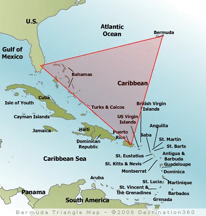

## 버뮤다 삼각지대, 신비인가 통계의 착시인가

||
|:---:|
|지도|

버뮤다 삼각지대는 일반적으로 미국 플로리다–버뮤다–푸에르토리코를 잇는 넓은 해역을 가리키는 대중 용어입니다. 하지만 미국 지명위원회는 공식 지명으로 인정하지 않으며 경계 또한 통일되어 있지 않습니다. NOAA(미국 국립해양대기청)와 미 해안경비대·해군은 초자연적 현상의 증거가 없으며, 보고된 사건 다수는 기상·해류·항법 오류 등 자연적·인간적 요인으로 설명된다고 밝힙니다. 참고: [NOAA Ocean Facts: What is the Bermuda Triangle?](https://oceanservice.noaa.gov/facts/bermudatri.html), [Wikipedia: Bermuda Triangle](https://en.wikipedia.org/wiki/Bermuda_Triangle)

## 전설의 기원: 1950년대 신문 기사에서 1970년대 베스트셀러까지

버뮤다 삼각지대 전설은 1950년 9월 AP 통신이 배포한 신문 기사들에서 시작해 대중에 널리 퍼졌습니다.
1952년 잡지 ‘Fate’가 삼각형 영역을 도식화하며 개념을 굳혔고, 1964년 빈센트 개디스의 글과 1974년 찰스 벌리츠의 베스트셀러가 ‘신비’ 프레임을 강화했습니다.
대표 사례로 1945년 훈련 비행편 ‘플라이트 19’, 1918년 석탄 수송선 ‘USS 사이클롭스’ 등이 자주 소환되지만, 이후 원자료와 조사 기록을 재검토한 결과 과장·오류·맥락 누락이 다수 확인되었습니다. 개요: [Wikipedia — Origins/Criticism](https://en.wikipedia.org/wiki/Bermuda_Triangle)

## 데이터가 말하는 것: ‘특이점’은 보이지 않는다

보험 시장 런던 로이즈는 이 해역에서 선박 손실이 통계적으로 유의미하게 높지 않다고 보고하며, 이는 미 해군·해안경비대의 조사·공개 자료와도 일치합니다.
미국 지명위원회 역시 ‘버뮤다 삼각지대’를 공식 지명으로 인정하지 않습니다.
왕복 항로가 많은 대양의 한 구역에서 장기간 축적된 사건을 선택적으로 묶으면, 마치 특별히 위험한 것처럼 보이는 **가용성 편향**이 발생할 수 있습니다.

## 과학적 설명: 왜 사고가 반복되는가

1) 급변하는 기상과 허리케인 경로
대서양 허리케인의 다수가 이 해역을 지나며, 위성·레이더 도입 이전에는 선박과 항공기가 기상 급변에 취약했습니다. 참고: [Wikipedia — Violent weather](https://en.wikipedia.org/wiki/Bermuda_Triangle)

2) 걸프 스트림과 표층 해류
강력한 표층 해류(걸프 스트림)는 표류와 표식 분산을 가속해 보고 위치와 실제 위치의 괴리를 키우고, 수색·구조를 어렵게 만듭니다. 참고: [Wikipedia — Gulf Stream](https://en.wikipedia.org/wiki/Gulf_Stream)

3) 나침반 자북/진북 차이(자기 편차)
자기 편차는 항법의 기본이며 특정 선에서만 자북과 진북이 일치합니다. 대중에겐 ‘나침반이 이상하다’로 비치기 쉽지만 자연스러운 현상입니다. 참고: [USGS 자료(위키 인용)](https://en.wikipedia.org/wiki/Magnetic_variation)

4) 인간 오류와 운영 한계
연료·항로 계획, 기상 판단, 통신 오류, 장비 결함 등은 전통적으로 다수 사고의 주된 원인입니다. 참고: [Wikipedia — Human error](https://en.wikipedia.org/wiki/Human_error)

5) 메탄 하이드레이트 가설의 현재 위치
실험실에서는 거품이 부력을 저하시킬 수 있음이 확인되었으나, USGS는 이 구역에서 최근 1.5만 년 동안 광역적인 대량 방출 증거를 찾지 못했습니다. 참고: [USGS/Woods Hole(위키 인용)](https://woodshole.er.usgs.gov/)

## 사건 미니 리뷰: 신비는 ‘맥락’에서 사라진다

플라이트 19(1945)는 훈련 중 항법 혼선과 연료 고갈 가능성이 해군 조사에서 지목되었습니다. 구조에 나선 PBM 마리너의 폭발·실종은 기체 특성상 연료 증기 취약성 기록과도 부합합니다. [Wikipedia — Flight 19](https://en.wikipedia.org/wiki/Flight_19)

USS 사이클롭스(1918)는 과적, 폭풍, 전시 위험 등 복합 요인이 거론됩니다. 자매함들도 북대서양에서 유사 손실을 겪었습니다. [Wikipedia — USS Cyclops](https://en.wikipedia.org/wiki/USS_Cyclops_(AC-4))

1948년 DC-3 실종 사건은 산후안→마이애미 구간에서 발생했으며 조사 결과 ‘원인 단정 불가’로 종결되었습니다. 다만 기상·통신·정비 변수가 조합되었을 가능성이 큽니다. [Wikipedia — 1948 DC-3 disappearance](https://en.wikipedia.org/wiki/1948_Airborne_Transport_DC-3_disappearance)

## 결론

버뮤다 삼각지대는 ‘특별히 위험해서’가 아니라, 넓고 붐비며 기상 변동이 큰 해역이라는 특성이 사고 체감도를 높인 측면이 큽니다. 공신력 있는 기관들은 초자연적 설명을 채택하지 않으며, 자연 현상과 인간 요인으로 충분히 설명된다는 결론에 서 있습니다. 그럼에도 전설이 오래 지속된 이유는 선택적 사례 수집, 이야기의 매력, 그리고 가용성 편향 때문입니다.

## 참고 자료

- NOAA Ocean Facts — “What is the Bermuda Triangle?” — [oceanservice.noaa.gov/facts/bermudatri.html](https://oceanservice.noaa.gov/facts/bermudatri.html)
- Wikipedia — “Bermuda Triangle” — [en.wikipedia.org/wiki/Bermuda_Triangle](https://en.wikipedia.org/wiki/Bermuda_Triangle)
- US Navy Historical Center — “The Loss of Flight 19”(아카이브) — [history.navy.mil/faqs/faq15-1.htm](https://web.archive.org/web/20090413074152/http://www.history.navy.mil/faqs/faq15-1.htm)
- US Navy/DoD Fact Sheet(아카이브) — “Bermuda Triangle FAQ” — [dod.mil/pubs/foi/Reading_Room/UFO/195.pdf](https://web.archive.org/web/20161121111220/http://www.dod.mil/pubs/foi/Reading_Room/UFO/195.pdf)

